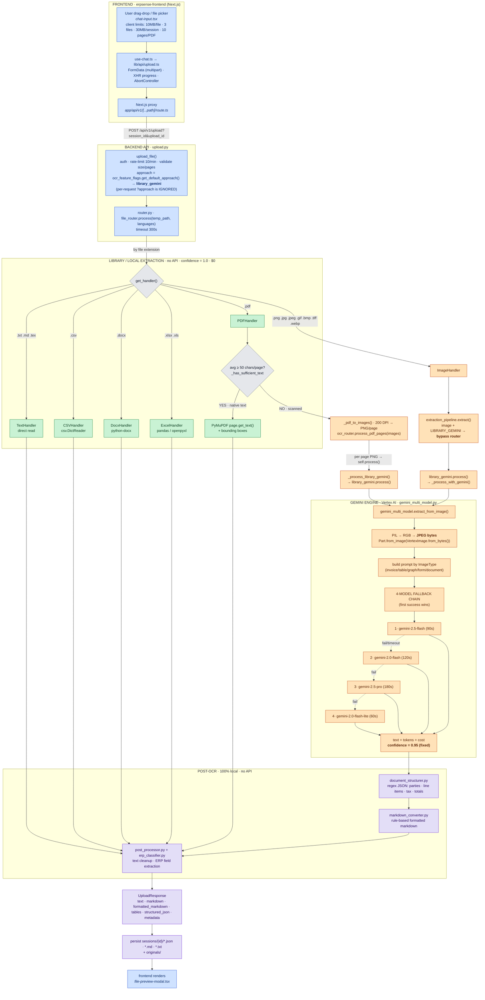

# ERPSense OCR Complete Active Flow, Routing & Confidence (Source of Truth)

> **Scope:** This document maps the **OCR pipeline that actually runs in production today**, end‑to‑end,
> across the backend (`erpsense-backend`, FastAPI) and the frontend (`erpsense-frontend`, Next.js 14).
>
> **What is "active":** The live feature‑flag file
> [`app/config/ocr_features.json`](../../erpsense-backend/app/config/ocr_features.json) enables **only two**
> approaches — `library_gemini` (priority 1) and `gemini_complete` (priority 3). With
> `auto_select_enabled: true`, the resolver picks the **highest‑priority enabled** approach, so the
> **single active approach is `LIBRARY_GEMINI`**.
>
> Everything local (PaddleOCR, Surya, `fully_local`, `hybrid`, `multi_ocr`, `cascade_auto`,
> `ultimate_cascade`) is **disabled and/or not installed**. Those are documented in the
> [Appendix](#appendix--what-is-not-used-dormant) only and are **excluded from the main diagram**.

---

## 1. TL;DR — the one‑paragraph version

A user uploads a file in the chat UI → it is POSTed to `POST /api/v1/upload` → the backend resolves the
OCR approach from feature flags (**always `library_gemini` today**) → `file_router` picks a handler by file
extension. **Text‑native files** (`.txt .md .csv .docx .xlsx .xls`, and PDFs that already contain a text
layer) are extracted with **pure Python libraries** — **no AI, $0 cost, confidence hard‑coded to `1.0`**.
**Images** and **scanned PDFs** are the **only inputs that reach Gemini**: they are converted to **JPEG bytes**
and sent to **Vertex AI Gemini** through a **4‑model fallback chain**
(`gemini‑2.5‑flash → gemini‑2.0‑flash → gemini‑2.5‑pro → gemini‑2.0‑flash‑lite`). Gemini results get a
**fixed `0.95` confidence** (Gemini does not return a real confidence). The extracted text is then
post‑processed **100% locally** (markdown formatting, JSON structuring, ERP field extraction) and returned to
the client. **Confidence is informational metadata only — in the live path nothing accepts/rejects/retries
based on it.**

---

## 2. What is actually used (live configuration)


| Approach             | Enabled | Priority | Role today                                                                           |
| -------------------- | :-----: | :------: | ------------------------------------------------------------------------------------ |
| **`library_gemini`** |   ✅   |  **1**  | **ACTIVE** — auto‑selected. Libraries for text, Gemini for images/scans            |
| `gemini_complete`    |   ✅   |    3    | Enabled but only becomes active if`library_gemini` is disabled; reachable indirectly |
| `ultimate_cascade`   |   ❌   |    2    | disabled                                                                             |
| `cascade_auto`       |   ❌   |    4    | disabled                                                                             |
| `multi_ocr`          |   ❌   |    5    | disabled                                                                             |
| `hybrid`             |   ❌   |    6    | disabled                                                                             |
| `fully_local`        |   ❌   |    7    | disabled (needs PaddleOCR/Surya —**not installed**)                                 |

**Resolution code:** [`feature_flags.py:258‑305`](../../erpsense-backend/app/services/file_processing/ocr/feature_flags.py#L258)
→ `get_default_approach()` sorts enabled approaches by priority ascending and returns the first →
`library_gemini`. The singleton is built at import time:
[`ocr_router.py:1802‑1819`](../../erpsense-backend/app/services/file_processing/ocr/ocr_router.py#L1802) `_resolve_initial_approach()`.

> ⚠️ Note: `ocr_features.json` has `default_approach: "ultimate_cascade"`, but that field is **ignored**
> because `auto_select_enabled: true`. The auto‑selector wins → `library_gemini`.

---

## 3. MASTER FLOWCHART — the active OCR pipeline

> Only the **used** path is shown. Engines that are disabled/uninstalled are intentionally omitted.



### 3a. ASCII master flow (for viewers without Mermaid)

```
USER (chat-input.tsx)
  │  FormData multipart  (upload.ts → use-chat.ts)
  ▼
Next.js proxy  app/api/v1/[...path]/route.ts
  │  POST /api/v1/upload?session_id&upload_id
  ▼
upload.py  upload_file()
  • auth + rate-limit (10/min) + size/page validation
  • approach = get_default_approach()  ==>  library_gemini   (?approach param ignored)
  ▼
router.py  file_router.process()      ── pick handler by extension ──┐
  │                                                                   │
  ├─ .txt/.md/.tex  → TextHandler   (direct read)      ┐             │
  ├─ .csv           → CSVHandler    (csv.DictReader)    │ LIBRARY     │ confidence = 1.0
  ├─ .docx          → DocxHandler   (python-docx)       │ no Gemini   │ cost = $0.00
  ├─ .xlsx/.xls     → ExcelHandler  (pandas)            │ $0          │
  ├─ .pdf  → PDFHandler                                 ┘             │
  │           └─ avg ≥ 50 chars/page ? ── YES ─► PyMuPDF native text (conf 1.0, $0)
  │                                     └─ NO  ─► rasterize 200 DPI PNG/page
  │                                                └─► ocr_router.process_pdf_pages()
  │                                                       └─ per page → self.process()
  │                                                              └─ _process_library_gemini()
  │                                                                     └─ library_gemini.process(png)
  └─ .png/.jpg/.jpeg/.gif/.bmp/.tiff/.webp → ImageHandler
              └─ extraction_pipeline.extract()  (image+LIBRARY_GEMINI ⇒ bypass router)
                     └─ library_gemini.process(image)
                            └─ _process_with_gemini()
                                                   │
       ┌───────────────────────────────────────────┘   (images AND scanned-PDF pages converge here)
       ▼
gemini_multi_model.extract_from_image()       [GEMINI — the ONLY paid/AI step]
  • PIL → RGB → JPEG bytes → Vertex Part.from_image(VertexImage.from_bytes())
  • prompt chosen by ImageType (invoice/table/graph/form/document)
  • 4-model fallback (first success wins):
        gemini-2.5-flash(90s) → gemini-2.0-flash(120s) → gemini-2.5-pro(180s) → gemini-2.0-flash-lite(60s)
  • confidence = 0.95 (HARD-CODED — Gemini returns no confidence)
       ▼
POST-OCR (100% local, no API):
  document_structurer.py  →  markdown_converter.py  →  post_processor.py + erp_classifier.py
       ▼
UploadResponse  →  saved to sessions/{id}/{name}.json/.md/.txt (+ originals/)
       ▼
frontend file-preview-modal.tsx  (renders text/tables/markdown + metadata)
```

---

## 4. Stage‑by‑stage, with exact file names

### Stage 0 — Frontend (erpsense-frontend)


| Concern                     | File                                                                                                               | Notes                                                                                 |
| --------------------------- | ------------------------------------------------------------------------------------------------------------------ | ------------------------------------------------------------------------------------- |
| File picker + client limits | [`src/components/chat/chat-input.tsx`](../../erpsense-frontend/src/components/chat/chat-input.tsx)                 | 10 MB/file, 3 files, 30MB/session, 10 pages/PDF, accepted extensions                                |
| Upload orchestration        | [`src/lib/hooks/use-chat.ts`](../../erpsense-frontend/src/lib/hooks/use-chat.ts)                                   | creates session, tracks status/extraction                                             |
| HTTP client                 | [`src/lib/api/upload.ts`](../../erpsense-frontend/src/lib/api/upload.ts)                                           | `FormData` multipart, 300 s timeout, XHR progress, `AbortController` cancel           |
| Proxy to backend            | [`src/app/api/v1/[...path]/route.ts`](../../erpsense-frontend/src/app/api/v1/%5B...path%5D/route.ts)               | forwards`/api/v1/*`, preserves auth headers/query                                     |
| Result rendering            | [`src/components/chat/file-preview-modal.tsx`](../../erpsense-frontend/src/components/chat/file-preview-modal.tsx) | text/tables/markdown + metadata (pages, languages, model, tokens, cost)               |
| Constants                   | [`src/lib/constants.ts`](../../erpsense-frontend/src/lib/constants.ts)                                             | `OCR_MAX_FILE_SIZE`, `OCR_MAX_FILES`, `OCR_MAX_PAGES_PER_PDF`, `API_ENDPOINTS.UPLOAD` |

- **There is no OCR‑approach selector in the UI** and **no confidence selector.** The backend auto‑selects
  the approach; confidence is shown only as read‑only metadata.

### Stage 1 — API entry ([`app/api/v1/endpoints/upload.py`](../../erpsense-backend/app/api/v1/endpoints/upload.py))

- Route: **`POST /api/v1/upload`** (`upload_file()`), mounted at `prefix="/upload"` in
  [`app/api/v1/router.py`](../../erpsense-backend/app/api/v1/router.py); permission `upload:READ`.
- Limits enforced: `MAX_FILE_SIZE=10MB`, `MAX_TOTAL_SIZE=30MB`, `MAX_FILES_PER_SESSION=3`,
  `MAX_PAGES_PER_PDF=10` (counted with `fitz.open`), `_OCR_PROCESSING_TIMEOUT=300s`.
- **Approach selection:** reads `ocr_feature_flags.get_default_approach()` → `library_gemini`. A per‑request
  `?approach=` is **explicitly ignored** (logged as a warning). The approach can only be changed globally by
  an admin via `POST /api/v1/upload/set-approach`.
- `lang` param parsed (`auto`/`en`/`hi`/`en,hi`); passed to `file_router.process(..., languages=...)`.
- Outputs saved under `sessions/{session_id}/` as `{base}_{YYYYMMDD_HHMMSS}.json/.md/.txt`, original under
  `sessions/{session_id}/originals/`.

### Stage 2 — File router ([`app/services/file_processing/router.py`](../../erpsense-backend/app/services/file_processing/router.py))

- `file_router.process()` → `get_handler()` by extension → `handler.extract()`.
- After extraction, if the result is an OCR result, it runs **post‑processing**: `post_processor.process()` →
  `format_text_lines()` → `erp_classifier.classify_from_text()` → `extract_erp_fields()`.

### Stage 3 — Handlers (file‑format → library/Gemini)

See the full routing table in [§5](#5-file-format--handler--library-or-gemini-routing-table).

### Stage 4 — OCR approach dispatch ([`ocr_router.py`](../../erpsense-backend/app/services/file_processing/ocr/ocr_router.py))

- Single‑file dispatch: `process()` → `_smart_process()` → `_process_library_gemini()` (active approach) →
  `library_gemini.process()`.
- PDF pages: `process_pdf_pages(images)` saves each page to a temp **PNG** and re‑enters `self.process()` per
  page → same dispatch.

### Stage 5 — Gemini engine ([`gemini_multi_model.py`](../../erpsense-backend/app/services/file_processing/ocr/gemini_multi_model.py))

See [§6](#6-what-goes-to-gemini--in-what-format) and [§7](#7-gemini-engine-deep-dive).

### Stage 6 — Post‑OCR (all local, no API)


| Step               | File                                                                                                                     | What it does                                                                            |
| ------------------ | ------------------------------------------------------------------------------------------------------------------------ | --------------------------------------------------------------------------------------- |
| Structure          | [`document_structurer.py`](../../erpsense-backend/app/services/file_processing/ocr/document_structurer.py)               | regex/heuristic JSON: seller/buyer, line items, tax breakdown, totals, bank txns, forms |
| Format             | [`markdown_converter.py`](../../erpsense-backend/app/services/file_processing/ocr/markdown_converter.py)                 | rule‑based pretty markdown (headings, KV pairs, tables, summary)                       |
| Clean + ERP fields | [`post_processor.py`](../../erpsense-backend/app/services/file_processing/ocr/post_processor.py)                         | OCR error fixes, amount/date/email extraction, ERP‑specific fields                     |
| ERP detection      | [`classifiers/erp_classifier.py`](../../erpsense-backend/app/services/file_processing/classifiers/erp_classifier.py)     | ERPNext / Petpooja / Kladana / Tally / None                                             |
| Image typing       | [`classifiers/image_classifier.py`](../../erpsense-backend/app/services/file_processing/classifiers/image_classifier.py) | invoice/receipt/form/table/chart/bank statement + confidence                            |
| Pipeline glue      | [`extraction_pipeline.py`](../../erpsense-backend/app/services/file_processing/ocr/extraction_pipeline.py)               | for images: bypass→Gemini→structure→format →`FormattedExtraction`                   |

---

## 5. File‑format → handler → (library or Gemini) routing table


| Extension(s)                            | Handler                                                     | Library used                            | Reaches Gemini? | `ExtractionMethod` | Confidence |  Cost  |
| --------------------------------------- | ----------------------------------------------------------- | --------------------------------------- | :-------------: | ------------------ | :--------: | :-----: |
| `.txt .md .tex`                         | `TextHandler`                                               | `pathlib.read_text` (encoding fallback) |       ❌       | `DIRECT_READ`      |   `1.0`   |   $0   |
| `.csv`                                  | `CSVHandler`                                                | `csv.DictReader`                        |       ❌       | `DIRECT_READ`      |   `1.0`   |   $0   |
| `.docx`                                 | `DocxHandler`                                               | `python-docx`                           |       ❌       | `PYTHON_DOCX`      |   `1.0`   |   $0   |
| `.xlsx .xls`                            | `ExcelHandler`                                              | `pandas` / `openpyxl`                   |       ❌       | `OPENPYXL`         |   `1.0`   |   $0   |
| `.pdf` (native text)                    | `PDFHandler`                                                | `PyMuPDF` (`fitz`)                      |       ❌       | `PYMUPDF`          |   `1.0`   |   $0   |
| `.pdf` (scanned)                        | `PDFHandler` → `ocr_router.process_pdf_pages`              | `PyMuPDF` rasterize (200 DPI) → Gemini |       ✅       | `GEMINI_VISION`    | `0.95` avg | 💲 paid |
| `.png .jpg .jpeg .gif .bmp .tiff .webp` | `ImageHandler` → `extraction_pipeline` → `library_gemini` | Gemini Vision                           |       ✅       | `GEMINI_VISION`    |   `0.95`   | 💲 paid |

**The scanned/native decision for PDFs is a single heuristic:** `len(text) >= 50 * page_count`
(`PDFHandler.MIN_TEXT_LENGTH = 50`, [`pdf_handler.py:302‑308`](../../erpsense-backend/app/services/file_processing/handlers/pdf_handler.py#L302)).
The same 50‑chars/page threshold also exists inside `library_gemini` (`MIN_PDF_TEXT_PER_PAGE = 50`).

> **Important wiring nuance:** In the **live upload flow**, PDFs are routed by **`PDFHandler`**, which does its
> own native/scanned split and (for scans) rasterizes pages and calls `ocr_router.process_pdf_pages()`. The
> `library_gemini` module's *own* PDF branch (`_process_pdf_with_gemini` → `gemini_complete.process_pdf`) is
> therefore **not** the entry point for uploaded PDFs — it only fires if `library_gemini.process()` is called
> with a raw `.pdf` path directly (internal/other callers). For uploads, scanned‑PDF pages are processed as
> **images** through `gemini_multi_model`.

---

## 6. What goes to Gemini — in what format

**Only two input kinds ever reach Gemini:** (1) **image files**, and (2) **scanned‑PDF pages** (rasterized to
images first). Text‑native files never touch Gemini.

**Exact payload built for every Gemini call** ([`gemini_multi_model.py:363‑370`](../../erpsense-backend/app/services/file_processing/ocr/gemini_multi_model.py#L363) `_pil_to_vertex_part`):

```python
# Whatever the original format (PNG/JPG/TIFF/… or a rasterized PDF page),
# the bytes sent to Gemini are ALWAYS JPEG:
if pil_image.mode != "RGB":
    pil_image = pil_image.convert("RGB")
buf = io.BytesIO()
pil_image.save(buf, format="JPEG")            # <-- re-encoded to JPEG
part = Part.from_image(VertexImage.from_bytes(buf.getvalue()))
response = model.generate_content([prompt, part])
```

- **MIME:** implicit `image/jpeg` (Vertex infers from the bytes; no explicit `mime_type` is set).
- **PDF → image conversion** before this step:
  `PyMuPDF page.get_pixmap(matrix=fitz.Matrix(200/72, 200/72))` → `PIL.Image.frombytes("RGB", …)` → PNG temp
  file → handed to `gemini_multi_model`, which then re‑encodes to JPEG as above.
- **Prompt** is chosen by `ImageType` (detected from the **filename** in `library_gemini._detect_image_type`):
  `invoice/bill/receipt/order` → INVOICE, `chart/graph/plot` → GRAPH, `table` → TABLE, `form` → FORM, else
  DOCUMENT. Prompts ask for markdown tables, number/date accuracy, and multilingual extraction
  ([`gemini_multi_model.py:647‑695`](../../erpsense-backend/app/services/file_processing/ocr/gemini_multi_model.py#L647)). No JSON schema is requested — Gemini returns **raw markdown text**.

---

## 7. Gemini engine deep dive

**Auth / backend** ([`gemini_multi_model.py:234‑317`](../../erpsense-backend/app/services/file_processing/ocr/gemini_multi_model.py#L234)):

- If `settings.gemini_api_key` is set → **Google AI Studio** (`google.generativeai`).
- Else → **Vertex AI**: `vertexai.init(project=settings.gcp_project_id, location=settings.gcp_location)`.
  Default `gcp_location = "asia-south1"` ([`app/config.py`](../../erpsense-backend/app/config.py)). **This is the
  production path.**

**4‑model fallback chain** (`MODEL_CHAIN`, tried in order; first success returns):


| # | Model ID                | Timeout | Input $/1M | Output $/1M | Role                      |
| :-: | ----------------------- | :-----: | ---------: | ----------: | ------------------------- |
| 1 | `gemini-2.5-flash`      |  90 s  |      $0.15 |       $0.60 | preferred (fast, capable) |
| 2 | `gemini-2.0-flash`      |  120 s  |      $0.10 |       $0.40 | stable fallback           |
| 3 | `gemini-2.5-pro`        |  180 s  |      $1.25 |      $10.00 | hard documents            |
| 4 | `gemini-2.0-flash-lite` |  60 s  |     $0.075 |       $0.30 | cheapest last resort      |

- **Error handling per model:** `TimeoutError` → skip to next model (no retry); rate‑limit → exponential
  backoff and retry same model; other error → next model. All four fail → `FileProcessingException`.
- **Rate limiter** (`production_utils.RateLimiter`): `initial_delay=15s`, `max_delay=120s`, `multiplier=2.0`,
  `jitter=0.25`, `max_retries=5`.
- **Tokens & cost** read from `response.usage_metadata` (`prompt_token_count`, `candidates_token_count`);
  cost = tokens × per‑model price. `CHARS_PER_TOKEN = 4` used for pre‑call estimates only.
- **Bounding boxes are estimated** (line‑position heuristic) — Gemini does not return coordinates.

> The single‑model wrapper [`gemini_vision.py`](../../erpsense-backend/app/services/file_processing/ocr/gemini_vision.py)
> (default model `gemini-3-flash-preview` / `gemini-2.5-flash`) is **NOT** on the active path — it is used only
> by the disabled `hybrid`/`multi_ocr`/`cascade` approaches via `OCRRouter._use_gemini`. The active path uses
> the **multi‑model** engine.

---

## 8. Confidence — sources, who checks it, and the scoring

### 8.1 Where the score comes from (the "scoring")


| Source                                             | Value                                          | Where set                                                                                                         |
| -------------------------------------------------- | ---------------------------------------------- | ----------------------------------------------------------------------------------------------------------------- |
| Library extraction (txt/csv/docx/xlsx/native‑PDF) | **`1.0`** (deterministic)                      | `library_gemini.py` & `pdf_handler.py` (multiple lines)                                                           |
| Gemini (image or scanned‑PDF page)                | **`0.95`** — **hard‑coded**, not from Gemini | [`gemini_multi_model.py:478`](../../erpsense-backend/app/services/file_processing/ocr/gemini_multi_model.py#L478) |
| Scanned PDF (multi‑page)                          | **average** of per‑page confidences           | `process_pdf_pages` avg / `gemini_complete.py:255`                                                                |

> Gemini **does not return a confidence value**; the system treats every successful Gemini extraction as 95%.
> So in practice the only two confidence values you will ever see on the live path are **`1.0`** (libraries) and
> **`0.95`** (anything that went through Gemini), with PDF scans being an average of `0.95`/`0.0`(failed) pages.

### 8.2 Who checks the score — **honest answer: nobody, on the live path**

The `OCRConfig` dataclass defines a full threshold ladder, but **every one of these gates lives inside the
disabled approaches** (`hybrid`, `multi_ocr`, `cascade_auto`, `ultimate_cascade`). In `library_gemini` and
`gemini_complete` there is **no** accept/reject/retry/verify branch keyed on confidence.


| Threshold                           | Value | Defined             | Fires in**active** path? | Belongs to                                                                                             |
| ----------------------------------- | :---: | ------------------- | :----------------------: | ------------------------------------------------------------------------------------------------------ |
| `HIGH_CONFIDENCE`                   | 0.90 | `ocr_router.py:42`  |            ❌            | categorization (disabled)                                                                              |
| `MEDIUM_CONFIDENCE`                 | 0.75 | `:43`               |            ❌            | categorization (disabled)                                                                              |
| `LOW_CONFIDENCE`                    | 0.60 | `:44`               |    ❌ (metrics only)    | metrics counter                                                                                        |
| `REJECT_THRESHOLD`                  | 0.40 | `:45`               |            ❌            | disabled approaches                                                                                    |
| `MIN_USABLE_CONFIDENCE`             | 0.25 | `:46`               |            ❌            | Paddle path (disabled)                                                                                 |
| `VERIFICATION_THRESHOLD`            | 0.75 | `:55`               |            ❌            | `multi_ocr` verify (disabled)                                                                          |
| `TABLE_CONFIDENCE_THRESHOLD`        | 0.65 | `:67`               |            ❌            | disabled approaches                                                                                    |
| `CHART_CONFIDENCE_THRESHOLD`        | 0.50 | `:68`               |            ❌            | disabled approaches                                                                                    |
| `CASCADE_MIN_ACCEPTABLE_CONFIDENCE` | 0.55 | `:73`               |            ❌            | `cascade_auto` (disabled)                                                                              |
| `min_confidence_threshold` (JSON)   | 0.55 | `ocr_features.json` |            ❌            | **API‑exposed only**, read by `get_min_confidence_threshold()` but **consumed by no processing code** |

**Verdict:** On the active `library_gemini` path, **confidence is metadata/diagnostic only** — recorded in
`metadata.confidence`, logged, returned to the client, and shown read‑only in the UI. It never changes routing.
`post_processor.process()` passes confidence through **unchanged**.

> If you ever re‑enable a cascade/hybrid approach, *then* these thresholds (especially the 0.75 verification
> gate and the 0.55 cascade‑accept gate) come alive. Today they are effectively dead config.

---

## 9. Output / response structure

`UploadResponse` (`models.py`) wraps an `ExtractedContent`:

```jsonc
{
  "file_id": "<uuid>", "filename": "invoice.png", "upload_id": "<uuid>",
  "extraction": {
    "text": "…raw extracted text…",
    "markdown": "…basic markdown…",
    "formatted_markdown": "…pretty markdown (markdown_converter)…",
    "structured_json": { /* document_structurer output: seller, buyer, line_items, tax_breakdown, total… */ },
    "tables": [ { "headers": [...], "rows": [...], "confidence": 0.95 } ],
    "document_type": "invoice", "document_subtype": "purchase_invoice",
    "structured_data": {
      "approach": "library_gemini", "used_gemini": true, "reason": "image_file",
      "document_layout": { /* estimated bboxes */ },
      "output_files": { "json_path": "...", "markdown_path": "...", "text_path": "..." }
    },
    "metadata": {
      "extraction_method": "gemini_vision",
      "confidence": 0.95,
      "model_used": "gemini-2.5-flash",
      "ocr_engines_used": ["gemini_gemini-2.5-flash"],
      "tokens_used": 6912, "input_tokens": 1234, "output_tokens": 5678,
      "cost_usd": 0.0036, "processing_time_ms": 2500,
      "pages": 1, "languages_detected": ["en"]
    }
  }
}
```

---

## 10. Quick reference — constants & thresholds


| Constant                         | Value                                      | File                                    |
| -------------------------------- | ------------------------------------------ | --------------------------------------- |
| PDF native/scanned threshold     | `50` chars/page                            | `pdf_handler.py` / `library_gemini.py`  |
| PDF rasterization DPI            | `200`                                      | `pdf_handler.py` / `gemini_complete.py` |
| Max pages per PDF (API)          | `10`                                       | `upload.py`                             |
| Max pages OCR'd (handler safety) | `100`                                      | `pdf_handler.py`                        |
| Max file size (API)              | `10 MB`                                    | `upload.py`                             |
| Max session size                 | `30 MB` (3 × 10MB)                        | `upload.py`                             |
| Max files/session                | `3`                                        | `upload.py`                             |
| Processing timeout               | `300 s`                                    | `upload.py`                             |
| Gemini confidence (fixed)        | `0.95`                                     | `gemini_multi_model.py:478`             |
| Library confidence               | `1.0`                                      | various                                 |
| Rate limiter                     | `15s → 120s`, ×2, jitter 0.25, 5 retries | `gemini_multi_model.py`                 |
| Token estimate                   | `4` chars/token                            | `cost_estimation.py`                    |

---

## Appendix — what is NOT used (dormant)

> Kept for completeness. **None of this appears in the main flowchart** because it does not execute in the live
> configuration. To bring any of it back you must (a) enable it in `ocr_features.json`, **and** (b) for the
> local engines, install PaddleOCR/Surya (currently absent from `requirements.txt`).

### Disabled approaches (all `enabled: false` in the live config)


| Approach           | Would do                                                  | Status                           |
| ------------------ | --------------------------------------------------------- | -------------------------------- |
| `fully_local`      | Surya + PaddleOCR only, zero API                          | disabled + engines not installed |
| `hybrid`           | local OCR first, Gemini fallback on low confidence        | disabled                         |
| `multi_ocr`        | multiple local engines + Gemini verification              | disabled                         |
| `cascade_auto`     | `fully_local → hybrid → multi_ocr` (confidence‑driven) | disabled                         |
| `ultimate_cascade` | `gemini_complete → library_gemini → cascade_auto`       | disabled                         |

### Dormant modules (present in the repo, unreachable in live path)


| Module                             | Why dormant                                                                              |
| ---------------------------------- | ---------------------------------------------------------------------------------------- |
| `paddle_ocr.py`                    | PaddleOCR not installed; only called by disabled cascade/local paths                     |
| `surya_ocr.py`                     | Surya not installed; only called by disabled cascade/local paths                         |
| `chart_extractor.py`               | only used by disabled`multi_ocr`/`fully_local`; needs paddle/surya                       |
| `table_detector.py`                | only used by disabled cascade approaches                                                 |
| `ultimate_cascade.py`              | only runs if`ULTIMATE_CASCADE` selected (disabled)                                       |
| `gemini_vision.py` (single‑model) | only used by disabled approaches'`_use_gemini`; active path uses `gemini_multi_model.py` |

**Engine install status:** `paddleocr` / `paddlepaddle` / `surya` are **not** in
[`requirements.txt`](../../erpsense-backend/requirements.txt); `pyproject.toml` explicitly omits the local‑OCR
modules from coverage with the note *"OCR engines … require external services."* This confirms the local OCR
stack is intentionally **out of the deployed environment**.

---

### One‑line summary

> **Active OCR = `LIBRARY_GEMINI`.** Text‑native files → Python libraries (conf `1.0`, free). Images + scanned‑PDF
> pages → re‑encoded to **JPEG** → **Vertex AI Gemini** 4‑model fallback (`2.5‑flash → 2.0‑flash → 2.5‑pro → 2.0‑flash‑lite`), confidence fixed at **`0.95`**. Post‑processing (structuring, markdown, ERP fields) is
> **100% local**. **Confidence is informational only — nothing gates on it in the live path.** All
> PaddleOCR/Surya/local‑cascade code is **disabled/uninstalled** and lives in the appendix.
