# Smart Context Management System - Execution Plan

> **Status**: Planning
> **Last Updated**: 2024-02-06
> **Estimated Effort**: 12-16 days

---

## Executive Summary

Design an intelligent context management system that efficiently handles multiple file uploads across chat sessions while **reducing token usage by 60-70%** and maintaining contextual accuracy.

### Key Outcomes
- **Token Reduction**: ~15,000 to ~5,000 tokens per request (with 10 docs)
- **Cost Savings**: ~70% reduction in LLM API costs
- **Latency**: Context building < 500ms
- **Accuracy**: >90% relevant document retrieval

---

## Table of Contents

1. [Current State Analysis](#current-state-analysis)
2. [Target Architecture](#target-architecture)
3. [Context Management Strategy](#context-management-strategy)
4. [Data Models](#data-models)
5. [Implementation Phases](#implementation-phases)
6. [Edge Cases & Solutions](#edge-cases--solutions)
7. [API Design](#api-design)
8. [Technology Decisions](#technology-decisions)
9. [Success Metrics](#success-metrics)

---

## Current State Analysis

### Current Architecture Flow

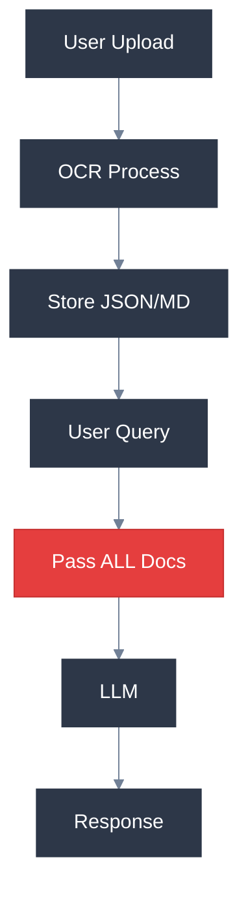

### Problem Visualization

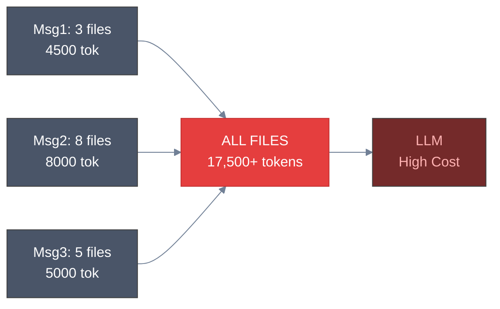

### Token Growth Problem

| Message | Files Uploaded | Cumulative Files | Tokens Sent | Cost Impact |
|---------|---------------|------------------|-------------|-------------|
| 1 | 3 | 3 | 4,500 | $0.01 |
| 2 | 8 | 11 | 12,500 | $0.03 |
| 3 | 5 | 16 | 17,500 | $0.04 |
| 4 | 0 (query only) | 16 | 17,500 | $0.04 |
| 5 | 2 | 18 | 20,000 | $0.05 |
| ... | ... | ... | **Grows linearly** | High |

**Problem**: Every message sends ALL historical documents, even when irrelevant.

---

## Target Architecture

### High-Level Architecture

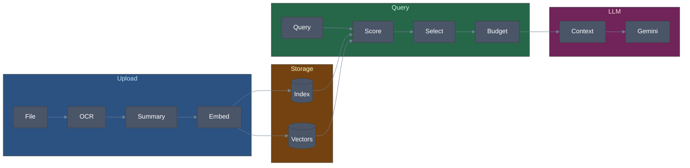

### Detailed Component Architecture

```mermaid
%%{init: {'theme': 'base', 'themeVariables': { 'primaryColor': '#4a5568', 'primaryTextColor': '#e2e8f0', 'lineColor': '#a0aec0'}}}%%
flowchart LR
    subgraph FE["Frontend"]
        F1[Chat] & F2[Upload]
    end
    subgraph API["API"]
        A1[/chat] & A2[/upload]
    end
    subgraph SVC["Services"]
        CM[Context Mgr]
        EM[Embedder]
        MM[Memory]
        OCR[OCR]
    end
    subgraph DB["Storage"]
        R[(Redis)]
        FS[(Files)]
    end
    subgraph EXT["External"]
        G[Gemini]
    end
    F1 --> A1 --> CM --> G
    F2 --> A2 --> OCR --> CM
    CM --> EM --> R
    CM --> MM
    OCR --> FS
    style FE fill:#2d3748,color:#e2e8f0
    style API fill:#2d3748,color:#e2e8f0
    style SVC fill:#1a202c,color:#e2e8f0
    style DB fill:#2d3748,color:#e2e8f0
    style EXT fill:#2d3748,color:#e2e8f0
```

---

## Context Management Strategy

### Document Lifecycle State Machine

```mermaid
%%{init: {'theme': 'base', 'themeVariables': { 'primaryColor': '#4a5568', 'primaryTextColor': '#e2e8f0', 'lineColor': '#a0aec0'}}}%%
stateDiagram-v2
    [*] --> Uploading
    Uploading --> Processing --> Indexed
    Indexed --> Active: In window
    Active --> Summarized: Exits window
    Summarized --> Archived: Session ages
    Active --> Active: Referenced
    Summarized --> Active: Query match
    Archived --> Active: Deep search
```

### Context Selection Algorithm

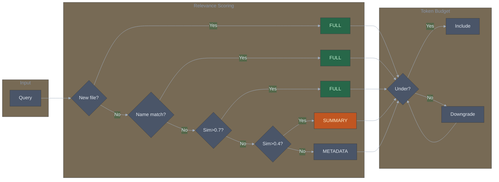

### Sliding Window Strategy

| Window | Messages | Content Level |
|--------|----------|---------------|
| **Active** | N, N-1, N-2 | Full content |
| **Summary** | N-3, N-4, N-5 | Summaries only |
| **Archive** | 1 to N-6 | Metadata only |

### Token Budget Allocation (8000 total)

| Component | Tokens | % |
|-----------|--------|---|
| System Prompt | 500 | 6% |
| Conversation Active | 1500 | 19% |
| Conversation Summaries | 500 | 6% |
| Documents Full | 2000 | 25% |
| Documents Summaries | 800 | 10% |
| Documents Metadata | 200 | 3% |
| User Query | 500 | 6% |
| Safety Buffer | 2000 | 25% |

### Content Level Comparison

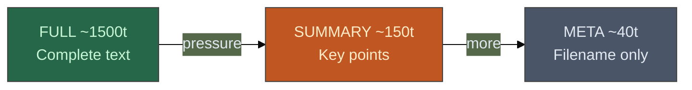

---

## Data Models

### Entity Relationship Diagram

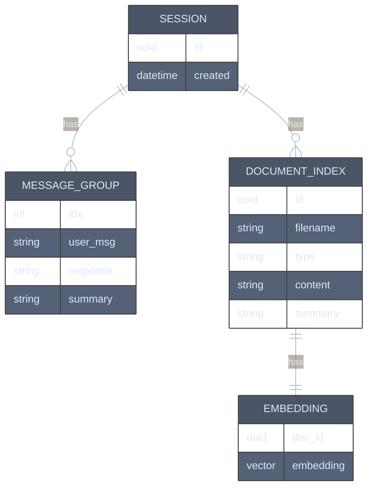

### Document Index Schema

```python
DocumentIndex = {
    # Identity
    "doc_id": "uuid-string",
    "session_id": "uuid-string",
    "filename": "invoice_001.pdf",
    "file_type": ".pdf",

    # Position
    "message_group_idx": 2,
    "upload_order": 1,
    "uploaded_at": "2024-02-06T10:30:00Z",

    # Classification
    "document_type": "invoice",
    "document_subtype": "purchase_invoice",

    # Content Levels
    "full_content": "Invoice #12345\nDate: 2024-01-15\n...",
    "full_token_count": 1500,

    "summary": "Purchase invoice #12345 from Acme Corp dated Jan 15, 2024 for $5,000 total with 3 line items.",
    "summary_token_count": 45,

    "metadata": {
        "entities": ["Acme Corp", "John Smith"],
        "amounts": ["$5,000", "$1,500", "$2,000", "$1,500"],
        "dates": ["2024-01-15", "2024-02-15"],
        "key_terms": ["invoice", "purchase", "net 30", "payment"],
        "erp_fields": {
            "vendor": "Acme Corp",
            "invoice_number": "12345",
            "total": 5000,
            "currency": "USD"
        }
    },

    # Usage
    "reference_count": 3,
    "last_referenced_at": "2024-02-06T11:00:00Z"
}
```

---

## Implementation Phases

### Phase Overview

| Phase | Name | Duration | Depends On |
|-------|------|----------|------------|
| 1 | Document Indexing | 2-3 days | - |
| 2 | Context Builder | 2-3 days | Phase 1 |
| 3 | Semantic Search | 3-4 days | Phase 1 |
| 4 | Conversation Memory | 2-3 days | Phase 2 |
| 5 | Optimization | 2-3 days | Phase 3, 4 |
| - | **MVP** | - | Phase 2 |
| - | **Full** | - | Phase 5 |

### Phase Dependencies

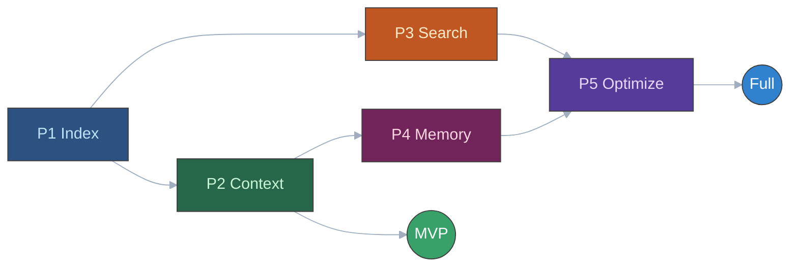

---

## Phase 1: Document Indexing Foundation

**Goal**: Store document metadata and summaries on upload

**Duration**: 2-3 days

### Sequence Diagram

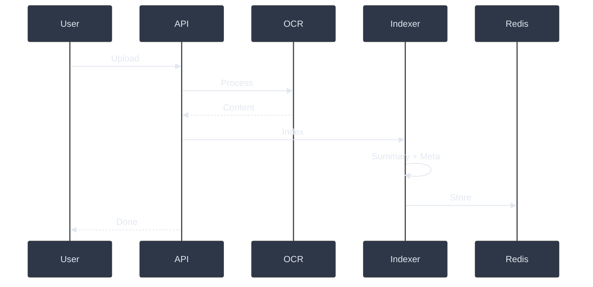

### Tasks

- [ ] **1.1** Create data models (DocumentIndex, DocumentMetadata)
- [ ] **1.2** Create DocumentIndexService with CRUD operations
- [ ] **1.3** Implement Summarizer service (Gemini API)
- [ ] **1.4** Implement metadata extraction (entities, amounts, dates)
- [ ] **1.5** Create TokenCounter utility
- [ ] **1.6** Integrate indexing into upload endpoint
- [ ] **1.7** Add index info to upload response

### Files to Create

```
app/services/context_manager/
├── __init__.py
├── models.py                 # DocumentIndex, DocumentMetadata, MessageGroup
├── document_index_service.py # CRUD for document index
├── summarizer.py             # LLM-based summarization
├── metadata_extractor.py     # Entity/amount extraction
└── token_counter.py          # Token counting utility
```

---

## Phase 2: Basic Context Builder

**Goal**: Build optimized context with token budgeting

**Duration**: 2-3 days

### Sequence Diagram

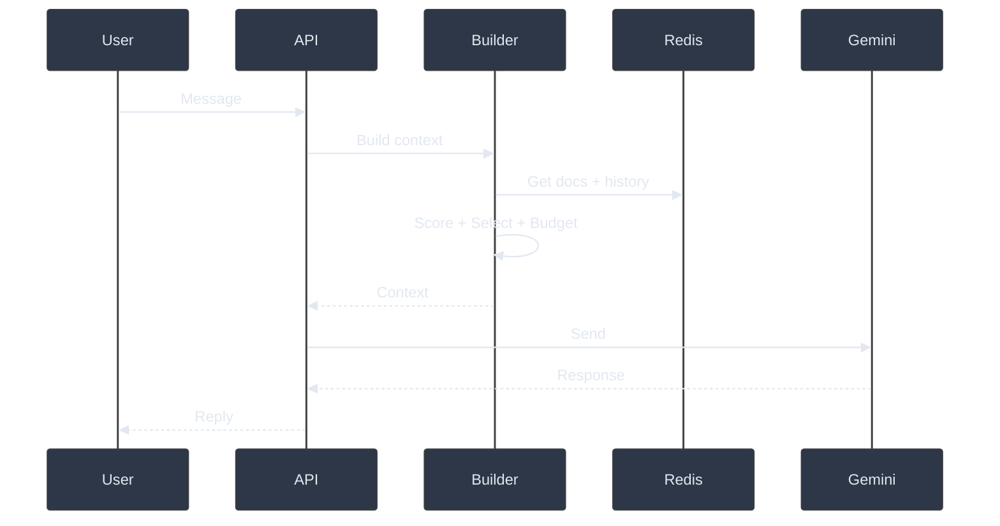

### Tasks

- [ ] **2.1** Create ContextBuilder service
- [ ] **2.2** Implement RelevanceScorer (filename + keyword matching)
- [ ] **2.3** Implement sliding window for conversation
- [ ] **2.4** Implement TokenBudgetManager
- [ ] **2.5** Create context assembly logic (full to summary to metadata)
- [ ] **2.6** Integrate into chat endpoint
- [ ] **2.7** Add context metrics to response (for debugging)

### Files to Create

```
app/services/context_manager/
├── context_builder.py        # Main context assembly
├── relevance_scorer.py       # Document relevance scoring
├── token_budget_manager.py   # Budget allocation and enforcement
└── context_assembler.py      # Assemble final context string
```

---

## Phase 3: Semantic Search

**Goal**: Find relevant documents by meaning

**Duration**: 3-4 days

### Sequence Diagram

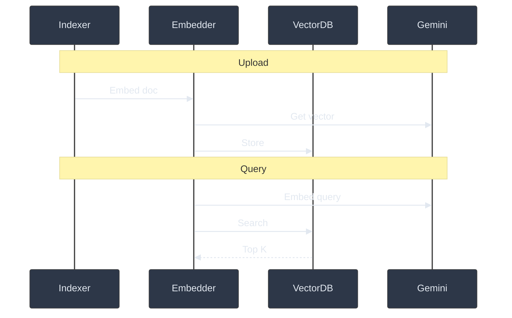

### Tasks

- [ ] **3.1** Create Embedder service (Gemini embedding API)
- [ ] **3.2** Create VectorStore service (Redis VSS)
- [ ] **3.3** Generate embeddings on document upload
- [ ] **3.4** Implement semantic similarity search
- [ ] **3.5** Enhance RelevanceScorer with semantic signals
- [ ] **3.6** Add query embedding at request time
- [ ] **3.7** Benchmark embedding latency

### Files to Create

```
app/services/embedding/
├── __init__.py
├── embedder.py               # Generate embeddings via Gemini
├── vector_store.py           # Redis VSS operations
└── similarity_search.py      # Search and rank by similarity
```

---

## Phase 4: Conversation Memory Enhancement

**Goal**: Efficient long conversation handling

**Duration**: 2-3 days

### Sequence Diagram

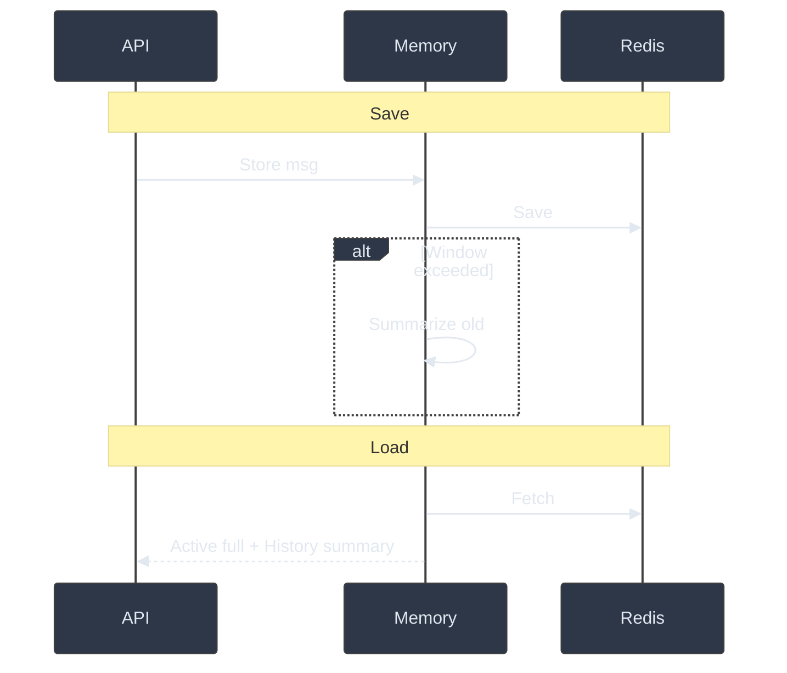

### Tasks

- [ ] **4.1** Enhance ConversationMemoryService with message groups
- [ ] **4.2** Implement automatic summarization trigger
- [ ] **4.3** Track document references per message
- [ ] **4.4** Implement cross-message reference resolution
- [ ] **4.5** Add conversation-level summary for very long sessions
- [ ] **4.6** Handle message editing with context updates

### Files to Modify/Create

```
app/services/
├── conversation_memory.py    # Enhanced with summaries
└── context_manager/
    └── conversation_manager.py  # Message group management
```

---

## Phase 5: Optimization and Edge Cases

**Goal**: Production-ready robustness

**Duration**: 2-3 days

### Edge Case Handling Flow

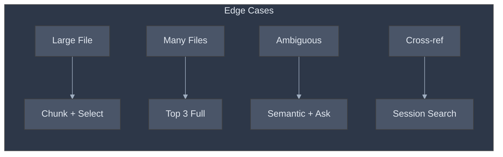

### Tasks

- [ ] **5.1** Implement chunking for large files
- [ ] **5.2** Handle 10+ files per message gracefully
- [ ] **5.3** Add caching for repeated queries
- [ ] **5.4** Implement clarification prompts for ambiguity
- [ ] **5.5** Add analytics/logging for context efficiency
- [ ] **5.6** Performance testing and optimization
- [ ] **5.7** Error handling and fallbacks

---

## Edge Cases and Solutions

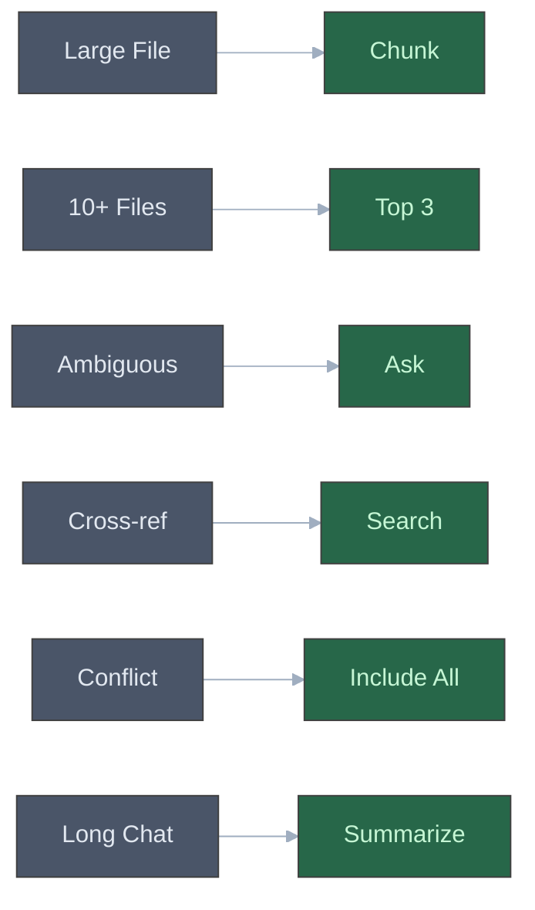

| Scenario | Detection | Solution | Fallback |
|----------|-----------|----------|----------|
| Very large file (>10k tokens) | Token count | Chunk into sections, embed each | Include summary only |
| Many files (10+) in one message | File count | Top 3 full + rest metadata | All as metadata |
| Ambiguous reference ("that file") | No direct match | Recency + semantic similarity | Ask user to clarify |
| Cross-message reference | "earlier", "before" keywords | Search all session documents | Include recent docs |
| Conflicting info across docs | Multiple high relevance | Include all relevant docs | Let LLM synthesize |
| Very long conversation (50+ msgs) | Message count | Keep only 5 groups active | Session summary |

---

## API Design

### Context Building Request Flow

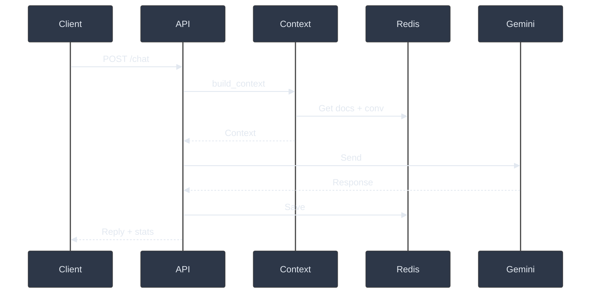

### New Response Schema

```python
# Enhanced chat response
ChatResponse = {
    "response": "The invoice total is $5,000...",
    "language": "en",
    "session_id": "uuid",
    "conversation_length": 5,

    # NEW: Context statistics (optional, for debugging)
    "context_stats": {
        "total_tokens": 4500,
        "docs_full": ["doc_id_1", "doc_id_2"],
        "docs_summary": ["doc_id_3", "doc_id_4"],
        "docs_metadata": ["doc_id_5", "doc_id_6"],
        "conversation_groups_included": 3,
        "budget_utilization": 0.82
    }
}

# Enhanced upload response
UploadResponse = {
    "file_id": "uuid",
    "filename": "invoice.pdf",
    "extraction": {...},

    # NEW: Index information
    "doc_index": {
        "doc_id": "uuid",
        "summary": "Invoice #123 from Acme Corp...",
        "token_count": 1500,
        "document_type": "invoice",
        "key_entities": ["Acme Corp", "$5,000"]
    }
}
```

---

## Technology Decisions

### Decision Matrix

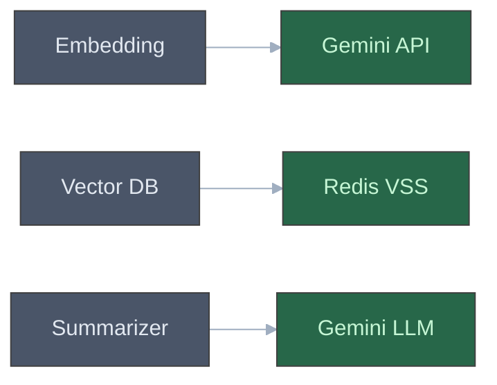

### Recommended Stack

| Component | Choice | Rationale |
|-----------|--------|-----------|
| **Embedding Model** | Gemini Embedding API | Consistency, quality, low cost |
| **Vector Store** | Redis VSS | Already in stack, sufficient scale |
| **Summarization** | Gemini LLM | Quality, already integrated |
| **Token Counter** | tiktoken | Accuracy for Gemini tokenizer |

### Cost Estimation (1000 conversations/month)

| Operation | Volume/Month | Unit Cost | Total |
|-----------|--------------|-----------|-------|
| Embeddings | 5,000 docs | $0.0001/1k tokens | ~$5 |
| Summaries | 5,000 docs | $0.00025/summary | ~$15 |
| LLM Queries | 10,000 msgs | $0.008/query (optimized) | ~$80 |
| **Total** | | | **~$100/month** |

**Savings**: ~$200/month compared to current approach (70% reduction)

---

## Success Metrics

### Performance Targets

**Token Usage: Current vs Target**

| Docs | Current | Target | Reduction |
|------|---------|--------|-----------|
| 1 | 1,500 | 1,500 | 0% |
| 5 | 7,500 | 3,000 | 60% |
| 10 | 15,000 | 5,000 | 67% |
| 20 | 22,500 | 7,000 | 69% |

| Metric | Current | Target | Improvement |
|--------|---------|--------|-------------|
| Tokens/request (10 docs) | ~15,000 | ~5,000 | 67% reduction |
| Context build latency | N/A | < 500ms | - |
| Relevant doc accuracy | N/A | > 90% | - |
| Cost/conversation (20 msgs) | ~$0.50 | ~$0.15 | 70% reduction |
| Max conversation length | ~20 msgs | 100+ msgs | 5x increase |

---

## File Structure (Final)

```
app/
├── services/
│   ├── context_manager/
│   │   ├── __init__.py
│   │   ├── models.py                 # Data models
│   │   ├── document_index_service.py # Document CRUD
│   │   ├── context_builder.py        # Main orchestrator
│   │   ├── relevance_scorer.py       # Scoring logic
│   │   ├── token_budget_manager.py   # Budget management
│   │   ├── context_assembler.py      # Final assembly
│   │   ├── summarizer.py             # LLM summarization
│   │   ├── metadata_extractor.py     # Entity extraction
│   │   └── token_counter.py          # Token utilities
│   │
│   ├── embedding/
│   │   ├── __init__.py
│   │   ├── embedder.py               # Gemini embeddings
│   │   ├── vector_store.py           # Redis VSS
│   │   └── similarity_search.py      # Search logic
│   │
│   └── conversation_memory.py        # Enhanced memory
│
├── api/v1/endpoints/
│   ├── chat.py                       # Modified
│   └── upload.py                     # Modified
│
└── agents/
    └── supervisor.py                 # Uses ContextBuilder
```

---

## Next Steps

1. **Review and Approve** this plan
2. **Confirm** technology choices (embedding, vector store)
3. **Begin Phase 1** - Document Indexing Foundation
4. **Daily standups** to track progress
5. **Test with real data** after each phase

---

## Appendix: Quick Reference

### Context Levels Cheat Sheet

| Level | Tokens | When Used | Example |
|-------|--------|-----------|---------|
| **FULL** | ~1500 | Just uploaded, explicitly referenced | Complete invoice text |
| **SUMMARY** | ~150 | In window, not referenced | "Invoice #123 from Acme, $5k total" |
| **METADATA** | ~40 | Older, for listing | "invoice.pdf, invoice, Acme Corp" |

### Relevance Signals

| Signal | Weight | Example |
|--------|--------|---------|
| Filename match | 0.4 | Query: "invoice.pdf" matches invoice.pdf |
| Explicit reference | 0.3 | Query: "the first file" matches file at index 1 |
| Keyword overlap | 0.2 | Query: "total amount" matches docs with "total" |
| Semantic similarity | 0.3 | Query: "how much to pay" matches invoice docs |
| Recency | 0.1 | Newer docs score higher |

---

*Document Version: 1.0*
*Status: Ready for Review*
