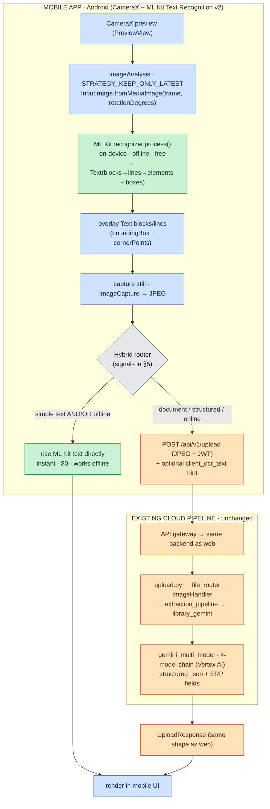

# Mobile Camera OCR with Google ML Kit — Hybrid Plan (In‑Depth)

> **What this is:** a plan + workflow chart for adding **on‑device camera OCR** to the mobile app using
> **Google ML Kit Text Recognition v2**
> ([Android docs](https://developers.google.com/ml-kit/vision/text-recognition/v2/android)), and **clubbing it with
> the existing cloud OCR pipeline** so that **web keeps using the current `library_gemini` → Gemini flow** unchanged,
> while **mobile gains a fast/free/offline on‑device path** and **escalates to the same backend** for high‑accuracy
> structured extraction.
>
> **Companion doc (the existing pipeline):** [`ocr_active_flow_complete.md`](./ocr_active_flow_complete.md).
>
> Diagram colors (dark/light legible): 🟦 mobile app/camera · 🟩 on‑device ML Kit (free) · 🟧 existing cloud pipeline
> (paid) · ⬜ decision.

---

## 1. What is Google ML Kit?

**ML Kit** is Google's free, **on‑device** mobile machine‑learning SDK (Android + iOS). "On‑device" is the key
word: the models run **locally on the phone's CPU/GPU/NPU**, so there is **no server call, no per‑use cost, no
network requirement, and the image never leaves the device**. It is the same technology family that powers Google
Lens / Translate offline.

ML Kit ships several ready‑made APIs. We only need **Text Recognition**, but for context here is the family:

| ML Kit API | What it does | Relevant to us? |
|---|---|---|
| **Text Recognition v2** | reads printed text from an image/camera frame | ✅ **this is what we use** |
| Barcode Scanning | decodes QR / 1D / 2D barcodes | maybe later (e.g. scan a product barcode) |
| Document Scanner | guided "flatten a page" capture + crop | optional UX helper for capture |
| Image Labeling / Object Detection | tags objects in an image | ❌ |
| Face / Pose / Selfie | face & body landmarks | ❌ |
| Language ID / Translation / Entity Extraction | on‑device NL tasks | ❌ (Gemini does our understanding) |

### 1.1 What **Text Recognition v2** specifically does

It takes an image (a still photo **or** a live camera frame) and returns the **printed text it sees, plus where each
piece of text is** (its geometry). It supports multiple **scripts**, each as a separate small model you include only
if needed:

- **Latin** (English + most European languages) — `TextRecognizerOptions.DEFAULT_OPTIONS`
- **Devanagari** (Hindi, Marathi, …) — `DevanagariTextRecognizerOptions`
- **Chinese**, **Japanese**, **Korean** — their own options classes

For ERPSense (English + Hindi/Marathi) you ship **Latin + Devanagari**.

### 1.2 What the result actually contains (the `Text` object)

ML Kit returns a **`Text`** object — a 4‑level hierarchy of recognized text **with bounding geometry at every
level**. This is *raw text + coordinates*, nothing more:

```
Text                         .text  = the whole recognized string
 └─ TextBlock  (a paragraph) .text  .boundingBox(Rect)  .cornerPoints(Point[])  .recognizedLanguage
     └─ Line   (a line)      .text  .boundingBox        .cornerPoints           .recognizedLanguage
         └─ Element (a word) .text  .boundingBox        .cornerPoints
             └─ Symbol (char).text  .boundingBox
```

So from one photo of, say, a price tag you might get back something like:

```jsonc
// conceptual shape of the ML Kit result
{
  "text": "MILK 1L\n₹ 62.00\nBest before 12/2026",
  "blocks": [
    { "text": "MILK 1L",            "boundingBox": [x,y,w,h], "lang": "en" },
    { "text": "₹ 62.00",            "boundingBox": [x,y,w,h], "lang": "en" },
    { "text": "Best before 12/2026","boundingBox": [x,y,w,h], "lang": "en" }
  ]
}
```

The **bounding boxes / corner points** are what let you draw a live overlay on the camera (highlight detected text)
and reason about *layout* (are the boxes in a neat grid → a table? one short box → a single label?).

### 1.3 What ML Kit **can** and **cannot** do — the crucial distinction

This is the whole reason for a *hybrid* design. ML Kit gives you **characters and their positions** — it does **not
understand the document**.

| ✅ ML Kit **can** | ❌ ML Kit **cannot** |
|---|---|
| Read printed text fast, on‑device, offline, free | Understand meaning ("which number is the invoice **total**?") |
| Return per‑word / per‑line **bounding boxes** | Produce structured JSON (seller, buyer, line items, tax) |
| Detect the **script/language** of a line | Extract **ERP fields** (GSTIN, PAN, invoice no., HSN) |
| Power a **real‑time overlay** on the camera | Reliably read **handwriting** |
| Handle short labels, codes, numbers, signs | Reconstruct complex **tables** as rows/columns |
| Work with **no network** | Interpret **charts/graphs** |

In one sentence: **ML Kit reads, Gemini understands.** That is the dividing line the hybrid router uses.

---

## 2. The hybrid principle (why two engines)

| | **ML Kit (on‑device, mobile)** | **Existing Gemini pipeline (cloud)** |
|---|---|---|
| Runs | on the phone (CameraX frames) | backend `library_gemini` → `gemini_multi_model` |
| Cost / network | **free, offline, instant** | paid (Vertex AI), needs network |
| Returns | plain text + bounding boxes (no meaning) | `text · markdown · structured_json · ERP fields · confidence` |
| Best at | live preview, framing, **simple text** | invoices, tables, ERP fields, handwriting, charts |

**Design rule:** ML Kit is the **real‑time front‑end + offline fast path**; the **existing cloud pipeline stays the
source of truth** for anything structured. A captured photo that needs understanding goes to the **same
`POST /api/v1/upload`** the web uses, so **mobile and web get the identical `UploadResponse`**. This mirrors the
cost‑tiering already in the pipeline (cheap local check first, escalate to paid Gemini only when needed) — see
`ocr_active_flow_complete.md` §5.

---

## 3. What is "simple text"? (definition + examples)

"**Simple text**" = a capture where the **raw characters ARE the answer** — there is no structure to reconstruct and
no field to *interpret*. ML Kit alone is enough; sending it to Gemini would add cost and latency for no benefit.

A capture is **"complex"** when the value comes from **understanding layout/relationships** — line items, totals,
which label maps to which value — i.e. it needs `structured_json` / ERP fields. Those go to the cloud.

### 3.1 Concrete examples

| 🟩 **Simple text → ML Kit on‑device** | 🟧 **Complex document → Cloud Gemini** |
|---|---|
| A **serial / batch number** off a carton (`SN: 8842‑AX‑19`) | A full **supplier invoice** (header + line items + GST + total) |
| A **product SKU / part code** label | A **receipt** with multiple items and amounts |
| A **price tag** (`₹ 62.00`) | A **purchase order** / quotation |
| A **phone number / email** on a business card | A **bank statement** (rows of transactions) |
| A **vehicle number plate** | A **form** with many label→value fields |
| A **meter reading** | A **table** / spreadsheet photo |
| A **Wi‑Fi password** card | **Handwritten** notes |
| A **container / LR / docket number** | A **chart / graph** |
| A short **printed note** or single field the user wants typed for them | Anything that becomes an **authoritative ERP record** |

### 3.2 How the app *measures* "simple" (so it's not a guess)

The router turns "simple vs complex" into **measurable signals** from the ML Kit result + context (see §5):

- **Few blocks & short text** — e.g. `textBlocks ≤ 3` and total length `< ~120 chars`.
- **No tabular geometry** — bounding boxes are **not** arranged in a multi‑column grid.
- **No "document" patterns** — no currency+amount **rows**, no `Invoice/Total/Tax/GSTIN/HSN` keywords, no date+amount
  pairs.
- **Single intent** — the user tapped **"Quick scan"**, not **"Add invoice / Upload document"**.

If all hold → treat as **simple** (use ML Kit text). If **any** "document" signal fires → **escalate to cloud**.

> Rule of thumb: **if the user would have to read the layout to make sense of it, it's complex.** A lone number is
> simple; a grid of numbers is not.

---

## 4. Hybrid workflow chart



### 4a. ASCII version

```
MOBILE (CameraX + ML Kit, on-device)
  CameraX preview
     │ frames → InputImage.fromMediaImage(frame, rotation)
     ▼
  ML Kit recognizer.process()   (on-device · offline · FREE)
     │ Text → blocks → lines → elements (+ boundingBox / cornerPoints + recognizedLanguage)
     ▼
  overlay text on preview  ──►  user captures still (JPEG)
     │
     ▼
  Hybrid router ── simple text / offline? ──┬── YES ─► use ML Kit text directly (instant · $0)
                                            │
                                            └── NO  ─► POST /api/v1/upload (JPEG + JWT)  [+ client_ocr_text]
                                                              │
                                                              ▼
                                   == EXISTING CLOUD PIPELINE (unchanged) ==
                                   upload.py → file_router → ImageHandler
                                     → extraction_pipeline → library_gemini → gemini_multi_model (Vertex AI)
                                              │ UploadResponse (text · markdown · structured_json · ERP fields)
                                              ▼
                                   render in mobile UI  ◄── (same result as web)
```

---

## 5. What gets passed to the router(s)

There are **two** routers in play. Don't confuse them:

1. **Mobile hybrid router** (new, on the phone) — decides **ML Kit‑only vs escalate to cloud**.
2. **Backend `file_router`** (existing) — once a JPEG arrives at `/api/v1/upload`, routes it by extension to the
   `ImageHandler → Gemini` path (unchanged; see companion doc §3–§4).

### 5.1 Inputs to the **mobile hybrid router** (the decision)

These are the signals the on‑device router reads to choose a path. **None of these leave the phone unless it
escalates.**

| Signal | Source | Pushes toward |
|---|---|---|
| `block_count`, `line_count`, total `char_count` | ML Kit `Text` tree | few/short → **on‑device** |
| Bounding‑box geometry (grid? multi‑column?) | `boundingBox` / `cornerPoints` | grid/columns → **cloud** |
| Content patterns: currency+amount, dates, `Invoice/Total/Tax/GSTIN/PAN/HSN` | regex over `text` | any match → **cloud** |
| `recognizedLanguage` / script | ML Kit line/element | (selects Latin vs Devanagari; not a router input per se) |
| **User intent** (which button: "Quick scan" vs "Add invoice/Upload") | app UI | invoice/upload → **cloud** |
| **Connectivity** (online/offline) | `ConnectivityManager` | offline → **on‑device** (or queue) |
| Document‑Scanner crop result (if used) | ML Kit Document Scanner | full page → **cloud** |

> Default bias: when **online** and the capture looks like a **document**, prefer **cloud** (accuracy + structure).
> When **offline** or clearly **simple**, use **on‑device**.

### 5.2 What is passed to the **backend** when it escalates (the upload payload)

This is the **same request the web makes** — reusing the existing endpoint means **no backend change** for the
minimal version.

| Field | Required? | Notes |
|---|---|---|
| `file` (the captured **JPEG**, `multipart/form-data`) | ✅ required | resize/compress first; backend caps 30 MB / 4096 px |
| `Authorization: Bearer <JWT>` header | ✅ required | same auth as web |
| `lang` (e.g. `auto`, `en`, `hi`) | optional | OCR language hint |
| `session_id`, `upload_id` | optional | if attached to a chat session |
| **`client_ocr_text`** (the ML Kit text) | optional (**Phase 4**) | lets backend short‑circuit or hint Gemini |
| **`source="mobile_mlkit"`** | optional (**Phase 4**) | analytics / branching flag |
| `client_ocr_boxes` (bounding boxes JSON) | optional (future) | could aid layout fusion |

> **Phase‑1 reality:** only `file` + JWT (+ maybe `lang`) are sent — literally the web upload. The `client_ocr_*`
> fields are **additive and ignored when absent**, so they can be introduced later without breaking anything.

### 5.3 What the backend `file_router` does with it (unchanged)

`.jpg` → **`ImageHandler`** → **`extraction_pipeline.extract()`** → (image + `library_gemini`) →
**`gemini_multi_model`** (Vertex AI 4‑model chain) → structuring + ERP fields. Identical to the web path.

### 5.4 What comes back to the phone (`UploadResponse`)

```jsonc
{
  "extraction": {
    "text": "…", "markdown": "…", "formatted_markdown": "…",
    "structured_json": { "seller": {…}, "buyer": {…}, "line_items": [...], "tax_breakdown": {…}, "total": … },
    "tables": [...], "document_type": "invoice",
    "metadata": {
      "extraction_method": "gemini_vision", "confidence": 0.95,
      "model_used": "gemini-2.5-flash", "ocr_engines_used": ["gemini_…"],
      "tokens_used": …, "cost_usd": …, "languages_detected": ["en","hi"]
    }
  }
}
```

The mobile UI renders this **exactly like the web preview** — so escalated captures look and behave identically
across platforms.

---

## 6. Worked example — two scans, side by side

**A) Scanning a product label `SN: 8842‑AX‑19` (simple)**
1. ML Kit returns 1 block, ~14 chars, no grid, no currency/date/keywords.
2. User came from **"Quick scan"**; online or not — doesn't matter.
3. Router → **on‑device**: the string `8842‑AX‑19` is shown instantly, **$0**, no upload. Done.

**B) Scanning a supplier invoice (complex)**
1. ML Kit returns ~30 blocks in a grid, with `₹` amounts, `Invoice No`, `Total`, `GSTIN`.
2. User came from **"Add invoice"**.
3. Router → **escalate**: capture JPEG → `POST /api/v1/upload` (JWT [+ `client_ocr_text`]).
4. Backend `ImageHandler → library_gemini → gemini_multi_model` returns `structured_json` with seller/buyer/line
   items/tax/total + ERP fields.
5. Phone renders the structured result — **identical to the web upload**.

---

## 7. Implementation steps (Android — per the linked v2 docs)

**Step 1 — Gradle dependencies** (prefer *unbundled* via Play Services to keep the APK small; the model downloads on
demand). Add only the scripts you need (ERPSense ≈ Latin + Devanagari for Hindi/Marathi):

```gradle
// ML Kit Text Recognition v2 (unbundled / Play Services)
implementation 'com.google.android.gms:play-services-mlkit-text-recognition:19.0.1'            // Latin
implementation 'com.google.android.gms:play-services-mlkit-text-recognition-devanagari:16.0.1' // Hindi/Marathi
// (bundled alternative: 'com.google.mlkit:text-recognition:16.0.1' + '-devanagari:16.0.1')

// CameraX
implementation "androidx.camera:camera-camera2:1.3.+"
implementation "androidx.camera:camera-lifecycle:1.3.+"
implementation "androidx.camera:camera-view:1.3.+"
```

Request the **`CAMERA`** permission at runtime.

**Step 2 — Build the recognizer (by language).** Map the app's selected language → the right v2 options class:

```kotlin
val recognizer = when (appLanguage) {
    "hi", "mr" -> TextRecognition.getClient(DevanagariTextRecognizerOptions.Builder().build())
    else       -> TextRecognition.getClient(TextRecognizerOptions.DEFAULT_OPTIONS) // Latin
}
// Other scripts: ChineseTextRecognizerOptions / JapaneseTextRecognizerOptions / KoreanTextRecognizerOptions
```

**Step 3 — CameraX live preview + analysis** (`PreviewView` + `ImageAnalysis` with `STRATEGY_KEEP_ONLY_LATEST` to
drop stale frames + `ImageCapture` for the high‑res still).

**Step 4 — Per‑frame recognition (real‑time overlay).** Convert the frame, process, and **always close the
`ImageProxy`** in `addOnCompleteListener` (otherwise the analyzer never receives the next frame):

```kotlin
@OptIn(ExperimentalGetImage::class)
fun analyze(imageProxy: ImageProxy) {
    val media = imageProxy.image ?: return imageProxy.close()
    val image = InputImage.fromMediaImage(media, imageProxy.imageInfo.rotationDegrees)
    recognizer.process(image)
        .addOnSuccessListener { text: Text ->
            // text.text            → full string
            // text.textBlocks      → List<TextBlock> → .lines → .elements → .symbols
            // block.boundingBox (Rect) + block.cornerPoints (Point[]) → draw overlay
            drawOverlay(text)
        }
        .addOnFailureListener { /* log; keep previewing */ }
        .addOnCompleteListener { imageProxy.close() }   // REQUIRED to unblock the pipeline
}
```

**Step 5 — Capture the still.** On the shutter tap (or auto‑capture when the overlay is stable), use `ImageCapture`
to produce a high‑resolution **JPEG**.

**Step 6 — Hybrid routing decision** (the signals in §5) → keep the ML Kit text locally **or** upload the JPEG.

**Step 7 — Cloud path = reuse the existing API (no backend change required).** POST the JPEG as
`multipart/form-data` to **`POST /api/v1/upload`** with the user's JWT — exactly what the web does
([upload.py](../../erpsense-backend/app/api/v1/endpoints/upload.py)). It flows through the unchanged
`ImageHandler → extraction_pipeline → library_gemini → gemini_multi_model` path and returns the same
`UploadResponse`.

**Step 8 — Lifecycle/perf hygiene:** throttle (skip frames while one is processing), run recognition off the UI
thread, release the recognizer (`recognizer.close()`) and unbind CameraX in `onDestroy`, and resize/compress the
captured JPEG before upload.

---

## 8. Clubbing it with the current pipeline

- **Web:** unchanged — still `library_gemini` → Gemini (see `ocr_active_flow_complete.md`).
- **Mobile, minimal integration (recommended first):** ML Kit for live preview + the captured JPEG goes to the
  **existing `/api/v1/upload`**. **Zero backend changes.** One pipeline, one result shape.
- **Mobile, enhanced integration (optional, later):** add the optional `client_ocr_text` / `source` fields so the
  backend can **short‑circuit** trivial captures or feed the ML Kit text to Gemini as a **verification hint**.
  Additive and backward‑compatible — ignored when absent.

---

## 9. Hybrid routing decision table

| Situation | Use | Why |
|---|---|---|
| Live camera framing / preview guidance | **ML Kit on‑device** | real‑time, free, no round‑trip |
| Quick text — a number, code, short label, single line | **ML Kit on‑device** | instant, $0, offline |
| No / poor network | **ML Kit on‑device** | works fully offline |
| Invoice / receipt / PO / table / bank statement | **Cloud Gemini pipeline** | structured extraction + ERP fields, parity with web |
| Handwriting, complex layout, charts/graphs | **Cloud Gemini pipeline** | Gemini handles these far better |
| Anything that becomes an authoritative ERP record | **Cloud Gemini pipeline** | identical result to the web upload |

---

## 10. Phased rollout plan

1. **Phase 1 — Capture + upload (parity):** CameraX capture → existing `/api/v1/upload`. Ships mobile OCR with the
   current accuracy and **no backend work**.
2. **Phase 2 — On‑device overlay:** add ML Kit real‑time text overlay + framing/stability guidance (still uploads for
   the authoritative result).
3. **Phase 3 — Offline/quick fast‑path:** when offline or the capture is "simple text", return the ML Kit result
   directly; queue heavy captures to upload when back online.
4. **Phase 4 (optional) — Hint fusion:** send `client_ocr_text` to the backend as a Gemini verification hint /
   short‑circuit.

---

## 11. If the mobile app is React Native (alternative)

The same hybrid holds — swap the native ML Kit calls for a wrapper such as
`@react-native-ml-kit/text-recognition` or a `react-native-vision-camera` frame processor; the cloud path is
unchanged (`POST /api/v1/upload`). Native Android (above) is the reference per the linked docs.

---

## 12. ML Kit Text Recognition v2 — quick reference

| Item | Value |
|---|---|
| On‑device / offline / cost | **Yes / yes / free** |
| Latin recognizer | `TextRecognition.getClient(TextRecognizerOptions.DEFAULT_OPTIONS)` |
| Devanagari recognizer | `DevanagariTextRecognizerOptions.Builder().build()` |
| Other scripts | `ChineseTextRecognizerOptions`, `JapaneseTextRecognizerOptions`, `KoreanTextRecognizerOptions` |
| Camera frame → input | `InputImage.fromMediaImage(mediaImage, rotationDegrees)` |
| Other inputs | `fromBitmap`, `fromFilePath`, `fromByteArray/Buffer (NV21/YV12)` |
| Process | `recognizer.process(image)` → `Task<Text>` (`addOnSuccessListener` / `Failure` / `Complete`) |
| Result tree | `Text.textBlocks → TextBlock.lines → Line.elements → Element.symbols`; each exposes `text`, `boundingBox` (Rect), `cornerPoints` (Point[]); blocks/lines also expose `recognizedLanguage` |
| CameraX backpressure | `ImageAnalysis.STRATEGY_KEEP_ONLY_LATEST` |
| Must‑do | close `ImageProxy` in `addOnCompleteListener`; throttle; overlay only after success |

---

### One‑line summary
> **ML Kit reads, Gemini understands.** Mobile uses ML Kit on‑device (free, offline, real‑time) for capture/preview
> and **simple text** (a number, code, label, single field); it **escalates the captured JPEG to the existing
> `/api/v1/upload` → `library_gemini` → Gemini pipeline** for **complex documents** (invoices, tables, ERP fields).
> Web is untouched; the cloud result is identical across web and mobile; backend changes are optional.
