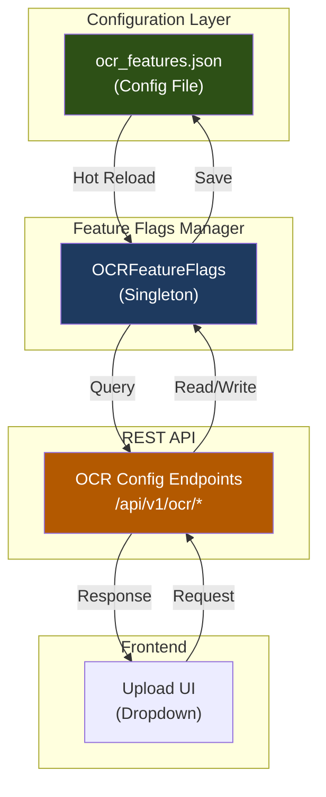
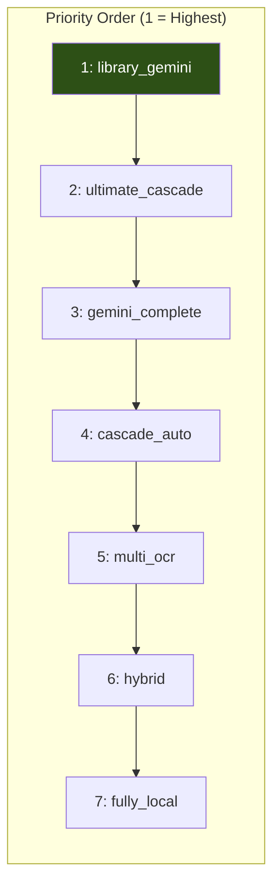
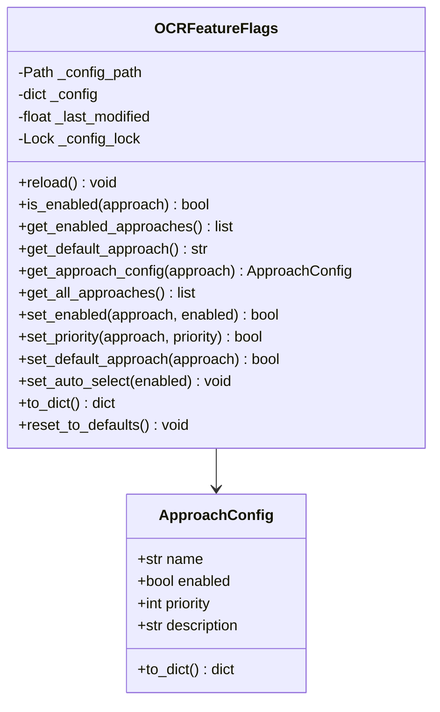
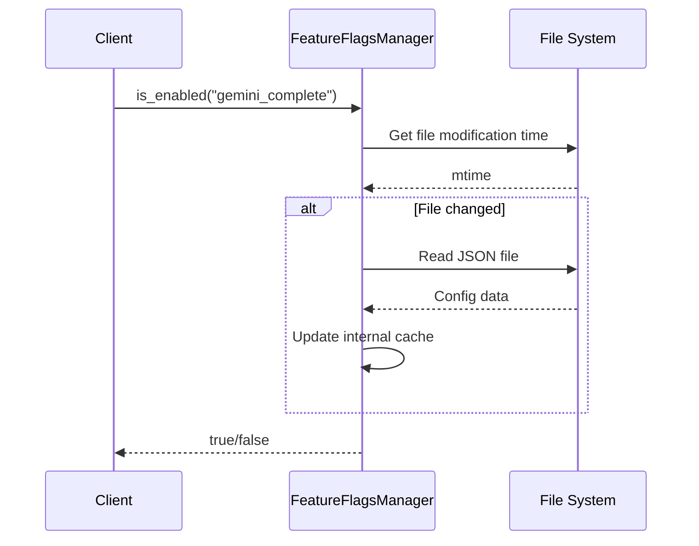
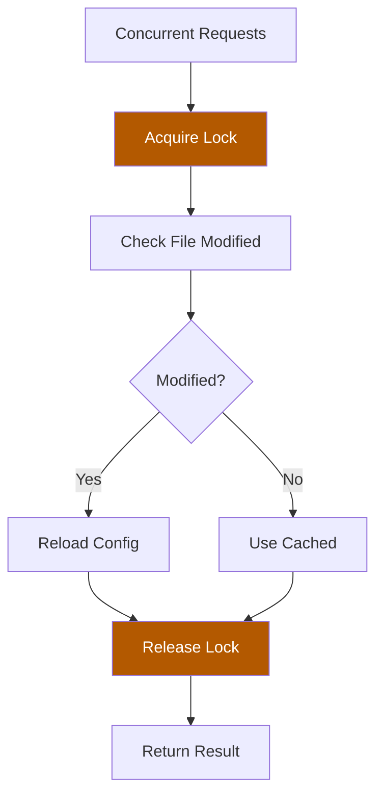
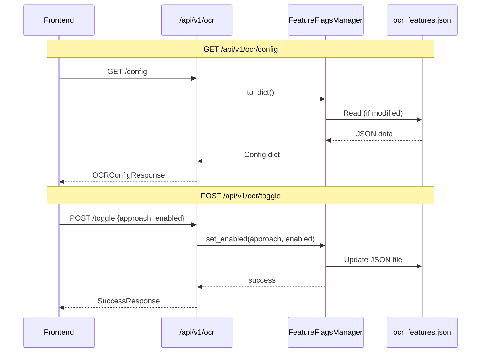
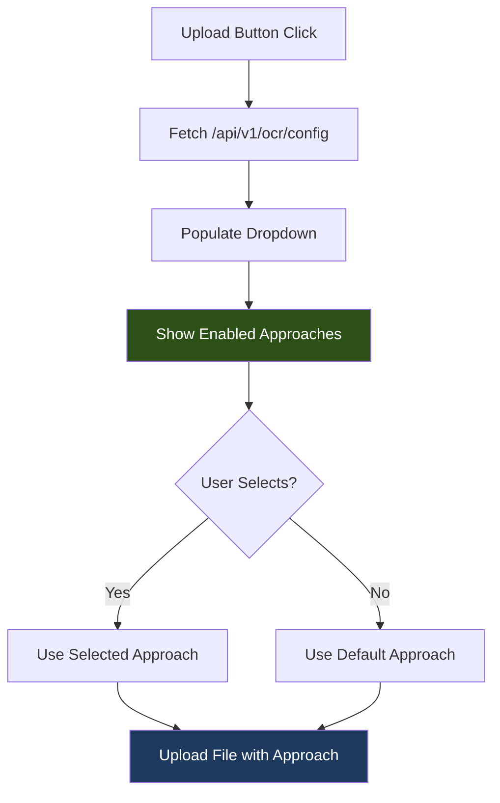
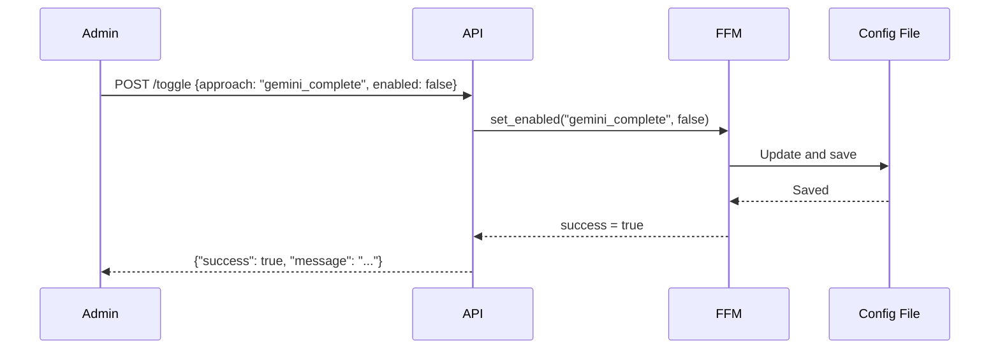
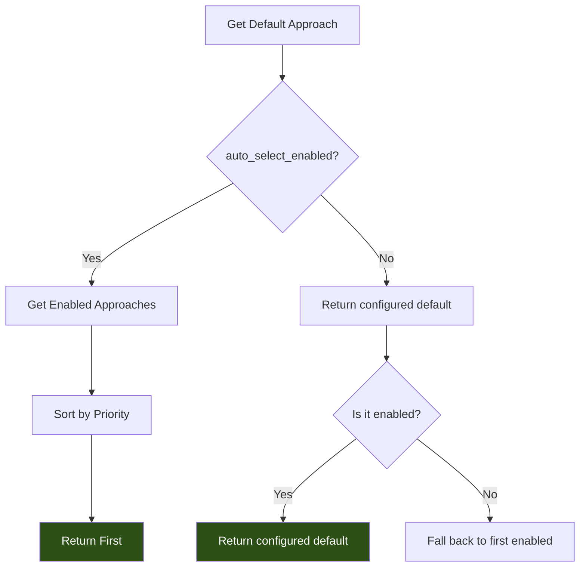

# OCR Feature Flags System

## Overview

The OCR Feature Flags system allows **dynamic enabling/disabling of OCR approaches** without code changes or server restarts.

### Key Features

| Feature | Description |
|---------|-------------|
| **Hot Reload** | Changes take effect immediately |
| **Priority System** | Auto-select best enabled approach |
| **REST API** | Frontend can fetch/update config |
| **Thread-Safe** | Safe for concurrent access |

---

## Architecture

### System Components



---

## Configuration File

### File Location

```
app/config/ocr_features.json
```

### JSON Structure

```json
{
  "ocr_approaches": {
    "fully_local": {
      "enabled": true,
      "priority": 7,
      "description": "Uses only local OCR engines (Surya, PaddleOCR). No API calls."
    },
    "hybrid": {
      "enabled": true,
      "priority": 6,
      "description": "Local OCR first, Gemini fallback for low confidence."
    },
    "multi_ocr": {
      "enabled": true,
      "priority": 5,
      "description": "Multiple local OCR engines with consensus."
    },
    "cascade_auto": {
      "enabled": true,
      "priority": 4,
      "description": "Auto-cascade through local approaches based on confidence."
    },
    "library_gemini": {
      "enabled": true,
      "priority": 1,
      "description": "Python libraries for text files, Gemini for images/scans."
    },
    "gemini_complete": {
      "enabled": true,
      "priority": 3,
      "description": "100% Gemini Vision with 4-model fallback chain."
    },
    "ultimate_cascade": {
      "enabled": true,
      "priority": 2,
      "description": "Most robust: GEMINI_COMPLETE → LIBRARY_GEMINI → CASCADE_AUTO."
    }
  },
  "default_approach": "library_gemini",
  "auto_select_enabled": true,
  "min_confidence_threshold": 0.55
}
```

### Priority System

**Lower number = Higher priority** (tried first when auto-select is enabled)



---

## Feature Flags Manager

### Class Diagram



### Hot Reload Mechanism



### Thread Safety



---

## REST API Endpoints

### Endpoint Overview

| Method | Endpoint | Description |
|--------|----------|-------------|
| GET | `/api/v1/ocr/config` | Get full configuration |
| GET | `/api/v1/ocr/approaches` | Get all approaches |
| GET | `/api/v1/ocr/approaches/enabled` | Get enabled only |
| GET | `/api/v1/ocr/default` | Get default approach |
| POST | `/api/v1/ocr/toggle` | Enable/disable approach |
| POST | `/api/v1/ocr/default` | Set default approach |
| POST | `/api/v1/ocr/priority` | Set approach priority |
| POST | `/api/v1/ocr/auto-select` | Toggle auto-select |
| POST | `/api/v1/ocr/reload` | Force reload config |
| POST | `/api/v1/ocr/reset` | Reset to defaults |

### API Flow



---

## Frontend Integration

### Fetching Available Approaches

```javascript
// Get all enabled approaches for dropdown
const response = await fetch('/api/v1/ocr/approaches/enabled');
const approaches = await response.json();
// ["library_gemini", "ultimate_cascade", "gemini_complete", ...]

// Get default approach
const defaultResponse = await fetch('/api/v1/ocr/default');
const { default_approach } = await defaultResponse.json();
// "library_gemini"
```

### Upload UI Integration



### Example UI Flow

```javascript
// 1. On component mount, fetch config
useEffect(() => {
  const fetchConfig = async () => {
    const res = await fetch('/api/v1/ocr/config');
    const config = await res.json();

    // Filter to only enabled approaches
    const enabled = config.approaches
      .filter(a => a.enabled)
      .sort((a, b) => a.priority - b.priority);

    setApproaches(enabled);
    setDefaultApproach(config.default_approach);
  };
  fetchConfig();
}, []);

// 2. Upload with selected approach
const handleUpload = async (file) => {
  const formData = new FormData();
  formData.append('file', file);
  formData.append('ocr_approach', selectedApproach || defaultApproach);

  const res = await fetch('/api/v1/files/upload', {
    method: 'POST',
    body: formData
  });
};
```

---

## Admin Operations

### Toggle Approach



### Change Priority

```python
# API Request
POST /api/v1/ocr/priority
{
  "approach": "library_gemini",
  "priority": 1
}

# Result: library_gemini becomes highest priority
```

### Reset to Defaults

```python
# API Request
POST /api/v1/ocr/reset

# All approaches re-enabled with default priorities
```

---

## Auto-Select Behavior

### When Auto-Select is ENABLED



### Priority-Based Selection

```python
# With auto_select_enabled = True
# Enabled: library_gemini (1), gemini_complete (3), fully_local (7)
# Result: library_gemini (lowest priority number = highest priority)

default = ocr_feature_flags.get_default_approach()
# Returns: "library_gemini"
```

---

## File Locations

| Component | Location |
|-----------|----------|
| Config File | `app/config/ocr_features.json` |
| Manager | `app/services/file_processing/ocr/feature_flags.py` |
| API Endpoints | `app/api/v1/endpoints/ocr_config.py` |
| Router Entry | `app/api/v1/router.py` |

---

## Usage Examples

### Python Usage

```python
from app.services.file_processing.ocr import ocr_feature_flags

# Check if approach is enabled
if ocr_feature_flags.is_enabled("gemini_complete"):
    # Use gemini_complete
    pass

# Get default approach
default = ocr_feature_flags.get_default_approach()

# Get all enabled approaches
enabled = ocr_feature_flags.get_enabled_approaches()

# Toggle an approach
ocr_feature_flags.set_enabled("fully_local", False)

# Get full config as dict (for API response)
config = ocr_feature_flags.to_dict()
```

### CLI Testing

```bash
# Get current config
curl http://localhost:8000/api/v1/ocr/config

# Disable an approach
curl -X POST http://localhost:8000/api/v1/ocr/toggle \
  -H "Content-Type: application/json" \
  -d '{"approach": "gemini_complete", "enabled": false}'

# Set default
curl -X POST http://localhost:8000/api/v1/ocr/default \
  -H "Content-Type: application/json" \
  -d '{"approach": "library_gemini"}'

# Reset to defaults
curl -X POST http://localhost:8000/api/v1/ocr/reset
```

---

## Default Configuration

### Initial State

| Approach | Enabled | Priority |
|----------|---------|----------|
| library_gemini | **true** | 1 |
| ultimate_cascade | true | 2 |
| gemini_complete | true | 3 |
| cascade_auto | true | 4 |
| multi_ocr | true | 5 |
| hybrid | true | 6 |
| fully_local | true | 7 |

### Current Testing State

| Approach | Enabled | Priority |
|----------|---------|----------|
| library_gemini | **true** | 1 |
| ultimate_cascade | false | 2 |
| gemini_complete | false | 3 |
| cascade_auto | false | 4 |
| multi_ocr | false | 5 |
| hybrid | false | 6 |
| fully_local | false | 7 |

---

## Error Handling

### Invalid Approach

```python
# Trying to toggle unknown approach
result = ocr_feature_flags.set_enabled("unknown_approach", True)
# Returns: False

# API returns 404
POST /api/v1/ocr/toggle {"approach": "unknown", "enabled": true}
# Response: 404 {"detail": "Unknown approach: unknown"}
```

### Config File Missing

```python
# If config file doesn't exist
# Manager creates it with default values automatically
```

### Corrupted JSON

```python
# If JSON is invalid
# Manager falls back to default config
# Logs error for debugging
```
