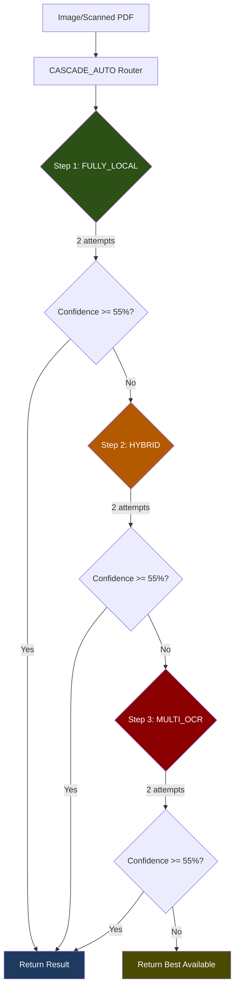
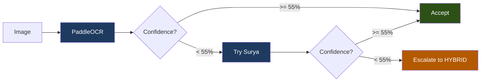
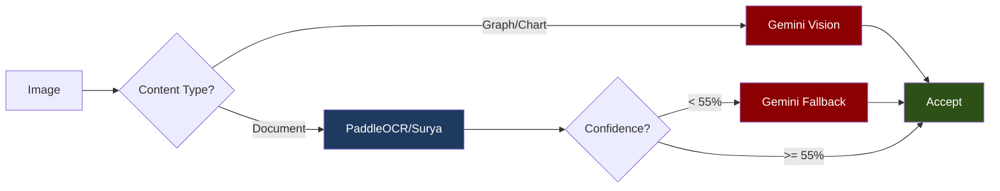
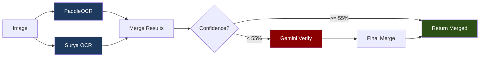
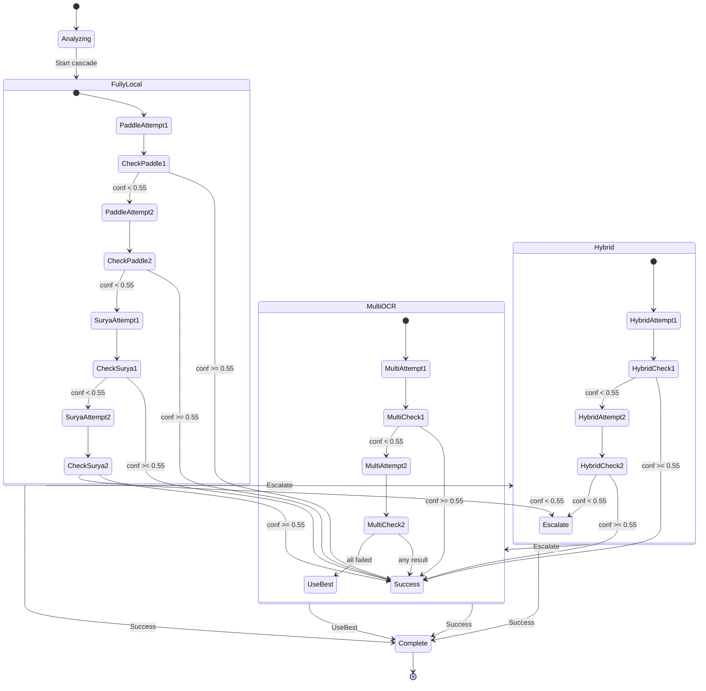
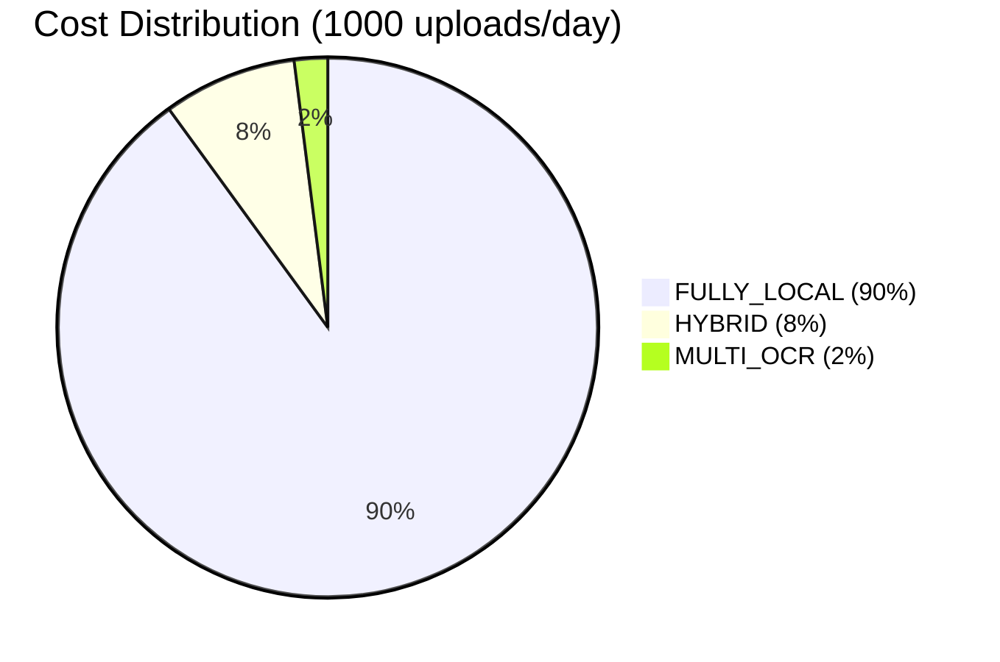

# OCR Implementation: CASCADE_AUTO (Recommended)

## Overview

CASCADE_AUTO is the **recommended default approach** for ERPSense. It provides maximum reliability through intelligent cascading from cheapest to most capable OCR methods.



**Legend:**
- Dark Green = FULLY_LOCAL (PaddleOCR + Surya, $0)
- Dark Orange = HYBRID (Local + Gemini for graphs)
- Dark Red = MULTI_OCR (All engines + verification)
- Dark Blue = Success result
- Dark Olive = Fallback result

---

## Why CASCADE_AUTO?

| Scenario | Approach Used | API Cost |
|----------|--------------|----------|
| 90% of documents | FULLY_LOCAL | **$0.00** |
| Complex layouts | HYBRID | ~$0.01 |
| Critical/Low confidence | MULTI_OCR | ~$0.001/page |

**Benefits:**
- Cost-optimized: Uses free local OCR first
- Reliability: Multiple fallback levels
- Accuracy: Verifies low-confidence results
- Transparent: Detailed cascade execution logs

---

## Cascade Execution Flow

### Step 1: FULLY_LOCAL (Free)



**Engines:**
- Primary: PaddleOCR (best for tables/invoices)
- Fallback: Surya OCR (best for general documents)

**Attempts:** 2 per engine (4 total max)

---

### Step 2: HYBRID (Low Cost)



**Strategy:**
- Use Gemini only for graphs/charts (it can interpret visuals)
- Use local OCR for documents with Gemini fallback

**Cost:** ~$0.01 per graph/chart processed

---

### Step 3: MULTI_OCR (Maximum Accuracy)



**Strategy:**
- Run multiple OCR engines in parallel
- Merge results using confidence-weighted voting
- Verify with Gemini if still uncertain

**Cost:** ~$0.001 per page (only when needed)

---

## Configuration

```python
# app/services/file_processing/ocr/ocr_router.py

@dataclass
class OCRConfig:
    # Cascade settings
    CASCADE_APPROACH_RETRIES: int = 2          # Retries per approach
    CASCADE_MIN_ACCEPTABLE_CONFIDENCE: float = 0.55  # Min to accept
    CASCADE_RETRY_DELAY_MS: int = 200          # Delay between retries

    # Confidence thresholds
    HIGH_CONFIDENCE: float = 0.90
    MEDIUM_CONFIDENCE: float = 0.75
    LOW_CONFIDENCE: float = 0.60

    # Verification
    VERIFY_LOW_CONFIDENCE: bool = True
    VERIFICATION_THRESHOLD: float = 0.75
```

---

## Cascade Execution Output

Every extraction includes detailed cascade info:

```json
{
  "cascade_execution": {
    "total_attempts": 3,
    "final_approach": "FULLY_LOCAL",
    "final_confidence": 0.92,
    "total_time_ms": 2340,
    "success": true,
    "attempts": [
      {
        "approach": "FULLY_LOCAL",
        "attempt": 1,
        "engine": "paddle_ocr",
        "success": true,
        "confidence": 0.92,
        "time_ms": 2340,
        "reason": "Accepted: confidence 0.92 >= threshold 0.55"
      }
    ]
  }
}
```

---

## State Machine



---

## Implementation

### OCR Router Core Logic

```python
# app/services/file_processing/ocr/ocr_router.py

class OCRRouter:
    """Routes images through CASCADE_AUTO pipeline."""

    APPROACHES = [
        OCRApproach.FULLY_LOCAL,
        OCRApproach.HYBRID,
        OCRApproach.MULTI_OCR,
    ]

    async def _process_cascade_auto(
        self,
        image_path: Path,
        image_type: ImageType,
        has_tables: bool,
    ) -> ExtractedContent:
        """
        CASCADE_AUTO: Try approaches in order until success.

        Order: FULLY_LOCAL -> HYBRID -> MULTI_OCR
        Each approach gets CASCADE_APPROACH_RETRIES attempts.
        Accepts result if confidence >= CASCADE_MIN_ACCEPTABLE_CONFIDENCE.
        """
        cascade_attempts = []
        best_result = None
        best_confidence = 0.0

        for approach in self.APPROACHES:
            for attempt in range(1, self.config.CASCADE_APPROACH_RETRIES + 1):
                attempt_start = time.perf_counter()

                try:
                    if approach == OCRApproach.FULLY_LOCAL:
                        result = await self._process_fully_local(
                            image_path, image_type, has_tables
                        )
                    elif approach == OCRApproach.HYBRID:
                        result = await self._process_hybrid(
                            image_path, image_type, has_tables
                        )
                    else:
                        result = await self._process_multi_ocr(
                            image_path, image_type, has_tables
                        )

                    confidence = result.metadata.confidence
                    attempt_time = int((time.perf_counter() - attempt_start) * 1000)

                    # Track attempt
                    cascade_attempts.append({
                        "approach": approach.value,
                        "attempt": attempt,
                        "success": True,
                        "confidence": confidence,
                        "time_ms": attempt_time,
                    })

                    # Track best result
                    if confidence > best_confidence:
                        best_result = result
                        best_confidence = confidence

                    # Accept if meets threshold
                    if confidence >= self.config.CASCADE_MIN_ACCEPTABLE_CONFIDENCE:
                        result.metadata.ocr_engines_used.append(
                            f"cascade:{approach.value}"
                        )
                        return self._add_cascade_info(
                            result, cascade_attempts, approach, True
                        )

                except Exception as e:
                    cascade_attempts.append({
                        "approach": approach.value,
                        "attempt": attempt,
                        "success": False,
                        "error": str(e),
                    })

                # Delay between retries
                if attempt < self.config.CASCADE_APPROACH_RETRIES:
                    await asyncio.sleep(self.config.CASCADE_RETRY_DELAY_MS / 1000)

        # Return best available result
        if best_result:
            return self._add_cascade_info(
                best_result, cascade_attempts,
                OCRApproach.MULTI_OCR, False
            )

        raise RuntimeError("All CASCADE_AUTO approaches failed")
```

---

### FULLY_LOCAL Implementation

```python
async def _process_fully_local(
    self,
    image_path: Path,
    image_type: ImageType,
    has_tables: bool,
) -> ExtractedContent:
    """FULLY_LOCAL: PaddleOCR -> Surya, no API calls."""

    # Choose primary engine based on content
    if has_tables or image_type in [ImageType.TABLE, ImageType.INVOICE]:
        primary = paddle_ocr
        fallback = surya_ocr
    else:
        primary = surya_ocr
        fallback = paddle_ocr

    # Try primary
    result = await primary.extract_from_image(image_path)

    if result.metadata.confidence >= self.config.MEDIUM_CONFIDENCE:
        return result

    # Try fallback
    fallback_result = await fallback.extract_from_image(image_path)

    # Return better result
    if fallback_result.metadata.confidence > result.metadata.confidence:
        return fallback_result

    return result
```

---

### HYBRID Implementation

```python
async def _process_hybrid(
    self,
    image_path: Path,
    image_type: ImageType,
    has_tables: bool,
) -> ExtractedContent:
    """HYBRID: Local OCR + Gemini for graphs/low confidence."""

    # Graphs/charts go directly to Gemini
    if image_type in [ImageType.GRAPH, ImageType.CHART]:
        return await gemini_vision.extract_from_image(image_path, image_type)

    # Try local first
    if has_tables:
        result = await paddle_ocr.extract_from_image(image_path)
    else:
        result = await surya_ocr.extract_from_image(image_path)

    # Fallback to Gemini if low confidence
    if result.metadata.confidence < self.config.LOW_CONFIDENCE:
        gemini_result = await gemini_vision.extract_from_image(image_path)
        return self._merge_results(result, gemini_result)

    return result
```

---

### MULTI_OCR Implementation

```python
async def _process_multi_ocr(
    self,
    image_path: Path,
    image_type: ImageType,
    has_tables: bool,
) -> ExtractedContent:
    """MULTI_OCR: All engines + merge + verification."""

    # Run both local engines
    paddle_result = await paddle_ocr.extract_from_image(image_path)
    surya_result = await surya_ocr.extract_from_image(image_path)

    # Merge results
    merged = self._merge_results(paddle_result, surya_result)

    # Verify with Gemini if still uncertain
    if merged.metadata.confidence < self.config.VERIFICATION_THRESHOLD:
        gemini_result = await gemini_vision.verify_ocr_result(
            image_path, merged.text
        )
        merged = self._incorporate_verification(merged, gemini_result)

    merged.metadata.extraction_method = ExtractionMethod.MULTI_OCR
    merged.metadata.ocr_engines_used = ["paddle_ocr", "surya_ocr", "gemini_vision"]

    return merged
```

---

## Cost Analysis

### Typical Usage Pattern



### Monthly Cost Estimates

| Daily Uploads | FULLY_LOCAL | HYBRID | MULTI_OCR | Total/Month |
|--------------|-------------|--------|-----------|-------------|
| 100 | $0 | ~$0.08 | ~$0.01 | **~$2.70** |
| 500 | $0 | ~$0.40 | ~$0.05 | **~$13.50** |
| 1000 | $0 | ~$0.80 | ~$0.10 | **~$27.00** |
| 5000 | $0 | ~$4.00 | ~$0.50 | **~$135.00** |

---

## Usage

### Basic Usage

```python
from app.services.file_processing.ocr import ocr_router

# Process with CASCADE_AUTO (default)
result = await ocr_router.process(image_path)

# Access cascade info
print(result.structured_data.get("cascade_execution"))
```

### Force Specific Approach

```python
# Force FULLY_LOCAL only
ocr_router.set_approach(OCRApproach.FULLY_LOCAL)
result = await ocr_router.process(image_path)

# Reset to CASCADE_AUTO
ocr_router.set_approach(OCRApproach.CASCADE_AUTO)
```

### Get Metrics

```python
metrics = ocr_router.get_metrics()
print(metrics)
# {
#   "total_processed": 1000,
#   "by_approach": {
#     "FULLY_LOCAL": 900,
#     "HYBRID": 80,
#     "MULTI_OCR": 20
#   },
#   "average_confidence": 0.89,
#   "average_time_ms": 1850
# }
```

---

## Comparison with Other Approaches

| Aspect | FULLY_LOCAL | HYBRID | MULTI_OCR | CASCADE_AUTO |
|--------|-------------|--------|-----------|--------------|
| Cost | $0 | ~$0.01/graph | ~$0.001/page | **Optimized** |
| Reliability | Good | Better | Best | **Maximum** |
| Speed | Fast | Medium | Slow | **Adaptive** |
| Graph Support | No | Yes | Yes | **Yes** |
| Table Accuracy | Good | Good | Excellent | **Best Available** |
| Complexity | Low | Medium | High | **Hidden** |

---

## Summary

CASCADE_AUTO provides:

1. **Cost Efficiency**: 90%+ of documents processed for free
2. **Reliability**: Multiple fallback levels ensure results
3. **Accuracy**: Best engine selected per document type
4. **Transparency**: Detailed execution logs for debugging
5. **Simplicity**: Single API, automatic routing

**Recommended for all production deployments.**
