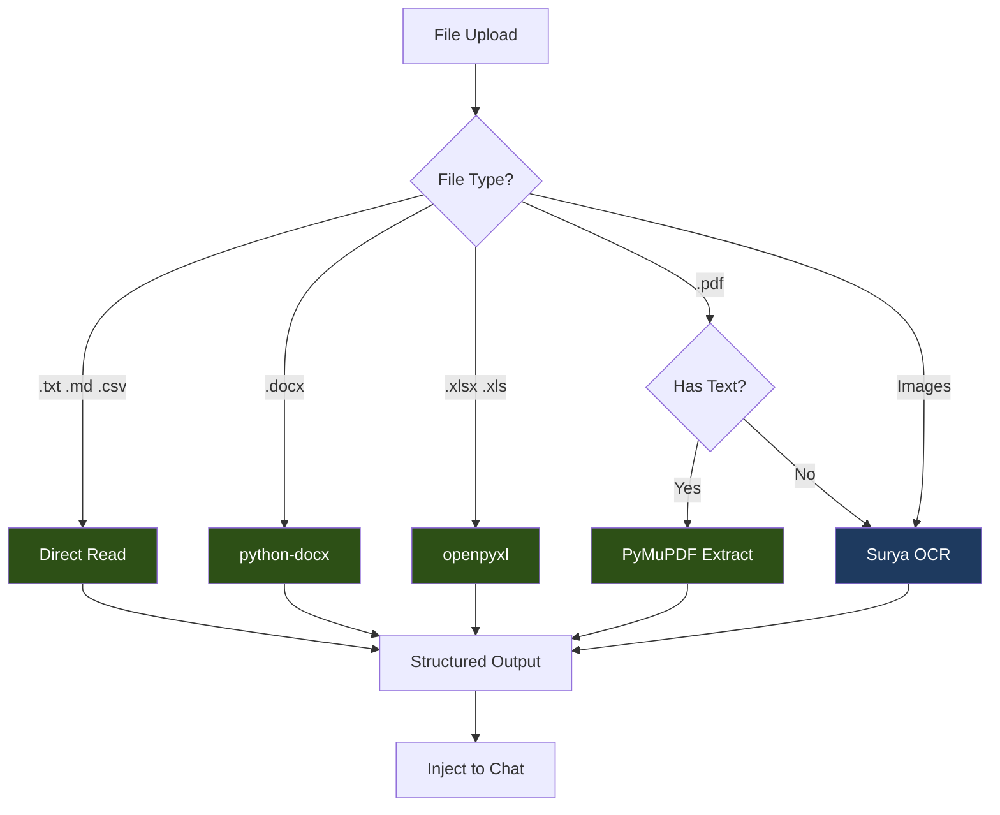

# OCR Implementation: Fully Local (Zero API Cost)

## Overview

This approach uses **Surya OCR** for all OCR needs with local parsers for digital files. No external API calls, 100% free.



**Legend:**
- Dark Green = Free (local parsers)
- Dark Blue = Free (local OCR - Surya)

---

## Cost

| Item | Cost |
|------|------|
| All processing | **$0.00** |
| Monthly total | **$0.00** |

---

## Limitations

- Cannot interpret graphs/charts (just sees pixels)
- Lower accuracy on complex table layouts
- Slower than API-based solutions

---

## Dependencies

### requirements.txt additions

```text
# ============================================
# FULLY LOCAL OCR DEPENDENCIES
# ============================================

# OCR Engine
surya-ocr>=0.6.0              # Layout + OCR

# Document Parsers
python-docx>=1.1.0            # .docx parsing
openpyxl>=3.1.0               # .xlsx parsing
PyMuPDF>=1.24.0               # PDF text extraction
pandas>=2.2.0                 # Data handling

# File Handling
Pillow>=10.0.0                # Image processing
python-multipart>=0.0.9       # FastAPI file upload
aiofiles>=24.1.0              # Async file I/O
python-magic>=0.4.27          # MIME detection
```

### Dockerfile additions

```dockerfile
# Add to existing Dockerfile
RUN apt-get update && apt-get install -y --no-install-recommends \
    libmagic1 \
    && rm -rf /var/lib/apt/lists/*
```

---

## Project Structure

```
app/
├── services/
│   └── file_processing/
│       ├── __init__.py
│       ├── router.py              # Routes file to handler
│       ├── base_handler.py        # Abstract base class
│       ├── text_handler.py        # .txt, .md, .csv
│       ├── docx_handler.py        # .docx
│       ├── excel_handler.py       # .xlsx, .xls
│       ├── pdf_handler.py         # .pdf
│       ├── image_handler.py       # Images
│       ├── ocr/
│       │   ├── __init__.py
│       │   └── surya_ocr.py       # Surya OCR wrapper
│       └── models.py              # Pydantic schemas
├── api/
│   └── v1/
│       └── endpoints/
│           └── upload.py          # Upload endpoint
```

---

## Implementation

### Step 1: Pydantic Models

**File: `app/services/file_processing/models.py`**

```python
"""Pydantic models for file processing."""

from enum import StrEnum
from pydantic import BaseModel, Field


class ExtractionMethod(StrEnum):
    """Method used to extract content."""
    DIRECT_READ = "direct_read"
    PYTHON_DOCX = "python_docx"
    OPENPYXL = "openpyxl"
    PYMUPDF = "pymupdf"
    SURYA_OCR = "surya_ocr"


class ExtractionMetadata(BaseModel):
    """Metadata about the extraction process."""
    file_type: str
    file_size: int
    pages: int | None = None
    extraction_method: ExtractionMethod
    confidence: float = Field(ge=0.0, le=1.0, default=1.0)
    processing_time_ms: int


class ExtractedContent(BaseModel):
    """Extracted content from a file."""
    text: str
    structured_data: dict | None = None
    markdown: str
    metadata: ExtractionMetadata


class UploadResponse(BaseModel):
    """Response from upload endpoint."""
    file_id: str
    filename: str
    extraction: ExtractedContent
```

---

### Step 2: Base Handler

**File: `app/services/file_processing/base_handler.py`**

```python
"""Base handler for file processing."""

from abc import ABC, abstractmethod
from pathlib import Path

from app.services.file_processing.models import ExtractedContent


class BaseFileHandler(ABC):
    """Abstract base class for file handlers."""

    SUPPORTED_EXTENSIONS: list[str] = []

    @classmethod
    def can_handle(cls, file_path: Path) -> bool:
        """Check if this handler can process the file."""
        return file_path.suffix.lower() in cls.SUPPORTED_EXTENSIONS

    @abstractmethod
    async def extract(self, file_path: Path) -> ExtractedContent:
        """Extract content from the file."""
        pass

    def _text_to_markdown(self, text: str) -> str:
        """Convert plain text to markdown."""
        return f"```\n{text}\n```"
```

---

### Step 3: Text Handler

**File: `app/services/file_processing/text_handler.py`**

```python
"""Handler for text files (.txt, .md, .csv)."""

import csv
import time
from io import StringIO
from pathlib import Path

from app.services.file_processing.base_handler import BaseFileHandler
from app.services.file_processing.models import (
    ExtractedContent,
    ExtractionMetadata,
    ExtractionMethod,
)


class TextHandler(BaseFileHandler):
    """Handler for plain text files."""

    SUPPORTED_EXTENSIONS = [".txt", ".md", ".tex"]

    async def extract(self, file_path: Path) -> ExtractedContent:
        """Extract content from text file."""
        start_time = time.perf_counter()

        text = file_path.read_text(encoding="utf-8")

        processing_time = int((time.perf_counter() - start_time) * 1000)

        # For .md files, text is already markdown
        if file_path.suffix.lower() == ".md":
            markdown = text
        else:
            markdown = self._text_to_markdown(text)

        return ExtractedContent(
            text=text,
            structured_data=None,
            markdown=markdown,
            metadata=ExtractionMetadata(
                file_type=file_path.suffix.lower(),
                file_size=file_path.stat().st_size,
                extraction_method=ExtractionMethod.DIRECT_READ,
                processing_time_ms=processing_time,
            ),
        )


class CSVHandler(BaseFileHandler):
    """Handler for CSV files."""

    SUPPORTED_EXTENSIONS = [".csv"]

    async def extract(self, file_path: Path) -> ExtractedContent:
        """Extract content from CSV file."""
        start_time = time.perf_counter()

        text = file_path.read_text(encoding="utf-8")

        # Parse CSV to structured data
        reader = csv.DictReader(StringIO(text))
        rows = list(reader)
        headers = reader.fieldnames or []

        # Convert to markdown table
        markdown = self._csv_to_markdown(headers, rows)

        processing_time = int((time.perf_counter() - start_time) * 1000)

        return ExtractedContent(
            text=text,
            structured_data={"headers": headers, "rows": rows},
            markdown=markdown,
            metadata=ExtractionMetadata(
                file_type=".csv",
                file_size=file_path.stat().st_size,
                extraction_method=ExtractionMethod.DIRECT_READ,
                processing_time_ms=processing_time,
            ),
        )

    def _csv_to_markdown(self, headers: list[str], rows: list[dict]) -> str:
        """Convert CSV data to markdown table."""
        if not headers:
            return "*(Empty CSV file)*"

        lines = []

        # Header row
        lines.append("| " + " | ".join(headers) + " |")
        lines.append("| " + " | ".join(["---"] * len(headers)) + " |")

        # Data rows (limit to 100 for display)
        for row in rows[:100]:
            values = [str(row.get(h, "")) for h in headers]
            lines.append("| " + " | ".join(values) + " |")

        if len(rows) > 100:
            lines.append(f"\n*... and {len(rows) - 100} more rows*")

        return "\n".join(lines)
```

---

### Step 4: DOCX Handler

**File: `app/services/file_processing/docx_handler.py`**

```python
"""Handler for DOCX files."""

import time
from pathlib import Path

from docx import Document

from app.services.file_processing.base_handler import BaseFileHandler
from app.services.file_processing.models import (
    ExtractedContent,
    ExtractionMetadata,
    ExtractionMethod,
)


class DocxHandler(BaseFileHandler):
    """Handler for Microsoft Word documents."""

    SUPPORTED_EXTENSIONS = [".docx"]

    async def extract(self, file_path: Path) -> ExtractedContent:
        """Extract content from DOCX file."""
        start_time = time.perf_counter()

        doc = Document(str(file_path))

        paragraphs = []
        tables_md = []

        # Extract paragraphs
        for para in doc.paragraphs:
            if para.text.strip():
                paragraphs.append(para.text)

        # Extract tables
        for table in doc.tables:
            tables_md.append(self._table_to_markdown(table))

        text = "\n\n".join(paragraphs)

        # Build markdown
        markdown_parts = []
        if paragraphs:
            markdown_parts.append("\n\n".join(paragraphs))
        if tables_md:
            markdown_parts.append("\n\n".join(tables_md))

        markdown = "\n\n".join(markdown_parts)

        processing_time = int((time.perf_counter() - start_time) * 1000)

        return ExtractedContent(
            text=text,
            structured_data={"paragraphs": paragraphs, "table_count": len(doc.tables)},
            markdown=markdown,
            metadata=ExtractionMetadata(
                file_type=".docx",
                file_size=file_path.stat().st_size,
                extraction_method=ExtractionMethod.PYTHON_DOCX,
                processing_time_ms=processing_time,
            ),
        )

    def _table_to_markdown(self, table) -> str:
        """Convert DOCX table to markdown."""
        rows = []
        for row in table.rows:
            cells = [cell.text.strip() for cell in row.cells]
            rows.append(cells)

        if not rows:
            return ""

        lines = []

        # Header row
        lines.append("| " + " | ".join(rows[0]) + " |")
        lines.append("| " + " | ".join(["---"] * len(rows[0])) + " |")

        # Data rows
        for row in rows[1:]:
            lines.append("| " + " | ".join(row) + " |")

        return "\n".join(lines)
```

---

### Step 5: Excel Handler

**File: `app/services/file_processing/excel_handler.py`**

```python
"""Handler for Excel files (.xlsx, .xls)."""

import time
from pathlib import Path

import pandas as pd

from app.services.file_processing.base_handler import BaseFileHandler
from app.services.file_processing.models import (
    ExtractedContent,
    ExtractionMetadata,
    ExtractionMethod,
)


class ExcelHandler(BaseFileHandler):
    """Handler for Excel spreadsheets."""

    SUPPORTED_EXTENSIONS = [".xlsx", ".xls"]

    async def extract(self, file_path: Path) -> ExtractedContent:
        """Extract content from Excel file."""
        start_time = time.perf_counter()

        # Read all sheets
        excel_file = pd.ExcelFile(file_path)
        sheets_data = {}
        markdown_parts = []
        text_parts = []

        for sheet_name in excel_file.sheet_names:
            df = pd.read_excel(excel_file, sheet_name=sheet_name)

            # Store structured data
            sheets_data[sheet_name] = df.to_dict(orient="records")

            # Convert to text
            text_parts.append(f"=== Sheet: {sheet_name} ===")
            text_parts.append(df.to_string())

            # Convert to markdown
            markdown_parts.append(f"### Sheet: {sheet_name}")
            markdown_parts.append(self._df_to_markdown(df))

        text = "\n\n".join(text_parts)
        markdown = "\n\n".join(markdown_parts)

        processing_time = int((time.perf_counter() - start_time) * 1000)

        return ExtractedContent(
            text=text,
            structured_data={"sheets": sheets_data, "sheet_names": excel_file.sheet_names},
            markdown=markdown,
            metadata=ExtractionMetadata(
                file_type=file_path.suffix.lower(),
                file_size=file_path.stat().st_size,
                extraction_method=ExtractionMethod.OPENPYXL,
                processing_time_ms=processing_time,
            ),
        )

    def _df_to_markdown(self, df: pd.DataFrame, max_rows: int = 100) -> str:
        """Convert DataFrame to markdown table."""
        if df.empty:
            return "*(Empty sheet)*"

        # Limit rows for display
        display_df = df.head(max_rows)

        headers = list(display_df.columns)

        lines = []
        lines.append("| " + " | ".join(str(h) for h in headers) + " |")
        lines.append("| " + " | ".join(["---"] * len(headers)) + " |")

        for _, row in display_df.iterrows():
            values = [str(v) if pd.notna(v) else "" for v in row]
            lines.append("| " + " | ".join(values) + " |")

        if len(df) > max_rows:
            lines.append(f"\n*... and {len(df) - max_rows} more rows*")

        return "\n".join(lines)
```

---

### Step 6: Surya OCR Wrapper

**File: `app/services/file_processing/ocr/surya_ocr.py`**

```python
"""Surya OCR wrapper for document text extraction."""

import time
from pathlib import Path

from PIL import Image
from surya.ocr import run_ocr
from surya.model.detection.model import load_model as load_det_model
from surya.model.detection.processor import load_processor as load_det_processor
from surya.model.recognition.model import load_model as load_rec_model
from surya.model.recognition.processor import load_processor as load_rec_processor

from app.services.file_processing.models import (
    ExtractedContent,
    ExtractionMetadata,
    ExtractionMethod,
)


class SuryaOCR:
    """Wrapper for Surya OCR engine."""

    _instance = None
    _det_model = None
    _det_processor = None
    _rec_model = None
    _rec_processor = None

    def __new__(cls):
        """Singleton pattern for model caching."""
        if cls._instance is None:
            cls._instance = super().__new__(cls)
        return cls._instance

    def _load_models(self):
        """Lazy load OCR models."""
        if self._det_model is None:
            self._det_processor = load_det_processor()
            self._det_model = load_det_model()
            self._rec_processor = load_rec_processor()
            self._rec_model = load_rec_model()

    async def extract_from_image(
        self,
        image_path: Path,
        languages: list[str] | None = None
    ) -> ExtractedContent:
        """Extract text from an image using Surya OCR."""
        start_time = time.perf_counter()

        # Ensure models are loaded
        self._load_models()

        # Load image
        image = Image.open(image_path)

        # Default to English
        if languages is None:
            languages = ["en"]

        # Run OCR
        results = run_ocr(
            [image],
            [languages],
            self._det_model,
            self._det_processor,
            self._rec_model,
            self._rec_processor,
        )

        # Extract text from results
        text_lines = []
        confidence_scores = []

        for page_result in results:
            for line in page_result.text_lines:
                text_lines.append(line.text)
                confidence_scores.append(line.confidence)

        text = "\n".join(text_lines)

        # Calculate average confidence
        avg_confidence = sum(confidence_scores) / len(confidence_scores) if confidence_scores else 0.0

        processing_time = int((time.perf_counter() - start_time) * 1000)

        return ExtractedContent(
            text=text,
            structured_data={"line_count": len(text_lines)},
            markdown=f"```\n{text}\n```",
            metadata=ExtractionMetadata(
                file_type=image_path.suffix.lower(),
                file_size=image_path.stat().st_size,
                extraction_method=ExtractionMethod.SURYA_OCR,
                confidence=avg_confidence,
                processing_time_ms=processing_time,
            ),
        )

    async def extract_from_images(
        self,
        images: list[Image.Image],
        languages: list[str] | None = None,
    ) -> tuple[str, float]:
        """Extract text from multiple images (e.g., PDF pages)."""
        self._load_models()

        if languages is None:
            languages = ["en"]

        # Run OCR on all images
        results = run_ocr(
            images,
            [languages] * len(images),
            self._det_model,
            self._det_processor,
            self._rec_model,
            self._rec_processor,
        )

        all_text = []
        all_confidence = []

        for page_idx, page_result in enumerate(results):
            page_text = []
            for line in page_result.text_lines:
                page_text.append(line.text)
                all_confidence.append(line.confidence)

            all_text.append(f"--- Page {page_idx + 1} ---\n" + "\n".join(page_text))

        text = "\n\n".join(all_text)
        avg_confidence = sum(all_confidence) / len(all_confidence) if all_confidence else 0.0

        return text, avg_confidence


# Singleton instance
surya_ocr = SuryaOCR()
```

---

### Step 7: PDF Handler

**File: `app/services/file_processing/pdf_handler.py`**

```python
"""Handler for PDF files."""

import time
from pathlib import Path

import fitz  # PyMuPDF
from PIL import Image

from app.services.file_processing.base_handler import BaseFileHandler
from app.services.file_processing.models import (
    ExtractedContent,
    ExtractionMetadata,
    ExtractionMethod,
)
from app.services.file_processing.ocr.surya_ocr import surya_ocr


class PDFHandler(BaseFileHandler):
    """Handler for PDF documents."""

    SUPPORTED_EXTENSIONS = [".pdf"]
    MIN_TEXT_LENGTH = 50  # Minimum chars per page to consider it native

    async def extract(self, file_path: Path) -> ExtractedContent:
        """Extract content from PDF file."""
        start_time = time.perf_counter()

        doc = fitz.open(str(file_path))
        page_count = len(doc)

        # Try native text extraction first
        native_text = self._extract_native_text(doc)

        if self._has_sufficient_text(native_text, page_count):
            # Native PDF with text layer
            processing_time = int((time.perf_counter() - start_time) * 1000)

            return ExtractedContent(
                text=native_text,
                structured_data={"pages": page_count},
                markdown=self._text_to_markdown(native_text),
                metadata=ExtractionMetadata(
                    file_type=".pdf",
                    file_size=file_path.stat().st_size,
                    pages=page_count,
                    extraction_method=ExtractionMethod.PYMUPDF,
                    confidence=1.0,
                    processing_time_ms=processing_time,
                ),
            )

        # Scanned PDF - use OCR
        images = self._pdf_to_images(doc)
        doc.close()

        text, confidence = await surya_ocr.extract_from_images(images)

        processing_time = int((time.perf_counter() - start_time) * 1000)

        return ExtractedContent(
            text=text,
            structured_data={"pages": page_count, "ocr_used": True},
            markdown=self._text_to_markdown(text),
            metadata=ExtractionMetadata(
                file_type=".pdf",
                file_size=file_path.stat().st_size,
                pages=page_count,
                extraction_method=ExtractionMethod.SURYA_OCR,
                confidence=confidence,
                processing_time_ms=processing_time,
            ),
        )

    def _extract_native_text(self, doc: fitz.Document) -> str:
        """Extract text from PDF using PyMuPDF."""
        pages_text = []
        for page_num, page in enumerate(doc):
            text = page.get_text().strip()
            if text:
                pages_text.append(f"--- Page {page_num + 1} ---\n{text}")
        return "\n\n".join(pages_text)

    def _has_sufficient_text(self, text: str, page_count: int) -> bool:
        """Check if extracted text is sufficient (not a scanned PDF)."""
        if not text:
            return False
        # Average at least MIN_TEXT_LENGTH chars per page
        return len(text) >= (self.MIN_TEXT_LENGTH * page_count)

    def _pdf_to_images(self, doc: fitz.Document, dpi: int = 200) -> list[Image.Image]:
        """Convert PDF pages to PIL Images for OCR."""
        images = []
        zoom = dpi / 72  # 72 is default PDF DPI
        matrix = fitz.Matrix(zoom, zoom)

        for page in doc:
            pix = page.get_pixmap(matrix=matrix)
            img = Image.frombytes("RGB", [pix.width, pix.height], pix.samples)
            images.append(img)

        return images
```

---

### Step 8: Image Handler

**File: `app/services/file_processing/image_handler.py`**

```python
"""Handler for image files."""

import time
from pathlib import Path

from PIL import Image

from app.services.file_processing.base_handler import BaseFileHandler
from app.services.file_processing.models import (
    ExtractedContent,
    ExtractionMetadata,
    ExtractionMethod,
)
from app.services.file_processing.ocr.surya_ocr import surya_ocr


class ImageHandler(BaseFileHandler):
    """Handler for image files."""

    SUPPORTED_EXTENSIONS = [".png", ".jpg", ".jpeg", ".gif", ".bmp", ".tiff", ".webp"]
    MAX_DIMENSION = 4096  # Resize if larger

    async def extract(self, file_path: Path) -> ExtractedContent:
        """Extract text from image using OCR."""
        start_time = time.perf_counter()

        # Resize if needed
        self._resize_if_needed(file_path)

        # Run OCR
        result = await surya_ocr.extract_from_image(file_path)

        processing_time = int((time.perf_counter() - start_time) * 1000)
        result.metadata.processing_time_ms = processing_time

        return result

    def _resize_if_needed(self, file_path: Path) -> None:
        """Resize image if it exceeds maximum dimensions."""
        img = Image.open(file_path)

        if img.width > self.MAX_DIMENSION or img.height > self.MAX_DIMENSION:
            # Calculate new size maintaining aspect ratio
            ratio = min(self.MAX_DIMENSION / img.width, self.MAX_DIMENSION / img.height)
            new_size = (int(img.width * ratio), int(img.height * ratio))

            img = img.resize(new_size, Image.Resampling.LANCZOS)
            img.save(file_path)
```

---

### Step 9: File Router

**File: `app/services/file_processing/router.py`**

```python
"""Routes files to appropriate handlers."""

from pathlib import Path

from app.services.file_processing.base_handler import BaseFileHandler
from app.services.file_processing.text_handler import TextHandler, CSVHandler
from app.services.file_processing.docx_handler import DocxHandler
from app.services.file_processing.excel_handler import ExcelHandler
from app.services.file_processing.pdf_handler import PDFHandler
from app.services.file_processing.image_handler import ImageHandler
from app.services.file_processing.models import ExtractedContent


class FileRouter:
    """Routes files to the appropriate handler."""

    HANDLERS: list[type[BaseFileHandler]] = [
        TextHandler,
        CSVHandler,
        DocxHandler,
        ExcelHandler,
        PDFHandler,
        ImageHandler,
    ]

    SUPPORTED_EXTENSIONS: set[str] = set()

    def __init__(self):
        """Initialize handlers and build extension set."""
        self._handlers = {cls: cls() for cls in self.HANDLERS}

        for handler_cls in self.HANDLERS:
            self.SUPPORTED_EXTENSIONS.update(handler_cls.SUPPORTED_EXTENSIONS)

    def is_supported(self, file_path: Path) -> bool:
        """Check if file type is supported."""
        return file_path.suffix.lower() in self.SUPPORTED_EXTENSIONS

    def get_handler(self, file_path: Path) -> BaseFileHandler | None:
        """Get the appropriate handler for a file."""
        for handler_cls, handler in self._handlers.items():
            if handler_cls.can_handle(file_path):
                return handler
        return None

    async def process(self, file_path: Path) -> ExtractedContent:
        """Process a file and return extracted content."""
        handler = self.get_handler(file_path)

        if handler is None:
            raise ValueError(f"Unsupported file type: {file_path.suffix}")

        return await handler.extract(file_path)


# Singleton instance
file_router = FileRouter()
```

---

### Step 10: Upload Endpoint

**File: `app/api/v1/endpoints/upload.py`**

```python
"""File upload endpoint."""

import uuid
from pathlib import Path
from tempfile import NamedTemporaryFile

import aiofiles
from fastapi import APIRouter, File, HTTPException, UploadFile, status

from app.services.file_processing.router import file_router
from app.services.file_processing.models import UploadResponse

router = APIRouter()

MAX_FILE_SIZE = 50 * 1024 * 1024  # 50MB


@router.post(
    "/upload",
    response_model=UploadResponse,
    status_code=status.HTTP_200_OK,
    tags=["Upload"],
    summary="Upload and process a file",
)
async def upload_file(file: UploadFile = File(...)):
    """
    Upload a file and extract its content.

    Supported formats:
    - Text: .txt, .md, .csv, .tex
    - Documents: .docx
    - Spreadsheets: .xlsx, .xls
    - PDFs: .pdf (native and scanned)
    - Images: .png, .jpg, .jpeg, .gif, .bmp, .tiff, .webp

    Returns extracted text, structured data, and markdown representation.
    """
    # Validate file size
    if file.size and file.size > MAX_FILE_SIZE:
        raise HTTPException(
            status_code=status.HTTP_413_REQUEST_ENTITY_TOO_LARGE,
            detail=f"File too large. Maximum size is {MAX_FILE_SIZE // (1024 * 1024)}MB",
        )

    # Get file extension
    original_filename = file.filename or "unknown"
    suffix = Path(original_filename).suffix.lower()

    # Check if supported
    if suffix not in file_router.SUPPORTED_EXTENSIONS:
        raise HTTPException(
            status_code=status.HTTP_400_BAD_REQUEST,
            detail=f"Unsupported file type: {suffix}. Supported: {', '.join(sorted(file_router.SUPPORTED_EXTENSIONS))}",
        )

    # Save to temp file
    temp_path = None
    try:
        with NamedTemporaryFile(delete=False, suffix=suffix) as temp_file:
            temp_path = Path(temp_file.name)

            # Write uploaded content
            content = await file.read()
            async with aiofiles.open(temp_path, "wb") as f:
                await f.write(content)

        # Process file
        extraction = await file_router.process(temp_path)

        # Generate file ID
        file_id = str(uuid.uuid4())

        return UploadResponse(
            file_id=file_id,
            filename=original_filename,
            extraction=extraction,
        )

    except ValueError as e:
        raise HTTPException(
            status_code=status.HTTP_400_BAD_REQUEST,
            detail=str(e),
        )
    except Exception as e:
        raise HTTPException(
            status_code=status.HTTP_422_UNPROCESSABLE_ENTITY,
            detail=f"Failed to process file: {str(e)}",
        )
    finally:
        # Clean up temp file
        if temp_path and temp_path.exists():
            temp_path.unlink()
```

---

### Step 11: Register Router

**Add to `app/api/v1/router.py`:**

```python
from app.api.v1.endpoints import auth, chat, health, users, upload

# ... existing routers ...

api_router.include_router(
    upload.router,
    prefix="/upload",
    tags=["Upload"],
)
```

---

## Testing

```bash
# Test text file
curl -X POST "http://localhost:8000/api/v1/upload" \
  -F "file=@test.txt"

# Test PDF
curl -X POST "http://localhost:8000/api/v1/upload" \
  -F "file=@invoice.pdf"

# Test Excel
curl -X POST "http://localhost:8000/api/v1/upload" \
  -F "file=@data.xlsx"
```

---

## Summary

| Component | Status |
|-----------|--------|
| Text handler | Ready |
| DOCX handler | Ready |
| Excel handler | Ready |
| PDF handler | Ready |
| Image handler | Ready |
| Surya OCR | Ready |
| Upload endpoint | Ready |
| **Total API cost** | **$0.00** |
