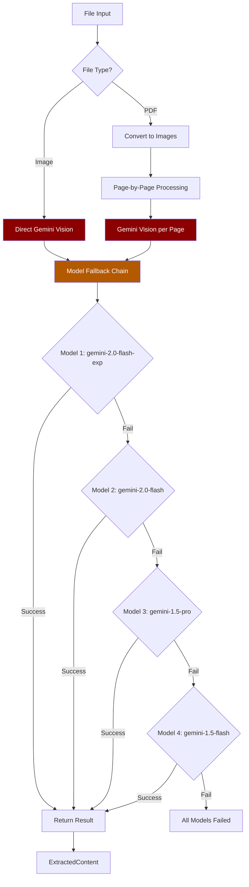
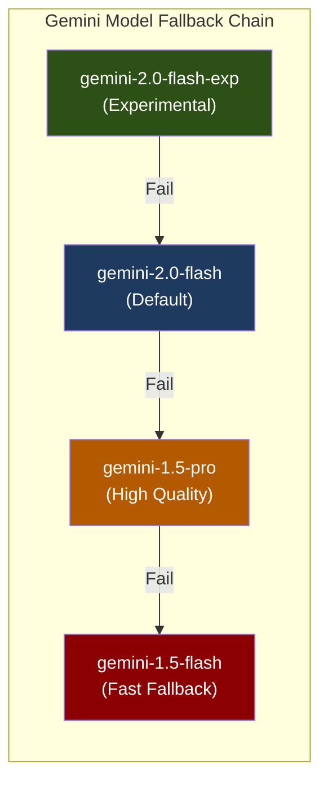
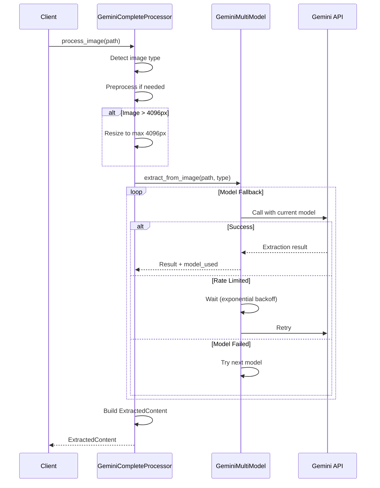
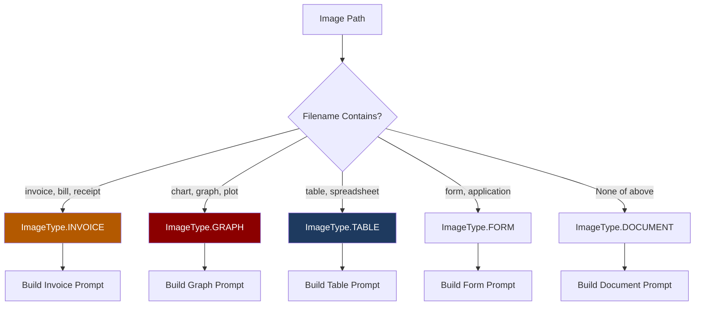
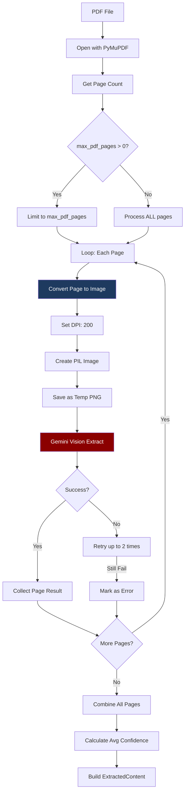
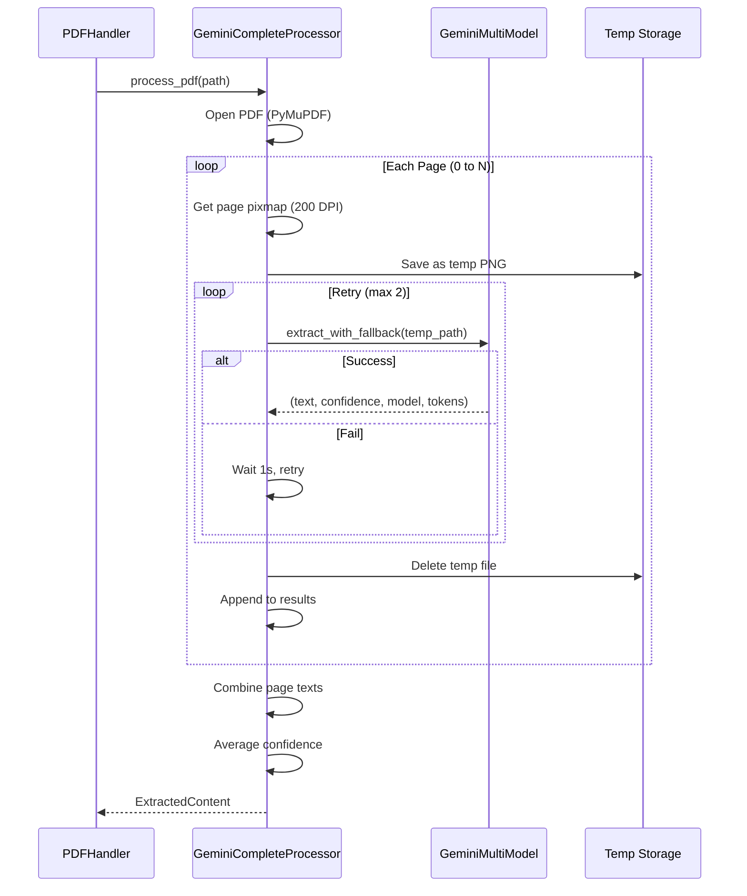
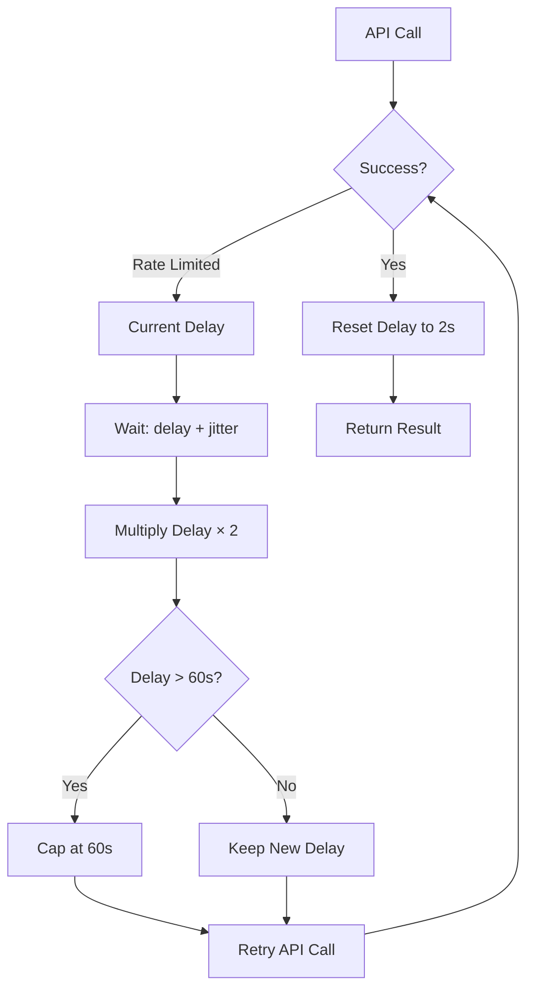
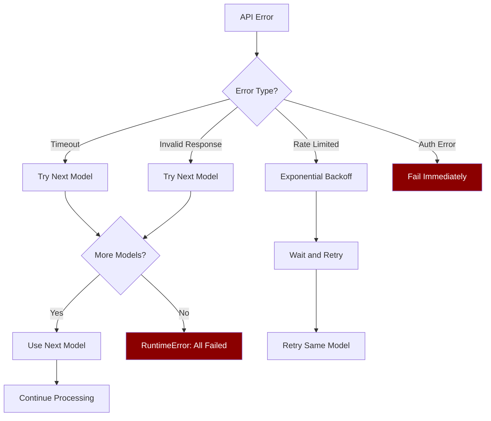

# GEMINI_COMPLETE - 100% Gemini Vision OCR Approach

## Overview

**GEMINI_COMPLETE** is an OCR approach that uses **only Gemini Vision API** for all text extraction. No local OCR engines are used.

### Key Characteristics

| Feature | Value |
|---------|-------|
| **Local OCR** | None |
| **API Usage** | 100% Gemini |
| **Cost** | ~$0.0001/page |
| **Speed** | Medium (API latency) |
| **Accuracy** | Highest (especially for complex docs) |
| **Best For** | Graphs, charts, complex layouts |

---

## Architecture

### High-Level Flow



---

## Model Fallback Chain

### 4-Model Cascade



### Model Specifications

| Model | Timeout | Max Tokens | Use Case |
|-------|---------|------------|----------|
| `gemini-2.0-flash-exp` | 60s | 8192 | Experimental, most capable |
| `gemini-2.0-flash` | 60s | 8192 | Production default |
| `gemini-1.5-pro` | 90s | 8192 | Complex documents |
| `gemini-1.5-flash` | 45s | 4096 | Fast fallback |

---

## Image Processing Flow

### Direct Image Extraction



### Image Type Detection



---

## PDF Processing Flow

### Page-by-Page Extraction



### PDF Page Processing Detail



---

## Configuration

### GeminiCompleteConfig

```python
@dataclass
class GeminiCompleteConfig:
    # PDF processing
    pdf_dpi: int = 200              # Resolution for PDF→Image
    max_pdf_pages: int = 0          # 0 = no limit
    pdf_timeout_per_page: int = 120 # Seconds per page

    # Image processing
    max_image_dimension: int = 4096 # Max width/height
    image_quality: int = 95         # JPEG quality

    # Retry settings
    max_retries_per_page: int = 2
    retry_delay_seconds: float = 1.0
```

---

## Rate Limiting

### Exponential Backoff



### Rate Limit Configuration

```python
@dataclass
class RateLimitConfig:
    initial_delay: float = 2.0      # Start at 2 seconds
    max_delay: float = 60.0         # Cap at 60 seconds
    multiplier: float = 2.0         # Double each failure
    max_retries: int = 5            # Max 5 retries
```

---

## Output Structure

### ExtractedContent

```json
{
  "text": "Combined text from all pages...",
  "structured_data": {
    "gemini_complete": true,
    "approach": "gemini_complete",
    "pages": 5,
    "pages_processed": 5,
    "models_used": ["gemini-2.0-flash"],
    "total_tokens": 4500,
    "processing_time_ms": 12340
  },
  "metadata": {
    "file_type": ".pdf",
    "extraction_method": "gemini_vision",
    "confidence": 0.92,
    "processing_time_ms": 12340,
    "tokens_used": 4500,
    "ocr_engines_used": ["gemini_2.0-flash"]
  }
}
```

---

## When to Use GEMINI_COMPLETE

### Best Use Cases

| Document Type | Why Use |
|---------------|---------|
| Graphs/Charts | Visual understanding required |
| Complex Layouts | Multi-column, mixed content |
| Low Quality Scans | Gemini handles noise better |
| Handwritten + Printed | Mixed content interpretation |
| Non-standard Formats | Gemini adapts to any format |

### When NOT to Use

| Scenario | Better Alternative |
|----------|-------------------|
| High volume processing | LIBRARY_GEMINI (cost) |
| Simple text documents | FULLY_LOCAL (free) |
| Offline requirement | FULLY_LOCAL |
| Budget constraints | LIBRARY_GEMINI |

---

## Cost Analysis

### Per-Document Cost

| Document Type | Pages | Estimated Cost |
|---------------|-------|----------------|
| Single Image | 1 | ~$0.0001 |
| 5-page PDF | 5 | ~$0.0005 |
| 20-page PDF | 20 | ~$0.002 |
| 100-page PDF | 100 | ~$0.01 |

### Monthly Cost Projection

| Daily Volume | Monthly Cost |
|--------------|--------------|
| 50 docs | ~$0.15 |
| 200 docs | ~$0.60 |
| 1000 docs | ~$3.00 |

---

## File Location

**Implementation:** `app/services/file_processing/ocr/gemini_complete.py`

**Singleton Instance:** `gemini_complete`

```python
from app.services.file_processing.ocr import gemini_complete

# Process image
result = await gemini_complete.process(Path("invoice.jpg"))

# Process PDF
result = await gemini_complete.process(Path("document.pdf"))

# Check availability
if gemini_complete.is_available():
    # API key is configured
    pass
```

---

## Error Handling

### Common Errors and Handling

| Error | Cause | Handling |
|-------|-------|----------|
| `ValueError` | Unsupported file type | Return clear message |
| `RuntimeError` | All models failed | After 4 model attempts |
| `TimeoutError` | API timeout | Retry with next model |
| `ResourceExhausted` | Rate limited | Exponential backoff |

### Error Flow


