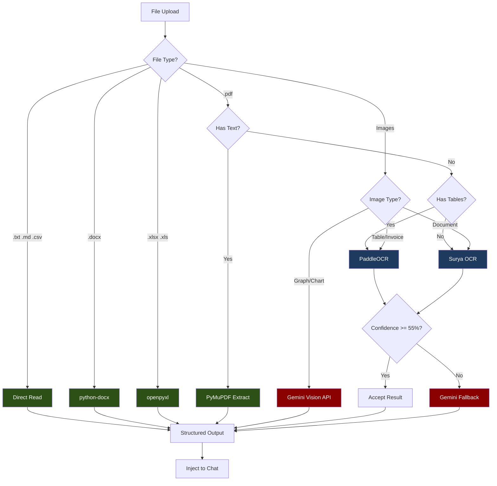

# OCR Implementation: Hybrid (PaddleOCR + Surya + Gemini)

## Overview

This approach uses **PaddleOCR** (for tables) and **Surya OCR** (for general documents) locally, with **Gemini Vision** for graphs/charts. Best balance of cost and capability.



**Legend:**
- Dark Green = Free (local parsers)
- Dark Blue = Free (local OCR - PaddleOCR/Surya)
- Dark Red = Paid (Gemini API)

---

## Cost

| Item | Cost |
|------|------|
| Local parsers (50% of files) | **$0.00** |
| Local OCR - PaddleOCR/Surya (40%) | **$0.00** |
| Gemini for graphs + fallback (~10%) | **~$0.50-2.00/month** |

---

## OCR Engine Selection

| Content Type | Primary Engine | Fallback | Reason |
|-------------|----------------|----------|--------|
| Tables | PaddleOCR | Gemini | PP-Structure excels at tables |
| Invoices | PaddleOCR | Gemini | Better structured data extraction |
| General Documents | Surya | Gemini | Better layout detection |
| Handwritten | Surya | Gemini | Superior handwriting support |
| Graphs/Charts | Gemini | - | Only Gemini can interpret visuals |
| Low confidence | Gemini | - | Verify/correct local OCR |

---

## Capabilities

| Feature | Supported | Engine |
|---------|-----------|--------|
| Text documents | Yes | Surya (free) |
| Tables in PDFs | Yes | PaddleOCR (free) |
| Invoices | Yes | PaddleOCR (free) |
| Graphs/Charts interpretation | Yes | Gemini (paid) |
| Handwritten text | Partial | Surya (free) |
| Low confidence verification | Yes | Gemini (paid) |

---

## Dependencies

### requirements.txt additions

```text
# ============================================
# HYBRID OCR DEPENDENCIES (PaddleOCR + Surya + Gemini)
# ============================================

# Local OCR Engines (FREE)
paddlepaddle>=2.6.0           # PaddlePaddle framework
paddleocr>=2.7.0              # PaddleOCR + PP-Structure
surya-ocr>=0.6.0              # Surya OCR (layout + recognition)

# Document Parsers (FREE)
python-docx>=1.1.0            # .docx parsing
openpyxl>=3.1.0               # .xlsx parsing
PyMuPDF>=1.24.0               # PDF text extraction
pandas>=2.2.0                 # Data handling

# Gemini API (for graphs + fallback)
google-generativeai>=0.8.0    # Gemini Vision

# File Handling
Pillow>=10.0.0                # Image processing
python-multipart>=0.0.9       # FastAPI file upload
aiofiles>=24.1.0              # Async file I/O
python-magic>=0.4.27          # MIME detection
numpy>=1.26.0                 # Array operations
```

---

## Project Structure

```
app/
├── services/
│   └── file_processing/
│       ├── __init__.py
│       ├── router.py              # Routes file to handler
│       ├── base_handler.py        # Abstract base class
│       ├── text_handler.py        # .txt, .md, .csv
│       ├── docx_handler.py        # .docx
│       ├── excel_handler.py       # .xlsx, .xls
│       ├── pdf_handler.py         # .pdf
│       ├── image_handler.py       # Images (with graph detection)
│       ├── ocr/
│       │   ├── __init__.py
│       │   ├── paddle_ocr.py      # PaddleOCR wrapper
│       │   ├── surya_ocr.py       # Surya OCR wrapper
│       │   ├── gemini_vision.py   # Gemini Vision wrapper
│       │   └── ocr_router.py      # Routes to best engine
│       ├── classifiers/
│       │   ├── __init__.py
│       │   ├── image_classifier.py  # Detect graph vs document
│       │   └── table_detector.py    # Detect tables in images
│       └── models.py              # Pydantic schemas
├── api/
│   └── v1/
│       └── endpoints/
│           └── upload.py          # Upload endpoint
```

---

## Implementation

### Changes from Fully Local

This approach extends the Fully Local implementation with:
1. **Gemini Vision integration** for graphs/charts
2. **Image classifier** to detect if image is a graph or document
3. **Fallback logic** for low-confidence OCR results

---

### Step 1: Extended Models

**File: `app/services/file_processing/models.py`**

```python
"""Pydantic models for file processing."""

from enum import StrEnum
from pydantic import BaseModel, Field


class ExtractionMethod(StrEnum):
    """Method used to extract content."""
    DIRECT_READ = "direct_read"
    PYTHON_DOCX = "python_docx"
    OPENPYXL = "openpyxl"
    PYMUPDF = "pymupdf"
    PADDLE_OCR = "paddle_ocr"
    SURYA_OCR = "surya_ocr"
    GEMINI_VISION = "gemini_vision"


class ImageType(StrEnum):
    """Type of image content."""
    DOCUMENT = "document"
    TABLE = "table"
    INVOICE = "invoice"
    FORM = "form"
    GRAPH = "graph"
    CHART = "chart"
    PHOTO = "photo"
    UNKNOWN = "unknown"


class ExtractionMetadata(BaseModel):
    """Metadata about the extraction process."""
    file_type: str
    file_size: int
    pages: int | None = None
    extraction_method: ExtractionMethod
    confidence: float = Field(ge=0.0, le=1.0, default=1.0)
    processing_time_ms: int
    tokens_used: int = 0  # Tracks Gemini token usage
    image_type: ImageType | None = None
    ocr_engines_used: list[str] = []


class TableData(BaseModel):
    """Extracted table data."""
    headers: list[str]
    rows: list[list[str]]
    confidence: float


class ExtractedContent(BaseModel):
    """Extracted content from a file."""
    text: str
    structured_data: dict | None = None
    tables: list[TableData] | None = None
    markdown: str
    metadata: ExtractionMetadata


class UploadResponse(BaseModel):
    """Response from upload endpoint."""
    file_id: str
    filename: str
    extraction: ExtractedContent
```

---

### Step 2: OCR Router (Hybrid)

**File: `app/services/file_processing/ocr/ocr_router.py`**

```python
"""Routes images to the best OCR engine (Hybrid approach)."""

import time
from pathlib import Path

from app.services.file_processing.models import (
    ExtractedContent,
    ImageType,
)
from app.services.file_processing.ocr.paddle_ocr import paddle_ocr
from app.services.file_processing.ocr.surya_ocr import surya_ocr
from app.services.file_processing.ocr.gemini_vision import gemini_vision
from app.services.file_processing.classifiers.image_classifier import image_classifier
from app.services.file_processing.classifiers.table_detector import table_detector


class OCRRouter:
    """Routes images to optimal OCR engine (Hybrid approach)."""

    CONFIDENCE_THRESHOLD = 0.55

    async def process(self, image_path: Path) -> ExtractedContent:
        """Process image with hybrid OCR selection."""
        start_time = time.perf_counter()

        # Classify image type
        image_type = image_classifier.classify(image_path)

        # Route graphs/charts directly to Gemini
        if image_type in [ImageType.GRAPH, ImageType.CHART]:
            result = await gemini_vision.extract_from_image(image_path, image_type)
            result.metadata.processing_time_ms = int((time.perf_counter() - start_time) * 1000)
            return result

        # Check for tables
        has_tables = table_detector.has_tables(image_path)

        # Select local OCR engine
        if has_tables or image_type in [ImageType.TABLE, ImageType.INVOICE, ImageType.FORM]:
            result = await paddle_ocr.extract_from_image(image_path)
        else:
            result = await surya_ocr.extract_from_image(image_path)

        # Fallback to Gemini if low confidence
        if result.metadata.confidence < self.CONFIDENCE_THRESHOLD:
            gemini_result = await gemini_vision.extract_from_image(image_path, image_type)

            # Use Gemini if better confidence or merge results
            if gemini_result.metadata.confidence > result.metadata.confidence:
                result = gemini_result
            else:
                # Keep local result but note the verification
                result.metadata.ocr_engines_used.append("gemini_verified")

        result.metadata.image_type = image_type
        result.metadata.processing_time_ms = int((time.perf_counter() - start_time) * 1000)

        return result

    async def process_pdf_pages(
        self,
        images: list,
    ) -> tuple[str, list, float]:
        """Process multiple PDF pages with hybrid routing."""
        import tempfile
        from pathlib import Path

        all_text = []
        all_tables = []
        all_confidence = []

        for page_idx, image in enumerate(images):
            with tempfile.NamedTemporaryFile(suffix=".png", delete=False) as f:
                image.save(f.name)
                temp_path = Path(f.name)

            try:
                result = await self.process(temp_path)
                all_text.append(f"--- Page {page_idx + 1} ---\n{result.text}")

                if result.tables:
                    all_tables.extend(result.tables)

                all_confidence.append(result.metadata.confidence)
            finally:
                temp_path.unlink()

        text = "\n\n".join(all_text)
        avg_confidence = sum(all_confidence) / len(all_confidence) if all_confidence else 0.0

        return text, all_tables, avg_confidence


# Singleton instance
ocr_router = OCRRouter()
```

---

### Step 3: Image Classifier

**File: `app/services/file_processing/classifiers/image_classifier.py`**

```python
"""Classifier to detect image type (document vs graph/chart)."""

from pathlib import Path

from PIL import Image
import numpy as np

from app.services.file_processing.models import ImageType


class ImageClassifier:
    """Heuristic-based image classifier."""

    GRAPH_KEYWORDS = ["chart", "graph", "plot", "diagram", "pie", "bar", "line"]
    TABLE_KEYWORDS = ["invoice", "bill", "receipt", "table", "form"]

    def classify(self, file_path: Path, image: Image.Image | None = None) -> ImageType:
        """Classify image as document, graph, table, etc."""
        filename = file_path.stem.lower()

        # Check filename for keywords
        for keyword in self.GRAPH_KEYWORDS:
            if keyword in filename:
                return ImageType.GRAPH

        for keyword in self.TABLE_KEYWORDS:
            if keyword in filename:
                if "invoice" in filename or "bill" in filename or "receipt" in filename:
                    return ImageType.INVOICE
                return ImageType.TABLE

        # Load image if not provided
        if image is None:
            image = Image.open(file_path)

        # Analyze image characteristics
        return self._analyze_image(image)

    def _analyze_image(self, image: Image.Image) -> ImageType:
        """Analyze image to determine type."""
        if image.mode != "RGB":
            image = image.convert("RGB")

        img_array = np.array(image)

        unique_colors = self._count_unique_colors(img_array)
        color_variance = self._color_variance(img_array)

        # Graphs typically have fewer unique colors
        if unique_colors < 1000 and color_variance < 50:
            return ImageType.GRAPH

        if self._has_chart_colors(img_array):
            return ImageType.CHART

        return ImageType.DOCUMENT

    def _count_unique_colors(self, img_array: np.ndarray, sample_size: int = 10000) -> int:
        """Count unique colors in image (sampled)."""
        pixels = img_array.reshape(-1, 3)

        if len(pixels) > sample_size:
            indices = np.random.choice(len(pixels), sample_size, replace=False)
            pixels = pixels[indices]

        unique = np.unique(pixels, axis=0)
        return len(unique)

    def _color_variance(self, img_array: np.ndarray) -> float:
        """Calculate color variance."""
        return np.var(img_array)

    def _has_chart_colors(self, img_array: np.ndarray) -> bool:
        """Check if image has typical chart color patterns."""
        chart_colors = [
            (255, 99, 132),
            (54, 162, 235),
            (255, 206, 86),
            (75, 192, 192),
            (153, 102, 255),
            (255, 159, 64),
        ]

        pixels = img_array.reshape(-1, 3)
        for color in chart_colors:
            distances = np.linalg.norm(pixels - np.array(color), axis=1)
            close_pixels = np.sum(distances < 30)
            if close_pixels > len(pixels) * 0.05:
                return True

        return False


# Singleton instance
image_classifier = ImageClassifier()
```

---

### Step 4: Gemini Vision Wrapper

**File: `app/services/file_processing/ocr/gemini_vision.py`**

```python
"""Gemini Vision API wrapper for graph/chart interpretation."""

import time
from pathlib import Path

import google.generativeai as genai
from PIL import Image

from app.config import settings
from app.services.file_processing.models import (
    ExtractedContent,
    ExtractionMetadata,
    ExtractionMethod,
    ImageType,
)


class GeminiVision:
    """Wrapper for Gemini Vision API."""

    def __init__(self):
        """Initialize Gemini client."""
        genai.configure(api_key=settings.google_api_key)
        self.model = genai.GenerativeModel("gemini-2.0-flash")

    async def extract_from_image(
        self,
        file_path: Path,
        image_type: ImageType = ImageType.UNKNOWN,
    ) -> ExtractedContent:
        """Extract content from image using Gemini Vision."""
        start_time = time.perf_counter()

        image = Image.open(file_path)
        prompt = self._build_prompt(image_type)

        response = self.model.generate_content([prompt, image])

        text = response.text
        tokens_used = response.usage_metadata.total_token_count if response.usage_metadata else 0

        processing_time = int((time.perf_counter() - start_time) * 1000)

        if image_type in [ImageType.GRAPH, ImageType.CHART]:
            markdown = f"## Graph/Chart Analysis\n\n{text}"
        else:
            markdown = f"```\n{text}\n```"

        return ExtractedContent(
            text=text,
            structured_data={"image_type": image_type.value},
            markdown=markdown,
            metadata=ExtractionMetadata(
                file_type=file_path.suffix.lower(),
                file_size=file_path.stat().st_size,
                extraction_method=ExtractionMethod.GEMINI_VISION,
                confidence=0.95,
                processing_time_ms=processing_time,
                tokens_used=tokens_used,
                image_type=image_type,
                ocr_engines_used=["gemini_vision"],
            ),
        )

    async def verify_ocr_result(
        self,
        file_path: Path,
        ocr_text: str,
    ) -> str:
        """Verify and correct OCR result using Gemini."""
        image = Image.open(file_path)

        prompt = f"""The following text was extracted from the image using OCR.
Please verify and correct any errors, especially:
- Numbers (0 vs O, 1 vs l, etc.)
- Table alignments
- Missing text

OCR Result:
{ocr_text}

Provide the corrected text:"""

        response = self.model.generate_content([prompt, image])
        return response.text

    def _build_prompt(self, image_type: ImageType) -> str:
        """Build prompt based on image type."""
        if image_type == ImageType.GRAPH:
            return """Analyze this graph image and provide:
1. Type of graph (bar, line, pie, scatter, etc.)
2. Title and axis labels if visible
3. Key data points and values
4. Trends or patterns observed
5. Any notable insights

Format the response clearly with sections."""

        elif image_type == ImageType.CHART:
            return """Analyze this chart image and provide:
1. Type of chart
2. All visible data values and labels
3. Percentages or proportions if shown
4. Key takeaways

Format as structured data where possible."""

        elif image_type in [ImageType.TABLE, ImageType.INVOICE]:
            return """Extract all content from this document image.
Pay special attention to:
1. All text content
2. Tables - preserve structure
3. Numbers - ensure accuracy
4. Line items, totals, dates

Format tables using markdown table syntax."""

        else:
            return """Extract all text content from this image.
Preserve the structure and formatting.
If there are tables, format them as markdown tables.
Ensure number accuracy."""


# Singleton instance
gemini_vision = GeminiVision()
```

---

### Step 5: Image Handler (Hybrid)

**File: `app/services/file_processing/image_handler.py`**

```python
"""Handler for image files with hybrid OCR routing."""

import time
from pathlib import Path

from PIL import Image

from app.services.file_processing.base_handler import BaseFileHandler
from app.services.file_processing.models import ExtractedContent
from app.services.file_processing.ocr.ocr_router import ocr_router


class ImageHandler(BaseFileHandler):
    """Handler for image files with hybrid OCR routing."""

    SUPPORTED_EXTENSIONS = [".png", ".jpg", ".jpeg", ".gif", ".bmp", ".tiff", ".webp"]
    MAX_DIMENSION = 4096

    async def extract(self, file_path: Path) -> ExtractedContent:
        """Extract content from image using hybrid OCR."""
        start_time = time.perf_counter()

        self._resize_if_needed(file_path)

        # Use hybrid OCR router
        result = await ocr_router.process(file_path)

        total_time = int((time.perf_counter() - start_time) * 1000)
        result.metadata.processing_time_ms = total_time

        return result

    def _resize_if_needed(self, file_path: Path) -> None:
        """Resize image if it exceeds maximum dimensions."""
        img = Image.open(file_path)

        if img.width > self.MAX_DIMENSION or img.height > self.MAX_DIMENSION:
            ratio = min(self.MAX_DIMENSION / img.width, self.MAX_DIMENSION / img.height)
            new_size = (int(img.width * ratio), int(img.height * ratio))

            img = img.resize(new_size, Image.Resampling.LANCZOS)
            img.save(file_path)
```

---

### Step 6: PDF Handler (Hybrid)

**File: `app/services/file_processing/pdf_handler.py`**

```python
"""Handler for PDF files with hybrid OCR support."""

import time
from pathlib import Path

import fitz  # PyMuPDF
from PIL import Image

from app.services.file_processing.base_handler import BaseFileHandler
from app.services.file_processing.models import (
    ExtractedContent,
    ExtractionMetadata,
    ExtractionMethod,
)
from app.services.file_processing.ocr.ocr_router import ocr_router


class PDFHandler(BaseFileHandler):
    """Handler for PDF documents with hybrid OCR selection."""

    SUPPORTED_EXTENSIONS = [".pdf"]
    MIN_TEXT_LENGTH = 50

    async def extract(self, file_path: Path) -> ExtractedContent:
        """Extract content from PDF file."""
        start_time = time.perf_counter()

        doc = fitz.open(str(file_path))
        page_count = len(doc)

        native_text = self._extract_native_text(doc)

        if self._has_sufficient_text(native_text, page_count):
            doc.close()
            processing_time = int((time.perf_counter() - start_time) * 1000)

            return ExtractedContent(
                text=native_text,
                structured_data={"pages": page_count},
                markdown=self._text_to_markdown(native_text),
                metadata=ExtractionMetadata(
                    file_type=".pdf",
                    file_size=file_path.stat().st_size,
                    pages=page_count,
                    extraction_method=ExtractionMethod.PYMUPDF,
                    confidence=1.0,
                    processing_time_ms=processing_time,
                    ocr_engines_used=["pymupdf"],
                ),
            )

        # Scanned PDF - use hybrid OCR router
        images = self._pdf_to_images(doc)
        doc.close()

        text, tables, confidence = await ocr_router.process_pdf_pages(images)

        processing_time = int((time.perf_counter() - start_time) * 1000)

        markdown = self._build_markdown(text, tables)

        return ExtractedContent(
            text=text,
            tables=tables if tables else None,
            structured_data={
                "pages": page_count,
                "ocr_used": True,
                "table_count": len(tables) if tables else 0,
            },
            markdown=markdown,
            metadata=ExtractionMetadata(
                file_type=".pdf",
                file_size=file_path.stat().st_size,
                pages=page_count,
                extraction_method=ExtractionMethod.PADDLE_OCR,
                confidence=confidence,
                processing_time_ms=processing_time,
            ),
        )

    def _extract_native_text(self, doc: fitz.Document) -> str:
        pages_text = []
        for page_num, page in enumerate(doc):
            text = page.get_text().strip()
            if text:
                pages_text.append(f"--- Page {page_num + 1} ---\n{text}")
        return "\n\n".join(pages_text)

    def _has_sufficient_text(self, text: str, page_count: int) -> bool:
        if not text:
            return False
        return len(text) >= (self.MIN_TEXT_LENGTH * page_count)

    def _pdf_to_images(self, doc: fitz.Document, dpi: int = 200) -> list[Image.Image]:
        images = []
        zoom = dpi / 72
        matrix = fitz.Matrix(zoom, zoom)

        for page in doc:
            pix = page.get_pixmap(matrix=matrix)
            img = Image.frombytes("RGB", [pix.width, pix.height], pix.samples)
            images.append(img)

        return images

    def _build_markdown(self, text: str, tables: list) -> str:
        parts = [self._text_to_markdown(text)]

        if tables:
            parts.append("\n## Extracted Tables\n")
            for i, table in enumerate(tables):
                parts.append(f"### Table {i + 1}")
                parts.append(self._table_to_markdown(table))

        return "\n\n".join(parts)

    def _table_to_markdown(self, table) -> str:
        lines = []
        lines.append("| " + " | ".join(table.headers) + " |")
        lines.append("| " + " | ".join(["---"] * len(table.headers)) + " |")
        for row in table.rows:
            padded = row + [""] * (len(table.headers) - len(row))
            lines.append("| " + " | ".join(padded) + " |")
        return "\n".join(lines)
```

---

## Environment Variables

```bash
# .env additions
GOOGLE_API_KEY=your-gemini-api-key
```

---

## Cost Tracking

```python
def calculate_cost(metadata: ExtractionMetadata) -> float:
    """Calculate cost for this extraction."""
    if metadata.extraction_method == ExtractionMethod.GEMINI_VISION:
        # Gemini 2.0 Flash pricing: $0.10 per 1M input tokens
        return metadata.tokens_used * 0.0000001
    return 0.0  # Free for local processing
```

---

## Summary

| Component | Engine | Cost |
|-----------|--------|------|
| Text files | Direct read | Free |
| DOCX | python-docx | Free |
| Excel | openpyxl | Free |
| PDF (native) | PyMuPDF | Free |
| PDF (scanned - tables) | PaddleOCR | Free |
| PDF (scanned - general) | Surya OCR | Free |
| Images (tables/invoices) | PaddleOCR | Free |
| Images (documents) | Surya OCR | Free |
| Images (graphs/charts) | Gemini Vision | ~$0.0001/image |
| Low confidence fallback | Gemini Vision | ~$0.0001/image |
| **Monthly estimate** | | **$0.50-2.00** |
