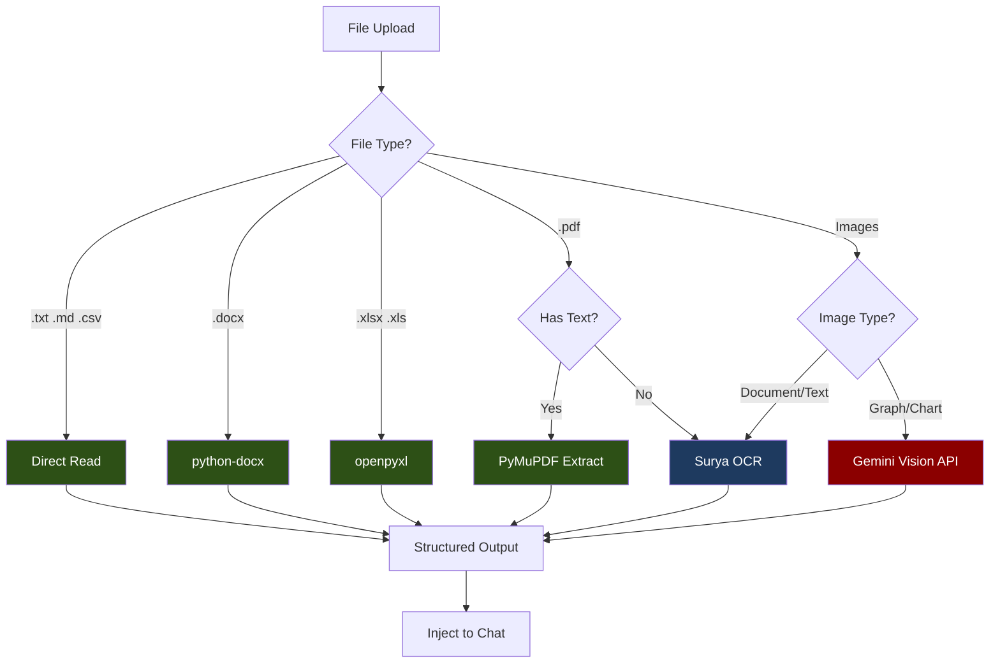

# OCR Implementation: Hybrid (Surya + Gemini)

## Overview

This approach uses **Surya OCR** for documents and **Gemini Vision** for graphs/charts. Best balance of cost and capability.



**Legend:**
- Dark Green = Free (local parsers)
- Dark Blue = Free (local OCR)
- Dark Red = Paid (Gemini API)

---

## Cost

| Item | Cost |
|------|------|
| Local parsers (90% of files) | **$0.00** |
| Gemini for graphs (~10%) | **~$0.50-2.00/month** |

---

## Capabilities

| Feature | Supported |
|---------|-----------|
| Text documents | Yes (free) |
| Tables in PDFs | Yes (Surya - free) |
| Graphs/Charts interpretation | Yes (Gemini - paid) |
| Handwritten text | Partial (Surya) |

---

## Dependencies

### requirements.txt additions

```text
# ============================================
# HYBRID OCR DEPENDENCIES (Surya + Gemini)
# ============================================

# Local OCR Engine
surya-ocr>=0.6.0              # Layout + OCR

# Document Parsers
python-docx>=1.1.0            # .docx parsing
openpyxl>=3.1.0               # .xlsx parsing
PyMuPDF>=1.24.0               # PDF text extraction
pandas>=2.2.0                 # Data handling

# Gemini API (for graphs)
google-generativeai>=0.8.0    # Gemini Vision

# File Handling
Pillow>=10.0.0                # Image processing
python-multipart>=0.0.9       # FastAPI file upload
aiofiles>=24.1.0              # Async file I/O
python-magic>=0.4.27          # MIME detection
```

---

## Project Structure

```
app/
├── services/
│   └── file_processing/
│       ├── __init__.py
│       ├── router.py              # Routes file to handler
│       ├── base_handler.py        # Abstract base class
│       ├── text_handler.py        # .txt, .md, .csv
│       ├── docx_handler.py        # .docx
│       ├── excel_handler.py       # .xlsx, .xls
│       ├── pdf_handler.py         # .pdf
│       ├── image_handler.py       # Images (with graph detection)
│       ├── ocr/
│       │   ├── __init__.py
│       │   ├── surya_ocr.py       # Surya OCR wrapper
│       │   └── gemini_vision.py   # Gemini Vision wrapper
│       ├── classifiers/
│       │   ├── __init__.py
│       │   └── image_classifier.py  # Detect graph vs document
│       └── models.py              # Pydantic schemas
├── api/
│   └── v1/
│       └── endpoints/
│           └── upload.py          # Upload endpoint
```

---

## Implementation

### Changes from Fully Local

This approach extends the Fully Local implementation with:
1. **Gemini Vision integration** for graphs/charts
2. **Image classifier** to detect if image is a graph or document
3. **Fallback logic** for low-confidence OCR results

---

### Step 1: Extended Models

**File: `app/services/file_processing/models.py`**

```python
"""Pydantic models for file processing."""

from enum import StrEnum
from pydantic import BaseModel, Field


class ExtractionMethod(StrEnum):
    """Method used to extract content."""
    DIRECT_READ = "direct_read"
    PYTHON_DOCX = "python_docx"
    OPENPYXL = "openpyxl"
    PYMUPDF = "pymupdf"
    SURYA_OCR = "surya_ocr"
    GEMINI_VISION = "gemini_vision"  # NEW


class ImageType(StrEnum):
    """Type of image content."""
    DOCUMENT = "document"
    GRAPH = "graph"
    CHART = "chart"
    PHOTO = "photo"
    UNKNOWN = "unknown"


class ExtractionMetadata(BaseModel):
    """Metadata about the extraction process."""
    file_type: str
    file_size: int
    pages: int | None = None
    extraction_method: ExtractionMethod
    confidence: float = Field(ge=0.0, le=1.0, default=1.0)
    processing_time_ms: int
    tokens_used: int = 0  # NEW - tracks Gemini token usage
    image_type: ImageType | None = None  # NEW


class ExtractedContent(BaseModel):
    """Extracted content from a file."""
    text: str
    structured_data: dict | None = None
    markdown: str
    metadata: ExtractionMetadata


class UploadResponse(BaseModel):
    """Response from upload endpoint."""
    file_id: str
    filename: str
    extraction: ExtractedContent
```

---

### Step 2: Image Classifier

**File: `app/services/file_processing/classifiers/image_classifier.py`**

```python
"""Classifier to detect image type (document vs graph/chart)."""

from pathlib import Path

from PIL import Image
import numpy as np

from app.services.file_processing.models import ImageType


class ImageClassifier:
    """Simple heuristic-based image classifier."""

    # Keywords that suggest a graph/chart when found in filename
    GRAPH_KEYWORDS = ["chart", "graph", "plot", "diagram", "pie", "bar", "line"]

    def __init__(self):
        pass

    def classify(self, file_path: Path, image: Image.Image | None = None) -> ImageType:
        """
        Classify image as document, graph, or other.

        Uses heuristics:
        1. Filename keywords
        2. Color distribution analysis
        3. Edge detection patterns
        """
        filename = file_path.stem.lower()

        # Check filename for keywords
        for keyword in self.GRAPH_KEYWORDS:
            if keyword in filename:
                return ImageType.GRAPH

        # Load image if not provided
        if image is None:
            image = Image.open(file_path)

        # Analyze image characteristics
        return self._analyze_image(image)

    def _analyze_image(self, image: Image.Image) -> ImageType:
        """Analyze image to determine type."""
        # Convert to RGB if needed
        if image.mode != "RGB":
            image = image.convert("RGB")

        # Get image as numpy array
        img_array = np.array(image)

        # Calculate color statistics
        unique_colors = self._count_unique_colors(img_array)
        color_variance = self._color_variance(img_array)

        # Heuristics for graph detection:
        # - Graphs typically have fewer unique colors (flat fills)
        # - Graphs have lower color variance
        # - Graphs often have white/light backgrounds

        # Check for graph characteristics
        if unique_colors < 1000 and color_variance < 50:
            return ImageType.GRAPH

        # Check for chart characteristics (pie charts, bar charts)
        if self._has_chart_colors(img_array):
            return ImageType.CHART

        # Default to document (text-heavy image)
        return ImageType.DOCUMENT

    def _count_unique_colors(self, img_array: np.ndarray, sample_size: int = 10000) -> int:
        """Count unique colors in image (sampled)."""
        # Flatten to pixels
        pixels = img_array.reshape(-1, 3)

        # Sample if too large
        if len(pixels) > sample_size:
            indices = np.random.choice(len(pixels), sample_size, replace=False)
            pixels = pixels[indices]

        # Count unique
        unique = np.unique(pixels, axis=0)
        return len(unique)

    def _color_variance(self, img_array: np.ndarray) -> float:
        """Calculate color variance."""
        return np.var(img_array)

    def _has_chart_colors(self, img_array: np.ndarray) -> bool:
        """Check if image has typical chart color patterns."""
        # Common chart colors (RGB)
        chart_colors = [
            (255, 99, 132),   # Red
            (54, 162, 235),   # Blue
            (255, 206, 86),   # Yellow
            (75, 192, 192),   # Teal
            (153, 102, 255),  # Purple
            (255, 159, 64),   # Orange
        ]

        # Check if any chart colors are prominent
        pixels = img_array.reshape(-1, 3)
        for color in chart_colors:
            # Count pixels close to this color
            distances = np.linalg.norm(pixels - np.array(color), axis=1)
            close_pixels = np.sum(distances < 30)
            if close_pixels > len(pixels) * 0.05:  # More than 5% of pixels
                return True

        return False


# Singleton instance
image_classifier = ImageClassifier()
```

---

### Step 3: Gemini Vision Wrapper

**File: `app/services/file_processing/ocr/gemini_vision.py`**

```python
"""Gemini Vision API wrapper for graph/chart interpretation."""

import base64
import time
from pathlib import Path

import google.generativeai as genai
from PIL import Image

from app.config import settings
from app.services.file_processing.models import (
    ExtractedContent,
    ExtractionMetadata,
    ExtractionMethod,
    ImageType,
)


class GeminiVision:
    """Wrapper for Gemini Vision API."""

    def __init__(self):
        """Initialize Gemini client."""
        # Configure API key
        genai.configure(api_key=settings.google_api_key)

        # Use fast model for cost efficiency
        self.model = genai.GenerativeModel("gemini-2.0-flash")

    async def extract_from_image(
        self,
        file_path: Path,
        image_type: ImageType = ImageType.UNKNOWN,
    ) -> ExtractedContent:
        """Extract content from image using Gemini Vision."""
        start_time = time.perf_counter()

        # Load and encode image
        image = Image.open(file_path)

        # Build prompt based on image type
        prompt = self._build_prompt(image_type)

        # Call Gemini
        response = self.model.generate_content([prompt, image])

        text = response.text
        tokens_used = response.usage_metadata.total_token_count if response.usage_metadata else 0

        processing_time = int((time.perf_counter() - start_time) * 1000)

        # Build markdown based on image type
        if image_type in [ImageType.GRAPH, ImageType.CHART]:
            markdown = f"## Graph/Chart Analysis\n\n{text}"
        else:
            markdown = f"```\n{text}\n```"

        return ExtractedContent(
            text=text,
            structured_data={"image_type": image_type.value},
            markdown=markdown,
            metadata=ExtractionMetadata(
                file_type=file_path.suffix.lower(),
                file_size=file_path.stat().st_size,
                extraction_method=ExtractionMethod.GEMINI_VISION,
                confidence=0.95,  # Gemini is generally high confidence
                processing_time_ms=processing_time,
                tokens_used=tokens_used,
                image_type=image_type,
            ),
        )

    async def interpret_graph(self, file_path: Path) -> ExtractedContent:
        """Specifically interpret a graph/chart image."""
        return await self.extract_from_image(file_path, ImageType.GRAPH)

    def _build_prompt(self, image_type: ImageType) -> str:
        """Build prompt based on image type."""
        if image_type == ImageType.GRAPH:
            return """Analyze this graph image and provide:
1. Type of graph (bar, line, pie, scatter, etc.)
2. Title and axis labels if visible
3. Key data points and values
4. Trends or patterns observed
5. Any notable insights

Format the response clearly with sections."""

        elif image_type == ImageType.CHART:
            return """Analyze this chart image and provide:
1. Type of chart
2. All visible data values and labels
3. Percentages or proportions if shown
4. Key takeaways

Format as structured data where possible."""

        else:
            return """Extract all text content from this image.
Preserve the structure and formatting.
If there are tables, format them clearly.
If there are numbers, ensure accuracy."""


# Singleton instance
gemini_vision = GeminiVision()
```

---

### Step 4: Updated Image Handler

**File: `app/services/file_processing/image_handler.py`**

```python
"""Handler for image files with graph detection."""

import time
from pathlib import Path

from PIL import Image

from app.services.file_processing.base_handler import BaseFileHandler
from app.services.file_processing.models import (
    ExtractedContent,
    ExtractionMetadata,
    ExtractionMethod,
    ImageType,
)
from app.services.file_processing.ocr.surya_ocr import surya_ocr
from app.services.file_processing.ocr.gemini_vision import gemini_vision
from app.services.file_processing.classifiers.image_classifier import image_classifier


class ImageHandler(BaseFileHandler):
    """Handler for image files with smart routing."""

    SUPPORTED_EXTENSIONS = [".png", ".jpg", ".jpeg", ".gif", ".bmp", ".tiff", ".webp"]
    MAX_DIMENSION = 4096

    async def extract(self, file_path: Path) -> ExtractedContent:
        """Extract content from image, routing to appropriate OCR."""
        start_time = time.perf_counter()

        # Resize if needed
        self._resize_if_needed(file_path)

        # Classify image type
        image_type = image_classifier.classify(file_path)

        # Route based on image type
        if image_type in [ImageType.GRAPH, ImageType.CHART]:
            # Use Gemini for graphs/charts (can interpret meaning)
            result = await gemini_vision.extract_from_image(file_path, image_type)
        else:
            # Use Surya for documents (free, good for text)
            result = await surya_ocr.extract_from_image(file_path)
            result.metadata.image_type = image_type

        # Update processing time to include classification
        total_time = int((time.perf_counter() - start_time) * 1000)
        result.metadata.processing_time_ms = total_time

        return result

    def _resize_if_needed(self, file_path: Path) -> None:
        """Resize image if it exceeds maximum dimensions."""
        img = Image.open(file_path)

        if img.width > self.MAX_DIMENSION or img.height > self.MAX_DIMENSION:
            ratio = min(self.MAX_DIMENSION / img.width, self.MAX_DIMENSION / img.height)
            new_size = (int(img.width * ratio), int(img.height * ratio))

            img = img.resize(new_size, Image.Resampling.LANCZOS)
            img.save(file_path)
```

---

### Step 5: Updated PDF Handler (with fallback)

**File: `app/services/file_processing/pdf_handler.py`**

```python
"""Handler for PDF files with Gemini fallback."""

import time
from pathlib import Path

import fitz  # PyMuPDF
from PIL import Image

from app.services.file_processing.base_handler import BaseFileHandler
from app.services.file_processing.models import (
    ExtractedContent,
    ExtractionMetadata,
    ExtractionMethod,
)
from app.services.file_processing.ocr.surya_ocr import surya_ocr
from app.services.file_processing.ocr.gemini_vision import gemini_vision


class PDFHandler(BaseFileHandler):
    """Handler for PDF documents with smart OCR selection."""

    SUPPORTED_EXTENSIONS = [".pdf"]
    MIN_TEXT_LENGTH = 50
    MIN_CONFIDENCE = 0.7  # Fallback to Gemini if below this

    async def extract(self, file_path: Path) -> ExtractedContent:
        """Extract content from PDF file."""
        start_time = time.perf_counter()

        doc = fitz.open(str(file_path))
        page_count = len(doc)

        # Try native text extraction first
        native_text = self._extract_native_text(doc)

        if self._has_sufficient_text(native_text, page_count):
            # Native PDF with text layer
            doc.close()
            processing_time = int((time.perf_counter() - start_time) * 1000)

            return ExtractedContent(
                text=native_text,
                structured_data={"pages": page_count},
                markdown=self._text_to_markdown(native_text),
                metadata=ExtractionMetadata(
                    file_type=".pdf",
                    file_size=file_path.stat().st_size,
                    pages=page_count,
                    extraction_method=ExtractionMethod.PYMUPDF,
                    confidence=1.0,
                    processing_time_ms=processing_time,
                ),
            )

        # Scanned PDF - use Surya OCR
        images = self._pdf_to_images(doc)
        doc.close()

        text, confidence = await surya_ocr.extract_from_images(images)

        # If confidence is too low, consider Gemini fallback
        # (Optional: uncomment to enable fallback)
        # if confidence < self.MIN_CONFIDENCE and page_count <= 5:
        #     # For short documents with low confidence, use Gemini
        #     return await self._gemini_fallback(file_path, page_count, start_time)

        processing_time = int((time.perf_counter() - start_time) * 1000)

        return ExtractedContent(
            text=text,
            structured_data={"pages": page_count, "ocr_used": True},
            markdown=self._text_to_markdown(text),
            metadata=ExtractionMetadata(
                file_type=".pdf",
                file_size=file_path.stat().st_size,
                pages=page_count,
                extraction_method=ExtractionMethod.SURYA_OCR,
                confidence=confidence,
                processing_time_ms=processing_time,
            ),
        )

    async def _gemini_fallback(
        self,
        file_path: Path,
        page_count: int,
        start_time: float
    ) -> ExtractedContent:
        """Fallback to Gemini for low-confidence results."""
        # Use Gemini's native PDF support
        result = await gemini_vision.extract_from_image(file_path)
        result.metadata.pages = page_count
        result.metadata.processing_time_ms = int((time.perf_counter() - start_time) * 1000)
        return result

    def _extract_native_text(self, doc: fitz.Document) -> str:
        """Extract text from PDF using PyMuPDF."""
        pages_text = []
        for page_num, page in enumerate(doc):
            text = page.get_text().strip()
            if text:
                pages_text.append(f"--- Page {page_num + 1} ---\n{text}")
        return "\n\n".join(pages_text)

    def _has_sufficient_text(self, text: str, page_count: int) -> bool:
        """Check if extracted text is sufficient."""
        if not text:
            return False
        return len(text) >= (self.MIN_TEXT_LENGTH * page_count)

    def _pdf_to_images(self, doc: fitz.Document, dpi: int = 200) -> list[Image.Image]:
        """Convert PDF pages to PIL Images."""
        images = []
        zoom = dpi / 72
        matrix = fitz.Matrix(zoom, zoom)

        for page in doc:
            pix = page.get_pixmap(matrix=matrix)
            img = Image.frombytes("RGB", [pix.width, pix.height], pix.samples)
            images.append(img)

        return images
```

---

### Step 6: Config Updates

**Add to `app/config.py`:**

```python
class Settings(BaseSettings):
    # ... existing settings ...

    # Gemini API (for graph interpretation)
    google_api_key: str = ""  # Add this if not already present
```

---

### Step 7: Updated Router

**File: `app/services/file_processing/router.py`**

```python
"""Routes files to appropriate handlers."""

from pathlib import Path

from app.services.file_processing.base_handler import BaseFileHandler
from app.services.file_processing.text_handler import TextHandler, CSVHandler
from app.services.file_processing.docx_handler import DocxHandler
from app.services.file_processing.excel_handler import ExcelHandler
from app.services.file_processing.pdf_handler import PDFHandler
from app.services.file_processing.image_handler import ImageHandler
from app.services.file_processing.models import ExtractedContent


class FileRouter:
    """Routes files to the appropriate handler."""

    HANDLERS: list[type[BaseFileHandler]] = [
        TextHandler,
        CSVHandler,
        DocxHandler,
        ExcelHandler,
        PDFHandler,
        ImageHandler,
    ]

    SUPPORTED_EXTENSIONS: set[str] = set()

    def __init__(self):
        """Initialize handlers."""
        self._handlers = {cls: cls() for cls in self.HANDLERS}

        for handler_cls in self.HANDLERS:
            self.SUPPORTED_EXTENSIONS.update(handler_cls.SUPPORTED_EXTENSIONS)

    def is_supported(self, file_path: Path) -> bool:
        """Check if file type is supported."""
        return file_path.suffix.lower() in self.SUPPORTED_EXTENSIONS

    def get_handler(self, file_path: Path) -> BaseFileHandler | None:
        """Get the appropriate handler for a file."""
        for handler_cls, handler in self._handlers.items():
            if handler_cls.can_handle(file_path):
                return handler
        return None

    async def process(self, file_path: Path) -> ExtractedContent:
        """Process a file and return extracted content."""
        handler = self.get_handler(file_path)

        if handler is None:
            raise ValueError(f"Unsupported file type: {file_path.suffix}")

        return await handler.extract(file_path)


# Singleton instance
file_router = FileRouter()
```

---

## Environment Variables

```bash
# .env additions
GOOGLE_API_KEY=your-gemini-api-key
```

---

## Cost Tracking

The `tokens_used` field in metadata allows tracking Gemini API usage:

```python
# Example: Track costs
def calculate_cost(metadata: ExtractionMetadata) -> float:
    """Calculate cost for this extraction."""
    if metadata.extraction_method == ExtractionMethod.GEMINI_VISION:
        # Gemini 2.0 Flash pricing: $0.10 per 1M input tokens
        return metadata.tokens_used * 0.0000001
    return 0.0  # Free for local processing
```

---

## Summary

| Component | Method | Cost |
|-----------|--------|------|
| Text files | Direct read | Free |
| DOCX | python-docx | Free |
| Excel | openpyxl | Free |
| PDF (native) | PyMuPDF | Free |
| PDF (scanned) | Surya OCR | Free |
| Images (docs) | Surya OCR | Free |
| Images (graphs) | Gemini Vision | ~$0.0001/image |
| **Monthly estimate** | | **$0.50-2.00** |
