# LIBRARY_GEMINI - Python Libraries + Gemini Fallback

## Overview

**LIBRARY_GEMINI** is a cost-efficient OCR approach that uses **Python libraries for text-based files** and only falls back to **Gemini Vision for images and scanned PDFs**.

### Key Characteristics

| Feature | Value |
|---------|-------|
| **Primary Method** | Python libraries (FREE) |
| **Fallback** | Gemini Vision API |
| **Cost** | Very Low (~$0 for 80% of docs) |
| **Speed** | Fast (libraries) / Medium (Gemini) |
| **Best For** | Text-heavy documents, cost optimization |

---

## Architecture

### High-Level Flow

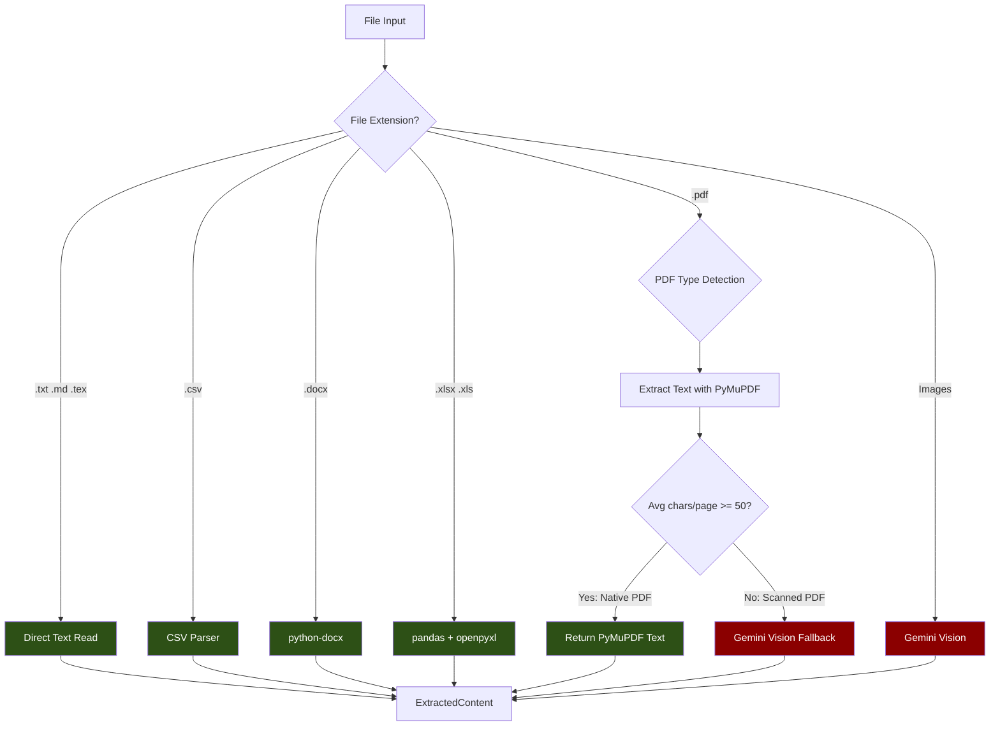

---

## File Type Handling

### Processing Matrix

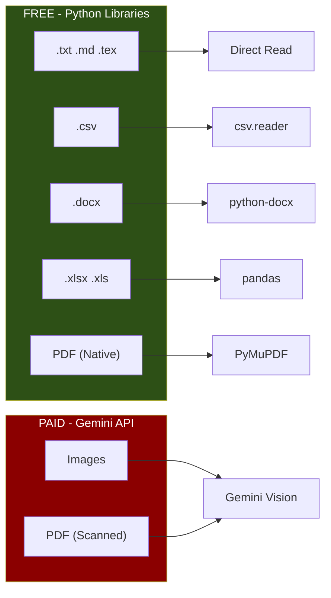

### Detailed File Handling

| Extension | Library | Method | Cost |
|-----------|---------|--------|------|
| `.txt`, `.md`, `.tex` | Built-in | `open().read()` | FREE |
| `.csv` | Built-in | `csv.reader()` | FREE |
| `.docx` | python-docx | `Document()` | FREE |
| `.xlsx`, `.xls` | pandas | `pd.read_excel()` | FREE |
| `.pdf` (native) | PyMuPDF | `fitz.open()` | FREE |
| `.pdf` (scanned) | Gemini | `gemini_multi_model` | ~$0.0001/page |
| Images | Gemini | `gemini_multi_model` | ~$0.0001/image |

---

## Scanned PDF Detection

### Detection Algorithm

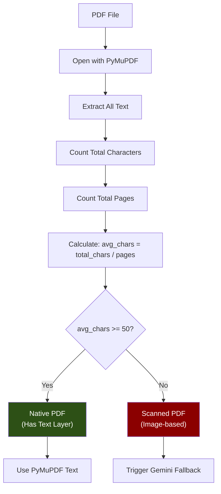

### Detection Logic

```python
MIN_PDF_TEXT_PER_PAGE = 50  # characters

def is_scanned_pdf(pdf_path: Path) -> bool:
    doc = fitz.open(str(pdf_path))
    total_chars = 0

    for page in doc:
        text = page.get_text()
        total_chars += len(text.strip())

    doc.close()

    avg_chars_per_page = total_chars / len(doc)

    # If less than 50 chars per page on average = scanned
    return avg_chars_per_page < MIN_PDF_TEXT_PER_PAGE
```

### Example Scenarios

| PDF Content | Total Chars | Pages | Avg/Page | Classification |
|-------------|-------------|-------|----------|----------------|
| Full text document | 5000 | 10 | 500 | **Native** |
| Scanned invoice | 0 | 1 | 0 | **Scanned** |
| Mixed (some OCR'd) | 200 | 5 | 40 | **Scanned** |
| Minimal text | 100 | 1 | 100 | **Native** |

---

## Text File Extraction

### Direct Read Flow

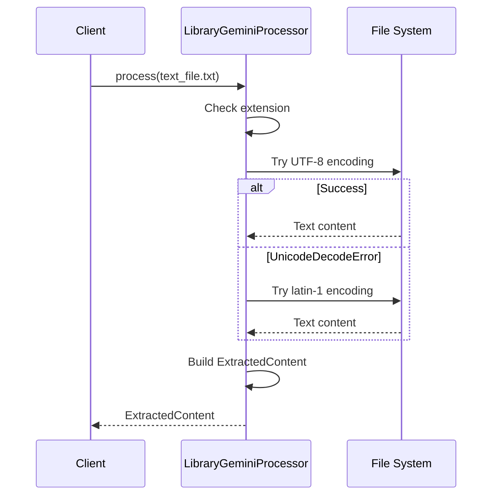

### Encoding Fallback

```python
ENCODING_FALLBACK = ["utf-8", "latin-1", "cp1252"]

def extract_text_file(path: Path) -> str:
    for encoding in ENCODING_FALLBACK:
        try:
            return path.read_text(encoding=encoding)
        except UnicodeDecodeError:
            continue
    raise ValueError(f"Cannot decode file with any encoding")
```

---

## CSV Extraction

### CSV Processing Flow

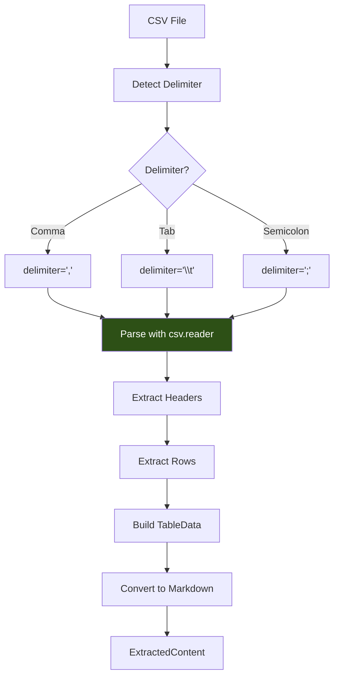

---

## DOCX Extraction

### Word Document Processing

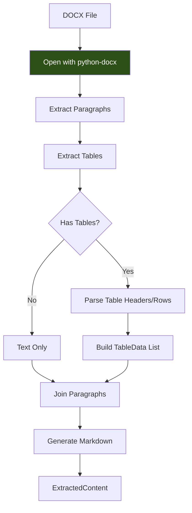

---

## Excel Extraction

### Spreadsheet Processing

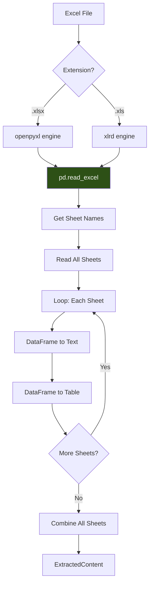

---

## PDF Native Extraction

### PyMuPDF Processing

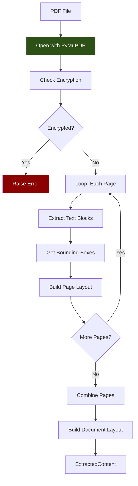

---

## Gemini Fallback Flow

### When Gemini is Used

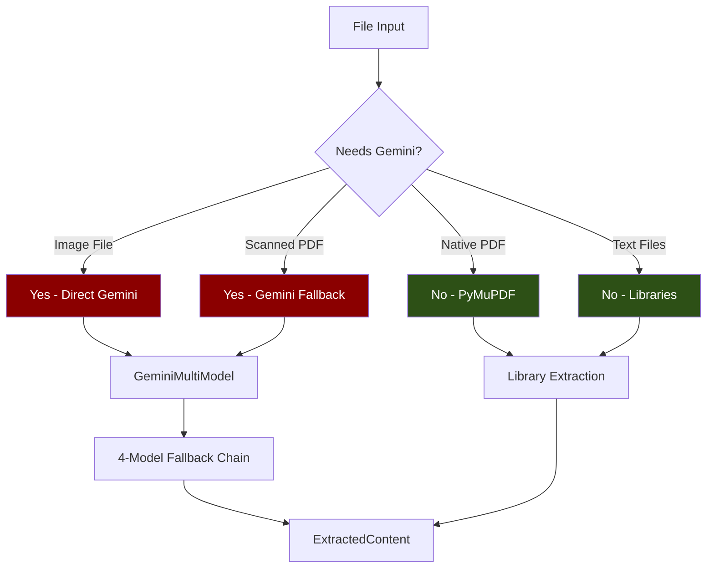

### Gemini Fallback Trigger

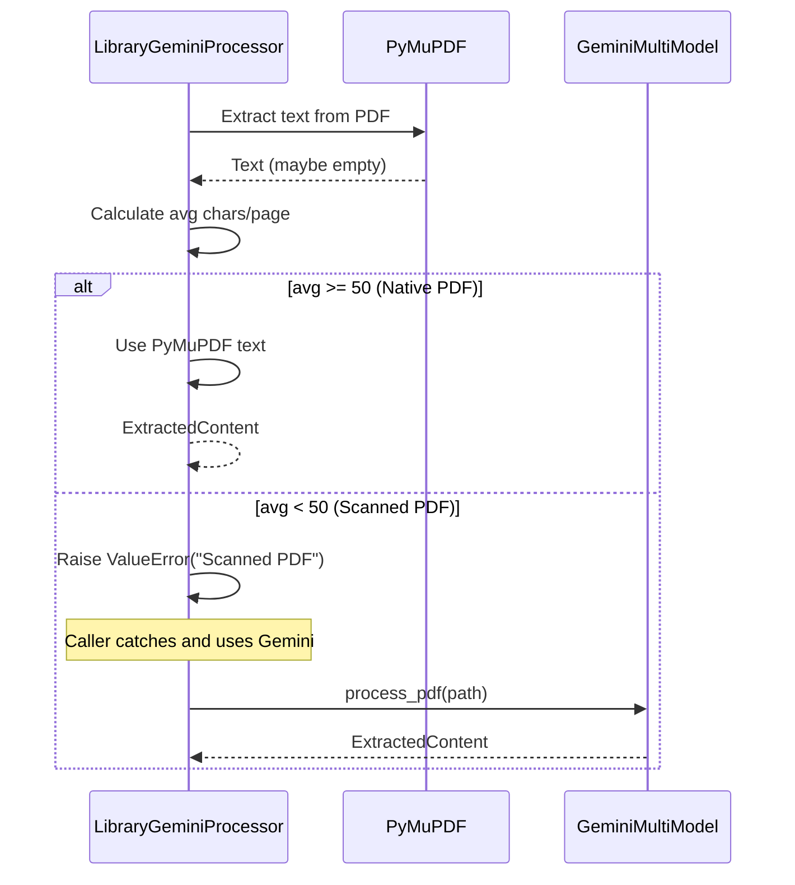

---

## Configuration

### Supported Extensions

```python
SUPPORTED_EXTENSIONS = {
    # Text files (direct read)
    ".txt", ".md", ".tex",

    # CSV
    ".csv",

    # Office documents
    ".docx",
    ".xlsx", ".xls",

    # PDF (native + scanned detection)
    ".pdf",

    # Images (always Gemini)
    ".png", ".jpg", ".jpeg", ".gif",
    ".bmp", ".tiff", ".webp"
}
```

### Detection Threshold

```python
MIN_PDF_TEXT_PER_PAGE = 50  # characters

# If average chars per page < 50, treat as scanned
```

---

## Output Structure

### Native Extraction (Libraries)

```json
{
  "text": "Document content...",
  "structured_data": {
    "library_gemini": true,
    "approach": "library_gemini",
    "extraction_type": "native",
    "library_used": "python-docx"
  },
  "metadata": {
    "extraction_method": "python_docx",
    "confidence": 1.0,
    "tokens_used": 0
  }
}
```

### Gemini Fallback

```json
{
  "text": "OCR extracted text...",
  "structured_data": {
    "library_gemini": true,
    "approach": "library_gemini",
    "extraction_type": "gemini_fallback",
    "reason": "Scanned PDF detected (avg 0 chars/page)"
  },
  "metadata": {
    "extraction_method": "gemini_vision",
    "confidence": 0.89,
    "tokens_used": 1500
  }
}
```

---

## Cost Analysis

### Cost Breakdown

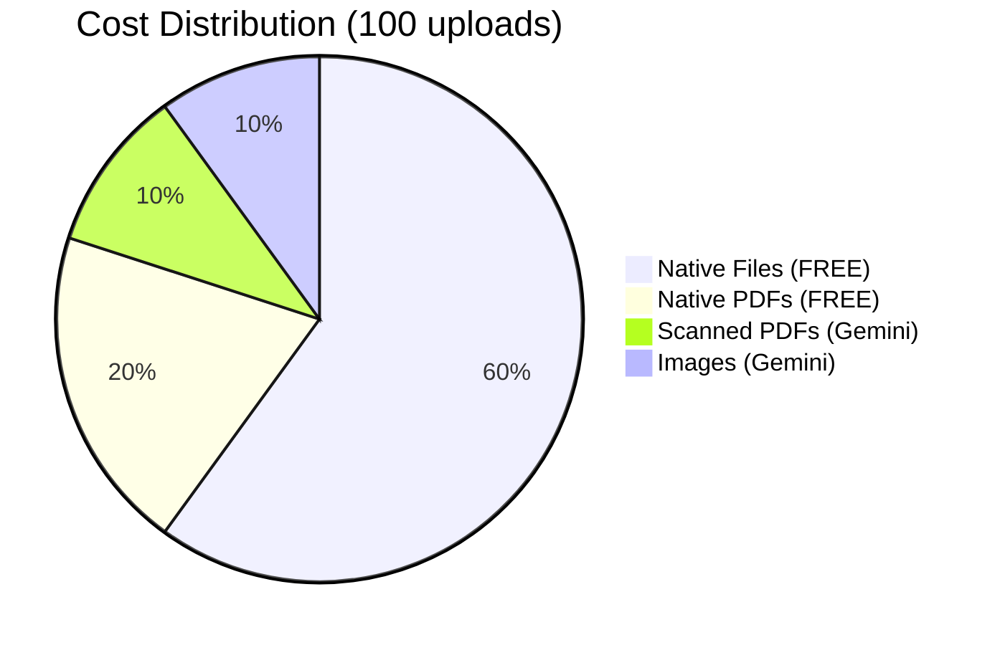

### Per-Type Cost

| File Type | Processing | Cost |
|-----------|------------|------|
| .docx, .xlsx, .csv, .txt | Libraries | **$0.00** |
| Native PDF | PyMuPDF | **$0.00** |
| Scanned PDF | Gemini | ~$0.0001/page |
| Images | Gemini | ~$0.0001/image |

### Monthly Projection

| Daily Volume | % Native | % Gemini | Monthly Cost |
|--------------|----------|----------|--------------|
| 100 docs | 80% | 20% | ~$0.06 |
| 500 docs | 80% | 20% | ~$0.30 |
| 1000 docs | 80% | 20% | ~$0.60 |

---

## Comparison with Other Approaches

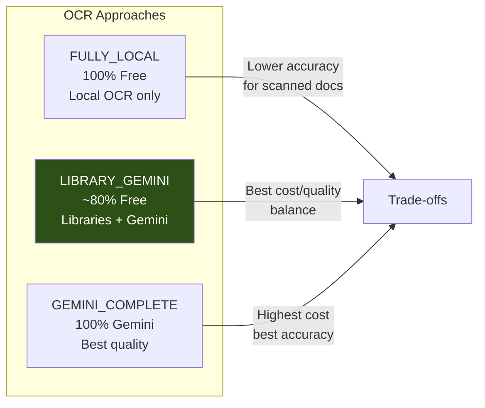

---

## When to Use LIBRARY_GEMINI

### Best Use Cases

| Scenario | Why Use |
|----------|---------|
| Text-heavy documents | FREE library extraction |
| Office files (.docx, .xlsx) | Perfect native parsing |
| Native PDFs | PyMuPDF extracts perfectly |
| Cost-sensitive workflows | Minimal API usage |
| High volume processing | 80%+ documents are FREE |

### When NOT to Use

| Scenario | Better Alternative |
|----------|-------------------|
| All images/scans | GEMINI_COMPLETE |
| Complex layouts | GEMINI_COMPLETE |
| Mission-critical | ULTIMATE_CASCADE |

---

## File Location

**Implementation:** `app/services/file_processing/ocr/library_gemini.py`

**Singleton Instance:** `library_gemini`

```python
from app.services.file_processing.ocr import library_gemini

# Process any supported file
result = await library_gemini.process(Path("document.docx"))
result = await library_gemini.process(Path("report.xlsx"))
result = await library_gemini.process(Path("invoice.pdf"))

# Check if Gemini fallback is available
if library_gemini.is_available():
    # Can handle scanned PDFs and images
    pass
```

---

## Error Handling

### Error Flow

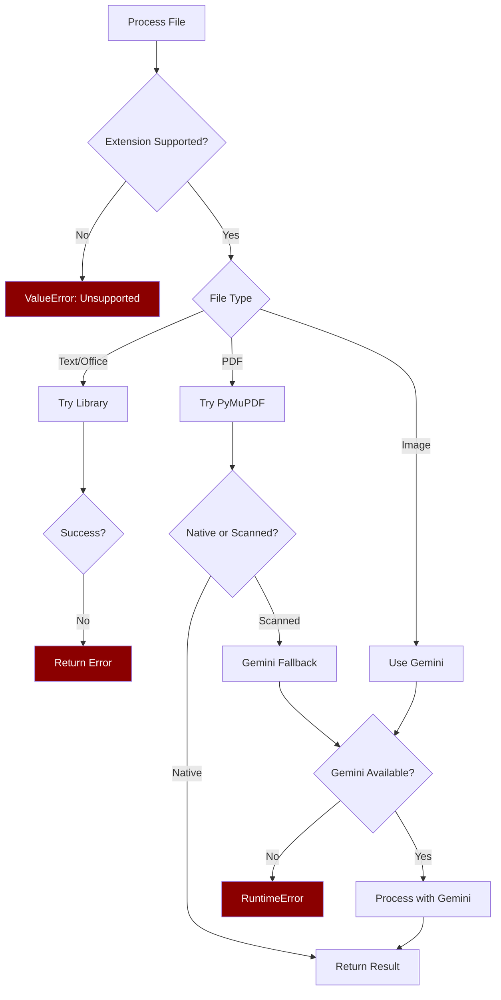
