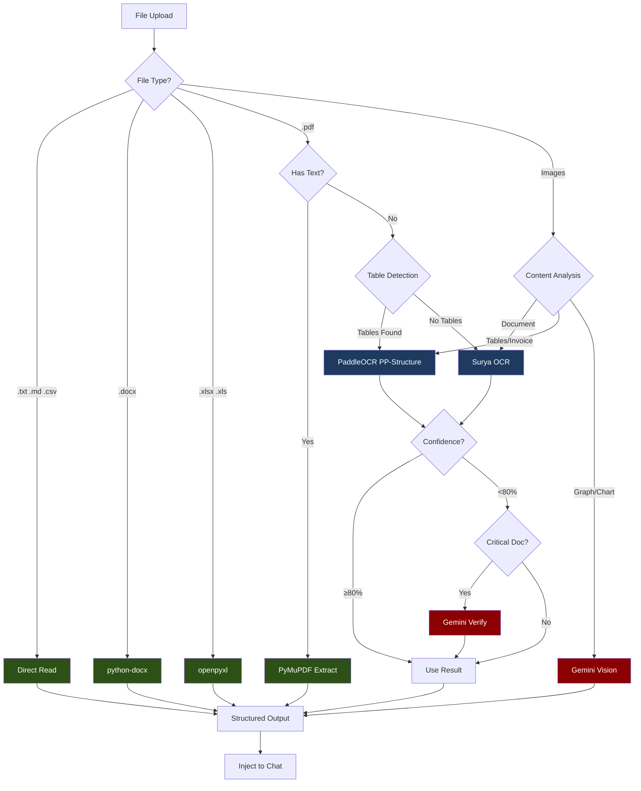

# OCR Implementation: Multi-OCR Hybrid (Surya + PaddleOCR + Gemini)

## Overview

This is the **recommended approach** for ERPSense. Uses multiple OCR engines, each optimized for specific document types:

- **Surya OCR** - Best for general documents and layout detection
- **PaddleOCR PP-Structure** - Best for tables and invoices
- **Gemini Vision** - Best for graphs/charts and fallback for low-confidence results



**Legend:**
- Dark Green = Free (local parsers)
- Dark Blue = Free (local OCR)
- Dark Red = Paid (Gemini API)

---

## Why Multi-OCR?

| Document Type | Best OCR | Reason |
|--------------|----------|--------|
| General documents | Surya | Best layout detection |
| Invoices/Bills | PaddleOCR | Superior table extraction |
| Forms with checkboxes | PaddleOCR | Good form recognition |
| Mixed layout | Both → Merge | Combine strengths |
| Graphs/Charts | Gemini | Only one that "understands" visuals |
| Handwritten | Surya | Better handwriting recognition |
| Low quality scans | Gemini | Most robust fallback |

---

## Cost

| Item | Cost |
|------|------|
| Local parsers (60%) | **$0.00** |
| Surya/PaddleOCR (30%) | **$0.00** |
| Gemini for graphs (10%) | **~$0.50-2.00/month** |
| **Total** | **~$1-2/month** |

---

## Dependencies

### requirements.txt additions

```text
# ============================================
# MULTI-OCR HYBRID DEPENDENCIES
# ============================================

# OCR Engines (FREE)
surya-ocr>=0.6.0              # Layout + general OCR
paddlepaddle>=2.6.0           # PaddlePaddle framework
paddleocr>=2.7.0              # Table structure (PP-Structure)

# Document Parsers (FREE)
python-docx>=1.1.0            # .docx parsing
openpyxl>=3.1.0               # .xlsx parsing
PyMuPDF>=1.24.0               # PDF text extraction
pandas>=2.2.0                 # Data handling

# Gemini API (for graphs + fallback)
google-generativeai>=0.8.0    # Gemini Vision

# File Handling
Pillow>=10.0.0                # Image processing
python-multipart>=0.0.9       # FastAPI file upload
aiofiles>=24.1.0              # Async file I/O
python-magic>=0.4.27          # MIME detection
numpy>=1.26.0                 # Array operations
```

### Dockerfile additions

```dockerfile
# Add system dependencies
RUN apt-get update && apt-get install -y --no-install-recommends \
    libmagic1 \
    libgl1-mesa-glx \
    libglib2.0-0 \
    && rm -rf /var/lib/apt/lists/*
```

---

## Project Structure

```
app/
├── services/
│   └── file_processing/
│       ├── __init__.py
│       ├── router.py                # Main file router
│       ├── base_handler.py          # Abstract base class
│       ├── text_handler.py          # .txt, .md, .csv
│       ├── docx_handler.py          # .docx
│       ├── excel_handler.py         # .xlsx, .xls
│       ├── pdf_handler.py           # .pdf (smart OCR selection)
│       ├── image_handler.py         # Images (smart routing)
│       ├── ocr/
│       │   ├── __init__.py
│       │   ├── surya_ocr.py         # Surya OCR wrapper
│       │   ├── paddle_ocr.py        # PaddleOCR wrapper (NEW)
│       │   ├── gemini_vision.py     # Gemini Vision wrapper
│       │   └── ocr_router.py        # Routes to best OCR (NEW)
│       ├── classifiers/
│       │   ├── __init__.py
│       │   ├── image_classifier.py  # Graph vs document
│       │   └── table_detector.py    # Detect tables in images (NEW)
│       └── models.py                # Pydantic schemas
├── api/
│   └── v1/
│       └── endpoints/
│           └── upload.py            # Upload endpoint
```

---

## Implementation

### Step 1: Extended Models

**File: `app/services/file_processing/models.py`**

```python
"""Pydantic models for file processing."""

from enum import StrEnum
from pydantic import BaseModel, Field


class ExtractionMethod(StrEnum):
    """Method used to extract content."""
    DIRECT_READ = "direct_read"
    PYTHON_DOCX = "python_docx"
    OPENPYXL = "openpyxl"
    PYMUPDF = "pymupdf"
    SURYA_OCR = "surya_ocr"
    PADDLE_OCR = "paddle_ocr"  # NEW
    GEMINI_VISION = "gemini_vision"
    MULTI_OCR = "multi_ocr"  # NEW - when multiple OCRs used


class ImageType(StrEnum):
    """Type of image content."""
    DOCUMENT = "document"
    TABLE = "table"  # NEW
    INVOICE = "invoice"  # NEW
    FORM = "form"  # NEW
    GRAPH = "graph"
    CHART = "chart"
    PHOTO = "photo"
    UNKNOWN = "unknown"


class OCRResult(BaseModel):
    """Result from a single OCR engine."""
    text: str
    confidence: float
    method: ExtractionMethod
    tables: list[dict] | None = None  # NEW - extracted tables


class ExtractionMetadata(BaseModel):
    """Metadata about the extraction process."""
    file_type: str
    file_size: int
    pages: int | None = None
    extraction_method: ExtractionMethod
    confidence: float = Field(ge=0.0, le=1.0, default=1.0)
    processing_time_ms: int
    tokens_used: int = 0
    image_type: ImageType | None = None
    ocr_engines_used: list[str] = []  # NEW - track which engines were used


class TableData(BaseModel):
    """Extracted table data."""
    headers: list[str]
    rows: list[list[str]]
    confidence: float


class ExtractedContent(BaseModel):
    """Extracted content from a file."""
    text: str
    structured_data: dict | None = None
    tables: list[TableData] | None = None  # NEW
    markdown: str
    metadata: ExtractionMetadata


class UploadResponse(BaseModel):
    """Response from upload endpoint."""
    file_id: str
    filename: str
    extraction: ExtractedContent
```

---

### Step 2: PaddleOCR Wrapper

**File: `app/services/file_processing/ocr/paddle_ocr.py`**

```python
"""PaddleOCR wrapper for table extraction."""

import time
from pathlib import Path

from paddleocr import PaddleOCR, PPStructure
from PIL import Image
import numpy as np

from app.services.file_processing.models import (
    ExtractedContent,
    ExtractionMetadata,
    ExtractionMethod,
    TableData,
)


class PaddleOCREngine:
    """Wrapper for PaddleOCR with table structure recognition."""

    _instance = None
    _ocr = None
    _table_engine = None

    def __new__(cls):
        """Singleton pattern for model caching."""
        if cls._instance is None:
            cls._instance = super().__new__(cls)
        return cls._instance

    def _load_models(self):
        """Lazy load OCR models."""
        if self._ocr is None:
            # Standard OCR
            self._ocr = PaddleOCR(
                use_angle_cls=True,
                lang="en",
                show_log=False,
            )

            # Table structure recognition (PP-Structure)
            self._table_engine = PPStructure(
                show_log=False,
                layout=True,
                table=True,
            )

    async def extract_text(self, image_path: Path) -> tuple[str, float]:
        """Extract text from image using PaddleOCR."""
        self._load_models()

        img = np.array(Image.open(image_path))
        result = self._ocr.ocr(img, cls=True)

        text_lines = []
        confidences = []

        for line in result[0] or []:
            text = line[1][0]
            confidence = line[1][1]
            text_lines.append(text)
            confidences.append(confidence)

        text = "\n".join(text_lines)
        avg_confidence = sum(confidences) / len(confidences) if confidences else 0.0

        return text, avg_confidence

    async def extract_tables(self, image_path: Path) -> tuple[str, list[TableData], float]:
        """Extract tables from image using PP-Structure."""
        self._load_models()
        start_time = time.perf_counter()

        img = np.array(Image.open(image_path))
        result = self._table_engine(img)

        tables = []
        all_text = []
        confidences = []

        for item in result:
            if item["type"] == "table":
                # Extract table structure
                table_data = self._parse_table(item)
                if table_data:
                    tables.append(table_data)
                    all_text.append(self._table_to_text(table_data))
                    confidences.append(table_data.confidence)

            elif item["type"] == "text":
                # Regular text blocks
                if "res" in item:
                    for line in item["res"]:
                        text = line["text"]
                        conf = line.get("confidence", 0.9)
                        all_text.append(text)
                        confidences.append(conf)

        text = "\n\n".join(all_text)
        avg_confidence = sum(confidences) / len(confidences) if confidences else 0.0

        return text, tables, avg_confidence

    def _parse_table(self, table_item: dict) -> TableData | None:
        """Parse PP-Structure table result into TableData."""
        try:
            html = table_item.get("res", {}).get("html", "")
            if not html:
                return None

            # Parse HTML table (simplified)
            import re

            # Extract rows
            rows_match = re.findall(r"<tr>(.*?)</tr>", html, re.DOTALL)
            if not rows_match:
                return None

            parsed_rows = []
            for row_html in rows_match:
                cells = re.findall(r"<t[dh][^>]*>(.*?)</t[dh]>", row_html, re.DOTALL)
                # Clean HTML tags from cells
                cells = [re.sub(r"<[^>]+>", "", cell).strip() for cell in cells]
                parsed_rows.append(cells)

            if not parsed_rows:
                return None

            # First row as headers
            headers = parsed_rows[0] if parsed_rows else []
            data_rows = parsed_rows[1:] if len(parsed_rows) > 1 else []

            return TableData(
                headers=headers,
                rows=data_rows,
                confidence=table_item.get("score", 0.9),
            )
        except Exception:
            return None

    def _table_to_text(self, table: TableData) -> str:
        """Convert TableData to plain text."""
        lines = []
        lines.append(" | ".join(table.headers))
        lines.append("-" * 40)
        for row in table.rows:
            lines.append(" | ".join(row))
        return "\n".join(lines)

    async def extract_from_image(self, image_path: Path) -> ExtractedContent:
        """Full extraction with table structure."""
        start_time = time.perf_counter()

        text, tables, confidence = await self.extract_tables(image_path)

        # Build markdown
        markdown = self._build_markdown(text, tables)

        processing_time = int((time.perf_counter() - start_time) * 1000)

        return ExtractedContent(
            text=text,
            tables=tables if tables else None,
            structured_data={
                "table_count": len(tables),
                "has_tables": len(tables) > 0,
            },
            markdown=markdown,
            metadata=ExtractionMetadata(
                file_type=image_path.suffix.lower(),
                file_size=image_path.stat().st_size,
                extraction_method=ExtractionMethod.PADDLE_OCR,
                confidence=confidence,
                processing_time_ms=processing_time,
                ocr_engines_used=["paddle_ocr"],
            ),
        )

    def _build_markdown(self, text: str, tables: list[TableData]) -> str:
        """Build markdown with tables."""
        parts = []

        # Add text
        if text:
            parts.append(text)

        # Add tables as markdown
        for i, table in enumerate(tables):
            parts.append(f"\n### Table {i + 1}")
            parts.append(self._table_to_markdown(table))

        return "\n\n".join(parts)

    def _table_to_markdown(self, table: TableData) -> str:
        """Convert TableData to markdown table."""
        lines = []

        # Header
        lines.append("| " + " | ".join(table.headers) + " |")
        lines.append("| " + " | ".join(["---"] * len(table.headers)) + " |")

        # Rows
        for row in table.rows:
            # Pad row if needed
            padded_row = row + [""] * (len(table.headers) - len(row))
            lines.append("| " + " | ".join(padded_row) + " |")

        return "\n".join(lines)


# Singleton instance
paddle_ocr = PaddleOCREngine()
```

---

### Step 3: Table Detector

**File: `app/services/file_processing/classifiers/table_detector.py`**

```python
"""Detector for tables in images."""

from pathlib import Path

import numpy as np
from PIL import Image


class TableDetector:
    """Detect if an image contains tables."""

    def __init__(self):
        pass

    def has_tables(self, image_path: Path) -> bool:
        """Check if image likely contains tables."""
        img = Image.open(image_path).convert("L")  # Grayscale
        img_array = np.array(img)

        # Detect horizontal and vertical lines
        h_lines = self._detect_horizontal_lines(img_array)
        v_lines = self._detect_vertical_lines(img_array)

        # Tables typically have multiple intersecting lines
        return h_lines >= 3 and v_lines >= 2

    def _detect_horizontal_lines(self, img: np.ndarray) -> int:
        """Count horizontal lines in image."""
        # Simple edge detection for horizontal lines
        h_diff = np.abs(np.diff(img.astype(np.int16), axis=0))
        h_edges = np.sum(h_diff > 100, axis=1)

        # Count rows with significant edges (potential lines)
        line_rows = np.sum(h_edges > img.shape[1] * 0.3)
        return line_rows

    def _detect_vertical_lines(self, img: np.ndarray) -> int:
        """Count vertical lines in image."""
        v_diff = np.abs(np.diff(img.astype(np.int16), axis=1))
        v_edges = np.sum(v_diff > 100, axis=0)

        line_cols = np.sum(v_edges > img.shape[0] * 0.3)
        return line_cols

    def get_table_regions(self, image_path: Path) -> list[tuple[int, int, int, int]]:
        """Get bounding boxes of table regions."""
        # This is a simplified version
        # For production, use PP-Structure's layout detection
        return []


# Singleton instance
table_detector = TableDetector()
```

---

### Step 4: OCR Router

**File: `app/services/file_processing/ocr/ocr_router.py`**

```python
"""Routes images to the best OCR engine based on content."""

import time
from pathlib import Path

from PIL import Image

from app.services.file_processing.models import (
    ExtractedContent,
    ExtractionMetadata,
    ExtractionMethod,
    ImageType,
)
from app.services.file_processing.ocr.surya_ocr import surya_ocr
from app.services.file_processing.ocr.paddle_ocr import paddle_ocr
from app.services.file_processing.ocr.gemini_vision import gemini_vision
from app.services.file_processing.classifiers.image_classifier import image_classifier
from app.services.file_processing.classifiers.table_detector import table_detector


class OCRRouter:
    """Routes images to optimal OCR engine."""

    CONFIDENCE_THRESHOLD = 0.8  # Below this, consider Gemini fallback

    async def process(
        self,
        image_path: Path,
        force_method: ExtractionMethod | None = None,
    ) -> ExtractedContent:
        """Process image with optimal OCR selection."""
        start_time = time.perf_counter()

        # Force specific method if requested
        if force_method == ExtractionMethod.SURYA_OCR:
            return await surya_ocr.extract_from_image(image_path)
        elif force_method == ExtractionMethod.PADDLE_OCR:
            return await paddle_ocr.extract_from_image(image_path)
        elif force_method == ExtractionMethod.GEMINI_VISION:
            return await gemini_vision.extract_from_image(image_path)

        # Classify image type
        image_type = image_classifier.classify(image_path)

        # Route based on image type
        if image_type in [ImageType.GRAPH, ImageType.CHART]:
            # Gemini is the only option for interpreting graphs
            return await gemini_vision.extract_from_image(image_path, image_type)

        # Check for tables
        has_tables = table_detector.has_tables(image_path)

        if has_tables or image_type in [ImageType.TABLE, ImageType.INVOICE, ImageType.FORM]:
            # PaddleOCR is best for tables
            result = await paddle_ocr.extract_from_image(image_path)
        else:
            # Surya is best for general documents
            result = await surya_ocr.extract_from_image(image_path)

        # Check confidence for fallback
        if result.metadata.confidence < self.CONFIDENCE_THRESHOLD:
            # Try the other OCR engine
            alt_result = await self._alternative_ocr(image_path, result.metadata.extraction_method)

            if alt_result.metadata.confidence > result.metadata.confidence:
                result = alt_result

            # If still low confidence and critical, use Gemini
            if result.metadata.confidence < self.CONFIDENCE_THRESHOLD * 0.8:
                gemini_result = await gemini_vision.extract_from_image(image_path)
                result = self._merge_results(result, gemini_result)

        # Update image type
        result.metadata.image_type = image_type

        # Update total processing time
        result.metadata.processing_time_ms = int((time.perf_counter() - start_time) * 1000)

        return result

    async def _alternative_ocr(
        self,
        image_path: Path,
        current_method: ExtractionMethod,
    ) -> ExtractedContent:
        """Try alternative OCR engine."""
        if current_method == ExtractionMethod.PADDLE_OCR:
            return await surya_ocr.extract_from_image(image_path)
        else:
            return await paddle_ocr.extract_from_image(image_path)

    def _merge_results(
        self,
        local_result: ExtractedContent,
        gemini_result: ExtractedContent,
    ) -> ExtractedContent:
        """Merge results from local OCR and Gemini."""
        # Prefer Gemini text if local confidence is low
        if local_result.metadata.confidence < 0.5:
            text = gemini_result.text
        else:
            # Combine both
            text = f"{local_result.text}\n\n--- Gemini Verification ---\n{gemini_result.text}"

        # Keep tables from local if available
        tables = local_result.tables

        # Use higher confidence
        confidence = max(local_result.metadata.confidence, gemini_result.metadata.confidence)

        # Build combined markdown
        markdown = local_result.markdown
        if gemini_result.text:
            markdown += f"\n\n### Gemini Analysis\n{gemini_result.text}"

        return ExtractedContent(
            text=text,
            tables=tables,
            structured_data={
                **(local_result.structured_data or {}),
                "gemini_verified": True,
            },
            markdown=markdown,
            metadata=ExtractionMetadata(
                file_type=local_result.metadata.file_type,
                file_size=local_result.metadata.file_size,
                extraction_method=ExtractionMethod.MULTI_OCR,
                confidence=confidence,
                processing_time_ms=local_result.metadata.processing_time_ms + gemini_result.metadata.processing_time_ms,
                tokens_used=gemini_result.metadata.tokens_used,
                ocr_engines_used=local_result.metadata.ocr_engines_used + ["gemini_vision"],
            ),
        )

    async def process_pdf_pages(
        self,
        images: list[Image.Image],
    ) -> tuple[str, list, float]:
        """Process multiple PDF pages with optimal routing."""
        all_text = []
        all_tables = []
        all_confidence = []

        for page_idx, image in enumerate(images):
            # Save temporarily for processing
            import tempfile
            with tempfile.NamedTemporaryFile(suffix=".png", delete=False) as f:
                image.save(f.name)
                temp_path = Path(f.name)

            try:
                result = await self.process(temp_path)
                all_text.append(f"--- Page {page_idx + 1} ---\n{result.text}")

                if result.tables:
                    all_tables.extend(result.tables)

                all_confidence.append(result.metadata.confidence)
            finally:
                temp_path.unlink()

        text = "\n\n".join(all_text)
        avg_confidence = sum(all_confidence) / len(all_confidence) if all_confidence else 0.0

        return text, all_tables, avg_confidence


# Singleton instance
ocr_router = OCRRouter()
```

---

### Step 5: Updated Surya OCR (minor updates)

**File: `app/services/file_processing/ocr/surya_ocr.py`**

```python
"""Surya OCR wrapper for document text extraction."""

import time
from pathlib import Path

from PIL import Image
from surya.ocr import run_ocr
from surya.model.detection.model import load_model as load_det_model
from surya.model.detection.processor import load_processor as load_det_processor
from surya.model.recognition.model import load_model as load_rec_model
from surya.model.recognition.processor import load_processor as load_rec_processor

from app.services.file_processing.models import (
    ExtractedContent,
    ExtractionMetadata,
    ExtractionMethod,
)


class SuryaOCR:
    """Wrapper for Surya OCR engine."""

    _instance = None
    _det_model = None
    _det_processor = None
    _rec_model = None
    _rec_processor = None

    def __new__(cls):
        """Singleton pattern for model caching."""
        if cls._instance is None:
            cls._instance = super().__new__(cls)
        return cls._instance

    def _load_models(self):
        """Lazy load OCR models."""
        if self._det_model is None:
            self._det_processor = load_det_processor()
            self._det_model = load_det_model()
            self._rec_processor = load_rec_processor()
            self._rec_model = load_rec_model()

    async def extract_from_image(
        self,
        image_path: Path,
        languages: list[str] | None = None
    ) -> ExtractedContent:
        """Extract text from an image using Surya OCR."""
        start_time = time.perf_counter()

        self._load_models()

        image = Image.open(image_path)

        if languages is None:
            languages = ["en"]

        results = run_ocr(
            [image],
            [languages],
            self._det_model,
            self._det_processor,
            self._rec_model,
            self._rec_processor,
        )

        text_lines = []
        confidence_scores = []

        for page_result in results:
            for line in page_result.text_lines:
                text_lines.append(line.text)
                confidence_scores.append(line.confidence)

        text = "\n".join(text_lines)
        avg_confidence = sum(confidence_scores) / len(confidence_scores) if confidence_scores else 0.0

        processing_time = int((time.perf_counter() - start_time) * 1000)

        return ExtractedContent(
            text=text,
            structured_data={"line_count": len(text_lines)},
            markdown=f"```\n{text}\n```",
            metadata=ExtractionMetadata(
                file_type=image_path.suffix.lower(),
                file_size=image_path.stat().st_size,
                extraction_method=ExtractionMethod.SURYA_OCR,
                confidence=avg_confidence,
                processing_time_ms=processing_time,
                ocr_engines_used=["surya_ocr"],
            ),
        )

    async def extract_from_images(
        self,
        images: list[Image.Image],
        languages: list[str] | None = None,
    ) -> tuple[str, float]:
        """Extract text from multiple images."""
        self._load_models()

        if languages is None:
            languages = ["en"]

        results = run_ocr(
            images,
            [languages] * len(images),
            self._det_model,
            self._det_processor,
            self._rec_model,
            self._rec_processor,
        )

        all_text = []
        all_confidence = []

        for page_idx, page_result in enumerate(results):
            page_text = []
            for line in page_result.text_lines:
                page_text.append(line.text)
                all_confidence.append(line.confidence)

            all_text.append(f"--- Page {page_idx + 1} ---\n" + "\n".join(page_text))

        text = "\n\n".join(all_text)
        avg_confidence = sum(all_confidence) / len(all_confidence) if all_confidence else 0.0

        return text, avg_confidence


# Singleton instance
surya_ocr = SuryaOCR()
```

---

### Step 6: Updated Image Handler

**File: `app/services/file_processing/image_handler.py`**

```python
"""Handler for image files with multi-OCR routing."""

import time
from pathlib import Path

from PIL import Image

from app.services.file_processing.base_handler import BaseFileHandler
from app.services.file_processing.models import ExtractedContent
from app.services.file_processing.ocr.ocr_router import ocr_router


class ImageHandler(BaseFileHandler):
    """Handler for image files with smart multi-OCR routing."""

    SUPPORTED_EXTENSIONS = [".png", ".jpg", ".jpeg", ".gif", ".bmp", ".tiff", ".webp"]
    MAX_DIMENSION = 4096

    async def extract(self, file_path: Path) -> ExtractedContent:
        """Extract content from image using optimal OCR."""
        start_time = time.perf_counter()

        # Resize if needed
        self._resize_if_needed(file_path)

        # Use OCR router for optimal selection
        result = await ocr_router.process(file_path)

        # Update total processing time
        total_time = int((time.perf_counter() - start_time) * 1000)
        result.metadata.processing_time_ms = total_time

        return result

    def _resize_if_needed(self, file_path: Path) -> None:
        """Resize image if it exceeds maximum dimensions."""
        img = Image.open(file_path)

        if img.width > self.MAX_DIMENSION or img.height > self.MAX_DIMENSION:
            ratio = min(self.MAX_DIMENSION / img.width, self.MAX_DIMENSION / img.height)
            new_size = (int(img.width * ratio), int(img.height * ratio))

            img = img.resize(new_size, Image.Resampling.LANCZOS)
            img.save(file_path)
```

---

### Step 7: Updated PDF Handler

**File: `app/services/file_processing/pdf_handler.py`**

```python
"""Handler for PDF files with multi-OCR support."""

import time
from pathlib import Path

import fitz  # PyMuPDF
from PIL import Image

from app.services.file_processing.base_handler import BaseFileHandler
from app.services.file_processing.models import (
    ExtractedContent,
    ExtractionMetadata,
    ExtractionMethod,
)
from app.services.file_processing.ocr.ocr_router import ocr_router


class PDFHandler(BaseFileHandler):
    """Handler for PDF documents with smart multi-OCR selection."""

    SUPPORTED_EXTENSIONS = [".pdf"]
    MIN_TEXT_LENGTH = 50

    async def extract(self, file_path: Path) -> ExtractedContent:
        """Extract content from PDF file."""
        start_time = time.perf_counter()

        doc = fitz.open(str(file_path))
        page_count = len(doc)

        # Try native text extraction first
        native_text = self._extract_native_text(doc)

        if self._has_sufficient_text(native_text, page_count):
            doc.close()
            processing_time = int((time.perf_counter() - start_time) * 1000)

            return ExtractedContent(
                text=native_text,
                structured_data={"pages": page_count},
                markdown=self._text_to_markdown(native_text),
                metadata=ExtractionMetadata(
                    file_type=".pdf",
                    file_size=file_path.stat().st_size,
                    pages=page_count,
                    extraction_method=ExtractionMethod.PYMUPDF,
                    confidence=1.0,
                    processing_time_ms=processing_time,
                    ocr_engines_used=["pymupdf"],
                ),
            )

        # Scanned PDF - use multi-OCR router
        images = self._pdf_to_images(doc)
        doc.close()

        text, tables, confidence = await ocr_router.process_pdf_pages(images)

        processing_time = int((time.perf_counter() - start_time) * 1000)

        # Build markdown with tables
        markdown = self._build_markdown(text, tables)

        return ExtractedContent(
            text=text,
            tables=tables if tables else None,
            structured_data={
                "pages": page_count,
                "ocr_used": True,
                "table_count": len(tables) if tables else 0,
            },
            markdown=markdown,
            metadata=ExtractionMetadata(
                file_type=".pdf",
                file_size=file_path.stat().st_size,
                pages=page_count,
                extraction_method=ExtractionMethod.MULTI_OCR,
                confidence=confidence,
                processing_time_ms=processing_time,
            ),
        )

    def _extract_native_text(self, doc: fitz.Document) -> str:
        """Extract text from PDF using PyMuPDF."""
        pages_text = []
        for page_num, page in enumerate(doc):
            text = page.get_text().strip()
            if text:
                pages_text.append(f"--- Page {page_num + 1} ---\n{text}")
        return "\n\n".join(pages_text)

    def _has_sufficient_text(self, text: str, page_count: int) -> bool:
        """Check if extracted text is sufficient."""
        if not text:
            return False
        return len(text) >= (self.MIN_TEXT_LENGTH * page_count)

    def _pdf_to_images(self, doc: fitz.Document, dpi: int = 200) -> list[Image.Image]:
        """Convert PDF pages to PIL Images."""
        images = []
        zoom = dpi / 72
        matrix = fitz.Matrix(zoom, zoom)

        for page in doc:
            pix = page.get_pixmap(matrix=matrix)
            img = Image.frombytes("RGB", [pix.width, pix.height], pix.samples)
            images.append(img)

        return images

    def _build_markdown(self, text: str, tables: list) -> str:
        """Build markdown with extracted tables."""
        parts = [self._text_to_markdown(text)]

        if tables:
            parts.append("\n## Extracted Tables\n")
            for i, table in enumerate(tables):
                parts.append(f"### Table {i + 1}")
                parts.append(self._table_to_markdown(table))

        return "\n\n".join(parts)

    def _table_to_markdown(self, table) -> str:
        """Convert table to markdown."""
        lines = []
        lines.append("| " + " | ".join(table.headers) + " |")
        lines.append("| " + " | ".join(["---"] * len(table.headers)) + " |")
        for row in table.rows:
            padded = row + [""] * (len(table.headers) - len(row))
            lines.append("| " + " | ".join(padded) + " |")
        return "\n".join(lines)
```

---

### Step 8: Updated Gemini Vision

**File: `app/services/file_processing/ocr/gemini_vision.py`**

```python
"""Gemini Vision API wrapper for graph/chart interpretation."""

import time
from pathlib import Path

import google.generativeai as genai
from PIL import Image

from app.config import settings
from app.services.file_processing.models import (
    ExtractedContent,
    ExtractionMetadata,
    ExtractionMethod,
    ImageType,
)


class GeminiVision:
    """Wrapper for Gemini Vision API."""

    def __init__(self):
        """Initialize Gemini client."""
        genai.configure(api_key=settings.google_api_key)
        self.model = genai.GenerativeModel("gemini-2.0-flash")

    async def extract_from_image(
        self,
        file_path: Path,
        image_type: ImageType = ImageType.UNKNOWN,
    ) -> ExtractedContent:
        """Extract content from image using Gemini Vision."""
        start_time = time.perf_counter()

        image = Image.open(file_path)
        prompt = self._build_prompt(image_type)

        response = self.model.generate_content([prompt, image])

        text = response.text
        tokens_used = response.usage_metadata.total_token_count if response.usage_metadata else 0

        processing_time = int((time.perf_counter() - start_time) * 1000)

        if image_type in [ImageType.GRAPH, ImageType.CHART]:
            markdown = f"## Graph/Chart Analysis\n\n{text}"
        else:
            markdown = f"```\n{text}\n```"

        return ExtractedContent(
            text=text,
            structured_data={"image_type": image_type.value},
            markdown=markdown,
            metadata=ExtractionMetadata(
                file_type=file_path.suffix.lower(),
                file_size=file_path.stat().st_size,
                extraction_method=ExtractionMethod.GEMINI_VISION,
                confidence=0.95,
                processing_time_ms=processing_time,
                tokens_used=tokens_used,
                image_type=image_type,
                ocr_engines_used=["gemini_vision"],
            ),
        )

    async def verify_ocr_result(
        self,
        file_path: Path,
        ocr_text: str,
    ) -> str:
        """Verify and correct OCR result using Gemini."""
        image = Image.open(file_path)

        prompt = f"""The following text was extracted from the image using OCR.
Please verify and correct any errors, especially:
- Numbers (0 vs O, 1 vs l, etc.)
- Table alignments
- Missing text

OCR Result:
{ocr_text}

Provide the corrected text:"""

        response = self.model.generate_content([prompt, image])
        return response.text

    def _build_prompt(self, image_type: ImageType) -> str:
        """Build prompt based on image type."""
        if image_type == ImageType.GRAPH:
            return """Analyze this graph image and provide:
1. Type of graph (bar, line, pie, scatter, etc.)
2. Title and axis labels if visible
3. Key data points and values
4. Trends or patterns observed
5. Any notable insights

Format the response clearly with sections."""

        elif image_type == ImageType.CHART:
            return """Analyze this chart image and provide:
1. Type of chart
2. All visible data values and labels
3. Percentages or proportions if shown
4. Key takeaways

Format as structured data where possible."""

        elif image_type in [ImageType.TABLE, ImageType.INVOICE]:
            return """Extract all content from this document image.
Pay special attention to:
1. All text content
2. Tables - preserve structure
3. Numbers - ensure accuracy
4. Line items, totals, dates

Format tables using markdown table syntax."""

        else:
            return """Extract all text content from this image.
Preserve the structure and formatting.
If there are tables, format them as markdown tables.
Ensure number accuracy."""


# Singleton instance
gemini_vision = GeminiVision()
```

---

## Environment Variables

```bash
# .env additions
GOOGLE_API_KEY=your-gemini-api-key
```

---

## Testing

```bash
# Test with different file types
curl -X POST "http://localhost:8000/api/v1/upload" -F "file=@invoice.pdf"
curl -X POST "http://localhost:8000/api/v1/upload" -F "file=@chart.png"
curl -X POST "http://localhost:8000/api/v1/upload" -F "file=@document.jpg"
curl -X POST "http://localhost:8000/api/v1/upload" -F "file=@table.png"
```

---

## Cost Tracking Dashboard (Optional)

```python
# app/services/file_processing/cost_tracker.py

from dataclasses import dataclass
from datetime import datetime


@dataclass
class OCRUsage:
    timestamp: datetime
    method: str
    tokens_used: int
    file_type: str


class CostTracker:
    """Track OCR costs for monitoring."""

    # Gemini 2.0 Flash pricing
    COST_PER_TOKEN = 0.0000001  # $0.10 per 1M tokens

    def __init__(self):
        self.usage_log: list[OCRUsage] = []

    def log_usage(self, method: str, tokens: int, file_type: str):
        """Log an OCR usage event."""
        self.usage_log.append(OCRUsage(
            timestamp=datetime.now(),
            method=method,
            tokens_used=tokens,
            file_type=file_type,
        ))

    def get_daily_cost(self) -> float:
        """Get total cost for today."""
        today = datetime.now().date()
        tokens = sum(
            u.tokens_used for u in self.usage_log
            if u.timestamp.date() == today and u.method == "gemini_vision"
        )
        return tokens * self.COST_PER_TOKEN

    def get_monthly_cost(self) -> float:
        """Get total cost for this month."""
        this_month = datetime.now().month
        tokens = sum(
            u.tokens_used for u in self.usage_log
            if u.timestamp.month == this_month and u.method == "gemini_vision"
        )
        return tokens * self.COST_PER_TOKEN


cost_tracker = CostTracker()
```

---

## Summary

| Component | OCR Used | Cost |
|-----------|----------|------|
| Text files | Direct read | Free |
| DOCX | python-docx | Free |
| Excel | openpyxl | Free |
| PDF (native) | PyMuPDF | Free |
| PDF (scanned - general) | Surya OCR | Free |
| PDF (scanned - tables) | PaddleOCR | Free |
| Images (documents) | Surya OCR | Free |
| Images (tables/invoices) | PaddleOCR | Free |
| Images (graphs/charts) | Gemini Vision | ~$0.0001/image |
| Low confidence fallback | Gemini Vision | ~$0.0001/image |
| **Monthly estimate** | | **$1-2/month** |

---

## Comparison: All Four Approaches

| Aspect | Fully Local | Hybrid | Multi-OCR | CASCADE_AUTO |
|--------|-------------|--------|-----------|--------------|
| Cost | $0 | ~$0.50-2/mo | ~$1-2/mo | **Optimized** |
| Local Engines | PaddleOCR + Surya | PaddleOCR + Surya | PaddleOCR + Surya | All |
| Table accuracy | Good | Good | Excellent | **Best available** |
| Graph support | No | Yes | Yes | Yes |
| Gemini fallback | No | Yes | Yes | **Auto** |
| Complexity | Low | Medium | High | **Hidden** |
| Docker size | ~1.2GB | ~1.3GB | ~1.5GB | ~1.5GB |
| Best for | Privacy-first | Balanced | Max accuracy | **Production** |

**Note:** CASCADE_AUTO is the recommended approach - it automatically cascades through FULLY_LOCAL -> HYBRID -> MULTI_OCR based on confidence levels.
