# ULTIMATE_CASCADE - The Most Robust OCR Approach

## Overview

**ULTIMATE_CASCADE** is the most robust OCR approach that combines **all available methods** in a 3-layer cascade. It tries each layer until acceptable confidence is achieved.

### Key Characteristics

| Feature | Value |
|---------|-------|
| **Layers** | 3 (GEMINI_COMPLETE → LIBRARY_GEMINI → CASCADE_AUTO) |
| **Reliability** | Highest |
| **Cost** | Variable (depends on which layer succeeds) |
| **Speed** | Slower (multi-layer cascade) |
| **Best For** | Mission-critical documents |

---

## Architecture

### 3-Layer Cascade

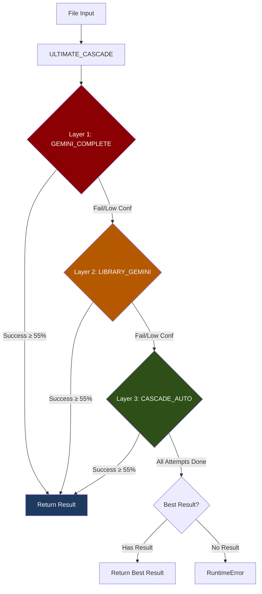

### Layer Details

| Layer | Approach | Description | Retry |
|-------|----------|-------------|-------|
| 1 | GEMINI_COMPLETE | 100% Gemini with 4-model fallback | 2 |
| 2 | LIBRARY_GEMINI | Libraries + Gemini for scans | 2 |
| 3 | CASCADE_AUTO | Local OCR cascade (existing) | 2 |

---

## Cascade Flow

### Complete Cascade Sequence

```mermaid
sequenceDiagram
    participant Client
    participant Ultimate as UltimateCascadeProcessor
    participant GC as GEMINI_COMPLETE
    participant LG as LIBRARY_GEMINI
    participant CA as CASCADE_AUTO

    Client->>Ultimate: process(file_path)
    Ultimate->>Ultimate: Start cascade log

    rect rgb(139, 0, 0)
        Note over Ultimate,GC: Layer 1: GEMINI_COMPLETE (2 attempts)
        loop Attempt 1-2
            Ultimate->>GC: process(file_path)
            alt Success (conf >= 0.55)
                GC-->>Ultimate: Result
                Ultimate-->>Client: Return with cascade_log
            else Fail/Timeout/Low Confidence
                Ultimate->>Ultimate: Log attempt, try again
            end
        end
    end

    rect rgb(179, 89, 0)
        Note over Ultimate,LG: Layer 2: LIBRARY_GEMINI (2 attempts)
        loop Attempt 1-2
            Ultimate->>LG: process(file_path)
            alt Success (conf >= 0.55)
                LG-->>Ultimate: Result
                Ultimate-->>Client: Return with cascade_log
            else Fail/Timeout/Low Confidence
                Ultimate->>Ultimate: Log attempt, try again
            end
        end
    end

    rect rgb(45, 80, 22)
        Note over Ultimate,CA: Layer 3: CASCADE_AUTO (2 attempts)
        loop Attempt 1-2
            Ultimate->>CA: process(file_path)
            alt Success (conf >= 0.55)
                CA-->>Ultimate: Result
                Ultimate-->>Client: Return with cascade_log
            else Fail/Timeout/Low Confidence
                Ultimate->>Ultimate: Log attempt, try again
            end
        end
    end

    Ultimate->>Ultimate: All layers tried
    alt Has any result
        Ultimate-->>Client: Return best result (below threshold)
    else No results
        Ultimate-->>Client: RuntimeError
    end
```

---

## Layer 1: GEMINI_COMPLETE

### What It Does

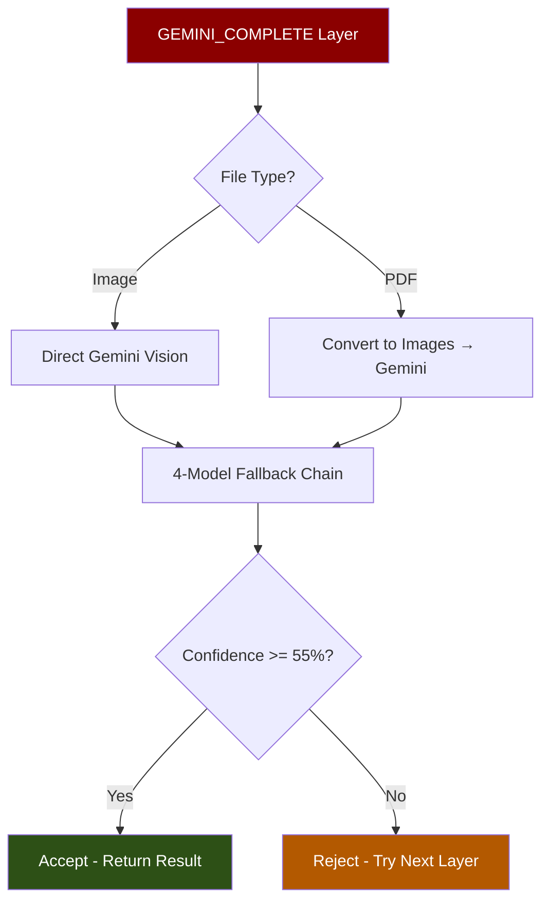

### When It Succeeds

- Complex documents with graphs/charts
- High-quality scans
- Non-standard layouts
- Mixed content (text + images)

---

## Layer 2: LIBRARY_GEMINI

### What It Does

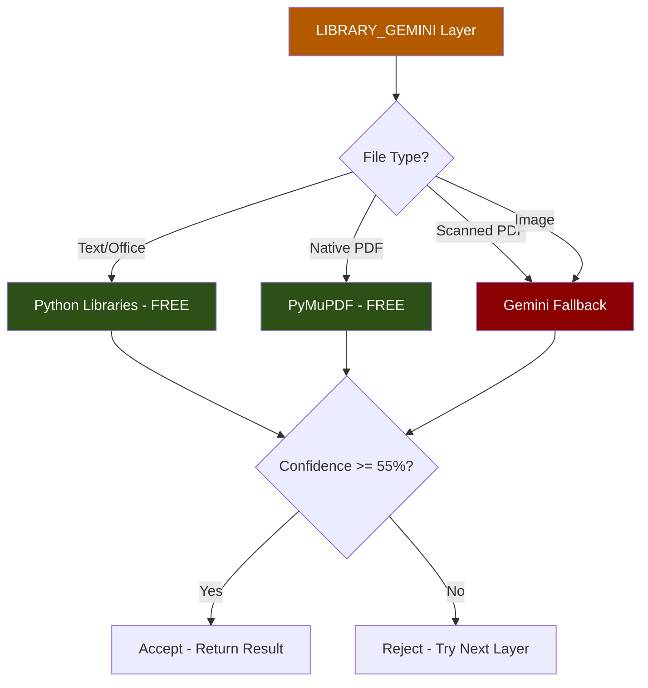

### When It Succeeds

- Text-based documents (.docx, .xlsx, .csv)
- Native PDFs with text layer
- Office documents

---

## Layer 3: CASCADE_AUTO

### What It Does

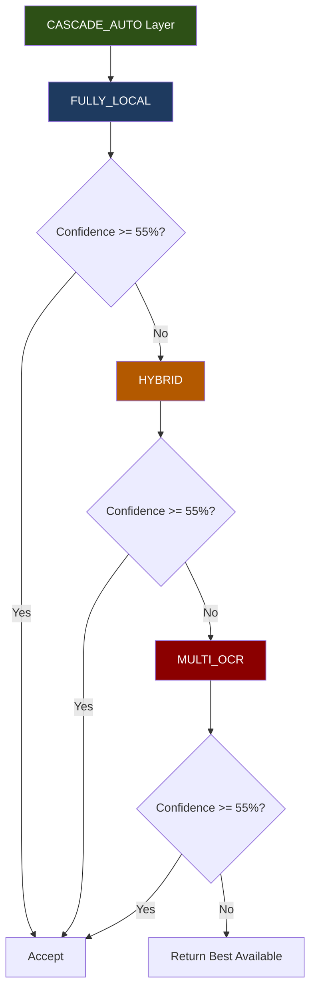

### Sub-Cascade (CASCADE_AUTO internals)

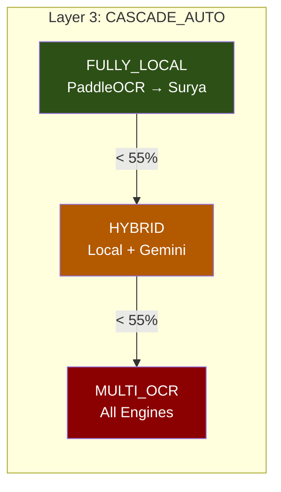

---

## Configuration

### UltimateCascadeConfig

```python
@dataclass
class UltimateCascadeConfig:
    # Confidence threshold to accept a result
    min_acceptable_confidence: float = 0.55

    # Retry settings per layer
    max_retries_per_layer: int = 2
    retry_delay_seconds: float = 1.0

    # Timeout per layer (seconds)
    layer_timeout: int = 300  # 5 minutes

    # Whether to continue after first success for better confidence
    try_all_for_best_result: bool = False
```

### Timing Diagram

```mermaid
gantt
    title ULTIMATE_CASCADE Execution Timeline (Worst Case)
    dateFormat X
    axisFormat %s

    section Layer 1
    GEMINI_COMPLETE Attempt 1    :0, 60
    GEMINI_COMPLETE Attempt 2    :60, 120

    section Layer 2
    LIBRARY_GEMINI Attempt 1     :120, 180
    LIBRARY_GEMINI Attempt 2     :180, 240

    section Layer 3
    CASCADE_AUTO Attempt 1       :240, 300
    CASCADE_AUTO Attempt 2       :300, 360
```

---

## Cascade Execution Log

### Log Structure

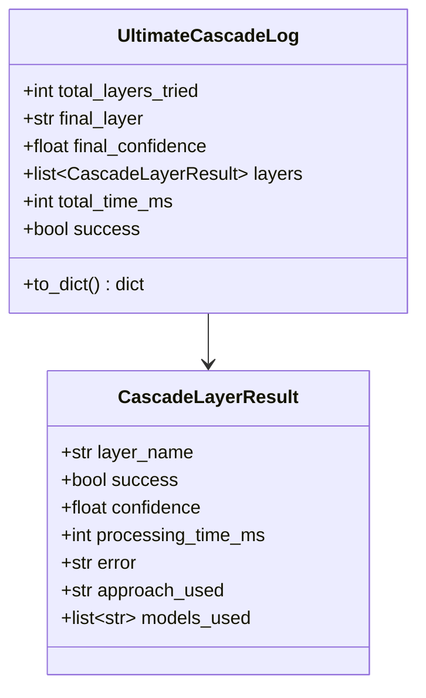

### Example Log Output

```json
{
  "cascade_execution": {
    "total_layers_tried": 2,
    "final_layer": "LIBRARY_GEMINI",
    "final_confidence": 0.89,
    "total_time_ms": 3450,
    "success": true,
    "layers": [
      {
        "layer": "GEMINI_COMPLETE",
        "success": false,
        "confidence": 0.0,
        "time_ms": 2100,
        "error": "Timeout after 60s",
        "approach": "gemini_complete",
        "models": []
      },
      {
        "layer": "LIBRARY_GEMINI",
        "success": true,
        "confidence": 0.89,
        "time_ms": 1350,
        "error": null,
        "approach": "library_gemini",
        "models": ["gemini-2.0-flash"]
      }
    ]
  }
}
```

---

## Decision Flow

### Layer Selection Logic

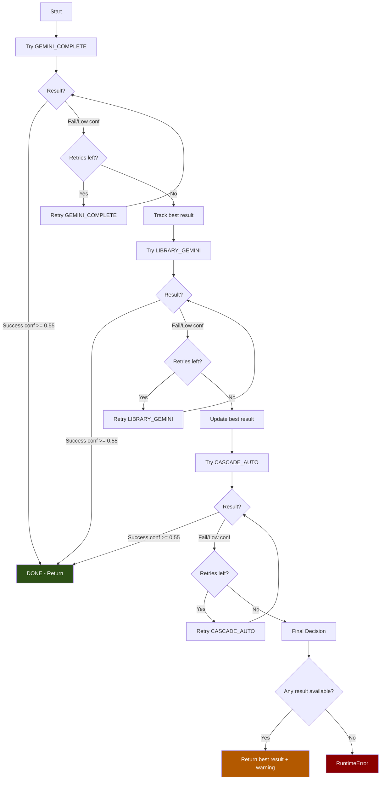

---

## Best Result Selection

### When All Layers Fail Threshold

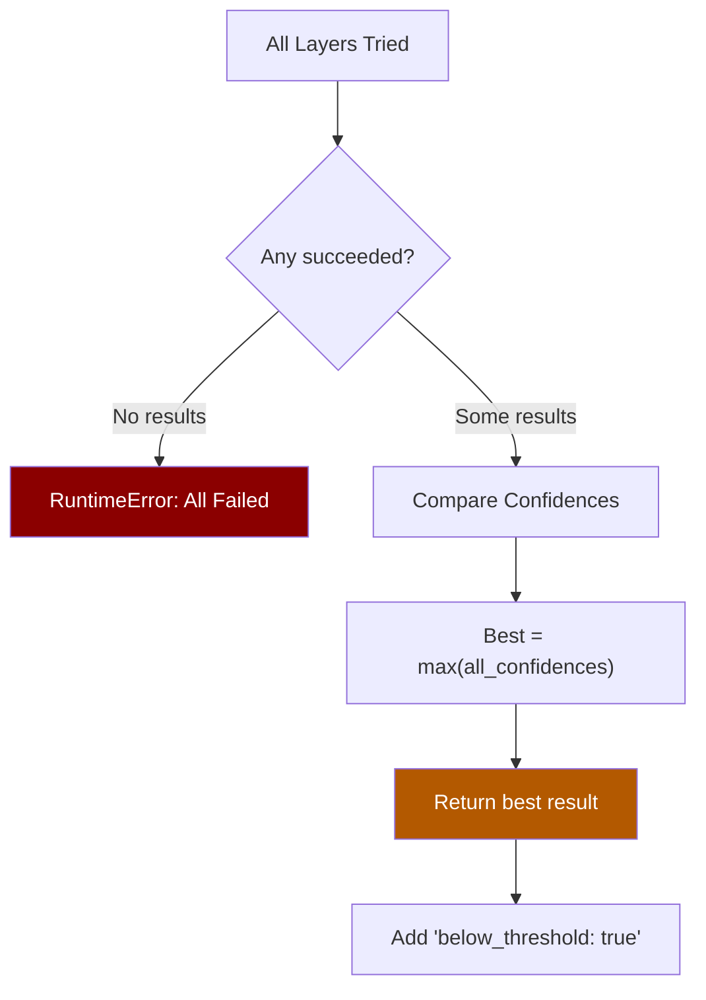

### Output with Below-Threshold Warning

```json
{
  "structured_data": {
    "ultimate_cascade": true,
    "approach": "ultimate_cascade",
    "below_threshold": true,
    "cascade_execution": {
      "final_layer": "CASCADE_AUTO",
      "final_confidence": 0.48,
      "success": true
    }
  }
}
```

---

## Error Handling

### Per-Layer Errors

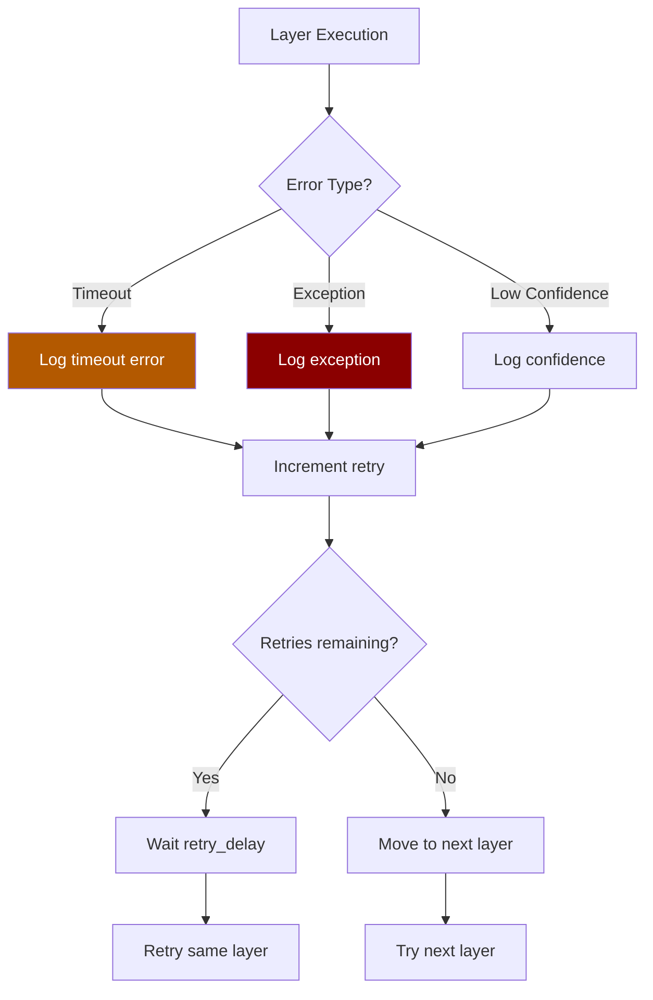

### Timeout Handling

```python
# Each layer has a 5-minute timeout
layer_timeout: int = 300  # seconds

async def _try_layer(self, layer_fn, file_path):
    try:
        result = await asyncio.wait_for(
            layer_fn(file_path),
            timeout=self.config.layer_timeout
        )
        return result
    except asyncio.TimeoutError:
        # Log and move to next layer
        pass
```

---

## When to Use ULTIMATE_CASCADE

### Best Use Cases

| Scenario | Why Use |
|----------|---------|
| Mission-critical documents | Maximum reliability |
| Unknown document quality | Handles any input |
| Compliance requirements | Multiple verification layers |
| High-value transactions | Worth the extra processing |
| Fallback-heavy workflows | Guaranteed result |

### When NOT to Use

| Scenario | Better Alternative |
|----------|-------------------|
| High volume, low value | LIBRARY_GEMINI |
| Simple text files | LIBRARY_GEMINI |
| Speed priority | GEMINI_COMPLETE |
| Cost priority | LIBRARY_GEMINI |

---

## Cost Analysis

### Best Case (Layer 1 Success)

| Layer | Triggered | Cost |
|-------|-----------|------|
| GEMINI_COMPLETE | Yes | ~$0.0001/page |
| LIBRARY_GEMINI | No | $0 |
| CASCADE_AUTO | No | $0 |

### Worst Case (All Layers)

| Layer | Triggered | Cost |
|-------|-----------|------|
| GEMINI_COMPLETE | Yes | ~$0.0001/page |
| LIBRARY_GEMINI | Yes | ~$0.0001/page |
| CASCADE_AUTO | Yes | $0 (local) |
| **Total** | | ~$0.0002/page |

### Monthly Projection

| Daily Volume | Avg Layers | Monthly Cost |
|--------------|------------|--------------|
| 100 docs | 1.5 | ~$0.45 |
| 500 docs | 1.5 | ~$2.25 |
| 1000 docs | 1.5 | ~$4.50 |

---

## Comparison with Other Approaches

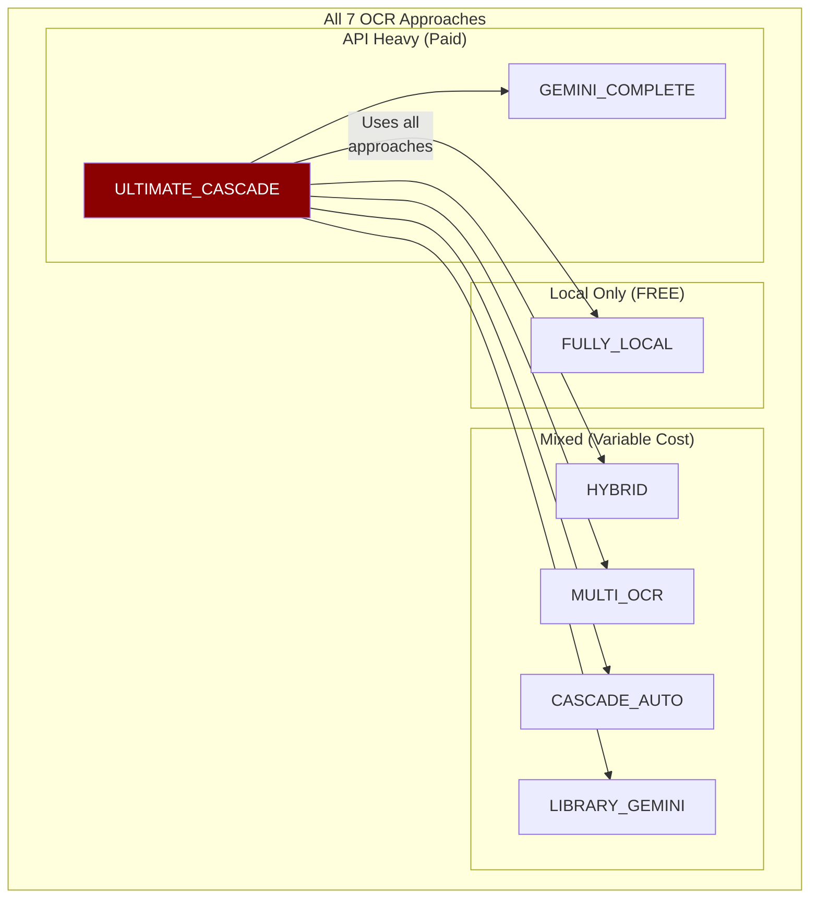

---

## File Location

**Implementation:** `app/services/file_processing/ocr/ultimate_cascade.py`

**Singleton Instance:** `ultimate_cascade`

```python
from app.services.file_processing.ocr import ultimate_cascade

# Process with maximum reliability
result = await ultimate_cascade.process(Path("critical_invoice.pdf"))

# Check layer availability
availability = ultimate_cascade.get_layer_availability()
# {'GEMINI_COMPLETE': True, 'LIBRARY_GEMINI': True, 'CASCADE_AUTO': True}

# Access cascade log
cascade_log = result.structured_data.get("cascade_execution")
print(f"Used {cascade_log['total_layers_tried']} layers")
print(f"Final layer: {cascade_log['final_layer']}")
```

---

## Complete State Machine

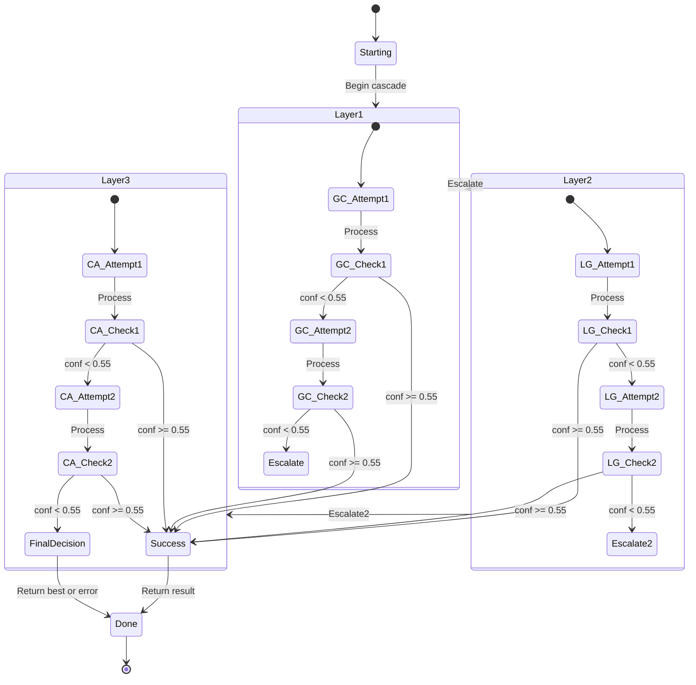
