# ERPSense — File Upload & OCR Implementation (PRODUCTION-GRADE)

## Table of Contents

1. [Current State (Implemented)](#1-current-state-implemented)
2. [Architecture Overview](#2-architecture-overview)
3. [OCR Approach: CASCADE_AUTO](#3-ocr-approach-cascade_auto)
4. [Bounding Box Support](#4-bounding-box-support)
5. [File-Type Handling Strategy](#5-file-type-handling-strategy)
6. [OCR Engine Details](#6-ocr-engine-details)
7. [Data Models & Output Structure](#7-data-models--output-structure)
8. [UML & Architecture Diagrams](#8-uml--architecture-diagrams)
9. [Sequence Diagrams](#9-sequence-diagrams)
10. [State Diagrams](#10-state-diagrams)
11. [Chat Integration Flow](#11-chat-integration-flow)
12. [API Design](#12-api-design)
13. [Cost Estimation](#13-cost-estimation)
14. [Python Libraries](#14-python-libraries)
15. [Production-Grade Fixes](#15-production-grade-fixes)
16. [Processing Limits](#16-processing-limits)
17. [Risks & Considerations](#17-risks--considerations)
18. [Sources](#18-sources)

---

## 1. Current State (Implemented)

### Backend Implementation Complete

| Component | Status | Location |
|-----------|--------|----------|
| File Processing Service | ✅ Implemented | `app/services/file_processing/` |
| OCR Router (CASCADE_AUTO) | ✅ Implemented | `app/services/file_processing/ocr/ocr_router.py` |
| PaddleOCR Integration | ✅ Implemented | `app/services/file_processing/ocr/paddle_ocr.py` |
| Surya OCR Integration | ✅ Implemented | `app/services/file_processing/ocr/surya_ocr.py` |
| Gemini Vision Integration | ✅ Implemented | `app/services/file_processing/ocr/gemini_vision.py` |
| Extraction Pipeline | ✅ Implemented | `app/services/file_processing/ocr/extraction_pipeline.py` |
| Document Structurer | ✅ Implemented | `app/services/file_processing/ocr/document_structurer.py` |
| Markdown Converter | ✅ Implemented | `app/services/file_processing/ocr/markdown_converter.py` |
| Bounding Box Support | ✅ Implemented | All OCR engines + handlers |
| Multi-page PDF Support | ✅ Implemented | Per-page layouts with bounding boxes |
| **Production Utilities** | ✅ Implemented | `app/services/file_processing/ocr/production_utils.py` |
| **Thread-Safe Singletons** | ✅ Implemented | All OCR engines |
| **Timeout Handling** | ✅ Implemented | OCR Router |
| **Rate Limiting** | ✅ Implemented | Gemini Vision |

### File Handlers Implemented

| Handler | File Types | Method | Bounding Boxes |
|---------|------------|--------|----------------|
| `text_handler.py` | `.txt`, `.md`, `.tex` | Direct read | N/A |
| `text_handler.py` (CSV) | `.csv` | CSV parser | N/A |
| `docx_handler.py` | `.docx` | python-docx | N/A |
| `excel_handler.py` | `.xlsx`, `.xls` | pandas/openpyxl | N/A |
| `pdf_handler.py` | `.pdf` | PyMuPDF + OCR | Yes |
| `image_handler.py` | Images | OCR engines | Yes |

---

## 2. Architecture Overview

### High-Level Flow

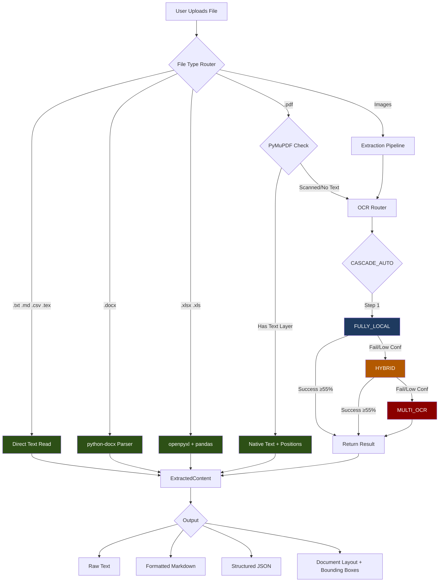
```mermaid
flowchart TD
    A[User Uploads File] --> B{File Type Router}

    B -->|.txt .md .csv .tex| C[Direct Text Read]
    B -->|.docx| D[python-docx Parser]
    B -->|.xlsx .xls| E[openpyxl + pandas]
    B -->|.pdf| F{PyMuPDF Check}
    B -->|Images| G[Extraction Pipeline]

    F -->|Has Text Layer| H[Native Text + Positions]
    F -->|Scanned/No Text| I[OCR Router]

    G --> I

    I --> J{CASCADE_AUTO}

    J -->|Step 1| K[FULLY_LOCAL]
    K -->|Success ≥55%| L[Return Result]
    K -->|Fail/Low Conf| M[HYBRID]

    M -->|Success ≥55%| L
    M -->|Fail/Low Conf| N[MULTI_OCR]

    N --> L

    C --> O[ExtractedContent]
    D --> O
    E --> O
    H --> O
    L --> O

    O --> P{Output}
    P --> Q[Raw Text]
    P --> R[Formatted Markdown]
    P --> S[Structured JSON]
    P --> T[Document Layout + Bounding Boxes]

    style C fill:#2D5016,color:#fff
    style D fill:#2D5016,color:#fff
    style E fill:#2D5016,color:#fff
    style H fill:#2D5016,color:#fff
    style K fill:#1E3A5F,color:#fff
    style M fill:#B35900,color:#fff
    style N fill:#8B0000,color:#fff
```

**Legend:**
- Dark Green = Free (local parsers, instant)
- Dark Blue = Free (local OCR - PaddleOCR/Surya)
- Dark Orange = Hybrid (local + Gemini fallback)
- Dark Red = Multi-OCR (all engines + verification)

### Module Structure

```
app/services/file_processing/
├── __init__.py
├── models.py                    # Pydantic models (BoundingBox, TextElement, etc.)
├── router.py                    # File type routing
├── handlers/
│   ├── __init__.py
│   ├── base_handler.py          # Base class for all handlers
│   ├── text_handler.py          # .txt, .md, .csv, .tex
│   ├── docx_handler.py          # .docx
│   ├── excel_handler.py         # .xlsx, .xls
│   ├── pdf_handler.py           # .pdf (native + scanned)
│   └── image_handler.py         # Images → Extraction Pipeline
├── ocr/
│   ├── __init__.py
│   ├── ocr_router.py            # CASCADE_AUTO routing + TIMEOUT handling
│   ├── paddle_ocr.py            # PaddleOCR + PP-Structure (thread-safe)
│   ├── surya_ocr.py             # Surya OCR (thread-safe)
│   ├── gemini_vision.py         # Gemini Vision API (rate-limited)
│   ├── extraction_pipeline.py   # OCR → Structuring → Formatting
│   ├── document_structurer.py   # JSON structure extraction
│   ├── markdown_converter.py    # Formatted markdown output
│   ├── table_detector.py        # Table detection
│   ├── chart_extractor.py       # Chart/graph extraction
│   ├── language_detector.py     # Language detection
│   ├── post_processor.py        # Text post-processing
│   └── production_utils.py      # ⭐ NEW: Production utilities
└── classifiers/
    ├── image_classifier.py      # Image type classification
    └── erp_classifier.py        # ERP document classification
```

---

## 3. OCR Approach: CASCADE_AUTO

### The Default Approach

CASCADE_AUTO is the recommended and default OCR approach. It provides maximum reliability through intelligent cascading:

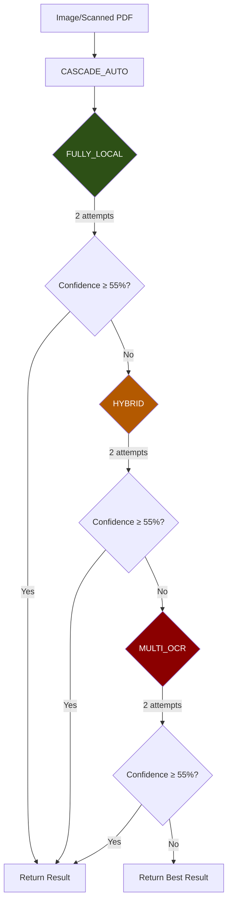
```mermaid
flowchart TD
    A[Image/Scanned PDF] --> B[CASCADE_AUTO]

    B --> C{FULLY_LOCAL}
    C -->|2 attempts| D{Confidence ≥ 55%?}

    D -->|Yes| E[Return Result]
    D -->|No| F{HYBRID}

    F -->|2 attempts| G{Confidence ≥ 55%?}
    G -->|Yes| E
    G -->|No| H{MULTI_OCR}

    H -->|2 attempts| I{Confidence ≥ 55%?}
    I -->|Yes| E
    I -->|No| J[Return Best Result]

    style C fill:#2D5016,color:#fff
    style F fill:#B35900,color:#fff
    style H fill:#8B0000,color:#fff
```

### Cascade Execution Details

| Approach | Engines Used | API Cost | When Used |
|----------|-------------|----------|-----------|
| **FULLY_LOCAL** | PaddleOCR → Surya (no Gemini) | $0 | First attempt (90% success) |
| **HYBRID** | Graphs: Gemini → Paddle → Surya; Other: Paddle → Surya → Gemini | ~$0.01/graph | When local fails |
| **MULTI_OCR** | Best engine per content + Gemini verification | ~$0.001/page | Complex documents |

### Configuration (Production-Grade)

```python
# In ocr_router.py
@dataclass
class OCRConfig:
    """Production-grade defaults optimized for reliability and accuracy."""

    # Confidence thresholds
    HIGH_CONFIDENCE: float = 0.90
    MEDIUM_CONFIDENCE: float = 0.75
    LOW_CONFIDENCE: float = 0.60
    REJECT_THRESHOLD: float = 0.40
    MIN_USABLE_CONFIDENCE: float = 0.25

    # Retry settings for individual OCR engines
    MAX_RETRIES: int = 2                       # 3 total attempts per engine
    RETRY_DELAY_MS: int = 500                  # 500ms between retries
    TIMEOUT_SECONDS: int = 120                 # ⭐ 2 minutes timeout per operation (ENFORCED)

    # Verification
    VERIFY_LOW_CONFIDENCE: bool = True
    VERIFICATION_THRESHOLD: float = 0.75

    # Processing limits - NO ARTIFICIAL LIMITS
    MAX_IMAGE_SIZE: int = 8192                 # ⭐ 8K resolution support
    MAX_FILE_SIZE_MB: int = 500                # 500MB max
    MAX_PDF_PAGES: int = 0                     # 0 = No limit, process ALL pages

    # CASCADE_AUTO specific settings
    CASCADE_APPROACH_RETRIES: int = 2          # 2 retries per approach
    CASCADE_MIN_ACCEPTABLE_CONFIDENCE: float = 0.55
    CASCADE_RETRY_DELAY_MS: int = 1000         # 1 second between cascade retries

    # Rate limit settings for Gemini API
    RATE_LIMIT_INITIAL_DELAY: float = 2.0      # ⭐ 2 seconds initial (exponential backoff)
    RATE_LIMIT_MAX_DELAY: float = 60.0         # 1 minute max
    RATE_LIMIT_MULTIPLIER: float = 2.0         # Double each retry
    RATE_LIMIT_MAX_RETRIES: int = 5            # Up to 5 rate limit retries
```

### Cascade Execution Log

Every extraction includes detailed cascade execution info:

```json
{
  "cascade_execution": {
    "total_attempts": 3,
    "final_approach": "FULLY_LOCAL",
    "final_confidence": 0.92,
    "total_time_ms": 2340,
    "success": true,
    "attempts": [
      {
        "approach": "FULLY_LOCAL",
        "attempt": 1,
        "success": true,
        "confidence": 0.92,
        "time_ms": 2340,
        "reason": "Accepted: confidence 0.92 >= threshold 0.55"
      }
    ]
  }
}
```

---

## 4. Bounding Box Support

### Overview

All OCR engines now return bounding box coordinates for every text element:

| Engine | Bounding Box Source | Accuracy |
|--------|-------------------|----------|
| **PaddleOCR** | Native (PP-Structure) | High |
| **Surya OCR** | Native (Detection Model) | High |
| **Gemini Vision** | Estimated (line-based) | Approximate |
| **PyMuPDF (Native PDF)** | Native (Text Spans) | Exact |

### Bounding Box Format

All bounding boxes use a 4-point polygon format (clockwise from top-left):

```python
class BoundingBox(BaseModel):
    # Top-left corner
    x1: float
    y1: float
    # Top-right corner
    x2: float
    y2: float
    # Bottom-right corner
    x3: float
    y3: float
    # Bottom-left corner
    x4: float
    y4: float

    @property
    def width(self) -> float
    @property
    def height(self) -> float
    @property
    def center(self) -> tuple[float, float]

    def to_rect(self) -> dict  # {x, y, width, height}
    def to_points(self) -> list  # [[x1,y1], [x2,y2], [x3,y3], [x4,y4]]
```

### Document Layout Structure

```python
class DocumentLayout(BaseModel):
    width: int                          # Image/page width
    height: int                         # Image/page height
    elements: list[TextElement]         # All text elements with bboxes
    regions: list[OCRRegion]            # Grouped regions by type
    full_text: str                      # Combined text
    total_elements: int
    total_characters: int
    total_words: int
    total_lines: int
    average_confidence: float
    languages: list[str]                # Detected languages
```

### Text Element Structure

```python
class TextElement(BaseModel):
    text: str                           # The actual text
    bbox: BoundingBox                   # Position coordinates
    confidence: float                   # 0.0 to 1.0
    element_type: ElementType           # text, title, amount, date, etc.
    order: int                          # Reading order
    line_number: int                    # Line number (1-based)
    is_numeric: bool                    # Contains numbers
    is_currency: bool                   # Contains currency
    language: str | None                # Detected language
```

### Element Types

```python
class ElementType(StrEnum):
    TEXT = "text"           # Regular text line
    TITLE = "title"         # Title/heading
    TABLE = "table"         # Table region
    FIGURE = "figure"       # Image/figure
    LIST = "list"           # List item
    HEADER = "header"       # Page header
    FOOTER = "footer"       # Page footer
    REFERENCE = "reference" # Invoice/order number
    DATE = "date"           # Date field
    AMOUNT = "amount"       # Monetary amount
    NUMBER = "number"       # Generic number
    KEY_VALUE = "key_value" # Key: Value pair
    SIGNATURE = "signature" # Signature area
    STAMP = "stamp"         # Stamp/seal
    BARCODE = "barcode"     # Barcode/QR
    LOGO = "logo"           # Company logo
```

### Output Example

```json
{
  "document_layout": {
    "width": 1200,
    "height": 1600,
    "total_elements": 45,
    "total_characters": 2340,
    "total_words": 456,
    "total_lines": 45,
    "average_confidence": 0.9234,
    "languages_detected": ["en"],
    "elements": [
      {
        "text": "INVOICE #INV-2024-001",
        "bbox": {
          "points": [[100, 50], [400, 50], [400, 80], [100, 80]],
          "rect": {"x": 100, "y": 50, "width": 300, "height": 30},
          "center": [250, 65]
        },
        "confidence": 0.98,
        "element_type": "reference",
        "order": 0,
        "line_number": 1,
        "is_numeric": false,
        "is_currency": false,
        "language": "en"
      },
      {
        "text": "₹15,000.00",
        "bbox": {
          "points": [[800, 500], [950, 500], [950, 530], [800, 530]],
          "rect": {"x": 800, "y": 500, "width": 150, "height": 30},
          "center": [875, 515]
        },
        "confidence": 0.95,
        "element_type": "amount",
        "order": 15,
        "line_number": 16,
        "is_numeric": true,
        "is_currency": true,
        "language": "en"
      }
    ],
    "regions": [
      {
        "region_type": "title",
        "bbox": {
          "points": [[100, 50], [400, 50], [400, 80], [100, 80]],
          "rect": {"x": 100, "y": 50, "width": 300, "height": 30}
        },
        "text": "INVOICE #INV-2024-001",
        "confidence": 0.98,
        "element_count": 1,
        "order": 0
      }
    ]
  }
}
```

### Multi-Page PDF Support

For multi-page documents, bounding boxes are organized per-page:

```json
{
  "document_layouts_by_page": {
    "total_pages": 5,
    "pages_processed": 5,
    "average_confidence": 0.91,
    "languages_detected": ["en", "hi"],
    "source": "ocr_router",
    "pages": [
      {
        "page_number": 1,
        "layout": {
          "width": 612,
          "height": 792,
          "total_elements": 23,
          "elements": [...]
        },
        "confidence": 0.93,
        "text_length": 1245
      },
      {
        "page_number": 2,
        "layout": {...},
        "confidence": 0.89,
        "text_length": 1890
      }
    ]
  }
}
```

---

## 5. File-Type Handling Strategy

### Processing Matrix

| File Type | Handler | Method | OCR | Bounding Boxes | Speed |
|-----------|---------|--------|-----|----------------|-------|
| `.txt`, `.md` | TextHandler | Direct read | No | N/A | ~5ms |
| `.csv` | CSVHandler | csv module | No | N/A | ~10ms |
| `.tex` | TextHandler | Direct read | No | N/A | ~5ms |
| `.docx` | DocxHandler | python-docx | No | N/A | ~50ms |
| `.xlsx`, `.xls` | ExcelHandler | pandas | No | N/A | ~100ms |
| `.pdf` (native) | PDFHandler | PyMuPDF | No | Yes | ~100ms |
| `.pdf` (scanned) | PDFHandler | OCR Router | Yes | Yes | ~2-5s/page |
| Images | ImageHandler | Extraction Pipeline | Yes | Yes | ~1-3s |

### PDF Processing Flow

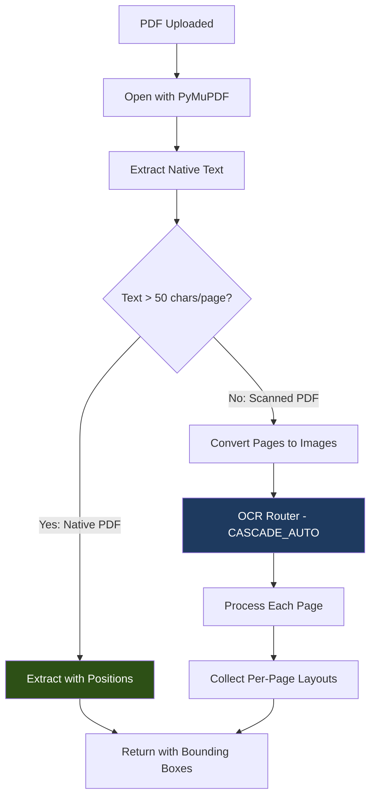
```mermaid
flowchart TD
    A[PDF Uploaded] --> B[Open with PyMuPDF]
    B --> C[Extract Native Text]

    C --> D{Text > 50 chars/page?}

    D -->|Yes: Native PDF| E[Extract with Positions]
    E --> F[Return with Bounding Boxes]

    D -->|No: Scanned PDF| G[Convert Pages to Images]
    G --> H[OCR Router - CASCADE_AUTO]
    H --> I[Process Each Page]
    I --> J[Collect Per-Page Layouts]
    J --> F

    style E fill:#2D5016,color:#fff
    style H fill:#1E3A5F,color:#fff
```

### Image Processing Flow

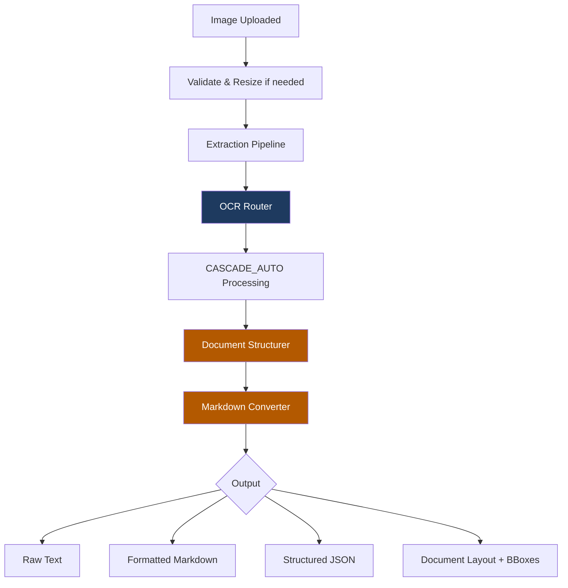
```mermaid
flowchart TD
    A[Image Uploaded] --> B[Validate & Resize if needed]
    B --> C[Extraction Pipeline]

    C --> D[OCR Router]
    D --> E[CASCADE_AUTO Processing]

    E --> F[Document Structurer]
    F --> G[Markdown Converter]

    G --> H{Output}
    H --> I[Raw Text]
    H --> J[Formatted Markdown]
    H --> K[Structured JSON]
    H --> L[Document Layout + BBoxes]

    style D fill:#1E3A5F,color:#fff
    style F fill:#B35900,color:#fff
    style G fill:#B35900,color:#fff
```

---

## 6. OCR Engine Details

### PaddleOCR (Primary for Tables)

**File:** `app/services/file_processing/ocr/paddle_ocr.py` (1,261 lines)

**Configuration:**
- USE_ANGLE_CLS: True (handle rotated text)
- USE_GPU: False (CPU for compatibility)
- ENABLE_MKLDNN: False (avoid OneDNN errors)
- MAX_RETRIES: 2
- ⭐ **Thread-safe singleton with double-checked locking**

**Production Fixes Applied:**
- ✅ Thread-safe singleton initialization with `threading.Lock()`
- ✅ Image validation before processing
- ✅ PIL Image cleanup after numpy conversion
- ✅ `_loading` flag to prevent re-entrant loading

**Features:**
- PP-Structure for layout analysis and table detection
- Native 4-point bounding box coordinates
- Multi-language support (20+ languages including Indian languages)
- Lazy model loading (singleton pattern)
- Image preprocessing with enhancement
- Automatic size adjustment (upscale/downscale)

**Output includes:**
- Text with confidence scores
- Table extraction (headers + rows) from HTML parsing
- Document layout with grouped regions
- Element type classification (AMOUNT, DATE, REFERENCE, etc.)

### Surya OCR (Primary for Documents)

**File:** `app/services/file_processing/ocr/surya_ocr.py` (577 lines)

**Model Architecture:**
- Detection Model: Detects text regions
- Recognition Model: Recognizes text content

**Production Fixes Applied:**
- ✅ Thread-safe singleton initialization with `threading.Lock()`
- ✅ Error state tracking (`_load_error`)
- ✅ `is_available()` method to check engine status
- ✅ `reset()` method to clear error state and retry

**Features:**
- State-of-the-art accuracy (v0.6.x)
- Excellent layout detection
- Native bounding boxes (converted from [x1,y1,x2,y2] to 4-point)
- Multi-language support (50+ languages)
- Good for handwritten text
- Region-based grouping by type and proximity

**Output includes:**
- Text lines with per-element confidence
- Polygon-based bounding boxes
- Language detection from Unicode script
- Element type classification

### Gemini Vision (Graphs & Fallback)

**File:** `app/services/file_processing/ocr/gemini_vision.py` (506 lines)

**Model:** `gemini-2.0-flash` (fast model for cost efficiency)

**Production Fixes Applied:**
- ✅ Thread-safe singleton initialization
- ✅ Exponential backoff rate limiter with jitter
- ✅ `_call_with_retry()` method for API calls
- ✅ Configurable rate limit parameters

**Features:**
- Visual understanding (interprets graphs/charts)
- High accuracy on complex layouts
- Estimated bounding boxes (line-based, marked as "estimated")
- API-based (requires GOOGLE_API_KEY)
- OCR result verification capability
- Image type-aware prompting

**Output includes:**
- Interpreted text content
- Chart/graph analysis with data extraction
- Estimated document layout
- Token usage tracking for cost monitoring

### Document Structurer (LOCAL - No AI)

**File:** `app/services/file_processing/ocr/document_structurer.py` (1,900 lines)

- Rule-based structuring (100% local, no API calls)
- Supports 20+ document types
- Extracts fields, line items, taxes
- Specialized extraction per document type

### Markdown Converter (LOCAL - No AI)

**File:** `app/services/file_processing/ocr/markdown_converter.py` (2,137 lines)

- Template-based formatting (100% local, no API calls)
- Document type-aware formatting
- Invoice/bill formatting with sections
- Table preservation

### Engine Selection Logic

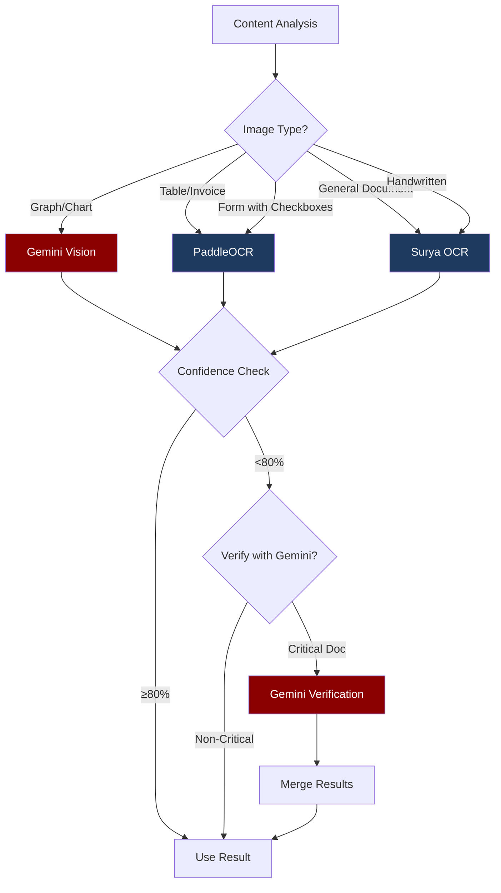
```mermaid
flowchart TD
    A[Content Analysis] --> B{Image Type?}

    B -->|Graph/Chart| C[Gemini Vision]
    B -->|Table/Invoice| D[PaddleOCR]
    B -->|General Document| E[Surya OCR]
    B -->|Form with Checkboxes| D
    B -->|Handwritten| E

    C --> F{Confidence Check}
    D --> F
    E --> F

    F -->|≥80%| G[Use Result]
    F -->|<80%| H{Verify with Gemini?}

    H -->|Critical Doc| I[Gemini Verification]
    H -->|Non-Critical| G

    I --> J[Merge Results]
    J --> G

    style C fill:#8B0000,color:#fff
    style D fill:#1E3A5F,color:#fff
    style E fill:#1E3A5F,color:#fff
    style I fill:#8B0000,color:#fff
```

---

## 7. Data Models & Output Structure

### Core Models (models.py)

```python
# Extraction Method
class ExtractionMethod(StrEnum):
    DIRECT_READ = "direct_read"
    PYTHON_DOCX = "python_docx"
    OPENPYXL = "openpyxl"
    PYMUPDF = "pymupdf"
    SURYA_OCR = "surya_ocr"
    PADDLE_OCR = "paddle_ocr"
    GEMINI_VISION = "gemini_vision"
    MULTI_OCR = "multi_ocr"

# OCR Approach
class OCRApproach(StrEnum):
    FULLY_LOCAL = "fully_local"    # PaddleOCR → Surya, NO API
    HYBRID = "hybrid"              # Local first, Gemini for graphs
    MULTI_OCR = "multi_ocr"        # Best engine per content
    CASCADE_AUTO = "cascade_auto"  # Auto cascade through all

# Image Type Classification
class ImageType(StrEnum):
    DOCUMENT = "document"
    TABLE = "table"
    INVOICE = "invoice"
    FORM = "form"
    GRAPH = "graph"
    CHART = "chart"
    PHOTO = "photo"
    UNKNOWN = "unknown"
```

### Extracted Content

```python
class ExtractedContent(BaseModel):
    text: str                               # Raw extracted text
    structured_data: dict | None            # Tables, layouts, metadata
    tables: list[TableData] | None          # Extracted tables
    markdown: str                           # Basic markdown
    metadata: ExtractionMetadata            # Processing info

    # Enhanced outputs (from extraction_pipeline)
    formatted_markdown: str | None          # Nicely formatted
    structured_json: dict | None            # Structured for API
    document_type: str | None               # invoice, receipt, etc.
    document_subtype: str | None            # Specific type
```

### Extraction Metadata

```python
class ExtractionMetadata(BaseModel):
    file_type: str
    file_size: int
    pages: int | None
    extraction_method: ExtractionMethod
    confidence: float                       # 0.0 - 1.0
    processing_time_ms: int
    tokens_used: int                        # 0 for local, >0 for Gemini
    image_type: ImageType | None
    ocr_engines_used: list[str]
    languages_requested: list[str]
    languages_detected: list[str]
```

### Formatted Extraction (Pipeline Output)

```python
@dataclass
class FormattedExtraction:
    # Raw extraction
    raw_text: str
    tables: list[TableData] | None

    # Formatted outputs
    formatted_markdown: str
    structured_json: dict[str, Any]

    # Document layout with bounding boxes
    document_layout: dict[str, Any] | None

    # Metadata
    metadata: ExtractionMetadata | None
    document_type: str
    document_subtype: str
    confidence: float

    # Processing info
    ocr_time_ms: int
    formatting_time_ms: int
    total_time_ms: int

    # Cascade execution details
    cascade_info: dict[str, Any] | None
```

---

## 8. UML & Architecture Diagrams

### Class Diagram - Core Models

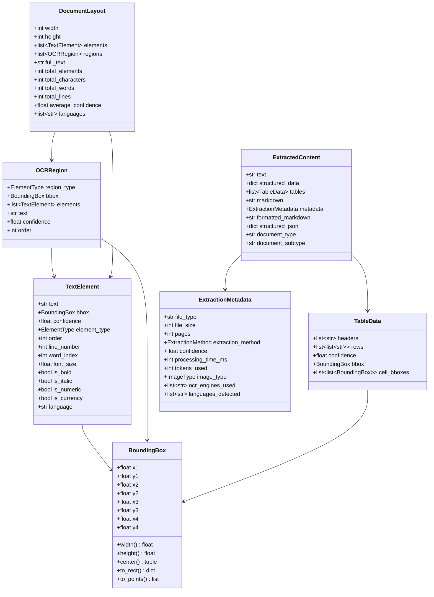
```mermaid
classDiagram
    class BoundingBox {
        +float x1
        +float y1
        +float x2
        +float y2
        +float x3
        +float y3
        +float x4
        +float y4
        +width() float
        +height() float
        +center() tuple
        +to_rect() dict
        +to_points() list
    }

    class TextElement {
        +str text
        +BoundingBox bbox
        +float confidence
        +ElementType element_type
        +int order
        +int line_number
        +int word_index
        +float font_size
        +bool is_bold
        +bool is_italic
        +bool is_numeric
        +bool is_currency
        +str language
    }

    class OCRRegion {
        +ElementType region_type
        +BoundingBox bbox
        +list~TextElement~ elements
        +str text
        +float confidence
        +int order
    }

    class DocumentLayout {
        +int width
        +int height
        +list~TextElement~ elements
        +list~OCRRegion~ regions
        +str full_text
        +int total_elements
        +int total_characters
        +int total_words
        +int total_lines
        +float average_confidence
        +list~str~ languages
    }

    class TableData {
        +list~str~ headers
        +list~list~str~~ rows
        +float confidence
        +BoundingBox bbox
        +list~list~BoundingBox~~ cell_bboxes
    }

    class ExtractedContent {
        +str text
        +dict structured_data
        +list~TableData~ tables
        +str markdown
        +ExtractionMetadata metadata
        +str formatted_markdown
        +dict structured_json
        +str document_type
        +str document_subtype
    }

    class ExtractionMetadata {
        +str file_type
        +int file_size
        +int pages
        +ExtractionMethod extraction_method
        +float confidence
        +int processing_time_ms
        +int tokens_used
        +ImageType image_type
        +list~str~ ocr_engines_used
        +list~str~ languages_detected
    }

    TextElement --> BoundingBox
    OCRRegion --> BoundingBox
    OCRRegion --> TextElement
    DocumentLayout --> TextElement
    DocumentLayout --> OCRRegion
    TableData --> BoundingBox
    ExtractedContent --> TableData
    ExtractedContent --> ExtractionMetadata
```

### Class Diagram - OCR Engines (with Production Fixes)

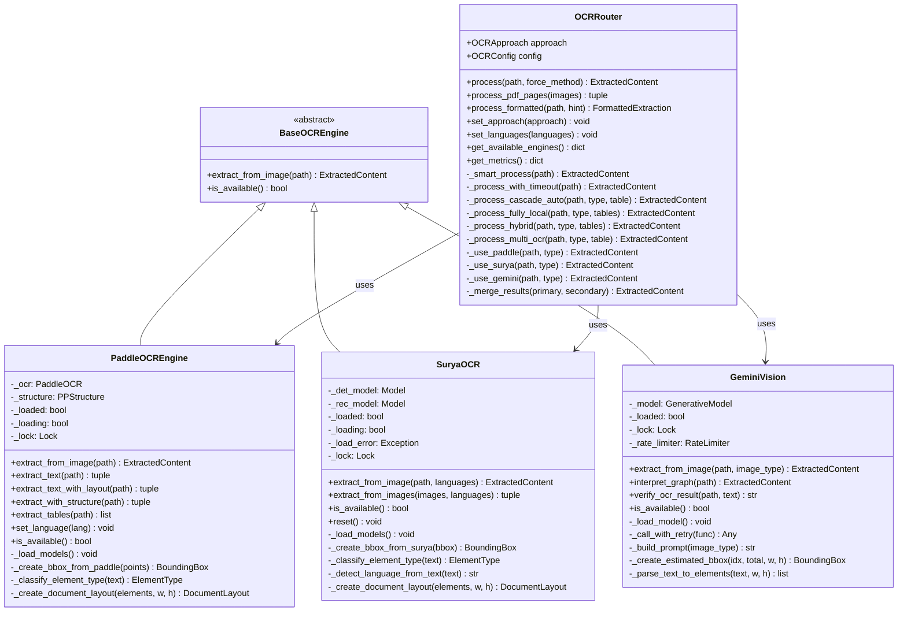
```mermaid
classDiagram
    class BaseOCREngine {
        <<abstract>>
        +extract_from_image(path) ExtractedContent
        +is_available() bool
    }

    class PaddleOCREngine {
        -_ocr: PaddleOCR
        -_structure: PPStructure
        -_loaded: bool
        -_loading: bool
        -_lock: Lock
        +extract_from_image(path) ExtractedContent
        +extract_text(path) tuple
        +extract_text_with_layout(path) tuple
        +extract_with_structure(path) tuple
        +extract_tables(path) list
        +set_language(lang) void
        +is_available() bool
        -_load_models() void
        -_create_bbox_from_paddle(points) BoundingBox
        -_classify_element_type(text) ElementType
        -_create_document_layout(elements, w, h) DocumentLayout
    }

    class SuryaOCR {
        -_det_model: Model
        -_rec_model: Model
        -_loaded: bool
        -_loading: bool
        -_load_error: Exception
        -_lock: Lock
        +extract_from_image(path, languages) ExtractedContent
        +extract_from_images(images, languages) tuple
        +is_available() bool
        +reset() void
        -_load_models() void
        -_create_bbox_from_surya(bbox) BoundingBox
        -_classify_element_type(text) ElementType
        -_detect_language_from_text(text) str
        -_create_document_layout(elements, w, h) DocumentLayout
    }

    class GeminiVision {
        -_model: GenerativeModel
        -_loaded: bool
        -_lock: Lock
        -_rate_limiter: RateLimiter
        +extract_from_image(path, image_type) ExtractedContent
        +interpret_graph(path) ExtractedContent
        +verify_ocr_result(path, text) str
        +is_available() bool
        -_load_model() void
        -_call_with_retry(func) Any
        -_build_prompt(image_type) str
        -_create_estimated_bbox(idx, total, w, h) BoundingBox
        -_parse_text_to_elements(text, w, h) list
    }

    class OCRRouter {
        +OCRApproach approach
        +OCRConfig config
        +process(path, force_method) ExtractedContent
        +process_pdf_pages(images) tuple
        +process_formatted(path, hint) FormattedExtraction
        +set_approach(approach) void
        +set_languages(languages) void
        +get_available_engines() dict
        +get_metrics() dict
        -_smart_process(path) ExtractedContent
        -_process_with_timeout(path) ExtractedContent
        -_process_cascade_auto(path, type, table) ExtractedContent
        -_process_fully_local(path, type, tables) ExtractedContent
        -_process_hybrid(path, type, tables) ExtractedContent
        -_process_multi_ocr(path, type, table) ExtractedContent
        -_use_paddle(path, type) ExtractedContent
        -_use_surya(path, type) ExtractedContent
        -_use_gemini(path, type) ExtractedContent
        -_merge_results(primary, secondary) ExtractedContent
    }

    BaseOCREngine <|-- PaddleOCREngine
    BaseOCREngine <|-- SuryaOCR
    BaseOCREngine <|-- GeminiVision
    OCRRouter --> PaddleOCREngine : uses
    OCRRouter --> SuryaOCR : uses
    OCRRouter --> GeminiVision : uses
```

### Class Diagram - File Handlers

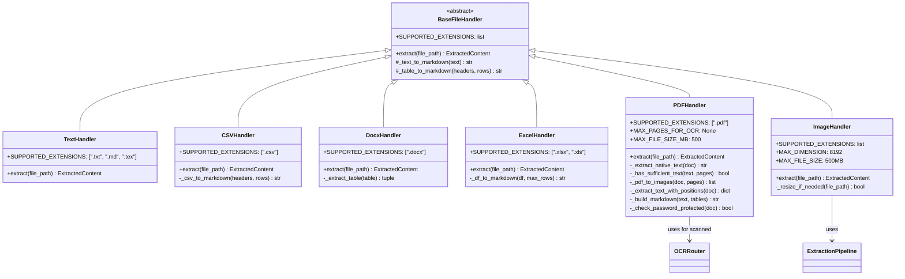
```mermaid
classDiagram
    class BaseFileHandler {
        <<abstract>>
        +SUPPORTED_EXTENSIONS: list
        +extract(file_path) ExtractedContent
        #_text_to_markdown(text) str
        #_table_to_markdown(headers, rows) str
    }

    class TextHandler {
        +SUPPORTED_EXTENSIONS: [".txt", ".md", ".tex"]
        +extract(file_path) ExtractedContent
    }

    class CSVHandler {
        +SUPPORTED_EXTENSIONS: [".csv"]
        +extract(file_path) ExtractedContent
        -_csv_to_markdown(headers, rows) str
    }

    class DocxHandler {
        +SUPPORTED_EXTENSIONS: [".docx"]
        +extract(file_path) ExtractedContent
        -_extract_table(table) tuple
    }

    class ExcelHandler {
        +SUPPORTED_EXTENSIONS: [".xlsx", ".xls"]
        +extract(file_path) ExtractedContent
        -_df_to_markdown(df, max_rows) str
    }

    class PDFHandler {
        +SUPPORTED_EXTENSIONS: [".pdf"]
        +MAX_PAGES_FOR_OCR: None
        +MAX_FILE_SIZE_MB: 500
        +extract(file_path) ExtractedContent
        -_extract_native_text(doc) str
        -_has_sufficient_text(text, pages) bool
        -_pdf_to_images(doc, pages) list
        -_extract_text_with_positions(doc) dict
        -_build_markdown(text, tables) str
        -_check_password_protected(doc) bool
    }

    class ImageHandler {
        +SUPPORTED_EXTENSIONS: list
        +MAX_DIMENSION: 8192
        +MAX_FILE_SIZE: 500MB
        +extract(file_path) ExtractedContent
        -_resize_if_needed(file_path) bool
    }

    BaseFileHandler <|-- TextHandler
    BaseFileHandler <|-- CSVHandler
    BaseFileHandler <|-- DocxHandler
    BaseFileHandler <|-- ExcelHandler
    BaseFileHandler <|-- PDFHandler
    BaseFileHandler <|-- ImageHandler
    PDFHandler --> OCRRouter : uses for scanned
    ImageHandler --> ExtractionPipeline : uses
```

### Component Diagram

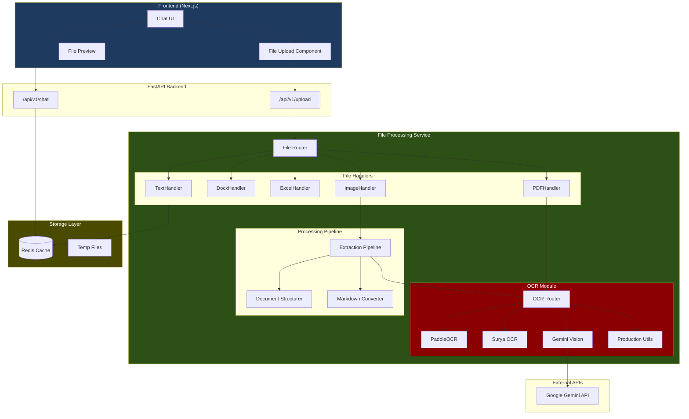
```mermaid
flowchart TB
    subgraph Frontend["Frontend (Next.js)"]
        UI[Chat UI]
        FileUpload[File Upload Component]
        Preview[File Preview]
    end

    subgraph API["FastAPI Backend"]
        UploadEP["/api/v1/upload"]
        ChatEP["/api/v1/chat"]
    end

    subgraph FileProcessing["File Processing Service"]
        Router[File Router]

        subgraph Handlers["File Handlers"]
            TH[TextHandler]
            DH[DocxHandler]
            EH[ExcelHandler]
            PH[PDFHandler]
            IH[ImageHandler]
        end

        subgraph OCR["OCR Module"]
            OCRRouter[OCR Router]
            Paddle[PaddleOCR]
            Surya[Surya OCR]
            Gemini[Gemini Vision]
            ProdUtils[Production Utils]
        end

        subgraph Processing["Processing Pipeline"]
            Pipeline[Extraction Pipeline]
            Structurer[Document Structurer]
            Converter[Markdown Converter]
        end
    end

    subgraph Storage["Storage Layer"]
        Redis[(Redis Cache)]
        Temp[Temp Files]
    end

    subgraph External["External APIs"]
        GeminiAPI[Google Gemini API]
    end

    UI --> FileUpload
    FileUpload --> UploadEP
    UI --> ChatEP

    UploadEP --> Router
    Router --> TH
    Router --> DH
    Router --> EH
    Router --> PH
    Router --> IH

    PH --> OCRRouter
    IH --> Pipeline
    Pipeline --> OCRRouter

    OCRRouter --> Paddle
    OCRRouter --> Surya
    OCRRouter --> Gemini
    OCRRouter --> ProdUtils

    Gemini --> GeminiAPI

    Pipeline --> Structurer
    Pipeline --> Converter

    Handlers --> Redis
    ChatEP --> Redis

    style Frontend fill:#1E3A5F,color:#fff
    style FileProcessing fill:#2D5016,color:#fff
    style OCR fill:#8B0000,color:#fff
    style Storage fill:#4A4A00,color:#fff
```

### Data Flow Diagram

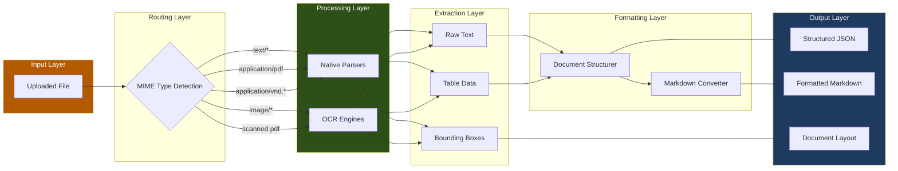
```mermaid
flowchart LR
    subgraph Input["Input Layer"]
        File[Uploaded File]
    end

    subgraph Routing["Routing Layer"]
        MIME{MIME Type Detection}
    end

    subgraph Processing["Processing Layer"]
        direction TB
        Native[Native Parsers]
        OCR[OCR Engines]
    end

    subgraph Extraction["Extraction Layer"]
        Text[Raw Text]
        Tables[Table Data]
        BBox[Bounding Boxes]
    end

    subgraph Formatting["Formatting Layer"]
        Struct[Document Structurer]
        MD[Markdown Converter]
    end

    subgraph Output["Output Layer"]
        JSON[Structured JSON]
        Markdown[Formatted Markdown]
        Layout[Document Layout]
    end

    File --> MIME

    MIME -->|text/*| Native
    MIME -->|application/pdf| Native
    MIME -->|application/vnd.*| Native
    MIME -->|image/*| OCR
    MIME -->|scanned pdf| OCR

    Native --> Text
    Native --> Tables
    Native --> BBox

    OCR --> Text
    OCR --> Tables
    OCR --> BBox

    Text --> Struct
    Tables --> Struct
    BBox --> Layout

    Struct --> JSON
    Struct --> MD
    MD --> Markdown

    style Input fill:#B35900,color:#fff
    style Processing fill:#2D5016,color:#fff
    style Output fill:#1E3A5F,color:#fff
```

---

## 9. Sequence Diagrams

### File Upload Sequence

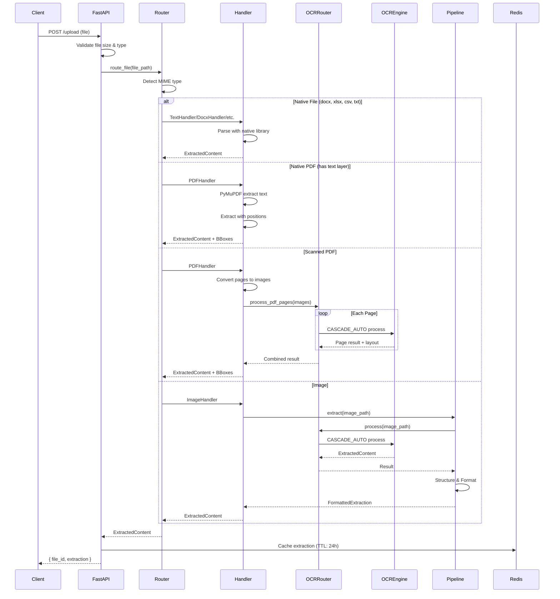
```mermaid
sequenceDiagram
    participant Client
    participant FastAPI
    participant Router
    participant Handler
    participant OCRRouter
    participant OCREngine
    participant Pipeline
    participant Redis

    Client->>FastAPI: POST /upload (file)
    FastAPI->>FastAPI: Validate file size & type

    FastAPI->>Router: route_file(file_path)
    Router->>Router: Detect MIME type

    alt Native File (docx, xlsx, csv, txt)
        Router->>Handler: TextHandler/DocxHandler/etc.
        Handler->>Handler: Parse with native library
        Handler-->>Router: ExtractedContent
    else Native PDF (has text layer)
        Router->>Handler: PDFHandler
        Handler->>Handler: PyMuPDF extract text
        Handler->>Handler: Extract with positions
        Handler-->>Router: ExtractedContent + BBoxes
    else Scanned PDF
        Router->>Handler: PDFHandler
        Handler->>Handler: Convert pages to images
        Handler->>OCRRouter: process_pdf_pages(images)
        loop Each Page
            OCRRouter->>OCREngine: CASCADE_AUTO process
            OCREngine-->>OCRRouter: Page result + layout
        end
        OCRRouter-->>Handler: Combined result
        Handler-->>Router: ExtractedContent + BBoxes
    else Image
        Router->>Handler: ImageHandler
        Handler->>Pipeline: extract(image_path)
        Pipeline->>OCRRouter: process(image_path)
        OCRRouter->>OCREngine: CASCADE_AUTO process
        OCREngine-->>OCRRouter: ExtractedContent
        OCRRouter-->>Pipeline: Result
        Pipeline->>Pipeline: Structure & Format
        Pipeline-->>Handler: FormattedExtraction
        Handler-->>Router: ExtractedContent
    end

    Router-->>FastAPI: ExtractedContent
    FastAPI->>Redis: Cache extraction (TTL: 24h)
    FastAPI-->>Client: { file_id, extraction }
```

### CASCADE_AUTO OCR Sequence

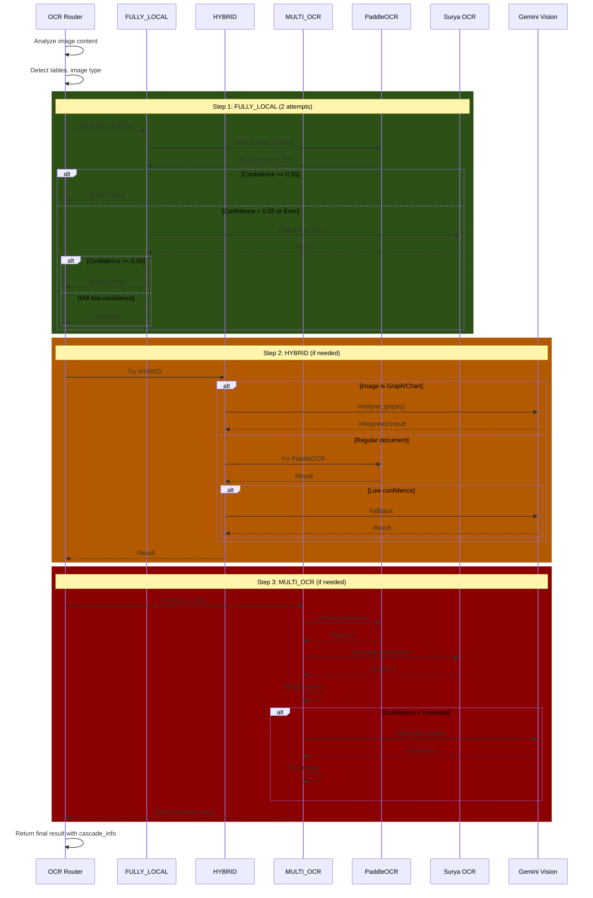
```mermaid
sequenceDiagram
    participant Router as OCR Router
    participant Local as FULLY_LOCAL
    participant Hybrid as HYBRID
    participant Multi as MULTI_OCR
    participant Paddle as PaddleOCR
    participant Surya as Surya OCR
    participant Gemini as Gemini Vision

    Router->>Router: Analyze image content
    Router->>Router: Detect tables, image type

    rect rgb(45, 80, 22)
        Note over Router,Surya: Step 1: FULLY_LOCAL (2 attempts)
        Router->>Local: Try FULLY_LOCAL
        Local->>Paddle: extract_from_image()
        Paddle-->>Local: Result (conf: 0.85)

        alt Confidence >= 0.55
            Local-->>Router: Accept result
        else Confidence < 0.55 or Error
            Local->>Surya: Fallback to Surya
            Surya-->>Local: Result
            alt Confidence >= 0.55
                Local-->>Router: Accept result
            else Still low confidence
                Local-->>Router: Escalate
            end
        end
    end

    rect rgb(179, 89, 0)
        Note over Router,Gemini: Step 2: HYBRID (if needed)
        Router->>Hybrid: Try HYBRID
        alt Image is Graph/Chart
            Hybrid->>Gemini: interpret_graph()
            Gemini-->>Hybrid: Interpreted result
        else Regular document
            Hybrid->>Paddle: Try PaddleOCR
            Paddle-->>Hybrid: Result
            alt Low confidence
                Hybrid->>Gemini: Fallback
                Gemini-->>Hybrid: Result
            end
        end
        Hybrid-->>Router: Result
    end

    rect rgb(139, 0, 0)
        Note over Router,Gemini: Step 3: MULTI_OCR (if needed)
        Router->>Multi: Try MULTI_OCR
        Multi->>Paddle: Primary extraction
        Paddle-->>Multi: Result A
        Multi->>Surya: Secondary extraction
        Surya-->>Multi: Result B
        Multi->>Multi: Merge results
        alt Confidence < threshold
            Multi->>Gemini: Verify with Gemini
            Gemini-->>Multi: Verification
            Multi->>Multi: Final merge
        end
        Multi-->>Router: Best combined result
    end

    Router->>Router: Return final result with cascade_info
```

### Chat with File Context Sequence

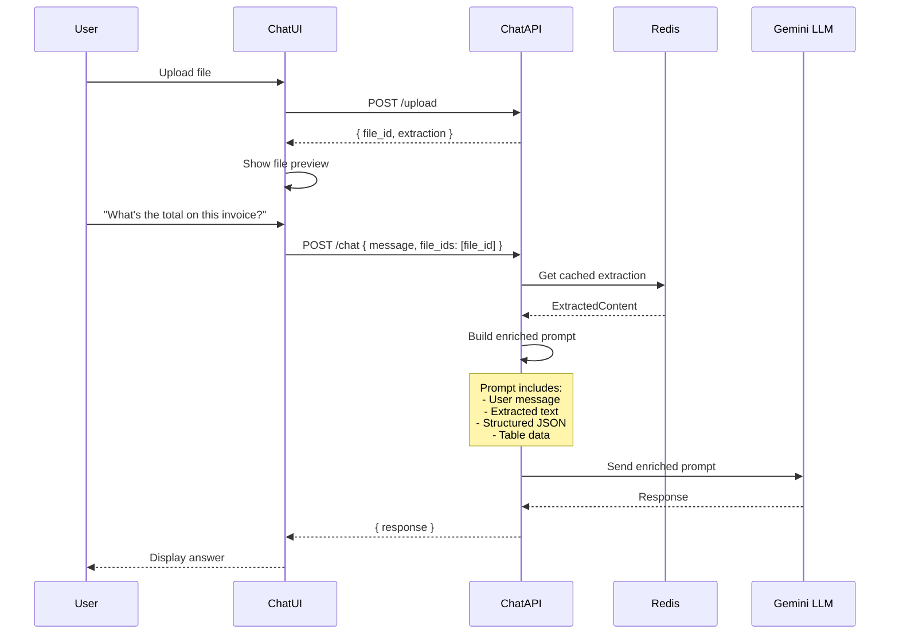
```mermaid
sequenceDiagram
    participant User
    participant ChatUI
    participant ChatAPI
    participant Redis
    participant LLM as Gemini LLM

    User->>ChatUI: Upload file
    ChatUI->>ChatAPI: POST /upload
    ChatAPI-->>ChatUI: { file_id, extraction }
    ChatUI->>ChatUI: Show file preview

    User->>ChatUI: "What's the total on this invoice?"
    ChatUI->>ChatAPI: POST /chat { message, file_ids: [file_id] }

    ChatAPI->>Redis: Get cached extraction
    Redis-->>ChatAPI: ExtractedContent

    ChatAPI->>ChatAPI: Build enriched prompt
    Note over ChatAPI: Prompt includes:<br/>- User message<br/>- Extracted text<br/>- Structured JSON<br/>- Table data

    ChatAPI->>LLM: Send enriched prompt
    LLM-->>ChatAPI: Response

    ChatAPI-->>ChatUI: { response }
    ChatUI-->>User: Display answer
```

### Multi-Page PDF Processing Sequence

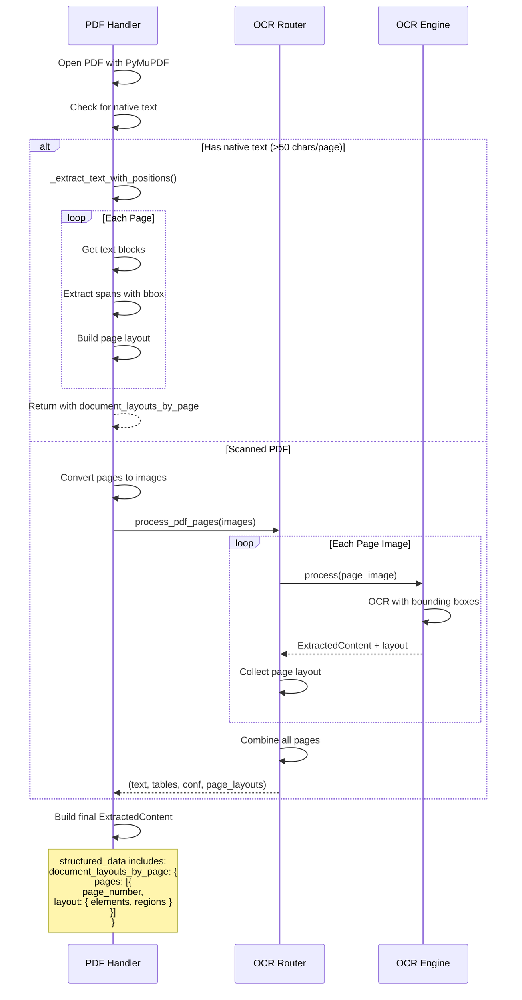
```mermaid
sequenceDiagram
    participant Handler as PDF Handler
    participant Router as OCR Router
    participant Engine as OCR Engine

    Handler->>Handler: Open PDF with PyMuPDF
    Handler->>Handler: Check for native text

    alt Has native text (>50 chars/page)
        Handler->>Handler: _extract_text_with_positions()
        loop Each Page
            Handler->>Handler: Get text blocks
            Handler->>Handler: Extract spans with bbox
            Handler->>Handler: Build page layout
        end
        Handler-->>Handler: Return with document_layouts_by_page
    else Scanned PDF
        Handler->>Handler: Convert pages to images
        Handler->>Router: process_pdf_pages(images)

        loop Each Page Image
            Router->>Engine: process(page_image)
            Engine->>Engine: OCR with bounding boxes
            Engine-->>Router: ExtractedContent + layout
            Router->>Router: Collect page layout
        end

        Router->>Router: Combine all pages
        Router-->>Handler: (text, tables, conf, page_layouts)
    end

    Handler->>Handler: Build final ExtractedContent
    Note over Handler: structured_data includes:<br/>document_layouts_by_page: {<br/>  pages: [{<br/>    page_number,<br/>    layout: { elements, regions }<br/>  }]<br/>}
```

---

## 10. State Diagrams

### OCR Router State Machine

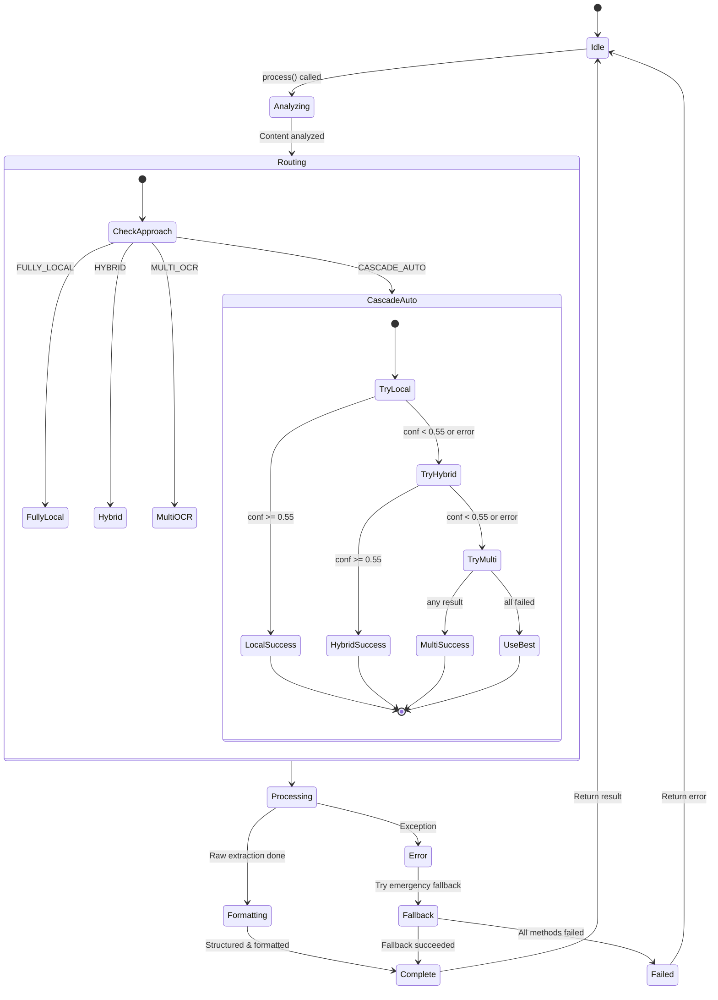
```mermaid
stateDiagram-v2
    [*] --> Idle

    Idle --> Analyzing: process() called
    Analyzing --> Routing: Content analyzed

    state Routing {
        [*] --> CheckApproach
        CheckApproach --> CascadeAuto: CASCADE_AUTO
        CheckApproach --> FullyLocal: FULLY_LOCAL
        CheckApproach --> Hybrid: HYBRID
        CheckApproach --> MultiOCR: MULTI_OCR
    }

    state CascadeAuto {
        [*] --> TryLocal
        TryLocal --> LocalSuccess: conf >= 0.55
        TryLocal --> TryHybrid: conf < 0.55 or error

        TryHybrid --> HybridSuccess: conf >= 0.55
        TryHybrid --> TryMulti: conf < 0.55 or error

        TryMulti --> MultiSuccess: any result
        TryMulti --> UseBest: all failed

        LocalSuccess --> [*]
        HybridSuccess --> [*]
        MultiSuccess --> [*]
        UseBest --> [*]
    }

    Routing --> Processing
    Processing --> Formatting: Raw extraction done
    Formatting --> Complete: Structured & formatted
    Complete --> Idle: Return result

    Processing --> Error: Exception
    Error --> Fallback: Try emergency fallback
    Fallback --> Complete: Fallback succeeded
    Fallback --> Failed: All methods failed
    Failed --> Idle: Return error
```

### File Upload State Machine

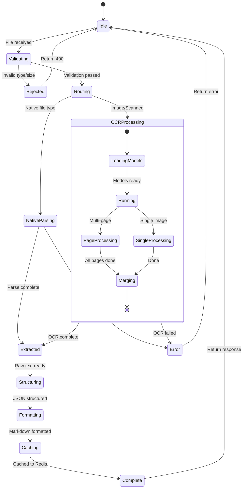
```mermaid
stateDiagram-v2
    [*] --> Idle

    Idle --> Validating: File received
    Validating --> Rejected: Invalid type/size
    Validating --> Routing: Validation passed

    Routing --> NativeParsing: Native file type
    Routing --> OCRProcessing: Image/Scanned

    NativeParsing --> Extracted: Parse complete
    NativeParsing --> Error: Parse failed

    state OCRProcessing {
        [*] --> LoadingModels
        LoadingModels --> Running: Models ready
        Running --> PageProcessing: Multi-page
        Running --> SingleProcessing: Single image

        PageProcessing --> Merging: All pages done
        SingleProcessing --> Merging: Done

        Merging --> [*]
    }

    OCRProcessing --> Extracted: OCR complete
    OCRProcessing --> Error: OCR failed

    Extracted --> Structuring: Raw text ready
    Structuring --> Formatting: JSON structured
    Formatting --> Caching: Markdown formatted
    Caching --> Complete: Cached to Redis

    Complete --> Idle: Return response
    Error --> Idle: Return error
    Rejected --> Idle: Return 400
```

### CASCADE_AUTO Attempt State

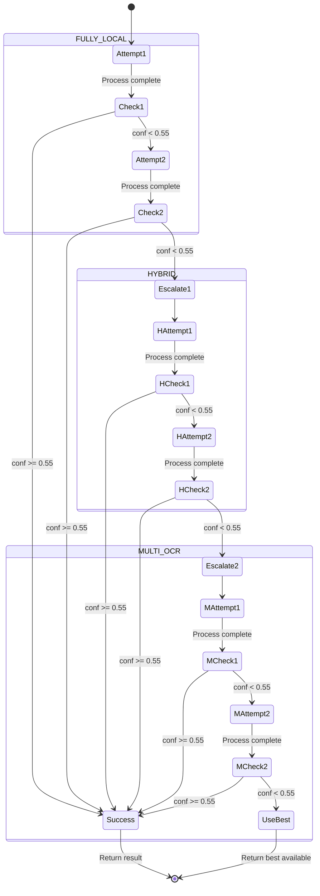
```mermaid
stateDiagram-v2
    [*] --> Attempt1

    state "FULLY_LOCAL" as FL {
        Attempt1 --> Check1: Process complete
        Check1 --> Success: conf >= 0.55
        Check1 --> Attempt2: conf < 0.55
        Attempt2 --> Check2: Process complete
        Check2 --> Success: conf >= 0.55
        Check2 --> Escalate1: conf < 0.55
    }

    state "HYBRID" as HY {
        Escalate1 --> HAttempt1
        HAttempt1 --> HCheck1: Process complete
        HCheck1 --> Success: conf >= 0.55
        HCheck1 --> HAttempt2: conf < 0.55
        HAttempt2 --> HCheck2: Process complete
        HCheck2 --> Success: conf >= 0.55
        HCheck2 --> Escalate2: conf < 0.55
    }

    state "MULTI_OCR" as MO {
        Escalate2 --> MAttempt1
        MAttempt1 --> MCheck1: Process complete
        MCheck1 --> Success: conf >= 0.55
        MCheck1 --> MAttempt2: conf < 0.55
        MAttempt2 --> MCheck2: Process complete
        MCheck2 --> Success: conf >= 0.55
        MCheck2 --> UseBest: conf < 0.55
    }

    Success --> [*]: Return result
    UseBest --> [*]: Return best available
```

---

## 11. Chat Integration Flow

### Complete Chat with Files Flow

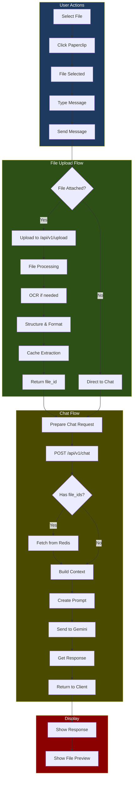
```mermaid
flowchart TB
    subgraph UserActions["User Actions"]
        A[Select File] --> B[Click Paperclip]
        B --> C[File Selected]
        C --> D[Type Message]
        D --> E[Send Message]
    end

    subgraph Upload["File Upload Flow"]
        E --> F{File Attached?}
        F -->|Yes| G[Upload to /api/v1/upload]
        F -->|No| H[Direct to Chat]

        G --> I[File Processing]
        I --> J[OCR if needed]
        J --> K[Structure & Format]
        K --> L[Cache Extraction]
        L --> M[Return file_id]
    end

    subgraph Chat["Chat Flow"]
        M --> N[Prepare Chat Request]
        H --> N
        N --> O[POST /api/v1/chat]
        O --> P{Has file_ids?}

        P -->|Yes| Q[Fetch from Redis]
        Q --> R[Build Context]
        P -->|No| R

        R --> S[Create Prompt]
        S --> T[Send to Gemini]
        T --> U[Get Response]
        U --> V[Return to Client]
    end

    subgraph Display["Display"]
        V --> W[Show Response]
        W --> X[Show File Preview]
    end

    style UserActions fill:#1E3A5F,color:#fff
    style Upload fill:#2D5016,color:#fff
    style Chat fill:#4A4A00,color:#fff
    style Display fill:#8B0000,color:#fff
```

### Context Injection for Chat

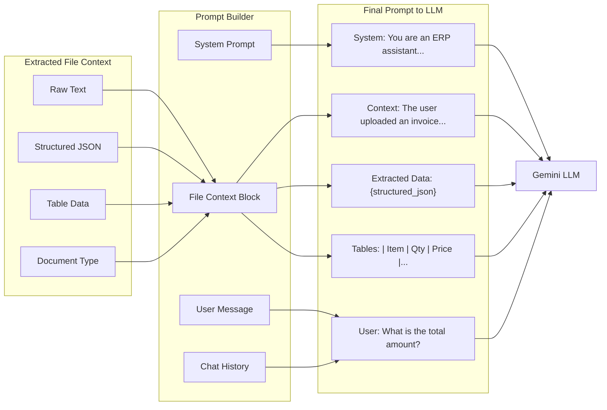
```mermaid
flowchart LR
    subgraph FileContext["Extracted File Context"]
        Raw[Raw Text]
        JSON[Structured JSON]
        Tables[Table Data]
        Type[Document Type]
    end

    subgraph PromptBuilder["Prompt Builder"]
        System[System Prompt]
        Context[File Context Block]
        User[User Message]
        History[Chat History]
    end

    subgraph FinalPrompt["Final Prompt to LLM"]
        P1["System: You are an ERP assistant..."]
        P2["Context: The user uploaded an invoice..."]
        P3["Extracted Data: {structured_json}"]
        P4["Tables: | Item | Qty | Price |..."]
        P5["User: What is the total amount?"]
    end

    Raw --> Context
    JSON --> Context
    Tables --> Context
    Type --> Context

    System --> P1
    Context --> P2
    Context --> P3
    Context --> P4
    User --> P5
    History --> P5

    P1 --> LLM[Gemini LLM]
    P2 --> LLM
    P3 --> LLM
    P4 --> LLM
    P5 --> LLM
```

### File Preview Component Flow

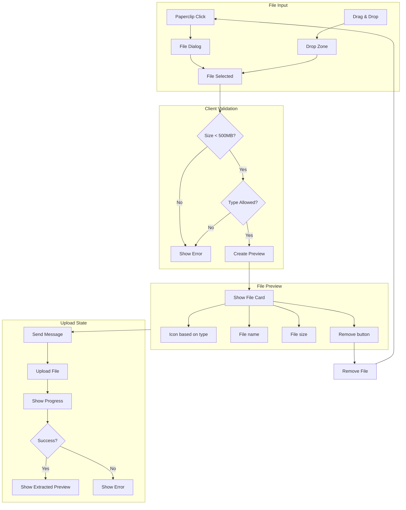
```mermaid
flowchart TD
    subgraph FileInput["File Input"]
        A[Paperclip Click] --> B[File Dialog]
        C[Drag & Drop] --> D[Drop Zone]
        B --> E[File Selected]
        D --> E
    end

    subgraph Validation["Client Validation"]
        E --> F{Size < 500MB?}
        F -->|No| G[Show Error]
        F -->|Yes| H{Type Allowed?}
        H -->|No| G
        H -->|Yes| I[Create Preview]
    end

    subgraph Preview["File Preview"]
        I --> J[Show File Card]
        J --> K[Icon based on type]
        J --> L[File name]
        J --> M[File size]
        J --> N[Remove button]
    end

    subgraph Upload["Upload State"]
        O[Send Message] --> P[Upload File]
        P --> Q[Show Progress]
        Q --> R{Success?}
        R -->|Yes| S[Show Extracted Preview]
        R -->|No| T[Show Error]
    end

    Preview --> O
    N --> U[Remove File]
    U --> A
```

### WebSocket Real-time Updates (Optional)

```mermaid
sequenceDiagram
    participant Client
    participant WS as WebSocket
    participant Server
    participant OCR as OCR Engine

    Client->>Server: Upload large file
    Server-->>Client: { file_id, status: "processing" }

    Client->>WS: Connect /ws/upload/{file_id}

    Server->>OCR: Start processing

    loop Processing Updates
        OCR->>Server: Page 1 complete (20%)
        Server->>WS: { progress: 20, page: 1 }
        WS-->>Client: Progress update

        OCR->>Server: Page 2 complete (40%)
        Server->>WS: { progress: 40, page: 2 }
        WS-->>Client: Progress update
    end

    OCR->>Server: Complete
    Server->>WS: { progress: 100, status: "complete" }
    WS-->>Client: Final update

    Client->>WS: Disconnect
```

---

## 12. API Design

### Upload Endpoint

```
POST /api/v1/upload
Content-Type: multipart/form-data

Request:
  - file: binary (required)
  - session_id: string (optional)
  - document_type_hint: string (optional) - invoice, receipt, etc.

Response (200):
{
  "file_id": "uuid",
  "filename": "invoice.pdf",
  "extraction": {
    "text": "Invoice #1234...",
    "formatted_markdown": "## Invoice #1234\n\n| Item | Qty | Price |...",
    "structured_json": {
      "document_type": "invoice",
      "invoice_number": "1234",
      "date": "2026-01-15",
      "items": [...],
      "total": 15000.00
    },
    "document_layout": {
      "width": 1200,
      "height": 1600,
      "total_elements": 45,
      "elements": [
        {
          "text": "Invoice #1234",
          "bbox": {...},
          "element_type": "reference",
          "confidence": 0.98
        }
      ]
    },
    "tables": [
      {
        "headers": ["Item", "Qty", "Price"],
        "rows": [["Widget", "10", "₹1,500"]],
        "confidence": 0.95
      }
    ],
    "metadata": {
      "file_type": ".pdf",
      "pages": 3,
      "extraction_method": "paddle_ocr",
      "confidence": 0.95,
      "processing_time_ms": 2340,
      "ocr_engines_used": ["paddle_ocr"],
      "languages_detected": ["en"]
    },
    "cascade_info": {
      "final_approach": "FULLY_LOCAL",
      "total_attempts": 1,
      "success": true
    }
  }
}
```

### Extended Chat Endpoint

```
POST /api/v1/chat
{
  "message": "What is the total amount on this invoice?",
  "session_id": "...",
  "file_ids": ["uuid-1", "uuid-2"]
}
```

---

## 13. Cost Estimation

### With CASCADE_AUTO (90%+ Free)

```mermaid
pie title Cost Distribution (500 uploads/day)
    "Native Files - Free" : 50
    "Local OCR - Free" : 40
    "Gemini API - Paid" : 10
```

### Scenario Analysis

| Scenario | Daily Volume | Monthly Cost |
|----------|-------------|--------------|
| **Small Business** | 50 uploads | ~$0.01/month |
| **Medium Business** | 500 uploads | ~$0.50/month |
| **Heavy Usage** | 2,000 uploads | ~$2.00/month |

### Cost Breakdown by File Type

| File Type | Method | Cost |
|-----------|--------|------|
| DOCX/XLSX/CSV/TXT | Local parsers | **$0.00** |
| Native PDFs | PyMuPDF | **$0.00** |
| Scanned docs | PaddleOCR/Surya | **$0.00** |
| Graphs/Charts | Gemini Vision | ~$0.0001/image |
| Low confidence fallback | Gemini | ~$0.0001/page |

---

## 14. Python Libraries

### Required Dependencies

```text
# ============================================
# FILE UPLOAD & OCR DEPENDENCIES
# ============================================

# Local OCR Engines (FREE)
surya-ocr>=0.6.0              # Best layout + general OCR
paddlepaddle>=2.6.0           # PaddlePaddle framework
paddleocr>=2.7.0              # Table structure (PP-Structure)

# Document Parsers (FREE)
python-docx>=1.1.0            # .docx parsing
openpyxl>=3.1.0               # .xlsx parsing
PyMuPDF>=1.24.0               # PDF text extraction
pandas>=2.2.0                 # CSV/Excel + data structuring
Pillow>=10.0.0                # Image format conversion

# Gemini API (for graphs + fallback)
google-generativeai>=0.8.0    # Direct Gemini API

# File Handling
python-multipart>=0.0.9       # FastAPI multipart upload
aiofiles>=24.1.0              # Async file I/O
python-magic>=0.4.27          # MIME type detection
```

### Installation Commands

```bash
# Make sure you're in venv312
cd C:\Users\conne\OneDrive\Desktop\erpsense_all\erpsense-backend
.\venv312\Scripts\activate

# Install PaddlePaddle and PaddleOCR
pip install paddlepaddle==2.6.2
pip install paddleocr==2.8.1

# Install Surya OCR
pip install surya-ocr==0.6.0

# Fix OpenCV compatibility
pip install opencv-python==4.9.0.80 opencv-contrib-python==4.9.0.80 --force-reinstall

# Start server with MKL-DNN disabled
$env:FLAGS_use_mkldnn = "0"
$env:MKLDNN_CACHE_CAPACITY = "0"
uvicorn app.main:app --reload --host 0.0.0.0 --port 8000
```

---

## 15. Production-Grade Fixes

### New File: `production_utils.py`

**Location:** `app/services/file_processing/ocr/production_utils.py`

This module contains all production utilities for robust OCR processing.

### Critical Issues Fixed (5)

| Issue | Severity | Fix Applied | File |
|-------|----------|-------------|------|
| Thread-safe singleton initialization | Critical | Double-checked locking with `threading.Lock()` | All OCR engines |
| Timeout mechanism | Critical | `with_timeout()` async wrapper | ocr_router.py |
| PDF password protection | Critical | `check_pdf_encrypted()` before processing | pdf_handler.py |
| PIL Image cleanup | Critical | `safe_image_open()` context manager | paddle_ocr.py, pdf_handler.py |
| File handle cleanup | Critical | `try-finally` blocks for PDF documents | pdf_handler.py |

### High Severity Issues Fixed (7)

| Issue | Severity | Fix Applied | File |
|-------|----------|-------------|------|
| Gemini rate limiting | High | Exponential backoff with jitter | gemini_vision.py |
| Image validation | High | `ImageValidator` class | paddle_ocr.py |
| Model loading errors | High | Error state tracking (`_load_error`) | surya_ocr.py |
| Re-entrant loading prevention | High | `_loading` flag | All OCR engines |
| Memory management | High | Garbage collection on memory errors | All OCR engines |
| Resource cleanup on shutdown | High | `atexit` registration | production_utils.py |
| Corrupted PDF handling | High | Proper error messages | pdf_handler.py |

### Production Utilities Classes

```python
# Thread-Safe Singleton
class ThreadSafeSingleton:
    """
    Thread-safe singleton initialization with proper locking.
    Used by all OCR engines to ensure models load only once.
    """
    _lock: threading.Lock
    _instance: Any = None
    _loaded: bool = False
    _loading: bool = False
    _load_error: Exception | None = None

# Temporary File Manager
class TempFileManager:
    """
    Safe temporary file handling with guaranteed cleanup.
    Tracks all temp files and cleans up on context exit.
    """
    def __enter__(self) -> Path
    def __exit__(self, *args)
    def cleanup_all()

# Image Validator
class ImageValidator:
    """
    Validates images before processing.
    Checks: file exists, size limits, format, corruption.
    """
    MAX_FILE_SIZE_MB: int = 500
    MAX_DIMENSION: int = 8192
    MAX_PIXELS: int = 200_000_000
    SUPPORTED_FORMATS: set = {"JPEG", "PNG", "GIF", "BMP", "TIFF", "WEBP"}

    @staticmethod
    def validate(path: Path) -> tuple[bool, str]

# Rate Limiter
@dataclass
class RateLimitConfig:
    initial_delay: float = 2.0
    max_delay: float = 60.0
    multiplier: float = 2.0
    max_retries: int = 5

class RateLimiter:
    """
    Exponential backoff with jitter for API rate limiting.
    """
    def wait_if_needed()
    def record_success()
    def record_failure()
    def get_delay() -> float

# Async Timeout
async def with_timeout(
    coro: Coroutine,
    timeout_seconds: float,
    operation_name: str = "operation"
) -> Any:
    """
    Wraps async operations with configurable timeout.
    Raises TimeoutError with descriptive message.
    """

# Safe Image Context Manager
@contextmanager
def safe_image_open(path: Path) -> Image:
    """
    Context manager for PIL Image with guaranteed cleanup.
    Prevents memory leaks from unclosed image handles.
    """
```

### Thread-Safe Singleton Pattern (Applied to All OCR Engines)

```python
class PaddleOCREngine:
    _lock = threading.Lock()
    _ocr: PaddleOCR | None = None
    _loaded: bool = False
    _loading: bool = False

    def _load_models(self):
        # Double-checked locking
        if self._loaded:
            return

        with self._lock:
            if self._loaded:  # Re-check inside lock
                return

            if self._loading:
                raise RuntimeError("Model already loading")

            self._loading = True
            try:
                # Load models...
                self._ocr = PaddleOCR(...)
                self._loaded = True
            finally:
                self._loading = False
```

### Timeout Handling in OCR Router

```python
class OCRRouter:
    async def process(self, path: Path) -> ExtractedContent:
        return await with_timeout(
            self._process_internal(path),
            timeout_seconds=self.config.TIMEOUT_SECONDS,
            operation_name=f"OCR processing for {path.name}"
        )
```

### Rate Limiter in Gemini Vision

```python
class GeminiVision:
    def __init__(self):
        self._rate_limiter = RateLimiter(RateLimitConfig(
            initial_delay=2.0,
            max_delay=60.0,
            multiplier=2.0,
            max_retries=5
        ))

    async def _call_with_retry(self, func: Callable) -> Any:
        for attempt in range(self._rate_limiter.config.max_retries):
            try:
                result = await func()
                self._rate_limiter.record_success()
                return result
            except ResourceExhausted:
                self._rate_limiter.record_failure()
                await asyncio.sleep(self._rate_limiter.get_delay())
        raise Exception("Max retries exceeded")
```

---

## 16. Processing Limits

### Updated Limits (No Restrictions)

| Setting | Before | After |
|---------|--------|-------|
| **PDF Max Pages** | 50 pages | **Unlimited (all pages)** |
| **PDF Max Size** | 100 MB | **500 MB** |
| **Image Max Size** | 50 MB | **500 MB** |
| **Image Max Dimension** | 4096 px | **8192 px (8K)** |
| **Image Max Pixels** | 100 MP | **200 MP** |
| **File Size (Router)** | 50 MB | **500 MB** |
| **Timeout** | None | **120 seconds** |

### Configuration Summary

```python
# In pdf_handler.py
MAX_PAGES_FOR_OCR = None  # No page limit - process ALL pages
MAX_FILE_SIZE_MB = 500    # 500MB PDFs supported

# In ocr_router.py
MAX_PDF_PAGES = 0         # 0 means no limit
MAX_FILE_SIZE_MB = 500
TIMEOUT_SECONDS = 120     # 2 minute timeout

# In production_utils.py (ImageValidator)
MAX_FILE_SIZE_MB = 500
MAX_DIMENSION = 8192      # Supports 8K scans
MAX_PIXELS = 200_000_000  # 200MP for high-res documents
```

### Processing Time Estimates

| Document Size | Estimated Time | Notes |
|--------------|----------------|-------|
| 1-10 pages | 3-30 seconds | Fast, single cascade |
| 10-50 pages | 30 seconds - 2.5 minutes | Normal processing |
| 50-100 pages | 2.5-5 minutes | May need timeout extension |
| 100+ pages | 5+ minutes | Consider chunking |

For a 100-page scanned PDF:
```
100 pages × ~3 seconds/page = ~5 minutes
With cascade retries = up to ~15 minutes worst case
```

---

## 17. Risks & Considerations

### Technical Risks

| Risk | Mitigation |
|------|------------|
| Large files timeout | 120s timeout, suggest splitting for 100+ pages |
| Scanned PDF detection fails | Default to OCR if <50 chars/page |
| OCR confidence too low | CASCADE_AUTO with Gemini fallback |
| Model loading slow | Lazy load, thread-safe singleton pattern |
| Gemini rate limits | Exponential backoff with jitter |
| Password-protected PDFs | Detect and return user-friendly error |
| Corrupted files | Validate before processing, proper error messages |
| Memory exhaustion | Image validation, cleanup on errors |
| Thread safety issues | Double-checked locking pattern |

### Security

- **Never execute uploaded files** — only parse/read
- **Validate file types server-side** using python-magic
- **Sanitize extracted content** before prompt injection
- **Temporary storage only** — delete files after extraction
- **No file paths in responses** — only UUIDs
- **Password-protected PDF detection** — fail fast with clear error

---

## 18. Sources

### OCR Libraries
- [Surya OCR — GitHub](https://github.com/VikParuchuri/surya)
- [PaddleOCR — GitHub](https://github.com/PaddlePaddle/PaddleOCR)

### Gemini API
- [Gemini API Pricing](https://ai.google.dev/gemini-api/docs/pricing)
- [Gemini Document Processing](https://ai.google.dev/gemini-api/docs/document-processing)

### Document Processing
- [PyMuPDF Documentation](https://pymupdf.readthedocs.io/)
- [python-docx Documentation](https://python-docx.readthedocs.io/)
- [openpyxl Documentation](https://openpyxl.readthedocs.io/)

---

## Appendix: Quick Reference

### Supported Languages (50+)

```python
# Indian Languages
"hi", "ta", "te", "kn", "ml", "mr", "gu", "pa", "bn", "or", "as", "sa", "ne", "si"

# East Asian
"ch", "cht", "ja", "ko"

# European
"en", "ru", "de", "fr", "es", "pt", "it", "nl", "pl", "uk", "cs", "ro", "hu", "el"

# Middle Eastern
"ar", "fa", "he", "tr", "ur"

# Southeast Asian
"th", "vi", "id", "ms", "tl"
```

### Supported Document Types

```python
[
    "invoice", "bill", "receipt", "quotation", "purchase_order", "sales_order",
    "credit_note", "debit_note", "delivery_note",
    "bank_statement", "bank_challan",
    "kot", "bot", "menu", "pos_receipt",
    "form", "application", "registration",
    "report", "financial_report", "stock_report", "sales_report",
    "excel", "spreadsheet",
    "letter", "memo", "contract",
    "chart", "graph"
]
```

### API Quick Start

```python
from app.services.file_processing.ocr import extraction_pipeline, extract_document

# Full extraction with all formats
result = await extraction_pipeline.extract(image_path, document_type_hint="invoice")

# Access outputs
print(result.raw_text)              # Raw OCR text
print(result.formatted_markdown)    # Nicely formatted
print(result.structured_json)       # Structured data
print(result.document_layout)       # Bounding boxes

# Convenience functions
result = await extract_document(Path("invoice.jpg"))
json_data = await extract_to_json(Path("invoice.jpg"))
markdown = await extract_to_markdown(Path("invoice.jpg"))
```

### Production Utils Quick Start

```python
from app.services.file_processing.ocr.production_utils import (
    with_timeout,
    safe_image_open,
    ImageValidator,
    RateLimiter,
    RateLimitConfig,
    check_pdf_encrypted
)

# Validate image before processing
is_valid, error = ImageValidator.validate(image_path)
if not is_valid:
    raise ValueError(error)

# Safe image handling
with safe_image_open(image_path) as img:
    # Process image - automatically closes on exit
    pass

# Timeout wrapper
result = await with_timeout(
    ocr_function(),
    timeout_seconds=120,
    operation_name="OCR extraction"
)

# Check for password-protected PDF
if check_pdf_encrypted(pdf_path):
    raise ValueError("Password-protected PDFs not supported")

# Rate limiting for API calls
limiter = RateLimiter(RateLimitConfig(initial_delay=2.0))
await asyncio.sleep(limiter.get_delay())
```

---

## Changelog

### 2026-02-05 — Production-Grade Update

**New:**
- Added `production_utils.py` with thread-safe utilities
- Thread-safe singleton pattern for all OCR engines
- Timeout handling (120s default) for all OCR operations
- Exponential backoff rate limiter for Gemini API
- Image validation before processing
- PDF password protection detection

**Changed:**
- Removed all artificial limits (pages, file size)
- PDF: Unlimited pages, 500MB max
- Images: 8K resolution (8192px), 500MB max, 200MP
- Rate limit: 2s initial → 60s max (exponential backoff)
- Timeout: 120 seconds (enforced)

**Fixed:**
- Thread safety in all OCR engines
- PIL Image memory leaks
- PDF file handle cleanup
- Re-entrant model loading prevention
- Gemini rate limit handling (was fixed 5s, now exponential)