# ERPSense — File Upload & OCR Implementation Roadmap

## Table of Contents

1. [Current State](#1-current-state)
2. [Goal](#2-goal)
3. [OCR Engine Comparison](#3-ocr-engine-comparison)
4. [Approach Comparison: 3 Options](#4-approach-comparison-3-options)
5. [Recommended Architecture (Multi-OCR Hybrid)](#5-recommended-architecture-multi-ocr-hybrid)
6. [File-Type Handling Strategy](#6-file-type-handling-strategy)
7. [Gemini API — Pricing & Cost Breakdown](#7-gemini-api--pricing--cost-breakdown)
8. [Cost Estimation Scenarios](#8-cost-estimation-scenarios)
9. [Python Libraries Required](#9-python-libraries-required)
10. [Implementation Plan (Step-by-Step)](#10-implementation-plan-step-by-step)
11. [API Design](#11-api-design)
12. [Frontend Changes](#12-frontend-changes)
13. [Risk & Considerations](#13-risks--considerations)
14. [Sources](#14-sources)

---

## 1. Current State

- **Backend:** FastAPI (Python), using `gemini-3-flash-preview` via LangChain
- **Frontend:** Next.js 14, React 18, TailwindCSS
- **File Upload:** NOT implemented. The paperclip icon in `chat-input.tsx` is a UI placeholder — no upload endpoint, no file processing logic exists
- **OCR:** None
- **Storage:** No file storage (MinIO/S3 planned but not set up)
- **Gemini Integration:** Already active for chat (text-only via `langchain-google-genai`)

---

## 2. Goal

Accept **any file type** uploaded by the user — `.pdf`, `.docx`, `.xlsx`, `.csv`, `.txt`, `.md`, `.tex`, `.png`, `.jpg`, `.jpeg`, `.gif`, `.bmp`, `.tiff`, `.webp`, etc. — extract content in a **properly structured format**, and feed it into the chat context so Gemini can reason over it.

**Target Document Types:**
- Bills & Invoices
- PDFs (native & scanned)
- DOC/DOCX documents
- CSV files
- XLS/XLSX spreadsheets
- Tabular data with numbers
- Graphs & charts

---

## 3. OCR Engine Comparison

### Local/Free OCR Options

| OCR Engine | Tables | Numbers | Speed | Setup | Best For |
|------------|--------|---------|-------|-------|----------|
| **Surya OCR** | ✅ Excellent | ✅ Excellent | Fast | Easy | Documents, 90+ languages, layout detection |
| **PaddleOCR** | ✅ Good | ✅ Good | Fast | Medium | Tables, multilingual, structured docs |
| **EasyOCR** | ⚠️ Medium | ✅ Good | Slow | Easy | General purpose, 80+ languages |
| **DocTR** | ✅ Good | ✅ Good | Medium | Easy | Documents, invoices |
| **TrOCR** | ⚠️ Medium | ✅ Good | Slow | Hard | Handwritten + printed text |
| **Tesseract** | ❌ Poor | ⚠️ Risky | Medium | Easy | Simple typed documents only |

### Detailed Engine Analysis

#### Surya OCR ⭐⭐ (Best Overall)
```bash
pip install surya-ocr
```

| Pros | Cons |
|------|------|
| State-of-the-art accuracy (2024) | Newer, less community support |
| Excellent layout detection | Requires GPU for best speed |
| Table structure preservation | ~500MB model size |
| 90+ languages support | |
| Built specifically for documents | |
| Free & open source (GPL) | |

**Best for:** Complex documents, invoices, forms, mixed layouts

#### PaddleOCR ⭐ (Best for Tables)
```bash
pip install paddlepaddle paddleocr
```

| Pros | Cons |
|------|------|
| Excellent table recognition (PP-Structure) | Larger model size (~150MB) |
| Very accurate on numbers | PaddlePaddle framework dependency |
| Fast inference | Documentation mostly in Chinese |
| Layout analysis built-in | |
| Free & open source | |

**Best for:** Invoices, bills, structured documents with tables

#### Tesseract ❌ (Not Recommended)
```bash
apt-get install tesseract-ocr
pip install pytesseract
```

| Pros | Cons |
|------|------|
| Free, widely available | Poor table recognition |
| Works offline | Number misreads (0↔O, 1↔l) |
| Many language packs | Slow processing |
| | Complex setup |

**Best for:** Simple typed documents only (not recommended for ERP use case)

### Paid API Options (Reference)

| Service | Tables | Accuracy | Cost |
|---------|--------|----------|------|
| **Gemini Vision** | ✅ Excellent | Excellent | ~$0.10/1000 pages |
| **AWS Textract** | ✅ Excellent | Excellent | $1.50/1000 pages |
| **Google Document AI** | ✅ Excellent | Excellent | $1.50/1000 pages |
| **Azure Document Intelligence** | ✅ Excellent | Excellent | $1.50/1000 pages |

---

## 4. Approach Comparison: 3 Options

### Option A: Fully Local (Zero API Cost)

| Pros | Cons |
|------|------|
| Zero cost — completely free | Cannot interpret graphs/charts |
| Full privacy — files never leave server | Slightly lower accuracy on complex layouts |
| Works offline | Larger Docker image (~800MB) |
| No rate limits | |

**Verdict:** Good for privacy-first deployments, but cannot understand graphs.

### Option B: Hybrid (Surya + Gemini)

| Pros | Cons |
|------|------|
| Free for 90% of files | Small cost for graphs (~$0.50-2/month) |
| Gemini understands graphs/charts | Requires internet for some files |
| Best balance of cost/accuracy | |
| Partial offline capability | |

**Verdict:** Good balance for most use cases.

### Option C: Multi-OCR Hybrid (Recommended) ⭐

| Pros | Cons |
|------|------|
| Maximum accuracy | More complex setup |
| Surya for layouts, Paddle for tables | Larger Docker image (~1.5GB) |
| Gemini for graphs (only option) | Small API cost (~$1-2/month) |
| Confidence-based fallback | |

**Verdict: THIS IS THE RECOMMENDED APPROACH.** Best accuracy for ERP documents with bills, invoices, tables, and graphs.

---

## 5. Recommended Architecture (Multi-OCR Hybrid)

### High-Level Flow

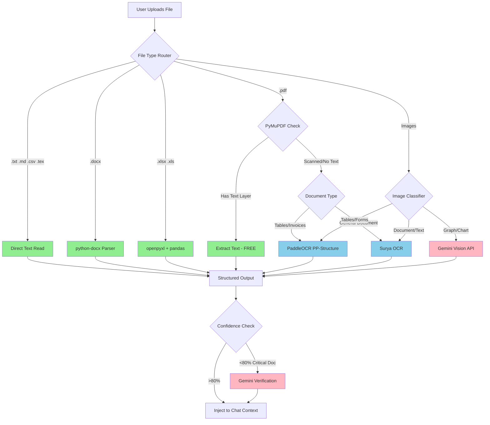

**Legend:**
- 🟢 Green = Free (local parsers)
- 🔵 Blue = Free (local OCR)
- 🔴 Pink = Paid (Gemini API)

### OCR Selection Logic

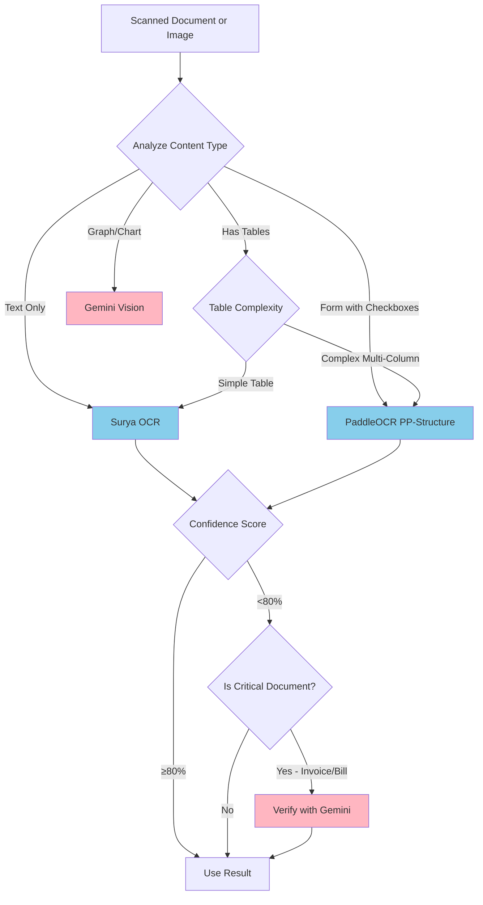

### When to Use Which OCR

| Document Type | Primary OCR | Reason |
|--------------|-------------|--------|
| General documents | Surya | Best layout detection |
| Invoices/Bills with tables | PaddleOCR PP-Structure | Best table extraction |
| Forms with checkboxes | PaddleOCR | Good form detection |
| Mixed layout (text + tables) | Surya + PaddleOCR merge | Combine strengths |
| Graphs/Charts | Gemini Vision | Only option that "understands" visuals |
| Handwritten notes | Surya | Better than Paddle on handwriting |
| Low quality scans | Gemini Vision | Most robust |

---

## 6. File-Type Handling Strategy

### Processing Flow by File Type

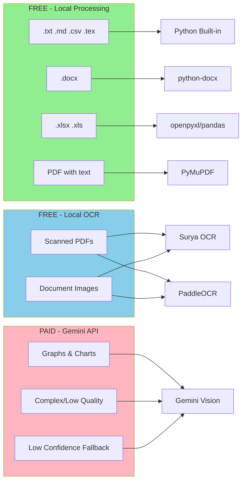

### Detailed File Type Matrix

| File Type | Method | Library / OCR | Cost | Speed |
|-----------|--------|---------------|------|-------|
| `.txt`, `.md`, `.csv` | Direct read | Python built-in / `csv` | Free | Instant |
| `.tex` | Direct read | Python built-in | Free | Instant |
| `.docx` | Parse structure | `python-docx` | Free | ~50ms |
| `.xlsx`, `.xls` | Parse spreadsheet | `openpyxl` / `pandas` | Free | ~100ms |
| `.pdf` (native) | Extract text | `PyMuPDF` (fitz) | Free | ~120ms |
| `.pdf` (scanned - tables) | OCR | PaddleOCR PP-Structure | Free | ~2-4s/page |
| `.pdf` (scanned - general) | OCR | Surya OCR | Free | ~1-3s/page |
| `.png`, `.jpg` (document) | OCR | Surya OCR | Free | ~1-2s |
| `.png`, `.jpg` (tables) | OCR | PaddleOCR | Free | ~1-2s |
| `.png`, `.jpg` (graphs) | Vision AI | Gemini API | ~$0.0001 | ~1-3s |
| `.gif`, `.bmp`, `.tiff`, `.webp` | Convert → OCR | Pillow + Surya/Paddle | Free | ~1-3s |

### PDF Processing Logic

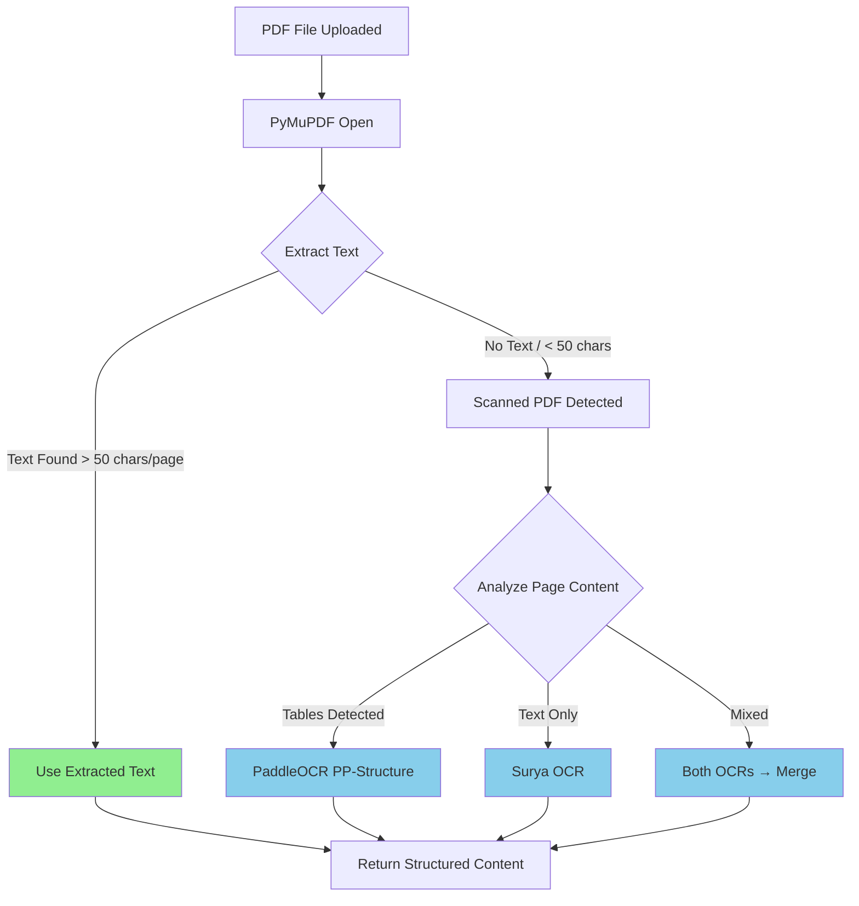

### Code: Detect Scanned vs Native PDF

```python
import fitz  # PyMuPDF

def is_scanned_pdf(file_path: str) -> bool:
    """Check if PDF is scanned (image-based) or has native text."""
    doc = fitz.open(file_path)
    for page in doc:
        text = page.get_text().strip()
        if len(text) > 50:  # Has meaningful text
            return False
    return True  # No text found — it's scanned
```

---

## 7. Gemini API — Pricing & Cost Breakdown

### Models Relevant to OCR (2026)

| Model | Input (per 1M tokens) | Output (per 1M tokens) | Best For |
|-------|----------------------|------------------------|----------|
| **Gemini 2.0 Flash** | $0.10 | $0.40 | Budget OCR, high volume |
| **Gemini 2.5 Flash-Lite** | $0.10 | $0.40 | Cheapest option |
| **Gemini 2.5 Flash** | $0.30 | $2.50 | Good balance |
| **Gemini 3 Flash Preview** | $0.50 | $3.00 | Best Flash-tier |
| **Gemini 2.5 Pro** | $1.25 | $10.00 | Complex documents |
| **Gemini 3 Pro Preview** | $2.00 | $12.00 | Best-in-class |

### Key Pricing Facts

- **Images:** ~258 tokens input regardless of size (~$0.000026/image on Gemini 2.0 Flash)
- **PDF pages:** Native text extracted for free since Gemini 3
- **Batch API:** 50% discount (async, results within 24h)
- **Free Tier:** 1,500 requests/day on Gemini 2.0 Flash
- **Context Caching:** Re-use uploaded files without re-paying tokens

### Token Estimation per File Type

| Document Type | Approx. Tokens (Input) | Cost (Gemini 2.0 Flash) |
|--------------|----------------------|------------------------|
| 1-page image OCR | ~258 + prompt (~100) | ~$0.000036 |
| 10-page scanned PDF | ~2,580 + prompt (~200) | ~$0.00028 |
| 50-page scanned PDF | ~12,900 + prompt (~200) | ~$0.0013 |
| Complex invoice image | ~258 + prompt (~300) | ~$0.000056 |

---

## 8. Cost Estimation Scenarios

### With Multi-OCR Hybrid Approach

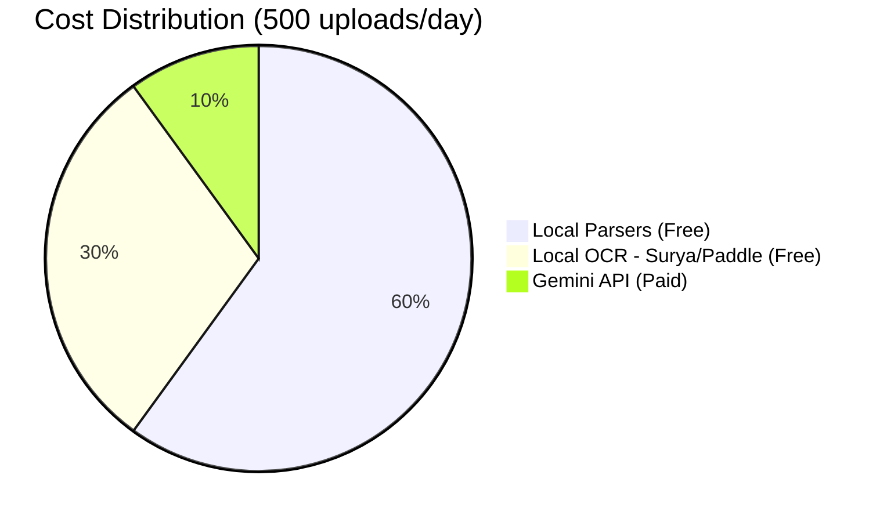

### Scenario A: Small Business (50 uploads/day)

| Item | Volume | Method | Monthly Cost |
|------|--------|--------|-------------|
| DOCX/XLSX/CSV/TXT | 25/day | Local parsers | **$0.00** |
| Native PDFs | 10/day | PyMuPDF | **$0.00** |
| Scanned docs (tables) | 10/day | PaddleOCR | **$0.00** |
| Graphs/Charts | 5/day | Gemini 2.0 Flash | **~$0.01/month** |
| **TOTAL** | | | **~$0.01/month** |

### Scenario B: Medium Business (500 uploads/day)

| Item | Volume | Method | Monthly Cost |
|------|--------|--------|-------------|
| DOCX/XLSX/CSV/TXT | 250/day | Local parsers | **$0.00** |
| Native PDFs | 100/day | PyMuPDF | **$0.00** |
| Scanned docs | 100/day | Surya + PaddleOCR | **$0.00** |
| Graphs/Charts | 50/day | Gemini 2.5 Flash | **~$0.50/month** |
| **TOTAL** | | | **~$0.50/month** |

### Scenario C: Heavy Usage (2,000 uploads/day)

| Item | Volume | Method | Monthly Cost |
|------|--------|--------|-------------|
| DOCX/XLSX/CSV/TXT | 1,000/day | Local parsers | **$0.00** |
| Native PDFs | 400/day | PyMuPDF | **$0.00** |
| Scanned docs | 400/day | Surya + PaddleOCR | **$0.00** |
| Graphs/Charts | 150/day | Gemini 2.5 Flash | **~$1.50/month** |
| Low confidence fallback | 50/day | Gemini 2.5 Flash | **~$0.50/month** |
| **TOTAL** | | | **~$2.00/month** |

**Bottom line:** Multi-OCR Hybrid is extremely cost-effective — 90%+ processing is free.

---

## 9. Python Libraries Required

### New Dependencies (add to `requirements.txt`)

```text
# ============================================
# FILE UPLOAD & OCR DEPENDENCIES
# ============================================

# Local OCR Engines (FREE)
surya-ocr>=0.6.0              # Best layout + general OCR
paddlepaddle>=2.6.0           # PaddlePaddle framework
paddleocr>=2.7.0              # Table structure (PP-Structure)

# Document Parsers (FREE)
python-docx>=1.1.0            # .docx parsing
openpyxl>=3.1.0               # .xlsx parsing
PyMuPDF>=1.24.0               # PDF text extraction
pandas>=2.2.0                 # CSV/Excel + data structuring
Pillow>=10.0.0                # Image format conversion

# Gemini API (for graphs + fallback)
google-generativeai>=0.8.0    # Direct Gemini API

# File Handling
python-multipart>=0.0.9       # FastAPI multipart upload
aiofiles>=24.1.0              # Async file I/O
python-magic>=0.4.27          # MIME type detection
```

### Already Installed (no changes needed)

```text
langchain-google-genai        # Already in requirements.txt
fastapi                       # Already in requirements.txt
pydantic                      # Already in requirements.txt
```

### System Dependencies

For **Docker**, add to Dockerfile:

```dockerfile
# Required for python-magic
RUN apt-get update && apt-get install -y --no-install-recommends \
    libmagic1 \
    && rm -rf /var/lib/apt/lists/*
```

**No Tesseract needed!** Surya and PaddleOCR handle all OCR locally.

---

## 10. Implementation Plan (Step-by-Step)

### Architecture Overview

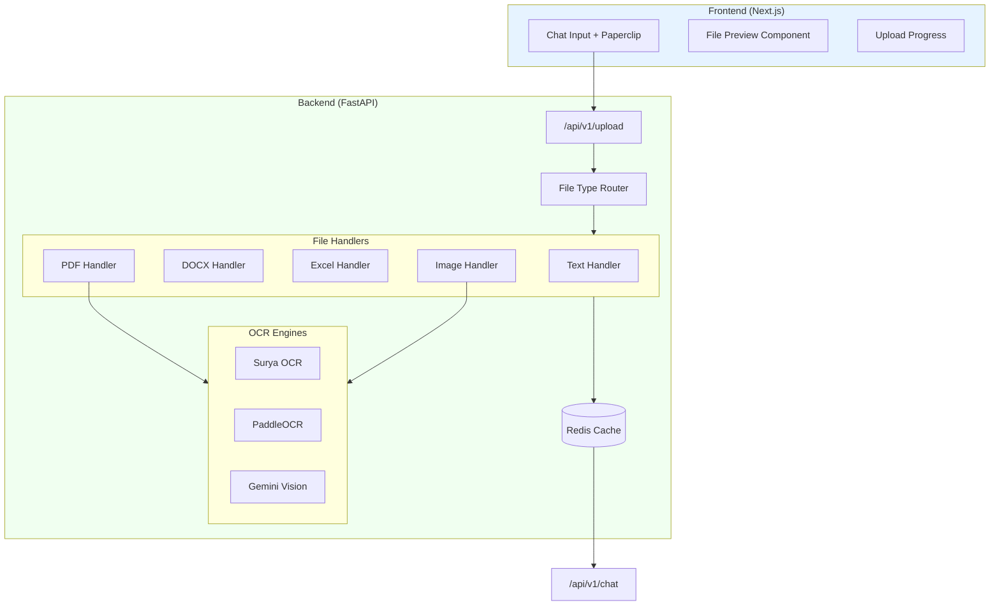

### Phase 1: Backend — File Processing Service

**Step 1.1: Create file processing module structure**

```
app/
  services/
    file_processing/
      __init__.py
      router.py           # Routes file to correct handler
      text_handler.py     # .txt, .md, .csv, .tex
      docx_handler.py     # .docx
      excel_handler.py    # .xlsx, .xls
      pdf_handler.py      # .pdf (native + scanned)
      image_handler.py    # .png, .jpg, etc.
      ocr/
        __init__.py
        surya_ocr.py      # Surya OCR integration
        paddle_ocr.py     # PaddleOCR integration
        gemini_ocr.py     # Gemini Vision API
      models.py           # Pydantic schemas
```

**Step 1.2: Define standardized output schema**

```python
from pydantic import BaseModel

class ExtractedContent(BaseModel):
    text: str                      # Extracted plain text
    structured_data: dict | None   # Tables, key-value pairs
    metadata: dict                 # Page count, method, confidence
    markdown: str                  # Formatted for chat display

class ExtractionMetadata(BaseModel):
    file_type: str
    pages: int | None
    extraction_method: str         # "pymupdf", "surya", "paddle", "gemini"
    confidence: float              # 0.0 - 1.0
    tokens_used: int               # 0 for local, >0 for Gemini
    processing_time_ms: int
```

**Step 1.3: Implement OCR selection logic**

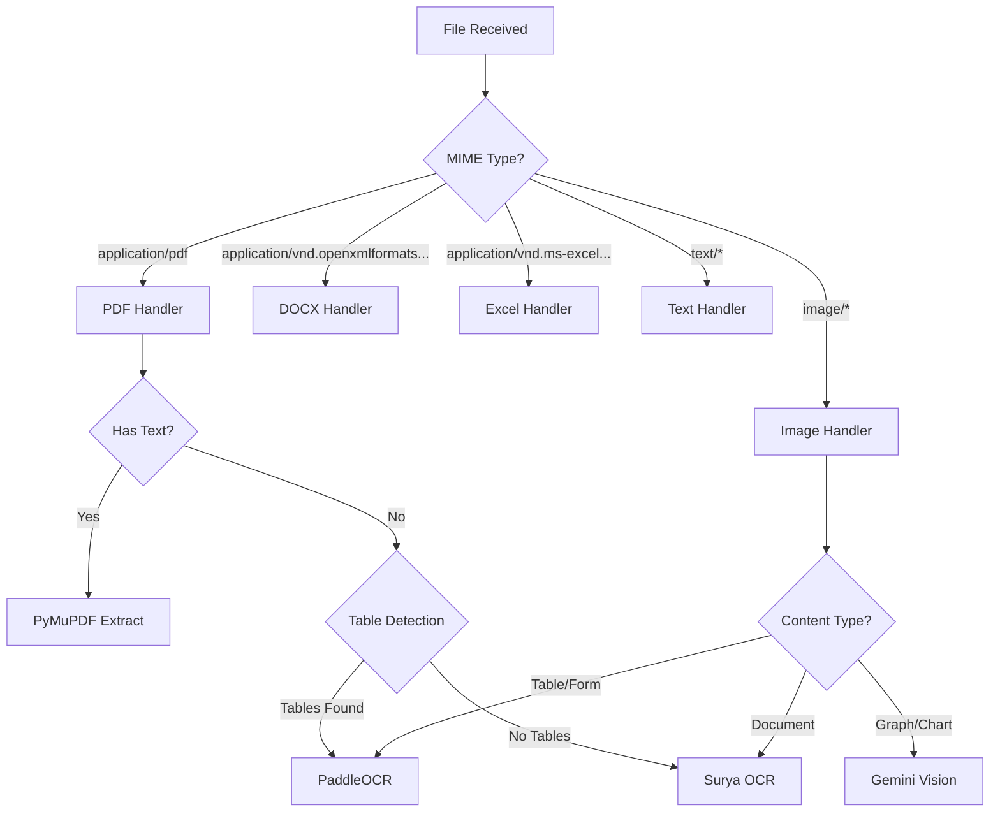

### Phase 2: Backend — Upload Endpoint

**Step 2.1: Create upload API endpoint**

```
POST /api/v1/upload
  - Accept: multipart/form-data
  - Fields: file (binary), session_id (optional)
  - Validate: file size (max 50MB), file type (allowlist)
  - Process: extract content via file processing service
  - Return: { file_id, extracted_content, metadata }
```

**Step 2.2: File storage strategy**

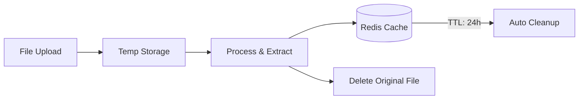

### Phase 3: Backend — Chat Integration

**Step 3.1: Extend chat to accept file context**

```python
class ChatRequest(BaseModel):
    message: str
    session_id: str | None = None
    file_ids: list[str] | None = None  # NEW FIELD
```

**Step 3.2: Context injection flow**

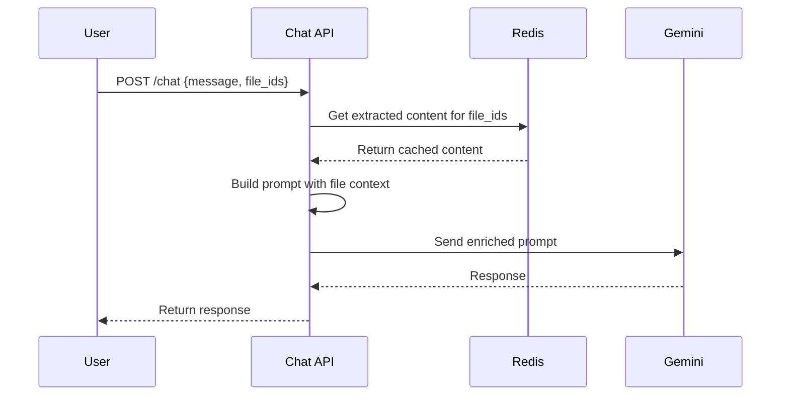

### Phase 4: Frontend — Upload UI

**Step 4.1: Component architecture**

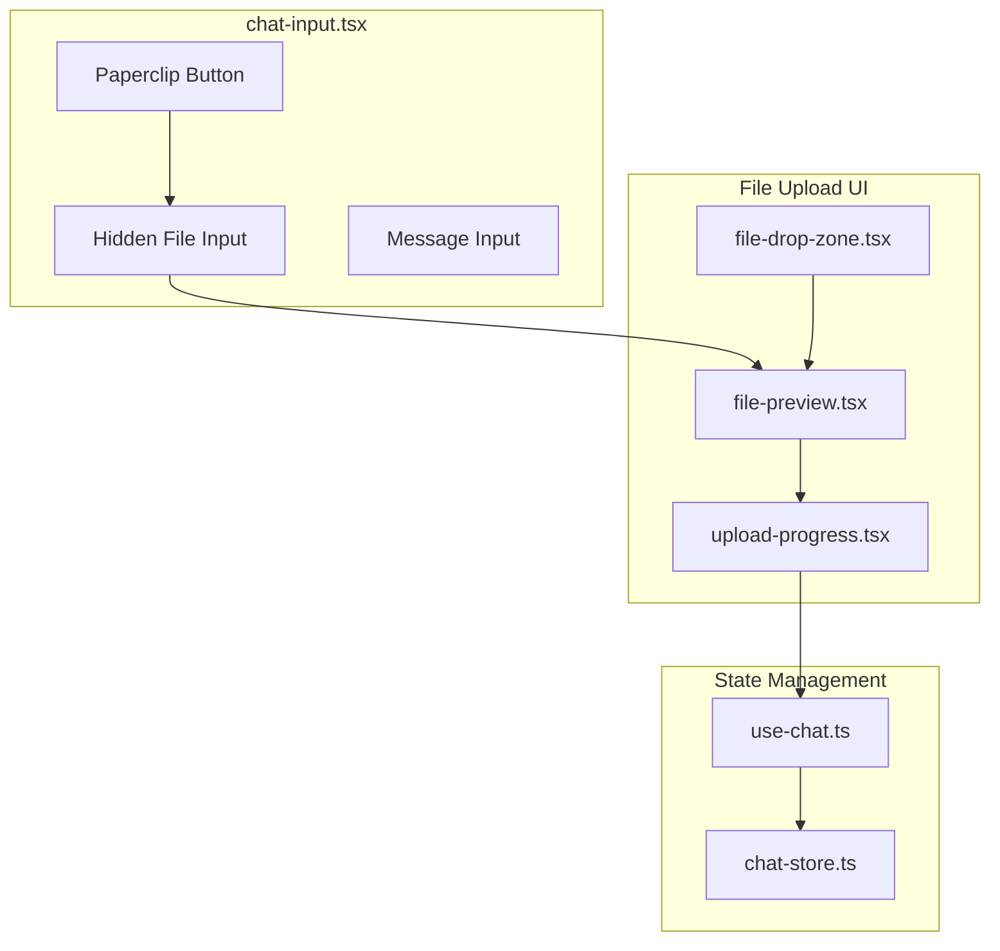

**Step 4.2: Files to modify**

| File | Change |
|------|--------|
| `chat-input.tsx` | Wire paperclip to file input, add upload logic |
| `chat-store.ts` | Add pending files state |
| `use-chat.ts` | Handle file uploads in send flow |
| `message-bubble.tsx` | Render file attachments |

**Step 4.3: New components to create**

| Component | Purpose |
|-----------|---------|
| `file-preview.tsx` | File card (icon, name, size) |
| `file-drop-zone.tsx` | Drag & drop overlay |
| `upload-progress.tsx` | Progress bar during upload |

### Phase 5: Polish & Edge Cases

- [ ] Handle password-protected PDFs
- [ ] Handle corrupted files gracefully
- [ ] File size validation (frontend + backend)
- [ ] Rate limiting on upload endpoint
- [ ] Logging & monitoring for OCR costs
- [ ] Image resize before Gemini (max 2048px)

---

## 11. API Design

### Upload Endpoint

```
POST /api/v1/upload
Content-Type: multipart/form-data

Request:
  - file: binary (required)
  - session_id: string (optional)

Response (200):
{
  "file_id": "uuid",
  "filename": "invoice.pdf",
  "file_type": "application/pdf",
  "file_size": 245000,
  "extraction": {
    "text": "Invoice #1234\nDate: 2026-01-15\n...",
    "structured_data": {
      "invoice_number": "1234",
      "date": "2026-01-15",
      "items": [...]
    },
    "markdown": "## Invoice #1234\n\n| Item | Qty | Price |\n|...",
    "method": "paddle_ocr",
    "confidence": 0.95,
    "pages": 3,
    "tokens_used": 0
  }
}

Response (400): { "error": "File type not supported" }
Response (413): { "error": "File too large (max 50MB)" }
Response (422): { "error": "Could not extract content from file" }
```

### Extended Chat Endpoint

```
POST /api/v1/chat
{
  "message": "What is the total amount on this invoice?",
  "session_id": "...",
  "file_ids": ["uuid-1", "uuid-2"]  // NEW FIELD
}
```

### Upload Flow Sequence

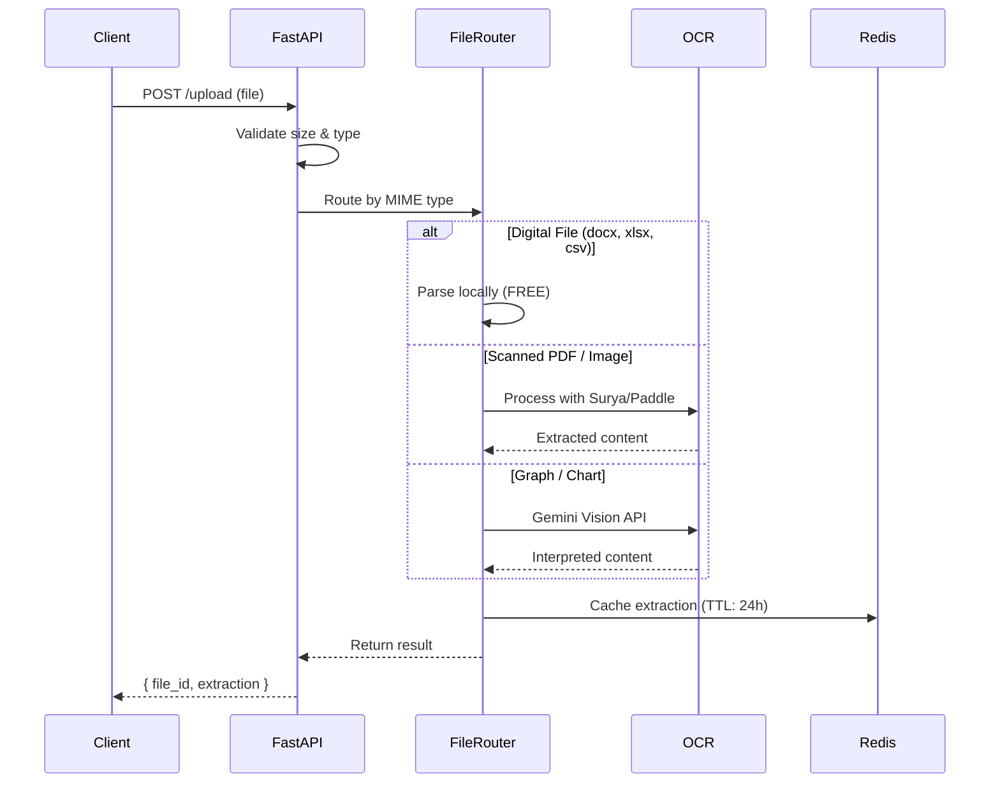

---

## 12. Frontend Changes

### Files to Modify

| File | Change |
|------|--------|
| `src/components/chat/chat-input.tsx` | Wire paperclip button to file input, add upload logic |
| `src/lib/api/upload.ts` | New file — upload API client |
| `src/types/chat.ts` | Add `FileAttachment` type, extend `SendMessageRequest` |
| `src/lib/hooks/use-chat.ts` | Handle file uploads in send flow |
| `src/components/chat/message-bubble.tsx` | Render file attachments in messages |
| `src/stores/chat-store.ts` | Add pending files state |

### New Components to Create

| Component | Purpose |
|-----------|---------|
| `file-preview.tsx` | Shows file card (icon, name, size) before/after upload |
| `file-drop-zone.tsx` | Drag & drop overlay for chat area |
| `upload-progress.tsx` | Progress bar during upload/extraction |

### UI State Flow

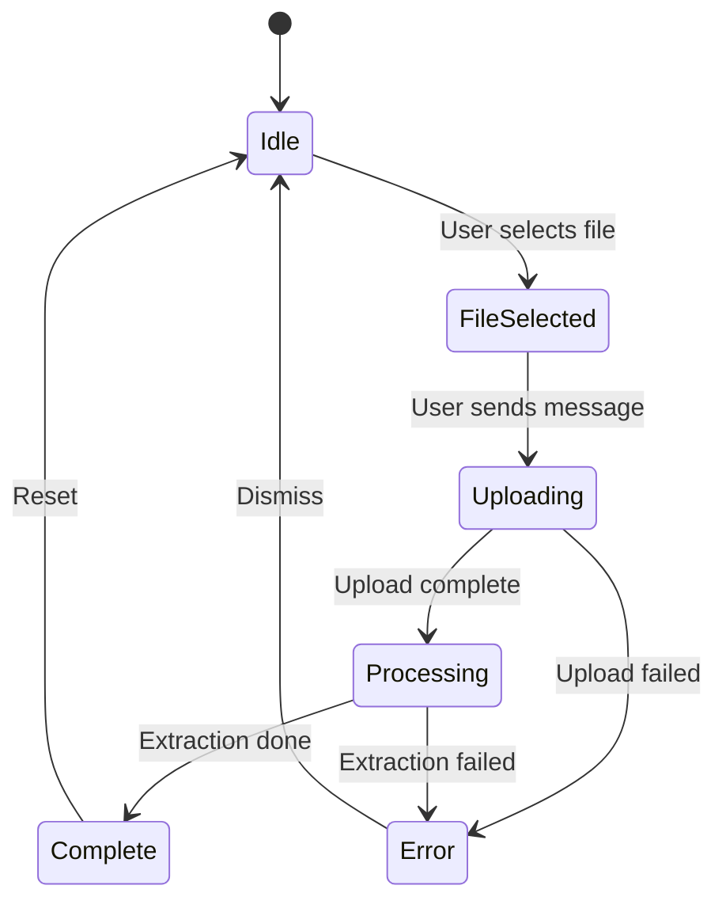

---

## 13. Risks & Considerations

### Technical Risks

| Risk | Mitigation |
|------|------------|
| Large files (>50MB) timeout | Reject with clear error, suggest splitting |
| Scanned PDF detection fails | Default to OCR if PyMuPDF returns < 50 chars/page |
| OCR confidence too low | Fallback to Gemini for verification |
| PaddleOCR/Surya model loading slow | Lazy load on first use, keep in memory |
| Gemini rate limits | Queue excess, use free tier (1,500 RPD) |
| Password-protected files | Detect and return user-friendly error |
| Malicious file uploads | Validate MIME type server-side, size limits |

### Cost Risks

| Scenario | Risk | Mitigation |
|----------|------|------------|
| 100+ page PDF | High processing time | Set page limit (50 pages) |
| Abuse/spam uploads | Unnecessary compute | Rate limit per user (20/hour) |
| Large images (4K+) | Slow processing | Resize to max 2048px |
| All graphs sent to Gemini | Higher API cost | Image classifier to detect graphs |

### Security

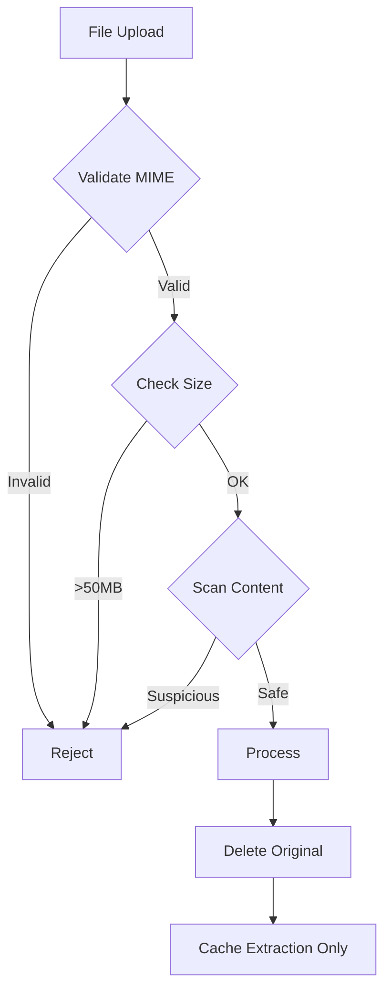

**Security Rules:**
- **Never execute uploaded files** — only parse/read
- **Validate file types server-side** using `python-magic`
- **Sanitize extracted content** before prompt injection
- **Temporary storage only** — delete files after extraction
- **No file paths in responses** — only UUIDs

---

## 14. Sources

### OCR Libraries & Comparisons
- [Surya OCR — GitHub](https://github.com/VikParuchuri/surya)
- [PaddleOCR — GitHub](https://github.com/PaddlePaddle/PaddleOCR)
- [Best PDF OCR Software 2026 — Unstract](https://unstract.com/blog/best-pdf-ocr-software/)
- [AI OCR Models Comparison — IntuitionLabs](https://intuitionlabs.ai/articles/ai-ocr-models-pdf-structured-text-comparison)
- [Document Extraction: LLMs vs OCRs — Vellum](https://www.vellum.ai/blog/document-data-extraction-llms-vs-ocrs)

### Gemini API & Pricing
- [Gemini API Pricing — Official](https://ai.google.dev/gemini-api/docs/pricing)
- [Gemini Document Understanding — Official](https://ai.google.dev/gemini-api/docs/document-processing)
- [Gemini Files API — Official](https://ai.google.dev/gemini-api/docs/files)
- [Structured Data from PDFs with Gemini — Phil Schmid](https://www.philschmid.de/gemini-pdf-to-data)

### Document Processing
- [PyMuPDF Documentation](https://pymupdf.readthedocs.io/)
- [python-docx Documentation](https://python-docx.readthedocs.io/)
- [openpyxl Documentation](https://openpyxl.readthedocs.io/)

### Open Source References
- [Google Cloud Document Processing Notebook](https://github.com/GoogleCloudPlatform/generative-ai/blob/main/gemini/use-cases/document-processing/document_processing.ipynb)
- [gemini-ocr — GitHub](https://github.com/skitsanos/gemini-ocr)