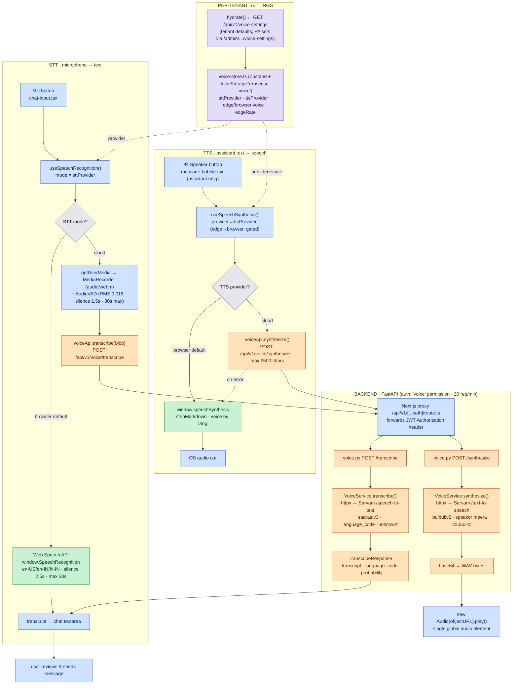
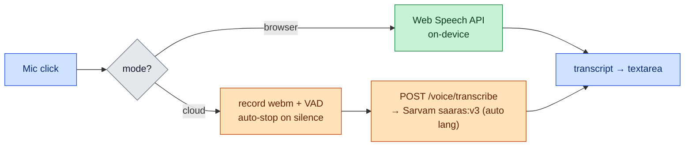
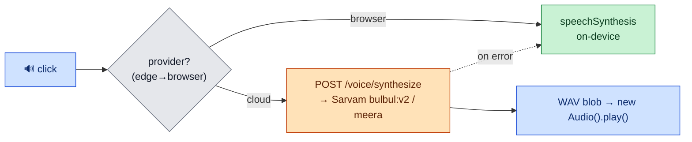

# ERPSense Voice — Complete Flow, Engines & Settings (Source of Truth)

> **Scope:** The full **voice feature** (microphone → text **STT**, and text → speech **TTS**), end‑to‑end across
> the backend (`erpsense-backend`, FastAPI) and frontend (`erpsense-frontend`, Next.js 14).
>
> **What we actually use today:**
> - **STT (speech‑to‑text):** browser **Web Speech API** (default, on‑device) *or* **Sarvam AI** cloud (`saaras:v3`).
> - **TTS (text‑to‑speech):** browser **`speechSynthesis`** (effective default, on‑device) *or* **Sarvam AI** cloud
>   (`bulbul:v2`, speaker `meera`, WAV).
> - **Microsoft Edge TTS** is fully implemented (`edge_tts`, 10 neural voices, streaming MP3) but **force‑disabled**
>   on the frontend (`edge → browser`) — documented in the [Appendix](#appendix--implemented-but-currently-off).
>
> Colors in the diagrams: 🟦 frontend/transport · 🟩 on‑device (free) · 🟧 cloud Sarvam (paid/external) ·
> 🟪 backend services + settings · ⬜ decision points.

---

## 1. TL;DR

The voice feature has two independent halves. **STT:** the mic button in the chat composer runs
`useSpeechRecognition()`; in **browser mode** (default) it uses the on‑device **Web Speech API**, and in **cloud
mode** it records `audio/webm` with a **VAD** (auto‑stop on silence) and uploads the clip to
`POST /voice/transcribe`, which proxies to **Sarvam `saaras:v3`** with **auto language detection**; the transcript
is dropped into the message box. **TTS:** the 🔊 button on an assistant message runs `useSpeechSynthesis()`; in
**browser mode** (effective default) it speaks via the OS `speechSynthesis`, and in **cloud mode** it calls
`POST /voice/synthesize` → **Sarvam `bulbul:v2`** (speaker `meera`) → **WAV** → played through an `<audio>` element.
Which engine runs is chosen **per tenant** (admin‑configured `voice-settings`, hydrated into a Zustand store).
Cloud failures **gracefully fall back to the browser engine**; missing `SARVAM_API_KEY` returns **503**.

---

## 2. What's used (engine matrix)

| Direction | Engine | Where it runs | Model / API | Output | Status |
|---|---|---|---|---|---|
| **STT** | Web Speech API | **browser (on‑device)** | `window.SpeechRecognition` | text | ✅ default |
| **STT** | Sarvam AI | cloud | `saaras:v3`, `/speech-to-text`, lang `unknown`=auto | text + lang | ✅ used (when `stt_provider=cloud`) |
| **TTS** | `speechSynthesis` | **browser (on‑device)** | OS voices | audio (OS) | ✅ effective default |
| **TTS** | Sarvam AI | cloud | `bulbul:v2`, speaker `meera`, 22050 Hz, `/text-to-speech` | **WAV** | ✅ used (when `tts_provider=cloud`) |
| **TTS** | Microsoft Edge TTS | cloud (free, no key) | `edge_tts` WebSocket, 10 voices | **MP3 (stream)** | ⚠️ built but **force‑disabled** → browser |

---

## 3. MASTER FLOWCHART — the complete voice pipeline



### 3a. ASCII master flow

```
                         PER-TENANT SETTINGS
        voice-store.ts (Zustand, localStorage 'erpsense-voice')
        hydrate() ← GET /api/v1/voice-settings  (PA sets via /admin/.../voice-settings)
                 │ sttProvider / ttsProvider / voice / rate
   ┌─────────────┴──────────────┐
   ▼                            ▼
== STT (mic → text) ==        == TTS (assistant text → speech) ==
Mic button (chat-input.tsx)   🔊 Speaker (message-bubble.tsx)
useSpeechRecognition(mode)    useSpeechSynthesis(provider)   [edge → browser, gated]
   │                              │
   ├─ browser (default) ──► Web Speech API (on-device, free)      ├─ browser (default) ─► speechSynthesis (on-device, free)
   │     2.5s silence, 30s max, dedup for hi-IN                   │     stripMarkdown, voice by lang
   │        └─► transcript → chat textarea                        │        └─► OS audio out
   │                                                              │
   └─ cloud ─► getUserMedia → MediaRecorder(webm) + VAD           └─ cloud ─► voiceApi.synthesize({text, lang})  (max 2500 ch)
           (RMS 0.015, 1.5s silence)                                       POST /api/v1/voice/synthesize
           voiceApi.transcribe(blob)                                              │
           POST /api/v1/voice/transcribe                                          ▼
                  │                                              Next.js proxy /api/v1/[...path] (forwards JWT)
                  ▼                                                               │
   Next.js proxy /api/v1/[...path] (forwards JWT)                                 ▼
                  │                                              voice.py /synthesize → VoiceService.synthesize
                  ▼                                              httpx → Sarvam /text-to-speech
   voice.py /transcribe → VoiceService.transcribe                 bulbul:v2 · speaker meera · 22050 Hz
   httpx → Sarvam /speech-to-text                                          │ base64 → WAV bytes
     saaras:v3 · language_code='unknown' (auto)                            ▼
            │ TranscribeResponse                              new Audio(objectURL).play()  (single global audio)
            ▼  {transcript, language_code, probability}        (on error → browser speechSynthesis fallback)
   transcript → chat textarea → user sends
```

---

## 4. Stage‑by‑stage, with exact file names

### 4a. STT — microphone → text

| Step | File | Detail |
|---|---|---|
| Mic UI | [`chat-input.tsx`](../../erpsense-frontend/src/components/chat/chat-input.tsx) | mic button; `Mic`→`MicOff`→`Loader2` by phase; live timer, "(max 30s)" at 25s |
| Hook | [`use-speech-recognition.ts`](../../erpsense-frontend/src/lib/hooks/use-speech-recognition.ts) | unified `useSpeechRecognition({lang:'en-IN', mode})`; phases `idle→listening→processing` |
| Browser STT | same hook (`useBrowserSpeechRecognition`) | Web Speech API, `continuous`+`interimResults`, silence **2.5s**, max **30s**, `deduplicateTranscript()` for hi‑IN/en‑IN overlap |
| VAD | [`audio-vad.ts`](../../erpsense-frontend/src/lib/utils/audio-vad.ts) | Web Audio `AnalyserNode` (fftSize 2048), RMS threshold **0.015**, silence **1500ms**, poll **100ms**, max **30s** |
| API client | [`voice.ts`](../../erpsense-frontend/src/lib/api/voice.ts) | `transcribe(blob)` → `FormData{file}` → `POST /api/v1/voice/transcribe`, 30s timeout |
| Endpoint | [`voice.py`](../../erpsense-backend/app/api/v1/endpoints/voice.py) | `transcribe_audio()`; pre‑flight 5MB guard; JWT auth; 20/min |
| Service | [`voice_service.py`](../../erpsense-backend/app/services/voice_service.py) | `VoiceService.transcribe()` → Sarvam `/speech-to-text`, multipart, `language_code="unknown"`, model `saaras:v3` |
| Response | [`schemas/voice.py`](../../erpsense-backend/app/schemas/voice.py) | `TranscribeResponse{success, transcript, language_code, language_probability, error}` |

**STT flow (mermaid):**



### 4b. TTS — assistant text → speech

| Step | File | Detail |
|---|---|---|
| Speaker UI | [`message-bubble.tsx`](../../erpsense-frontend/src/components/chat/message-bubble.tsx) | 🔊 on assistant messages; `Volume2`↔`VolumeX`; pulses while speaking; error → toast |
| Hook | [`use-speech-synthesis.ts`](../../erpsense-frontend/src/lib/hooks/use-speech-synthesis.ts) | `useSpeechSynthesis()`; `effectiveProvider = edge ? browser : ttsProvider`; stops inactive providers; single global `<audio>` |
| Browser TTS | same hook (`useBrowserSpeechSynthesis`) | `window.speechSynthesis`; `stripMarkdown`; voice = `browserVoiceName` or lang‑match |
| Cloud TTS | same hook (`useCloudSpeechSynthesis`) | max **2500** chars → `voiceApi.synthesize({text, target_language_code})` → WAV blob → `new Audio()` |
| API client | [`voice.ts`](../../erpsense-frontend/src/lib/api/voice.ts) | `synthesize()` (WAV) and `synthesizeEdge()` (MP3), `responseType:'blob'`, 30s timeout |
| Endpoint | [`voice.py`](../../erpsense-backend/app/api/v1/endpoints/voice.py) | `synthesize_speech()` → `Response(media_type="audio/wav")` |
| Service | [`voice_service.py`](../../erpsense-backend/app/services/voice_service.py) | `VoiceService.synthesize()` → Sarvam `/text-to-speech`, JSON `{inputs:[text], target_language_code, speaker:meera, model:bulbul:v2, pace, sample_rate:22050}` → base64 → WAV |
| Edge (gated) | [`edge_tts_service.py`](../../erpsense-backend/app/services/edge_tts_service.py) | `edge_tts` WebSocket, MP3 stream, 10 voices, rate presets — see Appendix |

**TTS flow (mermaid):**



---

## 5. Backend API surface

Mounted under **`/api/v1/voice`** in [`router.py`](../../erpsense-backend/app/api/v1/router.py), guarded by
`require_permission('voice', Action.READ)`, JWT auth (`get_current_active_user`), and a **20 req/min** rate limit.

| Method · Path | Engine | Request | Response |
|---|---|---|---|
| `POST /api/v1/voice/transcribe` | Sarvam STT `saaras:v3` | `multipart/form-data` (audio ≤ 5 MB, webm/wav/mp3/ogg) | `TranscribeResponse` (JSON) |
| `POST /api/v1/voice/synthesize` | Sarvam TTS `bulbul:v2` | JSON `{text, target_language_code, pace?}` | `audio/wav` (buffered) |
| `POST /api/v1/voice/synthesize/edge` | Edge TTS (free) | JSON `{text, voice?, rate?}` | `audio/mpeg` (**streamed**) |
| `GET /api/v1/voice/edge/voices` | Edge voice list | — | `{voices:[…]}` |

**Errors (codes from [`exceptions/chat.py`](../../erpsense-backend/app/core/exceptions/chat.py)):**

| Code | Meaning | HTTP |
|---|---|---|
| `VOICE_002` | `SARVAM_API_KEY` not configured | **503** |
| `VOICE_010` | Unsupported audio format | 400 |
| `VOICE_011` | Audio > 5 MB | 413 |
| `VOICE_003` | Sarvam API non‑200 | 502 |
| `VOICE_007` | Sarvam timeout (30s httpx) | 502 |
| `VOICE_020/021` | Unknown Edge voice / rate | 400 |

---

## 6. Per‑tenant voice settings

Stored as a JSONB sub‑object `tenant.settings['voice']`
([`tenant_voice_settings_service.py`](../../erpsense-backend/app/services/tenant_voice_settings_service.py)).
Read at runtime via **`GET /api/v1/voice-settings`** (tenant admin+); configured by Platform Admin via
**`PUT /api/v1/admin/tenants/{tenant_id}/voice-settings`** (full‑body replace). The frontend
[`voice-store.ts`](../../erpsense-frontend/src/stores/voice-store.ts) `hydrate()`s these on app start.

| Field | Type | Default | Controls |
|---|---|---|---|
| `stt_provider` | `browser` \| `cloud` | **`browser`** | STT engine (Web Speech vs Sarvam) |
| `tts_provider` | `browser` \| `edge` \| `cloud` | **`edge`** ⚠️ | TTS engine — but FE coerces **`edge → browser`** |
| `edge_voice_name` | string \| null | `andrew` | Edge voice (when Edge enabled) |
| `edge_rate` | `slow`\|`normal`\|`fast` | `normal` | Edge speed preset |
| `browser_voice_name` | string \| null | `null` | browser voice (null = auto by language) |

> ⚠️ **Live behavior nuance:** the tenant default is `tts_provider="edge"`, yet
> [`use-speech-synthesis.ts:369`](../../erpsense-frontend/src/lib/hooks/use-speech-synthesis.ts#L369) maps
> `edge → browser` ("not yet production‑ready"). So the **effective default TTS is the on‑device browser voice**,
> not Edge. Settings are **per‑tenant only** — individual users cannot override.

---

## 7. Transport, auth & language

- **Transport:** all voice calls go through the Next.js proxy
  [`app/api/v1/[...path]/route.ts`](../../erpsense-frontend/src/app/api/v1/%5B...path%5D/route.ts). The axios client
  ([`client.ts`](../../erpsense-frontend/src/lib/api/client.ts)) attaches the **JWT `Authorization` header**, which
  the proxy **forwards** to the backend (it does not mint tokens itself).
- **Config / enablement** ([`config.py:529‑537`](../../erpsense-backend/app/config.py#L529)):
  `sarvam_api_key` (empty ⇒ **voice disabled, 503**), `sarvam_api_base_url=https://api.sarvam.ai`,
  `sarvam_stt_model=saaras:v3`, `sarvam_tts_model=bulbul:v2`, `sarvam_tts_speaker=meera`,
  `sarvam_tts_sample_rate=22050`, `sarvam_max_audio_size_bytes=5 MB`, `voice_rate_limit_per_minute=20`.
  Edge TTS needs **no key** (WebSocket to Microsoft). `.env.example` notes Sarvam free credits at
  `console.sarvam.ai`.
- **Language asymmetry:** **STT auto‑detects** language (`language_code="unknown"` → Sarvam returns
  `language_code` + `language_probability`). **TTS must be told** the language (`target_language_code`, default
  `hi-IN` backend / `en-IN` frontend). The browser engines use BCP‑47 langs `en-US`/`en-IN`/`hi-IN`.

---

## 8. Reliability & UX behaviors

- **Graceful fallback:** cloud STT/TTS errors degrade to the browser Web Speech engines; a missing key surfaces a
  503 and the UI keeps working with on‑device voice.
- **Single‑playback guarantee:** a module‑level `_globalActiveAudio` pauses any prior `<audio>` before a new one
  starts, so two messages never speak at once.
- **VAD auto‑stop** (cloud STT) ends recording after **1.5 s of silence** (RMS < 0.015) or **30 s** max, so the
  user doesn't have to press stop.
- **Indian‑language dedup:** `deduplicateTranscript()` removes the overlapping/repeated segments the Web Speech API
  emits for `hi-IN`/`en-IN`.
- **Markdown stripping:** all TTS text passes through `stripMarkdown()` so `**bold**`/`##headings` aren't read out.
- **Abort on restart:** each new `speak()`/listen aborts the in‑flight fetch (`AbortController`) and revokes blob
  URLs to avoid leaks.

---

## 9. Quick reference — constants & defaults

| Constant | Value | File |
|---|---|---|
| STT default mode | `browser` | `voice-store.ts` |
| TTS effective default | `browser` (edge gated off) | `use-speech-synthesis.ts` |
| Browser STT silence / max | 2.5 s / 30 s | `use-speech-recognition.ts` |
| VAD RMS / silence / poll / max | 0.015 / 1.5 s / 100 ms / 30 s | `audio-vad.ts` |
| Cloud audio upload format | `audio/webm` | `use-speech-recognition.ts` |
| Max audio upload | 5 MB | `config.py` / `voice.py` |
| Cloud TTS / Edge TTS max chars | 2500 / 5000 | `use-speech-synthesis.ts` |
| Sarvam STT model | `saaras:v3` | `config.py` |
| Sarvam TTS model / speaker / rate | `bulbul:v2` / `meera` / 22050 Hz | `config.py` |
| API timeouts (FE / BE httpx) | 30 s / 30 s | `voice.ts` / `voice_service.py` |
| Rate limit | 20 req/min | `config.py` |
| localStorage key | `erpsense-voice` | `voice-store.ts` |

---

## Appendix — implemented but currently OFF

> Like the OCR "dormant" engines, these are built and reachable in code but **not active** in the live UX. Shown
> here, not in the main diagram.

### Microsoft Edge TTS (force‑disabled on the frontend)
- **Backend is fully working:** [`edge_tts_service.py`](../../erpsense-backend/app/services/edge_tts_service.py)
  uses the `edge_tts` library (WebSocket to Microsoft's neural TTS — same engine as Edge "Read Aloud", **no API key**),
  streaming **MP3** via `POST /voice/synthesize/edge`.
- **Voices (10):** `andrew, ava, brian, emma, jenny, aria, guy, roger` (en‑US) and `neerja, prabhat` (en‑IN).
- **Rate presets:** `slow -15%`, `normal +0%`, `fast +15%`, `blazing +25%`.
- **Why it's off:** the unified hook coerces `edge → browser`
  ([`use-speech-synthesis.ts:369`](../../erpsense-frontend/src/lib/hooks/use-speech-synthesis.ts#L369),
  "Edge TTS is not yet production‑ready"). Re‑enabling is a one‑line change once validated.

### Not used at all
- No **Deepgram / Whisper / ElevenLabs / Google STT‑TTS** anywhere in the active path — the only cloud voice vendor
  is **Sarvam AI**. (`@google-cloud/text-to-speech` appears only under an unrelated `erpnext-ai-search` package, not
  in `erpsense-backend`/`erpsense-frontend`.)

---

### One‑line summary
> **Voice = STT + TTS, each with an on‑device default and a Sarvam cloud option.** STT: Web Speech API (default) or
> Sarvam `saaras:v3` (auto‑language, via VAD‑gated webm upload). TTS: browser `speechSynthesis` (effective default)
> or Sarvam `bulbul:v2`/`meera` → WAV. Engine choice is **per‑tenant** (admin `voice-settings`, hydrated into a
> Zustand store); cloud failures fall back to the browser; **Edge TTS is built but gated off**.
