P# ERPSense Real-Time Communication Architecture

## Hybrid Architecture: SSE + WebSocket + HTTP

> **Document Version**: 1.0
> **Last Updated**: 2026-02-02
> **Status**: Architecture Design & Roadmap
> **Audience**: Development Team, Technical Leads, DevOps

---

## Table of Contents

1. [Executive Summary](#1-executive-summary)
2. [Current System Architecture](#2-current-system-architecture)
3. [Problem Statement](#3-problem-statement)
4. [Technology Comparison](#4-technology-comparison)
5. [Hybrid Architecture Overview](#5-hybrid-architecture-overview)
6. [Phase 1: SSE Text Streaming](#6-phase-1-sse-text-streaming)
7. [Phase 2: HTTP File Upload](#7-phase-2-http-file-upload)
8. [Phase 3: WebSocket Audio](#8-phase-3-websocket-audio)
9. [Phase 4: WebSocket Notifications](#9-phase-4-websocket-notifications)
10. [Edge Cases & Error Handling](#10-edge-cases--error-handling)
11. [Security Considerations](#11-security-considerations)
12. [Scaling & Infrastructure](#12-scaling--infrastructure)
13. [Monitoring & Observability](#13-monitoring--observability)
14. [Implementation Roadmap](#14-implementation-roadmap)
15. [Appendix: Protocol Reference](#15-appendix-protocol-reference)

---

## 1. Executive Summary

ERPSense is a conversational AI-powered ERP assistant for Indian SMEs. The current system uses **synchronous REST API calls** for all communication — the user sends a message, the server blocks for 5-15 seconds while Gemini processes, then returns the entire response at once.

This document proposes a **hybrid real-time architecture** that uses the right transport protocol for each feature:

| Feature | Transport | Why |
|---------|-----------|-----|
| AI text chat streaming | **SSE (Server-Sent Events)** | Unidirectional server-to-client streaming; simplest, most reliable |
| File upload | **HTTP Multipart** | Built-in progress tracking, resume, validation; battle-tested |
| Voice audio I/O | **WebSocket** | True bidirectional streaming required for real-time audio |
| Push notifications | **WebSocket** | Server-initiated push to client |

This hybrid approach is how production AI systems work:
- **ChatGPT, Claude, Gemini Web, GitHub Copilot** all use SSE for text streaming
- **OpenAI Realtime API, Google Gemini Live** use WebSocket for audio
- **Every major platform** uses HTTP for file uploads

---

## 2. Current System Architecture

### 2.1 Current Tech Stack

```
Frontend:  Next.js 14 | React 18 | TypeScript | Zustand | Axios | Tailwind CSS
Backend:   FastAPI (Python) | SQLAlchemy 2.0 (async) | PostgreSQL 15 | Redis 7
AI/LLM:    Google Gemini (gemini-3-flash-preview) via LangChain
ERP:       ERPNext REST API integration via httpx adapter
Auth:      JWT (access + refresh tokens) | bcrypt | Fernet encryption
Deploy:    Docker Compose | nginx | uvicorn (4 workers)
```

### 2.2 Current Chat Flow

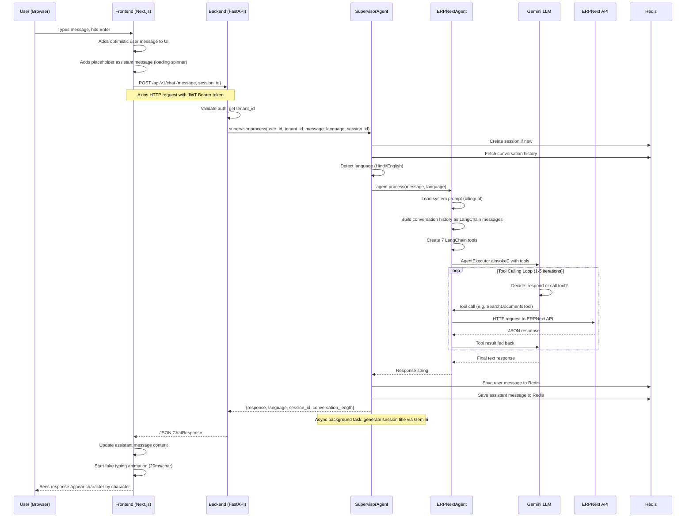

### 2.3 Current API Endpoints

```
Authentication:
  POST   /api/v1/auth/register
  POST   /api/v1/auth/login
  POST   /api/v1/auth/refresh
  POST   /api/v1/auth/logout

Chat:
  POST   /api/v1/chat                   # Send message, get response (BLOCKING)
  GET    /api/v1/chat/history            # Fetch session history from Redis
  DELETE /api/v1/chat/history            # Clear session history

Sessions:
  GET    /api/v1/chat/sessions
  POST   /api/v1/chat/sessions
  PATCH  /api/v1/chat/sessions/{id}
  DELETE /api/v1/chat/sessions/{id}

Health:
  GET    /health
  GET    /health/ready
  GET    /health/live
```

### 2.4 Current File Structure (Relevant)

```
erpsense-backend/
  app/
    main.py                          # FastAPI app, CORS, middlewares
    config.py                        # Settings (JWT, Redis, Gemini, CORS)
    api/v1/endpoints/
      chat.py                        # POST /chat, GET /history, sessions CRUD
      auth.py                        # login, register, refresh, logout
    agents/
      supervisor.py                  # Orchestrator: session, language, routing
      erpnext_agent.py               # LangChain agent with Gemini + 7 tools
    adapters/erpnext/
      adapter.py                     # ERPNext HTTP client (httpx)
      tools.py                       # LangChain tool definitions
    services/
      conversation_memory.py         # Redis conversation storage
    core/
      security.py                    # JWT generation/validation

erpsense-frontend/
  src/
    lib/api/
      chat.ts                        # chatApi: sendMessage, getHistory, sessions
      client.ts                      # Axios instance with JWT interceptor
    lib/hooks/
      use-chat.ts                    # sendMessage(), editMessage(), retryMessage()
    stores/
      chat-store.ts                  # Zustand: messages, sessions, loading state
    components/chat/
      chat-input.tsx                 # Text input + (non-functional) mic/file buttons
      message-bubble.tsx             # Message rendering with Markdown
      streaming-message.tsx          # FAKE typing animation (20ms/char client-side)
      thinking-indicator.tsx         # Generic loading animation
```

---

## 3. Problem Statement

### 3.1 User Experience Problems

**Problem 1: Long Perceived Latency**

The user sends a message and stares at a loading spinner for 5-15 seconds. In reality, Gemini starts generating tokens within 300-500ms, but the current architecture waits for the **entire** response before returning anything.

```
CURRENT EXPERIENCE:
  0s        User sends message
  0s-15s    Loading spinner (ZERO feedback) ─────────── User waiting, frustrated
  15s       Full response appears all at once
  15s-25s   Fake typing animation plays on already-received text
  25s       User can finally read complete response

WITH SSE STREAMING:
  0s        User sends message
  0.3s      First words start appearing ──────────────── User starts reading
  0.5s      "Searching your invoices..." (tool status)
  2s        Tool results arrive, more text streams
  8s        Response complete (user has been reading for 7.7 seconds already)
```

**Perceived latency drops from ~15 seconds to under 1 second.** This is the single biggest UX improvement possible.

**Problem 2: No Agent Transparency**

When Gemini calls tools (SearchDocumentsTool, GetDocumentTool, etc.), the user has no idea what is happening. The generic loading spinner gives zero insight into whether the AI is:
- Searching for documents
- Reading a specific invoice
- Creating a sales order
- Waiting for ERPNext API to respond
- Processing and formatting the response

Users lose trust when they cannot see what the system is doing.

**Problem 3: No File Support**

The Paperclip button exists in the UI but does nothing. Users cannot:
- Upload invoices for AI analysis
- Share screenshots of ERPNext errors
- Attach purchase orders for automatic data entry
- Send images of paper documents for OCR

This is a critical gap — ERP work inherently involves documents.

**Problem 4: No Voice Support**

The Mic button exists in the UI but does nothing. For Indian SME users:
- Many prefer speaking over typing (especially in Hindi)
- Field workers and warehouse staff need hands-free operation
- Voice reduces friction for non-technical users
- Hindi voice input is a strong market differentiator

### 3.2 Technical Debt

| Issue | Impact |
|-------|--------|
| **Fake streaming** — `StreamingMessage` simulates typing at 20ms/char | Misleading UX; adds unnecessary latency after response arrives |
| **No real-time channel** — No mechanism for server-initiated communication | Cannot push notifications, background task results, or cross-device sync |
| **Blocking endpoint** — `POST /api/v1/chat` ties up uvicorn worker for 5-15s | Limits server concurrency; 4 workers = max 4 simultaneous chats |
| **No file handling** — No upload endpoint, no storage, no multimodal AI | Entire document workflow category is impossible |
| **No audio pipeline** — No STT/TTS integration | Voice interaction impossible |

---

## 4. Technology Comparison

### 4.1 Transport Protocols Visualized

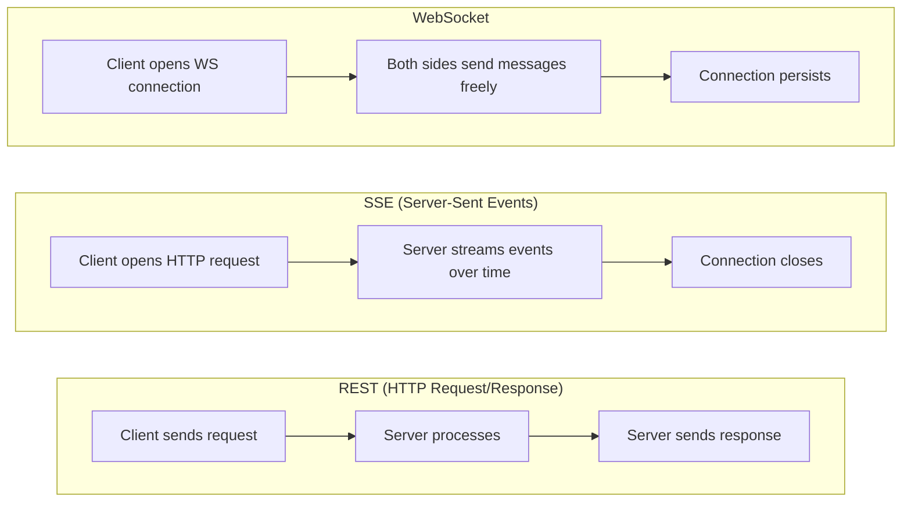

### 4.2 Detailed Comparison Matrix

| Criteria | REST | SSE | WebSocket |
|----------|------|-----|-----------|
| **Direction** | Client -> Server -> Client (one round trip) | Server -> Client (unidirectional stream) | Client <-> Server (bidirectional) |
| **Connection** | New connection per request | Held open for stream duration | Persistent, long-lived |
| **Protocol** | HTTP/1.1 or HTTP/2 | HTTP/1.1 or HTTP/2 | WS:// (protocol upgrade from HTTP) |
| **Browser Support** | Universal | Universal (EventSource API) | Universal (WebSocket API) |
| **Auto Reconnect** | N/A (stateless) | Built into browser EventSource API | Must implement manually |
| **Auth Handling** | Header per request (simple) | Header on initial request (simple) | On connect only; mid-session refresh is complex |
| **Proxy/CDN** | Works everywhere | Works everywhere (standard HTTP) | Some proxies need explicit WebSocket config |
| **Load Balancing** | Stateless, round-robin | Stateless, round-robin | Requires sticky sessions |
| **Horizontal Scaling** | Easiest | Easy | Most complex |
| **Binary Data** | Via multipart | Text only (Base64 for binary) | Native binary frame support |
| **Max Connections** | No persistent limit | ~6 per domain (HTTP/1.1) | Limited by server resources |
| **Best For** | CRUD, file upload, one-off requests | Server-push streams (LLM tokens, feeds) | Bidirectional real-time (audio, gaming) |

### 4.3 What Production AI Chat Systems Actually Use

| Product | Text Streaming | File Upload | Audio | Notifications |
|---------|---------------|-------------|-------|---------------|
| **ChatGPT** | SSE | HTTP multipart | WebSocket (Realtime API) | N/A |
| **Claude** | SSE | HTTP multipart | N/A | N/A |
| **Google Gemini Web** | SSE | HTTP multipart | WebSocket (Gemini Live) | N/A |
| **GitHub Copilot Chat** | SSE | N/A | N/A | N/A |
| **Perplexity** | SSE | N/A | N/A | N/A |
| **Slack** | WebSocket (human chat) | HTTP multipart | WebRTC (calls) | WebSocket |
| **Discord** | WebSocket (human chat) | HTTP multipart | WebRTC (voice) | WebSocket |

**Key pattern**: AI chat apps use SSE for text streaming. Human-to-human chat apps use WebSocket. The difference is the communication pattern — AI responses are unidirectional streams, human conversations are bidirectional.

### 4.4 Why NOT Use WebSocket for Everything?

It is a common assumption that WebSocket should handle all real-time features. Here is why that creates unnecessary problems:

**1. Connection State Management Overhead**

With WebSocket as sole transport, you must manually handle all of this:

```
WebSocket connection lifecycle:
  1. Initial connection + JWT authentication
  2. Heartbeat ping every 30s to detect dead connections
  3. Connection drop detection (network switch, sleep, background tab)
  4. Reconnection with exponential backoff (1s, 2s, 4s, 8s, 16s, max 30s)
  5. Message deduplication on reconnect (did client receive token #47?)
  6. Session resumption (replay missed messages from Redis buffer)
  7. Auth token refresh mid-connection (JWT expires every 24h)
  8. Multiple tab handling (user opens 3 tabs = 3 WS connections)
  9. Mobile browser background/foreground transitions
  10. Graceful shutdown on server deploy/restart
```

With SSE, items 1-6 are handled **automatically** by the browser's EventSource API. Items 7-10 are simpler because each stream is an independent HTTP request.

**2. Load Balancer Complexity**

WebSocket connections are sticky — once established, they must stay on the same server for the entire connection lifetime. This means:
- Standard round-robin load balancing doesn't work
- You need ip_hash or cookie-based session affinity
- Rolling deployments must drain existing connections gracefully
- Server failures lose all connections on that server

SSE works through standard HTTP load balancers with zero special configuration.

**3. File Upload is HTTP Regardless**

WebSocket has no built-in support for:
- `Content-Type` headers (MIME type detection)
- `Content-Length` (progress tracking)
- Chunked transfer with resume on failure
- Server-side file size rejection before receiving full upload
- CDN/proxy-level file size limits and caching

You need HTTP for files regardless, meaning "WebSocket for everything" is always a lie — it's really "WebSocket + HTTP for files."

**4. Failure Isolation**

With a single WebSocket for everything, if the WebSocket connection drops:
- Text chat stops
- Audio stops
- Notifications stop
- Everything fails simultaneously

With the hybrid approach, each transport is independent. SSE text streaming can fail while WebSocket audio continues working, and vice versa.

---

## 5. Hybrid Architecture Overview

### 5.1 High-Level Architecture Diagram

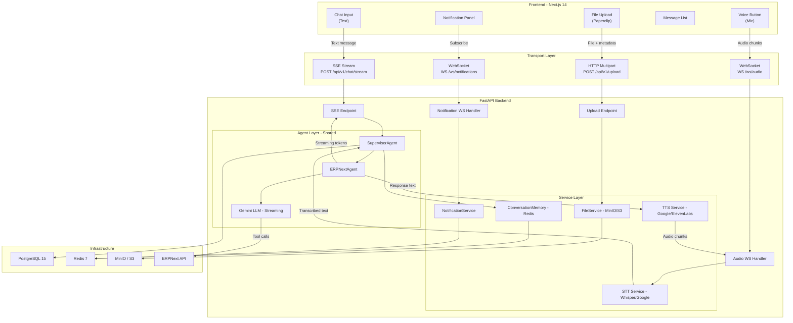

### 5.2 Transport Protocol Assignment

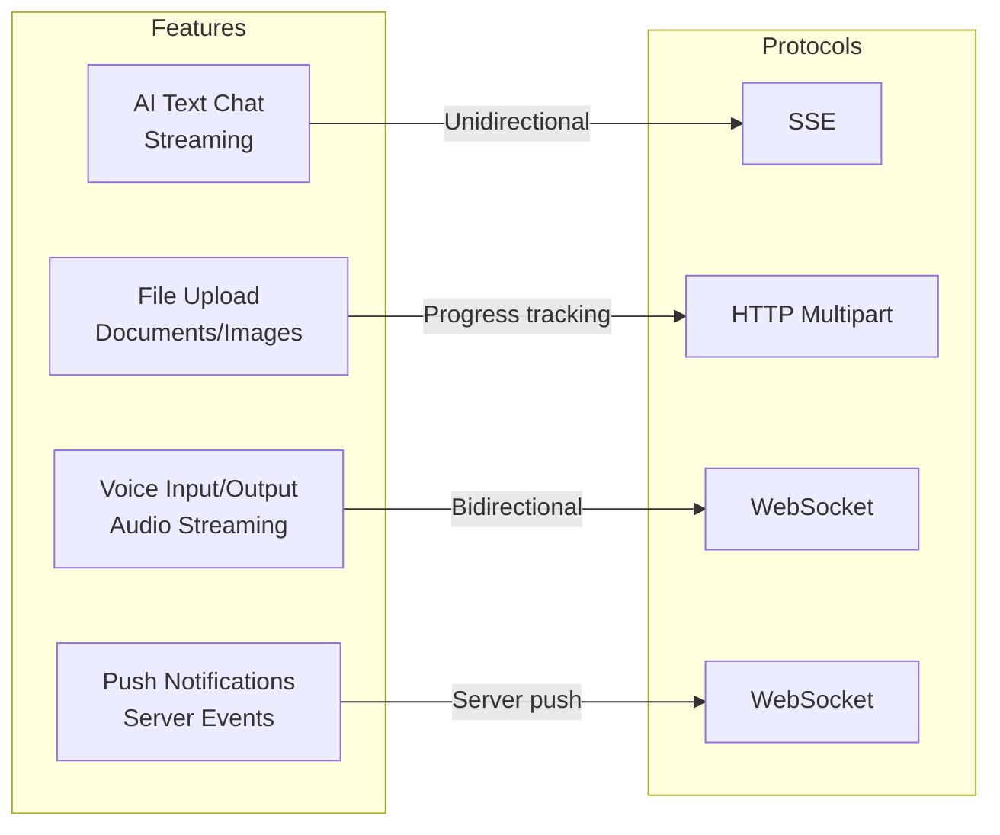

### 5.3 Why Each Transport Was Chosen

**SSE for Text Streaming**
```
Pros:
  + Matches AI chat pattern exactly (server streams to client)
  + Auto-reconnection built into browser EventSource API
  + Works through all proxies, CDNs, load balancers
  + Each request is stateless — trivial horizontal scaling
  + Auth token sent per-request — no mid-connection refresh complexity
  + Failure of one stream does not affect other features

Cons:
  - Cannot send data client-to-server over same connection
    (Not needed — user sends one message via POST body, then receives stream)
  - Max ~6 concurrent connections per domain in HTTP/1.1
    (Not an issue — only 1 active stream at a time per user)
```

**HTTP Multipart for File Upload**
```
Pros:
  + Built-in Content-Type and Content-Length headers
  + Native progress tracking (XMLHttpRequest.upload.onprogress)
  + Resumable uploads possible (tus protocol or presigned URLs)
  + Server can reject BEFORE receiving full file (size/type validation)
  + CDN/proxy-level protections (rate limiting, size limits)
  + Every web framework handles this natively

Cons:
  - Not real-time
    (Not needed — file upload is a one-time action, not a stream)
```

**WebSocket for Audio**
```
Pros:
  + True bidirectional — send mic audio while receiving TTS audio simultaneously
  + Low latency — no HTTP overhead per audio chunk
  + Native binary frame support — efficient audio transfer
  + Persistent connection — no reconnect overhead between utterances

Cons:
  - Requires sticky sessions for load balancing
  - Must implement reconnection, heartbeat, auth refresh manually
  - More complex server-side resource management
  - Justified because audio genuinely requires bidirectional streaming
```

**WebSocket for Notifications**
```
Pros:
  + Server can push events anytime without client polling
  + Lightweight persistent connection (small memory footprint per connection)
  + Single connection carries all notification types

Cons:
  - Same connection management complexity as audio WebSocket
  - Lower priority — application works without it
```

### 5.4 New API Endpoints (All Phases)

```
EXISTING (unchanged):
  POST   /api/v1/chat                   # Synchronous chat (backward compat)
  GET    /api/v1/chat/history
  DELETE /api/v1/chat/history
  GET    /api/v1/chat/sessions
  POST   /api/v1/chat/sessions
  PATCH  /api/v1/chat/sessions/{id}
  DELETE /api/v1/chat/sessions/{id}
  POST   /api/v1/auth/*
  GET    /health/*

NEW - Phase 1 (SSE):
  POST   /api/v1/chat/stream            # SSE streaming chat

NEW - Phase 2 (File Upload):
  POST   /api/v1/upload                  # Upload file (multipart)
  GET    /api/v1/upload/{file_id}        # Get file metadata
  GET    /api/v1/upload/{file_id}/download  # Get presigned download URL
  DELETE /api/v1/upload/{file_id}        # Delete file

NEW - Phase 3 (Audio):
  WS     /ws/audio                       # WebSocket audio bidirectional

NEW - Phase 4 (Notifications):
  WS     /ws/notifications               # WebSocket server push
```

---

## 6. Phase 1: SSE Text Streaming

### 6.1 Why This Is Phase 1

SSE streaming should be implemented first because:
1. **Biggest UX impact** — perceived latency drops from ~15s to <1s for every user, every message
2. **No new infrastructure** — no new Docker services, no new databases, no new external APIs
3. **Builds on existing code** — same agents, same tools, same Redis memory, same auth
4. **Prerequisite for audio** — when voice is added later, the text pipeline must already stream (otherwise voice has a 15s silence gap)
5. **Lowest risk** — additive change; existing `POST /api/v1/chat` stays for backward compatibility

### 6.2 Streaming Flow (Detailed)

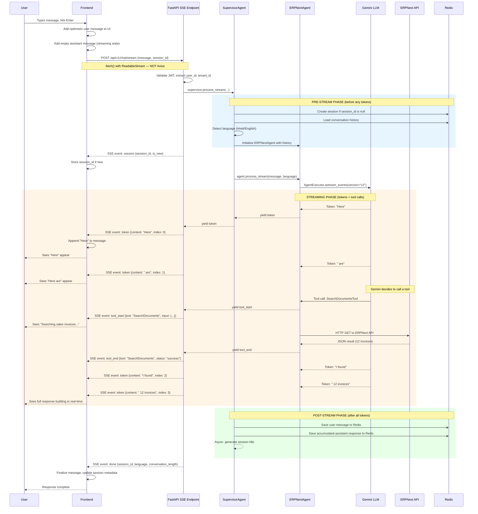

### 6.3 SSE Event Protocol

All events follow the SSE specification (RFC 8895). Format:

```
event: <event_type>\n
data: <json_payload>\n
\n
```

Each event is separated by a blank line. Lines starting with `:` are comments (used for keepalive).

#### Complete Event Type Reference

**`session` — Session metadata (always sent first)**
```
event: session
data: {"session_id": "550e8400-e29b-41d4-a716-446655440000", "is_new": true}
```
Purpose: Frontend stores session_id before tokens arrive. Sent after pre-stream phase completes.

**`token` — LLM text token (bulk of the stream)**
```
event: token
data: {"content": "Here", "index": 0}

event: token
data: {"content": " are your", "index": 1}

event: token
data: {"content": " recent invoices", "index": 2}
```
Purpose: Each token appended to the assistant message in real-time. `index` enables deduplication if client reconnects mid-stream.

**`tool_start` — Agent begins a tool call**
```
event: tool_start
data: {"tool": "SearchDocumentsTool", "call_id": "tc_001", "input": {"doctype": "Sales Invoice", "filters": {"status": "Unpaid"}}}
```
Purpose: Frontend shows contextual status: "Searching unpaid sales invoices..." instead of generic spinner.

**`tool_end` — Tool call completed**
```
event: tool_end
data: {"tool": "SearchDocumentsTool", "call_id": "tc_001", "status": "success", "summary": "Found 12 results"}
```
Purpose: Paired with `tool_start` via `call_id`. Frontend clears tool status indicator.

**`error` — Error occurred mid-stream**
```
event: error
data: {"code": "GEMINI_UNAVAILABLE", "message": "AI service temporarily unavailable. Please try again.", "retryable": true}
```
Purpose: Frontend shows inline error on the message with optional retry button.

**`done` — Stream complete (always sent last)**
```
event: done
data: {"session_id": "550e8400-...", "language": "en", "conversation_length": 8, "session_title": "Unpaid Invoice Query"}
```
Purpose: Frontend finalizes message state, updates session metadata, invalidates caches.

**`: keepalive` — Comment for connection health**
```
: keepalive
```
Purpose: Sent every 15 seconds during long tool calls to prevent proxy/CDN timeout. Not an event — browsers ignore SSE comments.

### 6.4 Backend Implementation Details

#### New Endpoint Structure

```
File:         app/api/v1/endpoints/chat.py (add alongside existing POST /chat)
Method:       POST /api/v1/chat/stream
Request:      Same ChatRequest body {message, session_id?}
Response:     StreamingResponse, media_type="text/event-stream"
Headers:
  Cache-Control: no-cache
  Connection: keep-alive
  X-Accel-Buffering: no     ← CRITICAL for nginx (disables response buffering)
  Content-Type: text/event-stream
Auth:         Same JWT Bearer token
Timeout:      120 seconds max stream duration
```

#### ERPNextAgent Streaming Method

The core change — using LangChain `astream_events` instead of `ainvoke`:

```
CURRENT (blocking):
  result = await agent_executor.ainvoke({"messages": messages})
  return result["output"]
  # Waits for ALL tool calls + ALL tokens before returning

NEW (streaming):
  async for event in agent_executor.astream_events({"messages": messages}, version="v2"):
      match event["event"]:
          "on_chat_model_stream"  → yield {"type": "token", "content": chunk.content}
          "on_tool_start"         → yield {"type": "tool_start", "tool": name, "input": input}
          "on_tool_end"           → yield {"type": "tool_end", "tool": name, "status": status}
          "on_chain_end"          → stream complete
  # Tokens yielded AS THEY ARE GENERATED
```

Key point: `astream_events(version="v2")` is LangChain's stable streaming API. It works with `ChatGoogleGenerativeAI` (Gemini) natively — no extra configuration.

#### SupervisorAgent Streaming Wrapper

The supervisor wraps the agent stream with pre/post processing:

```
PRE-STREAM (before yielding any events):
  1. Create session if session_id is None           → Redis
  2. Detect language from message text               → langdetect
  3. Load conversation history                       → Redis
  4. Get ERPNextAgent with history                   → adapter + tools
  5. Yield "session" event                           → {session_id, is_new}

DURING STREAM (yield events as they arrive):
  6. Iterate over agent.process_stream() events
  7. Accumulate tokens into full_response buffer     → string concatenation
  8. Yield each event to the SSE endpoint
  9. Send keepalive comments every 15s during gaps   → ": keepalive\n\n"

POST-STREAM (after all tokens):
  10. Save user message to Redis                     → conversation memory
  11. Save accumulated full_response to Redis         → conversation memory
  12. Launch async task: generate session title        → Gemini (non-blocking)
  13. Yield "done" event with metadata
```

#### What Does NOT Change

```
NO changes to:
  - PostgreSQL / database models / Alembic migrations
  - Redis data structure / ConversationMemoryService API
  - JWT authentication / CORS configuration
  - ERPNext adapter (adapter.py) or tool definitions (tools.py)
  - Docker Compose services (no new containers)
  - Session management endpoints (CRUD stays identical)
  - System prompts (system_en.txt, system_hi.txt)
  - Existing POST /api/v1/chat endpoint (kept for backward compat)
```

### 6.5 Frontend Implementation Details

#### Chat API Client — New Streaming Method

Axios cannot handle SSE/ReadableStream. The new method uses native `fetch`:

```
chatApi.streamMessage(data: SendMessageRequest, signal?: AbortSignal)
  → AsyncGenerator<SSEEvent>

Implementation:
  1. fetch(POST /api/v1/chat/stream, {headers: {Authorization: Bearer <jwt>}, body: JSON, signal})
  2. Get ReadableStream from response.body
  3. Pipe through TextDecoderStream
  4. Parse SSE format: split on "\n\n", extract event type and data
  5. yield parsed event objects
  6. On AbortSignal: close stream gracefully
```

The existing `chatApi.sendMessage()` stays unchanged — used as fallback and for retry/edit flows.

#### useChat Hook — Updated sendMessage

```
CURRENT:
  const response = await chatApi.sendMessage(data);           // blocks 5-15s
  updateMessage(id, { content: response.response });          // replace entire content

NEW:
  for await (const event of chatApi.streamMessage(data)):
    switch (event.type):
      "session":    → setCurrentSessionId(event.session_id)
      "token":      → appendToMessage(id, event.content)     // append incrementally
      "tool_start": → updateMessage(id, { toolStatus: humanLabel(event.tool) })
      "tool_end":   → updateMessage(id, { toolStatus: null })
      "done":       → finalizeMessage(id, event)
      "error":      → updateMessage(id, { error: event.message, isLoading: false })
```

#### Chat Store — One New Action

```
NEW Zustand action:
  appendToMessage(messageId: string, chunk: string)
    - Finds message by ID in messages array
    - Appends chunk to existing content: message.content += chunk
    - Zustand triggers React re-render automatically
```

All other store actions remain unchanged.

#### Component Changes

```
DELETE:
  streaming-message.tsx
    - Remove entirely — real streaming replaces the fake 20ms animation

MODIFY:
  thinking-indicator.tsx
    - Accept optional toolStatus prop
    - Display tool-specific labels instead of generic dots:
      "Searching sales invoices..." (English)
      "बिक्री चालान खोज रहे हैं..." (Hindi)
    - Map tool names to user-friendly labels:
      SearchDocumentsTool  → "Searching {doctype}..."
      GetDocumentTool      → "Fetching {name}..."
      CreateDocumentTool   → "Creating {doctype}..."
      UpdateDocumentTool   → "Updating {name}..."
      DeleteDocumentTool   → "Deleting {name}..."
      GetDoctypeMetaTool   → "Reading {doctype} structure..."

  message-bubble.tsx
    - Handle partial Markdown gracefully during streaming
    - Incomplete table rows, unclosed code blocks should not break layout
    - Consider: only render Markdown after stream completes, show plain text during stream

  chat-input.tsx
    - No changes needed (sends message the same way)
```

---

## 7. Phase 2: HTTP File Upload

### 7.1 Overview

Add file upload capability so users can share documents (invoices, POs, images, PDFs) with the AI assistant. Files are uploaded via HTTP multipart, stored in object storage (MinIO/S3), and referenced in chat messages for Gemini to analyze.

### 7.2 Upload + Chat Flow

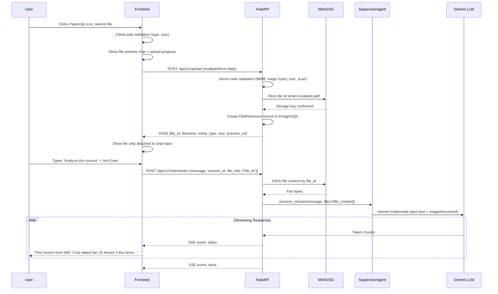

### 7.3 File Validation Pipeline

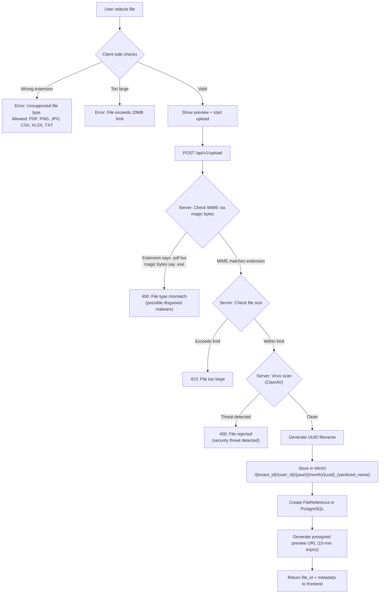

### 7.4 Supported File Types

| Category | Extensions | Max Size | How Gemini Processes It |
|----------|-----------|----------|------------------------|
| **Images** | .png, .jpg, .jpeg, .webp | 10 MB | Direct multimodal input (Gemini Vision) |
| **Documents** | .pdf | 20 MB | Text extraction + page images to Gemini |
| **Spreadsheets** | .csv, .xlsx | 10 MB | Parse to structured data, send as context text |
| **Text** | .txt, .json, .xml | 5 MB | Direct content sent as text context |

### 7.5 Storage Architecture

```
MinIO Bucket: erpsense-uploads

Directory Structure:
  erpsense-uploads/
    {tenant_id}/
      {user_id}/
        2026/
          01/
            a1b2c3d4_invoice_january.pdf
            e5f6g7h8_warehouse_photo.jpg
          02/
            i9j0k1l2_purchase_order.xlsx

Design Decisions:
  - Tenant-isolated paths    → prevents cross-tenant file access
  - UUID prefix on filenames → prevents collisions
  - Year/month organization  → enables lifecycle policies (auto-delete after 90 days)
  - Presigned URLs           → temporary access (15-min expiry), no direct MinIO exposure
  - SHA-256 hash stored      → deduplicate identical files within same tenant
```

### 7.6 Database Model: FileReference

```
Table: file_references

  id              UUID PRIMARY KEY
  tenant_id       UUID NOT NULL → tenants.id
  user_id         UUID NOT NULL → users.id
  filename        VARCHAR(255)          -- Original filename (sanitized)
  storage_key     VARCHAR(512)          -- MinIO object key (full path)
  mime_type       VARCHAR(100)          -- Validated MIME type
  size_bytes      BIGINT                -- File size
  sha256_hash     VARCHAR(64)           -- For deduplication
  metadata        JSONB                 -- Optional: description, tags
  created_at      TIMESTAMP WITH TZ
  deleted_at      TIMESTAMP WITH TZ    -- Soft delete (null = active)

  Indexes:
    - (tenant_id, user_id, created_at DESC)  -- List user's files
    - (tenant_id, sha256_hash)               -- Deduplication lookup
```

### 7.7 Extended ChatRequest Schema

The existing ChatRequest extends with an optional `file_refs` field:

```json
{
  "message": "Analyze this invoice and extract all line items",
  "session_id": "uuid-or-null",
  "file_refs": ["file_id_1", "file_id_2"]
}
```

Backend processing:
1. Validate each file_id exists and belongs to the requesting user's tenant
2. Fetch file content from MinIO
3. For images: pass as Gemini multimodal content part
4. For PDF/text: extract text, include in system context
5. For CSV/XLSX: parse to structured data, include as context

### 7.8 Infrastructure Addition

One new Docker service: MinIO (S3-compatible object storage)

```yaml
# Addition to docker-compose.yml
minio:
  image: minio/minio:latest
  ports:
    - "9000:9000"     # S3 API
    - "9001:9001"     # Web Console
  volumes:
    - minio_data:/data
  environment:
    MINIO_ROOT_USER: erpsense
    MINIO_ROOT_PASSWORD: ${MINIO_PASSWORD}
  command: server /data --console-address ":9001"
  healthcheck:
    test: ["CMD", "curl", "-f", "http://localhost:9000/minio/health/live"]
    interval: 30s
    timeout: 10s
    retries: 3
```

---

## 8. Phase 3: WebSocket Audio

### 8.1 Why WebSocket Is Necessary Here

This is the one feature where WebSocket is genuinely required. Audio interaction has a **truly bidirectional** pattern:

```
While user speaks:    Client → Server  (mic audio chunks every 100ms)
While AI responds:    Server → Client  (TTS audio chunks)
Overlapping:          Both directions simultaneously (user can interrupt)
```

SSE cannot handle this — it only goes server-to-client. REST would require a new HTTP request per 100ms audio chunk, which is impractical. WebSocket's persistent bidirectional connection is the correct fit.

### 8.2 Audio Pipeline Architecture

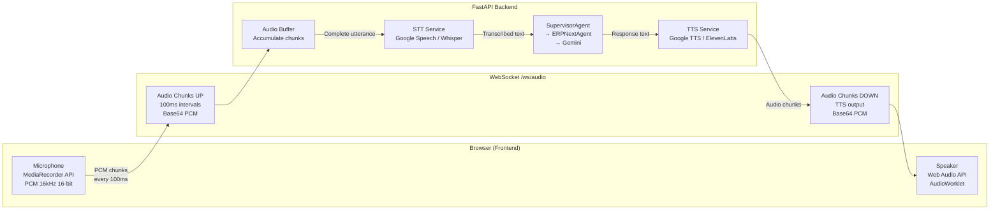

### 8.3 Complete Audio Flow

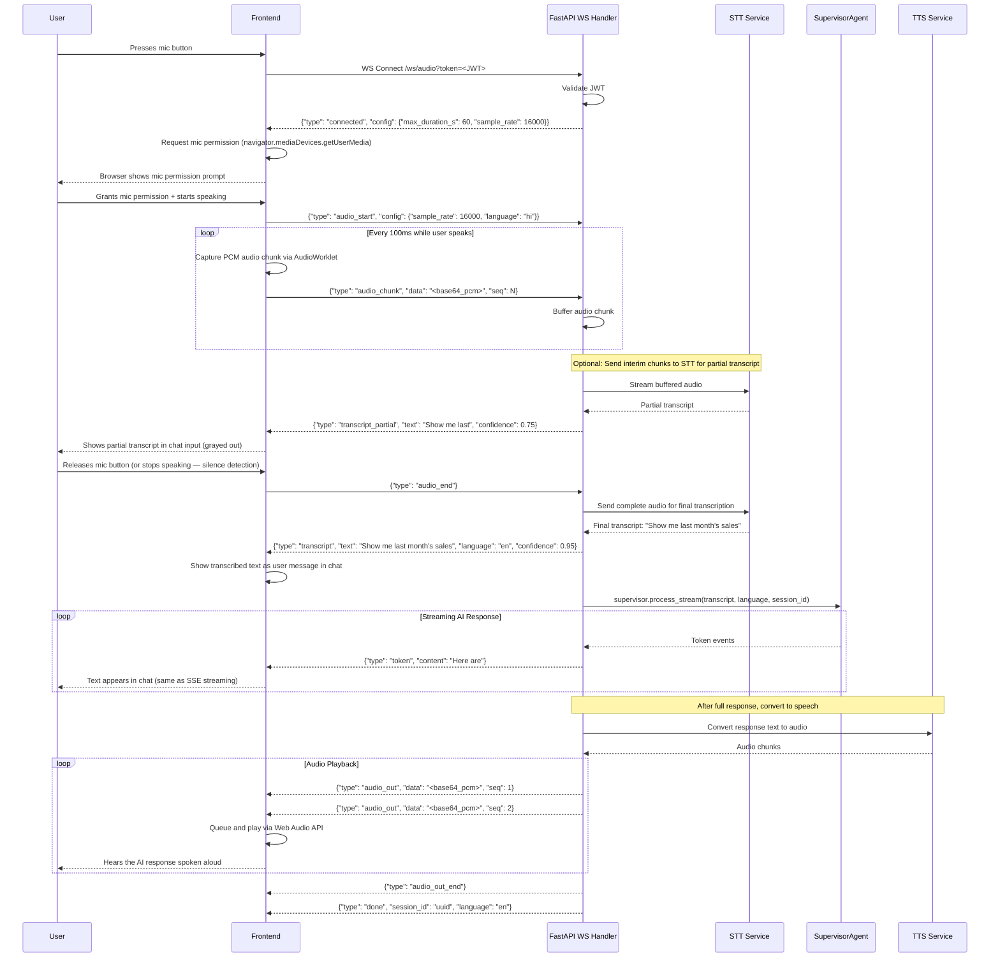

### 8.4 WebSocket Message Protocol

#### Connection Handshake

```
URL:          wss://api.erpsense.in/ws/audio?token=<jwt_token>
Why query param: Browser WebSocket API does not support custom headers.
                 JWT is passed as query parameter and validated server-side.
Subprotocol:  None
Frame format: Text frames with JSON (audio data as Base64 within JSON)
```

#### Client-to-Server Messages

```json
// 1. Start recording — sent when user presses mic
{
  "type": "audio_start",
  "config": {
    "sample_rate": 16000,
    "encoding": "pcm_s16le",
    "channels": 1,
    "language": "hi"
  }
}

// 2. Audio data chunk — sent every 100ms while recording
{
  "type": "audio_chunk",
  "data": "<base64_encoded_pcm_bytes>",
  "seq": 1,
  "timestamp_ms": 1706832000000
}

// 3. Stop recording — sent when user releases mic
{
  "type": "audio_end"
}

// 4. Cancel — abort current operation
{
  "type": "cancel"
}

// 5. Auth refresh — when JWT is renewed
{
  "type": "auth_refresh",
  "token": "<new_jwt_token>"
}

// 6. Keepalive
{
  "type": "ping"
}
```

#### Server-to-Client Messages

```json
// 1. Connection established
{
  "type": "connected",
  "config": {
    "max_duration_seconds": 60,
    "sample_rate": 16000,
    "supported_languages": ["en", "hi"]
  }
}

// 2. Partial transcript (while processing, for real-time feedback)
{
  "type": "transcript_partial",
  "text": "Show me last",
  "confidence": 0.75,
  "language": "en"
}

// 3. Final transcript
{
  "type": "transcript",
  "text": "Show me last month's sales",
  "confidence": 0.95,
  "language": "en"
}

// 4. Session info
{
  "type": "session",
  "session_id": "uuid",
  "is_new": false
}

// 5. AI response token (same format as SSE)
{
  "type": "token",
  "content": "Here are",
  "index": 0
}

// 6. Tool call status (same format as SSE)
{
  "type": "tool_start",
  "tool": "SearchDocumentsTool",
  "call_id": "tc_001",
  "input": {"doctype": "Sales Invoice"}
}
{
  "type": "tool_end",
  "tool": "SearchDocumentsTool",
  "call_id": "tc_001",
  "status": "success"
}

// 7. TTS audio output chunk
{
  "type": "audio_out",
  "data": "<base64_encoded_pcm_bytes>",
  "seq": 1
}

// 8. TTS audio complete
{
  "type": "audio_out_end"
}

// 9. Full response complete
{
  "type": "done",
  "session_id": "uuid",
  "language": "en",
  "conversation_length": 5
}

// 10. Error
{
  "type": "error",
  "code": "STT_FAILED",
  "message": "Could not understand audio. Please try again.",
  "retryable": true
}

// 11. Auth refresh confirmation
{
  "type": "auth_refreshed",
  "success": true
}

// 12. Keepalive response
{
  "type": "pong"
}
```

### 8.5 WebSocket Connection Lifecycle

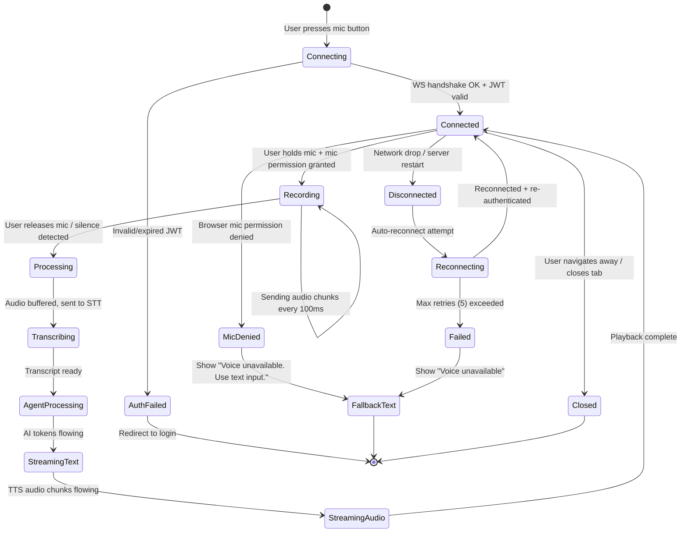

### 8.6 Reconnection Strategy

```
Trigger: WebSocket.onclose event OR missing pong within 10 seconds

Reconnection algorithm:
  Attempt 1: wait 1 second, reconnect with current JWT
  Attempt 2: wait 2 seconds
  Attempt 3: wait 4 seconds
  Attempt 4: wait 8 seconds
  Attempt 5: wait 16 seconds (max backoff: 30 seconds)

  If JWT expired during disconnect:
    1. Call POST /api/v1/auth/refresh to get new access token
    2. Reconnect with new token

  If mid-recording when disconnected:
    - Discard buffered audio (incomplete utterance)
    - Show: "Connection lost during recording. Please try again."
    - Do NOT attempt to resume partial audio

  If mid-playback when disconnected:
    - Text response is already in chat (was streamed via "token" events)
    - Audio playback stops — user can still read the text
    - Show: "Audio playback interrupted. Response is available as text."

  After max retries:
    - Show: "Voice is currently unavailable. Please use text input."
    - Disable mic button with tooltip
    - Enable automatic retry after 60 seconds
```

### 8.7 STT/TTS Service Comparison

| Service | Hindi Support | Streaming STT | Latency | Cost | Self-Hosted |
|---------|:------------:|:-------------:|---------|------|:-----------:|
| **Google Speech-to-Text** | Excellent | Yes | ~0.5-1s | $0.006/15s | No |
| **OpenAI Whisper API** | Good | No (batch) | ~1-2s | $0.006/min | No |
| **Whisper (self-hosted)** | Good | No (batch) | ~2-5s CPU, ~0.5s GPU | Compute only | Yes |
| **Azure Speech** | Good | Yes | ~0.5-1s | $1/hr audio | No |
| **Google TTS** | Excellent (many Hindi voices) | Yes | ~0.5s | $4/1M chars | No |
| **ElevenLabs** | Limited Hindi | Yes | ~0.5s | $5/100K chars | No |
| **Coqui TTS (self-hosted)** | Decent | No | ~1-2s | Compute only | Yes |

**Recommendation for Indian SME market**: Google Speech-to-Text + Google TTS.
- Best Hindi language support (multiple dialects)
- Streaming STT for real-time partial transcripts
- Multiple Hindi voice options for TTS
- Handles Hindi-English code-switching (common in Indian business)
- Reasonable cost for SME volume

### 8.8 Audio Infrastructure

```
Required server-side components:

1. FastAPI WebSocket endpoint
   - Native support via Starlette (already in your stack)
   - uvicorn handles WS natively

2. nginx WebSocket proxy config (add to existing):
   location /ws/ {
       proxy_pass http://backend;
       proxy_http_version 1.1;
       proxy_set_header Upgrade $http_upgrade;
       proxy_set_header Connection "upgrade";
       proxy_read_timeout 3600s;
   }

3. STT/TTS API keys:
   - GOOGLE_SPEECH_API_KEY in environment
   - GOOGLE_TTS_API_KEY in environment

4. Scaling consideration:
   - Audio processing is CPU-intensive
   - Consider running WS audio handlers as a SEPARATE service
   - Scale audio servers independently from REST/SSE API servers
   - This prevents audio load from affecting chat responsiveness
```

---

## 9. Phase 4: WebSocket Notifications

### 9.1 Overview

A lightweight WebSocket connection for server-pushed events. Lowest priority — the app works without it. Build this when concrete push notification requirements emerge.

### 9.2 Use Cases

| Notification Type | Example | Trigger |
|-------------------|---------|---------|
| **Background Task Complete** | "Your monthly report is ready" | Long-running Gemini analysis finishes |
| **Session Updated** | "New message in another session" | Multi-device / multi-tab sync |
| **ERP Event** | "Sales Order SO-001 confirmed" | ERPNext webhook fires |
| **System Alert** | "ERPNext connection lost" | Adapter health check fails |
| **Rate Limit Warning** | "Approaching daily message limit" | Usage counter threshold |

### 9.3 Connection Details

```
Endpoint:     wss://api.erpsense.in/ws/notifications?token=<jwt>
Heartbeat:    Server sends ping every 30 seconds
Auto-close:   After 4 hours of inactivity
Reconnect:    Same exponential backoff as audio WS
Multiplexing: Single connection carries ALL notification categories
Resource:     Lightweight — no audio processing, just JSON events
```

### 9.4 Notification Message Format

```json
// Server → Client
{
  "type": "notification",
  "id": "notif_uuid",
  "category": "task_complete",
  "priority": "normal",
  "data": {
    "title": "Monthly Report Generated",
    "body": "Your sales report for January 2026 is ready to download.",
    "action_url": "/reports/uuid",
    "action_label": "View Report"
  },
  "timestamp": "2026-02-02T10:30:00Z"
}

// Categories: task_complete, session_update, erp_event, system_alert, rate_limit
// Priorities: low, normal, high, urgent
```

### 9.5 Implementation Note

This is a future phase. Only build when you have:
- ERPNext webhook integration (to receive ERP events)
- Background task system (for long-running report generation)
- Multi-device requirements (user switching between desktop and mobile)

---

## 10. Edge Cases & Error Handling

### 10.1 SSE Streaming Edge Cases

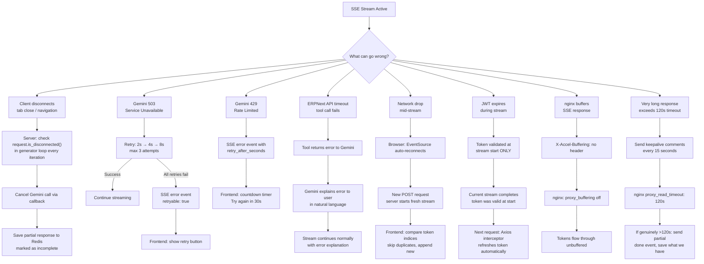

### 10.2 File Upload Edge Cases

| Scenario | Detection | Handling |
|----------|-----------|----------|
| **Upload interrupted** (network drop) | fetch error / timeout | Frontend: "Upload failed. Retry?" with same file pre-selected |
| **File too large** (>20MB) | Client-side: File.size check | Instant error before upload starts. Server: 413 if client check bypassed |
| **MIME type mismatch** (renamed .exe to .pdf) | Server: python-magic reads file header bytes | 400: "File type mismatch. Actual type: application/x-executable" |
| **Virus/malware in file** | Server: ClamAV scan | 400: "File rejected for security reasons" |
| **Storage full** (MinIO disk) | MinIO returns 507 | Alert ops team. Frontend: "Service temporarily unavailable" |
| **File referenced but deleted** | SQL lookup returns deleted_at != null | 404: "File no longer available." Gemini told: "Referenced file was deleted." |
| **Concurrent uploads** (same user) | Server-side counter per user | Allow max 3 concurrent. Queue additional. 429 if queue full |
| **Duplicate file** (same content) | SHA-256 hash match within tenant | Return existing file_id (save storage). Show file in chat |
| **Sensitive file** (.env, credentials.json) | Filename pattern matching | Warn user: "This file may contain credentials. Upload anyway?" |
| **Corrupt file** (truncated PDF, broken image) | File parsing fails | 400: "File appears to be corrupt. Please re-upload." |
| **Presigned URL expired** | URL older than 15 minutes | Generate new presigned URL on demand via GET /upload/{id}/download |
| **User has no storage quota left** | Check tenant quota before storing | 400: "Storage quota exceeded. Delete old files or contact admin." |

### 10.3 WebSocket Audio Edge Cases

| Scenario | Detection | Handling |
|----------|-----------|----------|
| **Mic permission denied** | navigator.mediaDevices throws NotAllowedError | Disable mic button. Tooltip: "Microphone access denied. Check browser settings." |
| **No speech detected** (silence) | 5 seconds of audio with zero speech activity | Auto-send audio_end. Show: "No speech detected. Please try again." |
| **Background noise only** | STT returns confidence < 0.3 | Show: "Couldn't understand. Please speak clearly and try again." |
| **Very long audio** (>60s) | Timer on server side | Server sends forced audio_end after max duration. Process received audio. |
| **Multiple browser tabs** | Second tab tries to connect WS | Send "session_claim" on new connection. Old connection receives "session_revoked" and disconnects. Only one active audio session per user. |
| **Mobile browser backgrounds** | visibilitychange event fires "hidden" | Pause recording. Resume when visible. If WS dropped, reconnect. |
| **WS drops mid-recording** | WebSocket.onclose fires | Discard incomplete audio. "Connection lost during recording. Please try again." |
| **WS drops mid-playback** | WebSocket.onclose fires | Text response already in chat. "Audio interrupted. Response available as text above." |
| **STT fails completely** | STT service returns error | Error event to client. "Voice recognition unavailable. Please type your message." |
| **TTS fails** | TTS service returns error | Text response still delivered. "Audio playback unavailable. Response shown as text." |
| **Hindi-English code-switching** | Common in Indian business speech | Use multilingual STT model. Google Speech handles this natively. |
| **Slow network** (high latency) | Audio chunks arrive late | Buffer on server. Process when complete. Client shows "Processing..." |
| **Server restart during WS** | WS connection terminates | Auto-reconnect. If mid-recording: discard and retry. If idle: transparent reconnect. |

### 10.4 General Error Recovery Strategy

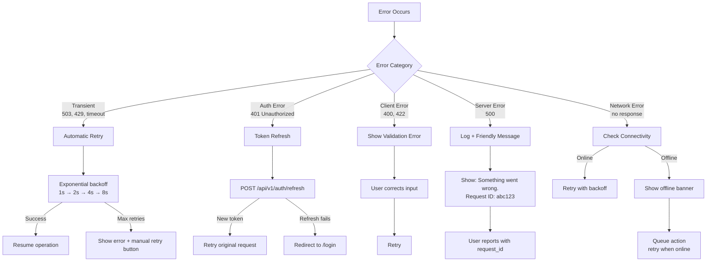

---

## 11. Security Considerations

### 11.1 SSE Security

| Threat | Mitigation |
|--------|------------|
| **Unauthorized stream access** | JWT Bearer token validated at stream start (same as REST) |
| **Token expiry during stream** | Token validated once at start. Streams are short (5-60s). Token valid for 24h |
| **Cross-origin SSE** | CORS headers apply (standard HTTP). `Access-Control-Allow-Origin` restricts origins |
| **DoS via hanging connections** | Server timeout: 120s max. Rate limit: max 5 concurrent streams per user |
| **Data injection in SSE** | Server controls all SSE data. JSON.stringify handles escaping. No user input reflected raw |
| **Man-in-the-middle** | HTTPS/TLS required in production. SSE runs over standard HTTPS |

### 11.2 File Upload Security

| Threat | Mitigation |
|--------|------------|
| **Malicious executable upload** | Magic byte validation (not just extension). ClamAV scan before storage |
| **Path traversal attack** | UUID-only filenames. Original filename never used in storage path |
| **Unrestricted upload size** | nginx: `client_max_body_size 25M`. Backend: explicit per-type size limits |
| **Storage exhaustion attack** | Per-user quota (100MB). Per-tenant quota (1GB). Rate limit: 10 uploads/hour |
| **Unauthorized file access** | Presigned URLs with 15-min expiry. Tenant isolation in storage paths. ACL checks on API |
| **SSRF via file processing** | Never fetch external URLs found in file content. Process in sandboxed container |
| **Image/PDF exploits** | Use hardened libraries (Pillow, PyMuPDF). Run processing in container with no network access |
| **Information leakage** | Strip EXIF metadata from images before storage. Sanitize PDF metadata |

### 11.3 WebSocket Security

| Threat | Mitigation |
|--------|------------|
| **Unauthorized WS connection** | JWT validated on WS handshake. Reject immediately if invalid/expired |
| **Token expiry mid-session** | Client sends `auth_refresh` message with new token. Server validates and updates |
| **Cross-origin WS hijacking** | Check `Origin` header on upgrade request. Reject non-allowlisted origins |
| **Message flooding** | Max 100 messages/second per connection. Drop excess. Disconnect repeat offenders |
| **Oversized frames** | Max frame size: 64KB. Reject larger frames. Audio chunks are ~3.2KB at 16kHz/100ms |
| **Connection exhaustion** | Max 1000 WS connections per server. Max 3 per user. Reject with 503 when full |
| **Connection hijacking** | WSS (TLS) required in production. Secure WebSocket only |
| **Replay attacks** | Timestamps on audio chunks. Reject chunks with timestamp drift >5 seconds |

### 11.4 Production Security Checklist

```
Transport Security:
  [x] TLS everywhere — HTTPS for REST/SSE, WSS for WebSocket
  [x] HSTS header (Strict-Transport-Security)
  [x] Certificate pinning for mobile apps (future)

Authentication:
  [x] JWT validation on every REST/SSE request
  [x] JWT validation on WebSocket connect
  [x] Token refresh mechanism for long WS sessions
  [x] Tenant isolation in all data access paths

Rate Limiting:
  [x] Per-user limits on chat (10 req/min), upload (10/hour), WS connections (3)
  [x] Per-IP limits for unauthenticated endpoints (login: 5/min)
  [x] Redis token bucket algorithm for distributed rate limiting

File Security:
  [x] Magic byte MIME validation
  [x] ClamAV virus scanning
  [x] Tenant-isolated storage paths
  [x] Presigned URLs with short expiry
  [x] Per-tenant storage quotas

Data Protection:
  [x] MinIO encryption at rest (AES-256-CTR)
  [x] Redis AUTH with strong password
  [x] PostgreSQL SSL connections
  [x] ERP credentials encrypted with Fernet (already implemented)
  [x] Audio recordings NOT stored (processed in memory, discarded)

Infrastructure:
  [x] WAF for file upload scanning (production)
  [x] DDoS protection at load balancer
  [x] Network segmentation — backend cannot reach internet directly
  [x] Audit logging for all write operations (already implemented)
```

---

## 12. Scaling & Infrastructure

### 12.1 Scaling Architecture

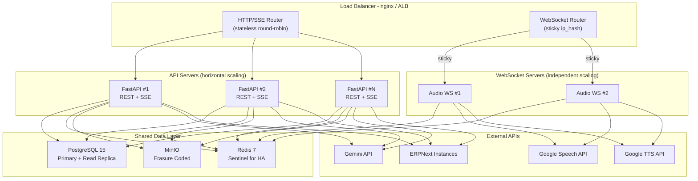

### 12.2 Scaling Strategy Per Component

| Component | Strategy | Key Metric | When to Scale |
|-----------|----------|------------|---------------|
| **FastAPI (REST/SSE)** | Horizontal — add instances. Stateless, any instance handles any request | Active SSE connections, requests/sec | >80% CPU or >500 concurrent SSE streams per instance |
| **WebSocket Audio** | Horizontal with sticky sessions. Separate deployment from REST | Active WS connections, CPU usage | >50 concurrent audio sessions per instance (CPU intensive) |
| **PostgreSQL** | Vertical (bigger instance) + read replicas for queries | Connection pool usage, query latency | Pool utilization >80% or p95 query >100ms |
| **Redis** | Redis Sentinel for HA. Cluster for sharding if >16GB | Memory usage, ops/second | Memory >80% or ops >100k/s |
| **MinIO** | Distributed mode (4+ nodes) with erasure coding | Storage capacity, IOPS | Storage >70% capacity |
| **Gemini API** | Concurrent requests. Rate limit aware with backoff | Tokens/second, quota usage | Approach quota — request limit increase |

### 12.3 Why Audio WS Is a Separate Service

Audio processing should run as an **independent service**, not inside the REST/SSE API servers:

```
Problem with co-located audio:
  - Audio processing is CPU-intensive (buffering, encoding, STT/TTS calls)
  - Each audio session holds a persistent WebSocket + runs concurrent API calls
  - 10 audio sessions can saturate a server that normally handles 500 REST requests
  - Audio traffic spikes (morning meeting time) would degrade text chat for everyone

Solution — separate deployment:
  erpsense-api      → REST + SSE endpoints (stateless, scale to N)
  erpsense-audio    → WebSocket audio endpoint (stateful, scale independently)

  Both share: PostgreSQL, Redis, Gemini API, ERPNext
  Audio servers additionally use: STT API, TTS API
```

### 12.4 nginx Production Configuration

```nginx
# Key sections for hybrid transport support

upstream api_servers {
    # Stateless — simple round-robin
    server api-1:8000;
    server api-2:8000;
}

upstream ws_servers {
    # Sticky sessions — required for WebSocket
    ip_hash;
    server ws-1:8001;
    server ws-2:8001;
}

server {
    listen 443 ssl http2;
    server_name api.erpsense.in;

    # --- REST API (standard) ---
    location /api/ {
        proxy_pass http://api_servers;
        proxy_set_header Host $host;
        proxy_set_header X-Real-IP $remote_addr;
        proxy_set_header X-Forwarded-For $proxy_add_x_forwarded_for;
        client_max_body_size 25M;  # File upload limit
    }

    # --- SSE Streaming (CRITICAL: disable buffering) ---
    location /api/v1/chat/stream {
        proxy_pass http://api_servers;
        proxy_http_version 1.1;
        proxy_set_header Connection '';

        proxy_buffering off;           # MUST be off for SSE
        proxy_cache off;               # No caching
        proxy_read_timeout 120s;       # Max stream duration
        chunked_transfer_encoding on;

        # Add CORS headers
        add_header Cache-Control "no-cache";
        add_header X-Accel-Buffering "no";
    }

    # --- WebSocket (audio + notifications) ---
    location /ws/ {
        proxy_pass http://ws_servers;
        proxy_http_version 1.1;
        proxy_set_header Upgrade $http_upgrade;
        proxy_set_header Connection "upgrade";
        proxy_set_header Host $host;

        proxy_read_timeout 3600s;      # 1 hour max WS connection
        proxy_send_timeout 3600s;
    }
}
```

### 12.5 Docker Compose — Full Stack (Development)

```yaml
version: "3.8"

services:
  # --- Existing (unchanged) ---
  db:
    image: postgres:15-alpine
    ports: ["5432:5432"]
    volumes: [postgres_data:/var/lib/postgresql/data]
    environment:
      POSTGRES_DB: erpsense
      POSTGRES_USER: erpsense
      POSTGRES_PASSWORD: ${DB_PASSWORD}
    healthcheck:
      test: ["CMD-SHELL", "pg_isready -U erpsense"]

  redis:
    image: redis:7-alpine
    ports: ["6379:6379"]
    volumes: [redis_data:/data]
    command: redis-server --appendonly yes --maxmemory 256mb --maxmemory-policy allkeys-lru
    healthcheck:
      test: ["CMD", "redis-cli", "ping"]

  # --- New: MinIO (Phase 2) ---
  minio:
    image: minio/minio:latest
    ports: ["9000:9000", "9001:9001"]
    volumes: [minio_data:/data]
    environment:
      MINIO_ROOT_USER: erpsense
      MINIO_ROOT_PASSWORD: ${MINIO_PASSWORD}
    command: server /data --console-address ":9001"

  # --- Backend (updated) ---
  backend:
    build: { context: ./erpsense-backend, dockerfile: docker/Dockerfile }
    ports: ["8000:8000"]
    environment:
      DATABASE_URL: postgresql+asyncpg://erpsense:${DB_PASSWORD}@db:5432/erpsense
      REDIS_URL: redis://redis:6379/0
      MINIO_ENDPOINT: minio:9000
      MINIO_ACCESS_KEY: erpsense
      MINIO_SECRET_KEY: ${MINIO_PASSWORD}
      GEMINI_API_KEY: ${GEMINI_API_KEY}
      GOOGLE_SPEECH_KEY: ${GOOGLE_SPEECH_KEY}
      GOOGLE_TTS_KEY: ${GOOGLE_TTS_KEY}
      JWT_SECRET_KEY: ${JWT_SECRET}
      CORS_ORIGINS: http://localhost:3000
    depends_on:
      db: { condition: service_healthy }
      redis: { condition: service_healthy }

  # --- Frontend (unchanged) ---
  frontend:
    build: { context: ./erpsense-frontend }
    ports: ["3000:3000"]
    environment:
      NEXT_PUBLIC_API_URL: http://localhost:8000
      NEXT_PUBLIC_WS_URL: ws://localhost:8000

volumes:
  postgres_data:
  redis_data:
  minio_data:
```

---

## 13. Monitoring & Observability

### 13.1 Key Metrics

#### SSE Streaming
```
erpsense_sse_streams_active              # Gauge: currently open SSE connections
erpsense_sse_stream_duration_seconds     # Histogram: how long streams last
erpsense_sse_first_token_latency_ms      # Histogram: time from request to first token
erpsense_sse_tokens_per_stream           # Histogram: tokens per response
erpsense_sse_errors_total                # Counter: by error type (gemini_503, timeout, disconnect)
erpsense_sse_tool_calls_total            # Counter: by tool name
erpsense_sse_tool_call_duration_ms       # Histogram: tool call latency by tool
```

#### File Upload
```
erpsense_upload_total                    # Counter: by status (success, rejected, error)
erpsense_upload_size_bytes               # Histogram: file sizes
erpsense_upload_duration_seconds         # Histogram: upload processing time
erpsense_upload_storage_bytes            # Gauge: total storage per tenant
erpsense_upload_by_type_total            # Counter: by MIME type
```

#### WebSocket Audio
```
erpsense_ws_connections_active           # Gauge: open WebSocket connections
erpsense_ws_audio_duration_seconds       # Histogram: recording duration
erpsense_ws_stt_latency_ms              # Histogram: speech-to-text time
erpsense_ws_tts_latency_ms              # Histogram: text-to-speech time
erpsense_ws_stt_confidence              # Histogram: STT confidence scores
erpsense_ws_reconnections_total          # Counter: reconnection events
erpsense_ws_errors_total                 # Counter: by error type
```

#### LLM (enhanced from existing)
```
erpsense_llm_input_tokens_total          # Counter: input tokens consumed
erpsense_llm_output_tokens_total         # Counter: output tokens generated
erpsense_llm_request_duration_ms         # Histogram: Gemini call latency
erpsense_llm_errors_total                # Counter: by type (503, 429, timeout)
erpsense_llm_cost_estimate_usd           # Counter: estimated cost
```

### 13.2 Structured Logging

```json
{
  "timestamp": "2026-02-02T10:30:00.123Z",
  "level": "INFO",
  "request_id": "req_abc123",
  "user_id": "usr_456",
  "tenant_id": "tnt_789",
  "session_id": "ses_012",
  "event": "sse_stream_complete",
  "duration_ms": 8432,
  "tokens_generated": 156,
  "tool_calls": 2,
  "language": "hi",
  "error": null
}
```

Log levels:
- **INFO**: Stream started/completed, upload successful, WS connected/disconnected
- **WARN**: Retry triggered, rate limit approaching, slow tool call (>5s), STT low confidence
- **ERROR**: Stream failed, upload rejected, WS auth failed, STT/TTS service error

### 13.3 Health Check Endpoints

```
GET /health           → {"status": "ok"}
GET /health/ready     → {"database": "ok", "redis": "ok", "minio": "ok"}
GET /health/live      → {"status": "alive", "uptime_seconds": 86400}
GET /health/detailed  → {
  "database": "ok",
  "redis": "ok",
  "minio": "ok",
  "gemini_api": "ok",
  "erpnext": "ok",
  "active_sse_streams": 12,
  "active_ws_connections": 3,
  "upload_storage_used_gb": 2.4,
  "uptime_seconds": 86400
}
```

---

## 14. Implementation Roadmap

### 14.1 Phase Overview

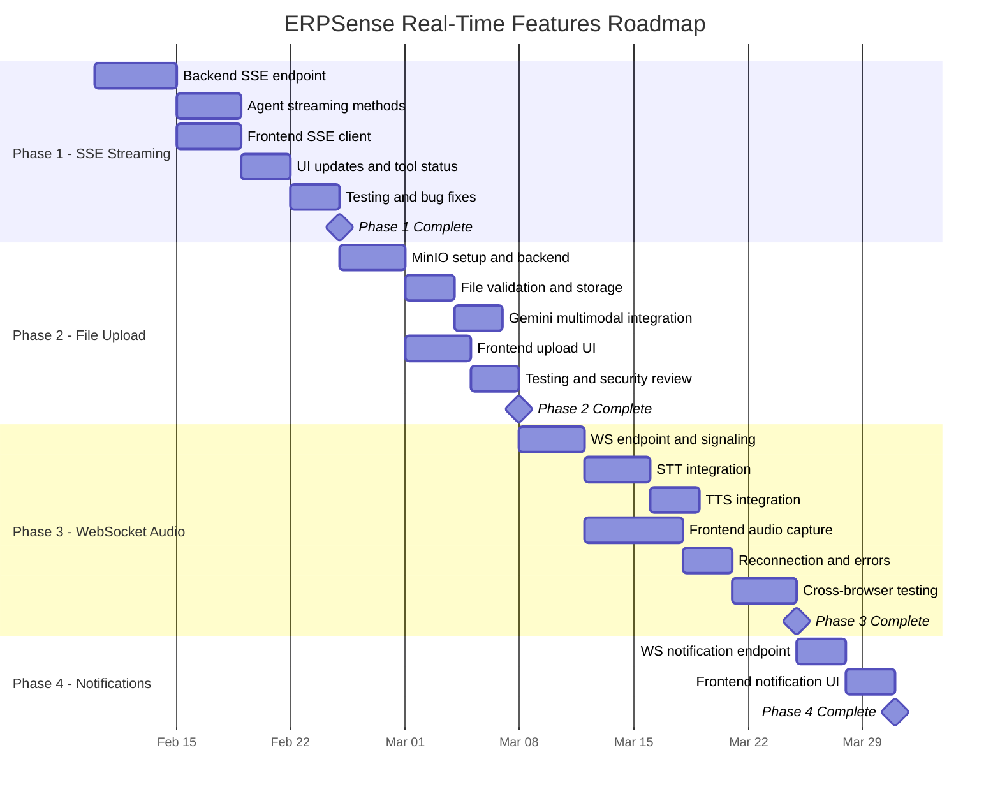

### 14.2 Phase 1: SSE Streaming — Task Breakdown

```
PRIORITY: HIGHEST | RISK: LOW | NEW INFRASTRUCTURE: NONE

Backend Tasks:
  1. Add POST /api/v1/chat/stream endpoint in chat.py
     - Accept same ChatRequest body as existing endpoint
     - Return StreamingResponse with media_type="text/event-stream"
     - Set headers: Cache-Control, X-Accel-Buffering, Connection
     - Check request.is_disconnected() in generator loop
     - Timeout: 120 seconds max

  2. Add ERPNextAgent.process_stream() method in erpnext_agent.py
     - Use agent_executor.astream_events(version="v2")
     - Parse event types: on_chat_model_stream, on_tool_start, on_tool_end
     - Maintain token accumulation buffer
     - Preserve existing retry logic for Gemini 503/429

  3. Add SupervisorAgent.process_stream() method in supervisor.py
     - Pre-stream: session creation, language detection, history loading
     - During: yield events from agent, accumulate tokens, send keepalives
     - Post-stream: save to Redis, generate session title

  4. Add SSE event serialization utility
     - Format events per SSE spec
     - Handle JSON serialization edge cases

Frontend Tasks:
  5. Add chatApi.streamMessage() using fetch + ReadableStream
     - SSE parsing (split on \n\n, extract event/data)
     - AsyncGenerator pattern
     - AbortSignal support

  6. Update useChat.sendMessage() to use streaming
     - Handle each event type: session, token, tool_start, tool_end, done, error
     - Fallback to chatApi.sendMessage() if SSE fails

  7. Add appendToMessage() action to chat-store.ts
     - Efficient string append (not full array replacement)

  8. Enhance thinking-indicator.tsx for tool status
     - Accept tool name + input as props
     - Map to human-readable labels (English + Hindi)

  9. Remove streaming-message.tsx
     - Delete file entirely
     - Update imports in message-list.tsx

Testing Tasks:
  10. Backend: Mock Gemini, verify SSE format, test disconnect handling
  11. Frontend: Mock SSE stream, verify UI updates, test abort
  12. E2E: Full flow across Chrome, Firefox, Safari, Edge
```

### 14.3 Phase 2: File Upload — Task Breakdown

```
PRIORITY: HIGH | RISK: MEDIUM | NEW INFRASTRUCTURE: MinIO

Infrastructure:
  1. Add MinIO to Docker Compose
  2. Create bucket initialization script (run on first deploy)
  3. Add MinIO connectivity to /health/ready

Backend:
  4. Create FileService (app/services/file_service.py)
     - MinIO client via minio-py
     - upload(), download(), delete(), presigned_url()
     - Tenant-isolated storage paths
     - SHA-256 deduplication

  5. Create file validation module
     - MIME detection via python-magic (magic bytes, not extension)
     - Per-type size limits
     - Extension allowlist
     - Filename sanitization (strip path components, special chars)

  6. Add upload endpoints (app/api/v1/endpoints/upload.py)
     - POST /upload — accept multipart, validate, store, return metadata
     - GET /upload/{file_id} — return metadata
     - GET /upload/{file_id}/download — return presigned URL
     - DELETE /upload/{file_id} — soft delete

  7. Create FileReference SQLAlchemy model + Alembic migration

  8. Extend ChatRequest schema with optional file_refs field

  9. Update SupervisorAgent to fetch files from MinIO when file_refs present

  10. Update ERPNextAgent to include files in Gemini prompt
      - Images: Gemini multimodal content part
      - PDF: text extraction + context
      - CSV/XLSX: parse to structured data

Frontend:
  11. Wire up Paperclip button in chat-input.tsx
      - File picker with type/size filters
      - Upload progress bar (XMLHttpRequest.upload.onprogress)
      - File preview chips (thumbnail for images, icon for docs)
      - Remove-file-before-sending button

  12. Add chatApi.uploadFile() method

  13. Update sendMessage to include file_refs in request

  14. Show file attachments in message-bubble.tsx

Testing:
  15. Validation tests: wrong type, too large, corrupt file
  16. Integration: upload → chat → Gemini analysis
  17. Security: disguised executables, path traversal attempts
```

### 14.4 Phase 3: WebSocket Audio — Task Breakdown

```
PRIORITY: MEDIUM-HIGH | RISK: HIGH | NEW INFRASTRUCTURE: STT/TTS APIs

Backend:
  1. Add WS /ws/audio endpoint in FastAPI
     - JWT auth on connection via query param
     - Connection manager (track active per user — max 1)
     - Message routing by type
     - Heartbeat ping every 30s

  2. Create STTService (app/services/stt_service.py)
     - Google Speech-to-Text streaming API
     - Hindi + English language detection
     - Interim + final transcript events
     - Audio format: PCM 16kHz 16-bit mono

  3. Create TTSService (app/services/tts_service.py)
     - Google Text-to-Speech API
     - Hindi + English voice selection
     - Chunk audio for streaming playback
     - SSML support for natural prosody

  4. Build audio processing pipeline
     - Buffer incoming chunks → complete utterance
     - Send to STT → transcript
     - Feed transcript to SupervisorAgent.process_stream()
     - Pipe response to TTS → audio chunks back

  5. Connection lifecycle management
     - Reconnection handling
     - Auth refresh via in-band message
     - Resource cleanup on disconnect
     - Max duration enforcement (60s per utterance)

Frontend:
  6. Create AudioCaptureService (src/lib/services/audio.ts)
     - MediaRecorder or AudioWorklet for raw PCM capture
     - Chunk every 100ms
     - Handle browser mic permissions
     - Silence detection (auto-stop after 5s silence)

  7. Create AudioPlaybackService
     - Web Audio API for playing received chunks
     - AudioBuffer queue for seamless playback
     - Volume control

  8. Create WebSocket client (src/lib/api/ws-audio.ts)
     - Connect with JWT in query param
     - Reconnection with exponential backoff
     - Message serialization/deserialization
     - Event emitter pattern for UI components

  9. Build voice UI components
     - Mic button: press-to-talk or toggle mode
     - Recording waveform animation
     - Playback indicator
     - Transcript preview (partial + final)
     - "Voice unavailable" fallback state

Testing:
  10. STT accuracy: Hindi, English, code-switching
  11. Latency: end-to-end speak-to-hear measurement
  12. Reconnection: network drop during recording/playback
  13. Browser compat: Chrome, Firefox, Safari, Edge, iOS Safari
  14. Load: concurrent WebSocket connections under stress
```

### 14.5 Phase 4: Notifications — Task Breakdown

```
PRIORITY: LOW | RISK: LOW | NEW INFRASTRUCTURE: NONE

  1. Add WS /ws/notifications endpoint
  2. Create NotificationService with Redis pub/sub
  3. Frontend notification manager with auto-reconnect
  4. Toast/banner UI component
  5. (Future) ERPNext webhook receiver
```

---

## 15. Appendix: Protocol Reference

### 15.1 Complete SSE Event Stream Example

A full example of what a streaming chat response looks like over the wire:

```
HTTP/1.1 200 OK
Content-Type: text/event-stream
Cache-Control: no-cache
Connection: keep-alive
X-Accel-Buffering: no

event: session
data: {"session_id": "550e8400-e29b-41d4-a716-446655440000", "is_new": false}

event: token
data: {"content": "Let me", "index": 0}

event: token
data: {"content": " search for", "index": 1}

event: token
data: {"content": " your invoices.", "index": 2}

event: tool_start
data: {"tool": "SearchDocumentsTool", "call_id": "tc_001", "input": {"doctype": "Sales Invoice", "filters": {"status": "Unpaid"}}}

: keepalive

event: tool_end
data: {"tool": "SearchDocumentsTool", "call_id": "tc_001", "status": "success", "summary": "Found 12 results"}

event: token
data: {"content": "I found", "index": 3}

event: token
data: {"content": " **12 unpaid invoices**", "index": 4}

event: token
data: {"content": ". Here are the details:\n\n", "index": 5}

event: token
data: {"content": "| Invoice | Customer | Amount |\n|---------|----------|--------|\n| INV-001 | ABC Corp | 50,000 |", "index": 6}

event: done
data: {"session_id": "550e8400-e29b-41d4-a716-446655440000", "language": "en", "conversation_length": 8, "session_title": "Unpaid Invoice Query"}

```

### 15.2 Complete WebSocket Audio Session Example

```
--- Connection ---
Client: WS CONNECT /ws/audio?token=eyJhbGciOiJIUzI1NiIs...
Server: {"type": "connected", "config": {"max_duration_seconds": 60, "sample_rate": 16000, "supported_languages": ["en", "hi"]}}

--- Recording ---
Client: {"type": "audio_start", "config": {"sample_rate": 16000, "encoding": "pcm_s16le", "language": "hi"}}
Client: {"type": "audio_chunk", "data": "SGVsbG8gV29ybGQ=...", "seq": 1}
Client: {"type": "audio_chunk", "data": "dGhpcyBpcyBhdWRpbw==...", "seq": 2}
Client: {"type": "audio_chunk", "data": "bW9yZSBhdWRpbyBkYXRh...", "seq": 3}

--- Partial Transcript (while processing) ---
Server: {"type": "transcript_partial", "text": "mujhe pichle", "confidence": 0.70, "language": "hi"}

--- User stops ---
Client: {"type": "audio_end"}

--- Final Transcript ---
Server: {"type": "transcript", "text": "mujhe pichle mahine ki bikri dikhao", "confidence": 0.93, "language": "hi"}

--- Session Info ---
Server: {"type": "session", "session_id": "550e8400-...", "is_new": false}

--- AI Response Tokens ---
Server: {"type": "tool_start", "tool": "SearchDocumentsTool", "call_id": "tc_001", "input": {"doctype": "Sales Order"}}
Server: {"type": "tool_end", "tool": "SearchDocumentsTool", "call_id": "tc_001", "status": "success"}
Server: {"type": "token", "content": "Yahan", "index": 0}
Server: {"type": "token", "content": " pichle mahine", "index": 1}
Server: {"type": "token", "content": " ki bikri hai:", "index": 2}

--- TTS Audio Output ---
Server: {"type": "audio_out", "data": "UklGRi4AAABXQVZFZm10...", "seq": 1}
Server: {"type": "audio_out", "data": "SUZPX1RFU1RfQVVESU8=...", "seq": 2}
Server: {"type": "audio_out_end"}

--- Complete ---
Server: {"type": "done", "session_id": "550e8400-...", "language": "hi", "conversation_length": 6}

--- Keepalive (periodic) ---
Client: {"type": "ping"}
Server: {"type": "pong"}
```

### 15.3 HTTP File Upload API Reference

```
=== Upload File ===

POST /api/v1/upload
Content-Type: multipart/form-data
Authorization: Bearer <jwt>

Body:
  file: (binary)                        # Required — the file
  metadata: (JSON string, optional)     # {"description": "January invoice"}

Response 200:
  {
    "file_id": "f1a2b3c4-d5e6-7890-abcd-ef1234567890",
    "filename": "invoice_jan_2026.pdf",
    "mime_type": "application/pdf",
    "size_bytes": 245678,
    "preview_url": "https://minio.../presigned?...",
    "created_at": "2026-02-02T10:30:00Z"
  }

Response 400: {"error": "INVALID_FILE_TYPE", "message": "...", "allowed_types": [...]}
Response 413: {"error": "FILE_TOO_LARGE", "message": "...", "max_bytes": 20971520}
Response 429: {"error": "UPLOAD_RATE_LIMIT", "retry_after_seconds": 60}


=== Get File Metadata ===

GET /api/v1/upload/{file_id}
Authorization: Bearer <jwt>

Response 200:
  {
    "file_id": "...",
    "filename": "invoice_jan_2026.pdf",
    "mime_type": "application/pdf",
    "size_bytes": 245678,
    "created_at": "2026-02-02T10:30:00Z"
  }


=== Get Download URL ===

GET /api/v1/upload/{file_id}/download
Authorization: Bearer <jwt>

Response 200:
  {
    "download_url": "https://minio.../presigned?...",
    "expires_at": "2026-02-02T10:45:00Z"
  }


=== Delete File ===

DELETE /api/v1/upload/{file_id}
Authorization: Bearer <jwt>

Response 200: {"message": "File deleted", "file_id": "..."}


=== Chat with File Reference ===

POST /api/v1/chat/stream
Content-Type: application/json
Authorization: Bearer <jwt>

Body:
  {
    "message": "Analyze this invoice and extract all line items",
    "session_id": "uuid-or-null",
    "file_refs": ["file_id_1", "file_id_2"]
  }

Response: text/event-stream (SSE format — same as Section 15.1)
```

### 15.4 Error Code Reference

| Code | HTTP/WS | Retryable | Description |
|------|---------|:---------:|-------------|
| `GEMINI_UNAVAILABLE` | SSE error event | Yes | Gemini API returned 503 after retries |
| `GEMINI_RATE_LIMITED` | SSE error event | Yes | Gemini API returned 429 |
| `GEMINI_TIMEOUT` | SSE error event | Yes | Gemini did not respond within timeout |
| `ERPNEXT_TIMEOUT` | SSE tool_end | No | ERPNext API timed out (handled by Gemini as tool error) |
| `ERPNEXT_AUTH_FAILED` | SSE error event | No | ERPNext credentials invalid |
| `STT_FAILED` | WS error | Yes | Speech-to-text could not process audio |
| `STT_LOW_CONFIDENCE` | WS error | Yes | Transcript confidence below threshold |
| `TTS_FAILED` | WS error | No | Text-to-speech service error (text still delivered) |
| `INVALID_FILE_TYPE` | HTTP 400 | No | File MIME type not in allowlist |
| `FILE_TOO_LARGE` | HTTP 413 | No | File exceeds size limit for its type |
| `FILE_CORRUPT` | HTTP 400 | No | File failed integrity check |
| `STORAGE_QUOTA_EXCEEDED` | HTTP 400 | No | Tenant storage limit reached |
| `UPLOAD_RATE_LIMIT` | HTTP 429 | Yes | Too many uploads in time window |
| `AUTH_EXPIRED` | HTTP 401 / WS error | Yes | JWT expired — refresh and retry |
| `AUTH_INVALID` | HTTP 401 / WS close | No | JWT invalid — re-login required |
| `RATE_LIMITED` | HTTP 429 | Yes | General rate limit exceeded |
| `INTERNAL_ERROR` | HTTP 500 / SSE error | No | Unexpected server error |

---

## Document History

| Version | Date | Author | Changes |
|---------|------|--------|---------|
| 1.0 | 2026-02-02 | Architecture Team | Initial design — hybrid SSE + WebSocket + HTTP architecture |

---

*This document is the technical specification and roadmap for ERPSense real-time communication features. All implementation decisions should reference this document. Update as architecture evolves.*
